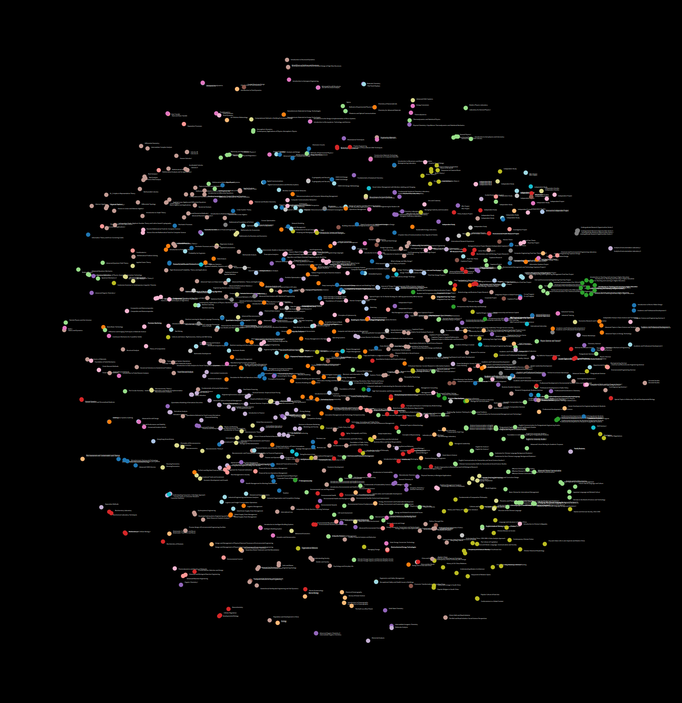

# All HKUST Courses

This information was scraped from the publicly available UST course list at [https://w5.ab.ust.hk/wcq/cgi-bin/2010/](https://w5.ab.ust.hk/wcq/cgi-bin/2010/)

It was aggregated on the Nov 16, 2020.(Jiangkun Qiu last update)

This is a very simple example to aggregate all the courses to perform text mining and visual analytics, but also to make course selection easier (Ctrl+F on this page!)

# T-SNE projection based on courses description:

# Graph View of HKUST COMP courses and Prerequisites

> Note this graph may be inaccurate and has not been updated for a while. This time the code is broken.

## ACCT 2010 - Principles of Accounting I (3 units)
For SB&amp;M students, and programs that designate the course as a required/specified elective course. This is the first course of the principles of accounting sequence. Introduction to the concepts and principles of financial accounting, including the analysis, recording, and reporting of business transactions and preparation of financial statements.

## ACCT 3010 - Financial Accounting I (3 units)
Study of the application of generally accepted accounting principles to accounting for business organizations; evaluation of balance sheet accounts and the related effects on income determination.

## ACCT 3030 - Intermediate Financial Accounting for Non-Accounting Majors (3 units)
Financial accounting concepts and practices with particular emphasis on the analysis and interpretation of financial reports and data.

## ACCT 3610 - Business Law (3 units)
This course is to provide students with an awareness of the overall legal framework in which businesses in Hong Kong operate so as to enable them to apply the relevant laws and practices to business problems and practical solutions. The main objective is to give students an understanding of how the society and business function in different socio-legal contexts like the legal system and process and its influence on citizens’ social rights and duties; the enforcement and honoring of agreement between private citizens, the use of business organizations in commercial society, the relationship between employee and employer from social and legal perspectives, the growing importance of business ethics and corporate social responsibilities etc.

## ACCT 3880 - Professional Excellence Program (1 unit)
Introductory-level seminars and workshops on the accounting/auditing professions; development of life-skills including writing and other communication skills; and individual thinking skills; ethics for accountants. For SB&amp;M students only. Graded P or F.

## ACCT 4010 - Advanced Financial Accounting (3 units)
Addresses accounting issues associated with (1) intercorporate investment activity that conveys significant influence or control and (2) cross-border activities.  The core topics addressed are business combinations, consolidated financial statements, associated companies, and foreign currency issues.

## ACCT 4510 - Auditing (3 units)
Objectives, standards and procedures of auditing; preparation of working papers; applications of statistical sampling; computer-assisted auditing and auditing of electronic data processing (EDP) services; professional liability and ethics.

## ACCT 4710 - Accounting Analytics for Professional Accountants (3 units)
Data analytics is reshaping the work of accountants. Applications of data analytics in accounting including: Auditing/Assurance - data analytics techniques used by accounting professionals and auditors nowadays to detect fraud and conduct forensic accounting. Enhancing Financial Reporting: more sophisticated data analytics tools can allow companies to link diverse financial and non-financial datasets and provide more comprehensive and rigorous financial reports to stakeholders. Managing risks: data analytics techniques such as continuous auditing and continuous monitoring can help accounting professionals assess and manage relevant risk levels within their organization. This course aims to provide students with knowledge of the nature and role of data analytics and enable students to apply and understand data analytics technologies to perform audit, enhance financial reporting, and minimize risks as accounting professionals.

## ACCT 5100 - Financial Accounting Foundations (2 units)
Introduction to accounting concepts, preparation and interpretation of financial statements. This is a core course for MBA.

## ACCT 5160 - Corporate Financial Reporting I (2 units)
Corporate financial reporting from the perspective of managers and financial statement users, including analysts. Topics include inventories, fixed assets, income taxes, liabilities, leases, off-balance-sheet debt, and dilutive securities.

## ACCT 5170 - Corporate Financial Reporting II (2 units)
Corporate financial reporting from the perspective of managers and financial statement users, including analysts.  Topics include intercorporate investments, business combinations, multinational operations, pensions, and earnings quality.

## ACCT 5210 - Managerial Accounting Foundations (2 units)
Use of accounting data in decision-making, financial planning, control, and performance evaluation within organizations. This is a core course for MBA.

## ACCT 5220 - International Treasury Management (2 units)
Specialized knowledge in international treasury operation and management control, risk management, inflation and foreign currency changes as well as international transfer pricing.

## ACCT 5410 - Taxation (2 units)
The course introduces the fundamentals of Hong Kong taxation based on case law and legislation. Topics include: property tax, salaries tax, profits tax, depreciation allowances, personal assessment, and stamp duty.

## ACCT 5630 - Business Law (2 units)
This course is designed for the study of Business Law with practical examples of the application of law in the real business world. The course materials cover  topics highly relevant to the business managers in the decision making process. The end goal is to elevate the student's level of understanding of the surrounding legal environment.

## ACCT 5710 - Data Analytics in Accounting (2 units)
Data analytics is the process of collecting, organizing and analyzing big data in order to discover useful information for different uses. This course aims to provide students with knowledge of the nature and role of data analytics and how important it is to accountants, and enable students to apply and understand big data issues and utilize data mining, data modeling, data analysis and data visualization techniques to solve accounting and business related issues.

## ACCT 5801 - Cryptocurrency, Blockchain and Their Business Applications (2 units)
This course discusses cryptocurrencies (including Bitcoin, Ethereum, and others), blockchain (the technology behind the meteoric rise of cryptocurrencies), and the multidimensional business applications of blockchain technology. The course provides a basic set of skills to understand the hype about cryptocurrencies, and more importantly, its underlying technology, and to envision a future of blockchain with or without cryptocurrencies.

## ACCT 7990 - Doctoral Thesis Research (0 units)
Original and independent doctoral thesis research.  A successful defense of the thesis leads to the grade Pass.  No course credit is assigned.

## AESF 5210 - Fluid Dynamics (3 units)
Basic concepts of fluid flows, derivation of governing equations, viscous flow, potential flow, boundary layer, flow instability, transition to turbulence, turbulent boundary layer.

## AESF 5310 - Advanced Aerodynamics (3 units)
Circulation, Kutta-Joukowski theorem, thin airfoil theory, lifting line theory, wingtip vortices, induced drag, elliptical wings, boundary layers, normal and oblique shocks, bow shocks, Prandtl-Meyer expansion fans, linearized potential flow theory, Prandtl-Glauert transformation, wave drag, transonic flow, swept wings, critical Mach number, supercritical airfoils.

## AESF 5320 - Advanced Aircraft Structures (3 units)
Aircraft structural design, wing structural details, elasticity, maneuver and gust loading, fatigue analysis, vibration theory, static and dynamic aeroelasticity, energy and matrix methods.

## AESF 5330 - Advanced Aircraft Design (3 units)
Flight mission requirements, aircraft size and layout, airfoil/wing geometry, aerodynamics, engine selection, airframe−engine integration, fuselage design, electrical and hydraulic systems, landing gear arrangement, flight stability and control, structures and materials, avionics and navigation systems, human factors, safety, manufacturing processes, and cost analysis.

## AESF 5370 - Composites and Nanocomposites (3 units)
This course is designed to provide fundamental understanding of fiber-reinforced composites (FRPs) and emerging nanocomposites technologies. The topics include constituent materials, microstructure-property relationships, fabrication and processing techniques, fundamental mechanics of stress transfer, lamination theory and failure mechanisms and fracture of FRPs in the first part. The topics in the second part include synthesis of nanoscale reinforcements, fabrication and processing techniques of nanocomposites; dispersion and functionalization of nanoreinforcements; interfacial adhesion; mechanical and functional properties of nanocomposites, and their design and applications.

## AESF 5930 - Finite Element Methods (3 units)
Finite element formulation; variational principles for structural and continuum mechanics; numerical interpolation and integration; plane stress and plane strain analysis; plate bending and three dimensional solids; solution of large systems of algebraic equations.

## AESF 6910O - Hong Kong Airworthiness (3 units)
The civil aviation industry is one of the safest modes of transportation, yet complex and highly regulated. Almost every part of the industry are regulated. From the design, manufacturing and operation of an aircraft, people operating and maintaining the aircraft to organisations handling, operating and maintaining the aircraft are regulated by various rules and regulations. This course introduces the concept of airworthiness and examines the framework of both international and Hong Kong aviation regulations governing the aviation industry. Allowing the students to understand the whole journey of the life of an aircraft.

## AESF 6950A - Aeronautical Independent Project (3 units)
An independent research project on Aeronautical Engineering carried out under the supervision of a faculty member.

## AESF 6950B - Aeronautical Independent Project (6 units)
An independent research project on Aeronautical Engineering carried out under the supervision of a faculty member.

## AMAT 6990 - MPhil Thesis Research (0 units)
Master's thesis research supervised by co-advisors from different disciplines. A successful defense of the thesis leads to the grade Pass. No course credit is assigned.

## AMAT 7990 - Doctoral Thesis Research (0 units)
Original and independent doctoral thesis research supervised by co-advisors from different disciplines. A successful defense of the thesis leads to the grade Pass. No course credit is assigned.

## BIBU 4820 - Biotechnology Entrepreneurship and Business Operations (3 units)
This course allows students to acquire a combination of essential scientific principles and practical business know-how in the biotechnology market, with an emphasis on the uniqueness and complexities of biotechnology entrepreneurship. Special focus will be placed on analyzing the critical factors that are pertinent to a successful venture in biotechnology. These factors will include scientific and technological advancements, intellectual property rights, as well as regulatory and commercial considerations. Students will eventually learn how to translate the knowledge into a business plan for start-up processes within the biotechnology industry. Guest speakers will include those who have experience in starting or managing biotechnology companies. For BIBU students in their fourth year of study only.

## BIBU 4840 - Biotechnology and Business Capstone Project (3 units)
Under the supervision of faculty members, students in small groups will undertake a project to investigate selected topics relevant to the biotechnology industry and its business operations. The project will be delivered through the format of literature review. Course assessment will be based on students’ written report and oral presentation that documents the project work and learning experiences. For BIBU students with approval of the course instructor for enrollment in the course.

## BIBU 4850 - Biotechnology and Business Project Research (6 units)
This is a one-year course. With a one-on-one supervision by faculty member, students will undertake a research project of their choice in biotechnological innovation/ideas: design of experiments, analysis of data, submission of a business plan/proposal in order to commercialize the selected biotechnological innovation/ideas. Credit load will be spread over the year. For BIBU students with approval of the course instructor for enrolling in the course.

## BIEN 2310 - Modeling for Chemical and Biological Engineering (3 units)
Modeling of physical, chemical and biological processes. Balance Equations. Dimensional and scaling analysis. Analytical and numerical solutions to initial and boundary value problems. Use of computer tools for engineering calculations. This course uses examples in the Bioengineering discipline. For BIEN students only.

## BIEN 2610 - Chemical Biology for Engineers (3 units)
A concise introduction of biochemistry, cell biology, and pharmacology to engineers. Molecular and supramolecular building blocks of biological systems. Analysis and engineering of biological systems by chemical principles. Introduction to transcriptomics, proteomics and metabolomics.

## BIEN 2990 - Academic and Professional Development I (1 unit)
For students in the Bioengineering major. This course is designed to provide academic advising to students, to enhance their understanding of the bioengineering field, to encourage them to pursue co-curricular learning opportunities available to them, and to improve their communication skills. Students are required to attend discussion sessions with advisors and fellow students and selected workshops and seminars. Graded P or F.

## BIEN 3410 - Introduction to Bioinstrumentation and Bioimaging (3 units)
This course introduces various biomedical devices to senior undergraduate students, including (electrical, chemical, optical, and acoustic) devices that can measure EEG, EMG, EOG, oxygen saturation, blood glucose level, blood components, and soft/hard tissue. Students will be able to understand, design, and evaluate devices that can acquire biological information from the human body.

## BIEN 3910 - Bioengineering Laboratory (4 units)
This course provides hands-on experience with molecular biotechnology, biomolecular engineering, biosensors, biomedical devices, and bioanalytical techniques. Laboratory experiments including cell culture, genetic engineering techniques, bioanalytical methods, biosensors and biomedical devices, with additional emphasis on data analysis. For students of the CBE department only.

## BIEN 4920 - Bioengineering Capstone Design (6 units)
A final-year project course offers practice of bioengineering design through a group design project chosen to integrate materials covered in the curriculum. Credit load may be spread over a year. May be graded PP. For students in the Bioengineering major only.

## BIEN 4930 - Bioengineering Thesis Research (6 units)
A final-year project course offers an opportunity to conduct individual bioengineering research under the direct supervision of a faculty member, which leads to a Bachelor's thesis. Credit load may be spread over a year. May be graded PP. For students in the Bioengineering major with approval from the department only.

## BIEN 5040 - Introduction to Neural Engineering (3 units)
This course will provide a survey of Neuroscience and Neuroengineering research areas to provide our research postgraduate students a broad appreciation of interdisciplinary research in context. The course aims to help student recognize and understand how knowledge from science and engineering interface in this interdisciplinary application. Concepts such as neural interfacing and neural prosthesis will be introduced so that students can understand the impact of the latest technologies. The course will enhance the vision of the students and encourage them to work in future inter-disciplinary research fields.

## BIEN 5050 - Global Health Ethics (3 units)
Through real-time videoconferencing with participants from different countries such as the United States, United Kingdom, Australia, Mexico, and Philippines, this ONLINE course aims at helping students learn the definitions of global health ethics and bioethics, the different protocol and systems in place to ensure adherence to ethical principles, and how different stakeholders and cultures may interpret ethics differently. Through case studies on ethical challenges from real-world situations, students will analyze and discuss the complexities of global health practice and research ethics in a global context. This course is co-offered with the University of Southern California. Besides the joint LIVE sessions, face-to-face sessions and group projects are also arranged for the introduction of background knowledge, case studies, group project discussion, and technical support.

## BIEN 6800S - Bioengineering Seminar (0 units)
Seminar topics presented by students, faculty and guest speakers. Students are expected to attend regularly and demonstrate proficiency in their seminar presentation in accordance with the program requirements. Graded P or F.

## BIEN 6990 - MPhil Thesis Research (0 units)
Master's thesis research supervised by a faculty member.  A successful defense of the thesis leads to the grade Pass.  No course credit is assigned.

## BIEN 7990 - Doctoral Thesis Research (0 units)
Original and independent doctoral thesis research.  A successful defense of the thesis leads to the grade Pass.  No course credit is assigned.

## BIPH 3010 - Advanced Biological Physics (3 units)
Biological physics involves the application of physics to achieve an understanding of life processes. This is the second of a two-course series that will prepare advanced undergraduates for research and technical work in Biological physics. It covers advanced biological physics such as molecular and cellular biological physics, photophysics, single-molecule biophysics, medical biophysics, membrane biological physics, neurobiophysics, biostatistics, biomathematics, bioinformatics, computational biology and protein engineering. At the conclusion of this course, students will be able to critically assess primary research literature written for a general scientific audience. They will also be prepared for mentored practical research investigations or professional job related to biological physics.

## BSBE 6990 - MPhil Thesis Research (0 units)
Master's thesis research supervised by co-advisors from different disciplines. A successful defense of the thesis leads to the grade Pass. No course credit is assigned.

## BSBE 7990 - Doctoral Thesis Research (0 units)
Original and independent doctoral thesis research supervised by co-advisors from different disciplines. A successful defense of the thesis leads to the grade Pass. No course credit is assigned.

## BTEC 5550 - Nutraceuticals and Transgenic Products (3 units)
Highlights in current applications of biotechnology on the research and development of nutraceuticals and transgenic products.  Scientific approaches to natural product drug discovery, TCM-based health products, and nutritional products will be discussed.

## BTEC 5760 - Concepts in Bioprocessing (3 units)
Weaves concepts and fundamentals common to various aspects of bioprocessing.  They include the analysis of transport phenomenon in biological systems (for example, immobilized cell or enzyme systems, artificial organs, and drug delivery systems); genetic engineering techniques applied to microorganisms, animals, and plants; and the cellular machinery and process by which biological products are synthesized by the cell.

## BTEC 5900 - Immuno Biotechnology (3 units)
A systematic review of the overall organization and function of the immune system with a special emphasis on antibody-based technology and its broad applications in various aspects of scientific research and medicine.

## BTEC 6900 - Case Investigation in Biotechnology (3 units)
Students will review a topic of their choice in an area of biotechnology under the supervision of a faculty member.  An in-depth reading and analysis by the student of the selected topic leading to the submission of a written report, and its presentation in a seminar.

## BTEC 6930 - Directed Biotechnological Research (4 units)
Students will undertake a research project of their choice in an area of biotechnology under the supervision of a faculty member.  The results of the research will be presented in a seminar and be formally written in the form of a final report.  For MSc student who can participate in day-time laboratory work only.

## BTEC 6940 - Advanced Biotechnological Research (4 units)
Students will undertake a research project in an area of biotechnology under the supervision of a faculty member. The results of the research will be presented in a seminar and be formally written in the form of a final report. For full time MSc students only.

## CBME 5810 - Energy Integration and Optimization for Process Industry (3 units)
For most energy intensive industries, such as process industry, the effectiveness of using energy plays a key role in improving their competitiveness and at the same time reducing environmental impacts. By knowing how energy equipment is designed and can be integrated, engineers could maximize the efficiency of a production system and sometimes simultaneously reduce capital investment and environmental burdens. Students will conduct several design projects in which they will apply computer software, such as Excel, Aspen+, GAMS and SPRINT, to design, integrate and optimize energy systems such as heat exchanger network, power plant, fuel conversion plant, etc.

## CBME 5820 - Energy, Environment and Sustainable Development (3 units)
This course attempts to highlight the basic issues on the relation between material/energy resources, the environment and sustainable development. Potential directions for technological changes on greater efficiency of energy utilization, exploitation of renewable energy, adoption of cleaner environmental practices and waste reduction that can lead to sustainable development will be explored. Management of energy and environment towards sustainability will be introduced.

## CBME 5830 - Electrochemical Energy Technologies (3 units)
Electrochemistry fundamentals; thermodynamics; electrokinetics; energy conversion and storage; fuel cells; batteries; supercapacitors; solar cells; electrolyzers; fuel production; CO2 reduction.

## CBME 6000D - Process Reactor Selection and Design (3 units)
This course will start by looking into various categories of process reactors; how they are categorized, what they are best suited for and the possible constraints. It will also go through the general design base for most of the reactor types and will select one of the most commonly used (e.g. stirred tanks) for in-depth studies. Sharing on considerations such as operability, scalability, safety evaluation, control configuration will also be included.

## CBME 6000E - Protein Engineering (3 units)
This course introduces fundamentals of protein science and common approaches for protein engineering. It will provide students with the basic knowledge of protein structure and function. The protein engineering part will cover two important approaches—computational design and directed evolution—toward protein engineering. The course will involve several case studies to illustrate the use of modern computational tools for design protein molecules including catalysts, biosensors, biomaterials, etc. The course will also cover the topics related to protein directed evolution, including mechanisms of biomolecular evolution, fitness landscapes, case studies of successful directed evolution.

## CBME 6980A - Independent Project (3 units)
An independent project carried out under the supervision of a faculty member.

## CBME 6980B - Independent Project (6 units)
An independent project carried out under the supervision of a faculty member.

## CENG 1000 - Introduction to Chemical and Biological Engineering (3 units)
From chemistry to engineering, molecules to useful products. Physical, chemical and biochemical transformation of materials. Survey of industries related to modern chemical and biological engineering. Basic principles of materials and energy balance. Strategy of molecular synthesis, process selection and design, economic and environmental considerations. Examples taken from a diverse range of products spanning realms of food, consumer products, energy, environment, and medicine. Case studies and team projects on process and product design. For engineering students only.

## CENG 1010 - Academic and Professional Development I (0 units)
Students not studying in the Chemical and Biomolecular Engineering Department may enroll in this course subject to the course instructors approval. This course is designed to provide academic advising to students, to enhance their understanding of the industries relevant to chemical engineers, and to improve their communication skills. Students are required to attend discussion sessions with advisors and selected seminars. Graded P or F.

## CENG 1600 - Biotechnology and Its Business Opportunities (3 units)
This course gives an introductory overview of biotechnology from both technical and business perspectives. It surveys the current landscape of medical biotechnology, discusses the significant milestones in this field, describes underlying scientific concepts, and emphasizes the impact of innovations on human health and economy. Case studies are used to illustrate the opportunities and limitations in current and future biotechnology development. In addition, experts from industry and academia are invited to give guest lectures on course-related topics.

## CENG 1700 - Introduction to Environmental Engineering (3 units)
Fundamentals of environmental impact assessment will be discussed. Life cycle analysis of carbon and energy will be introduced using case studies. Principles of environmental engineering for control of air, water, solid and noise pollution will be discussed, including global pollution, pollution prevention and minimization. Cost of available technologies will be analyzed.

## CENG 1980 - Industrial Training (0 units)
A practical training course in an industrial simulated environment. For students of the Chemical and Biological Engineering Department only. Graded P, PP or F.

## CENG 2110 - Process and Product Design Principles (3 units)
Processes and process variables, engineering data, and process representations. The conservation principle. Material and energy balances on non-reactive and reactive unit operations and process systems with recycles. Introduction to chemical product design.

## CENG 2310 - Modeling for Chemical and Biological Engineering (3 units)
Modeling of physical, chemical and biological processes. Balance Equations. Dimensional and scaling analysis. Analytical and numerical solutions to initial and boundary value problems. Use of computer tools for engineering calculations. This course uses examples in the Chemical or Environmental Engineering disciplines. For CENG and CEEV students only.

## CENG 3210 - Separation Processes (3 units)
Phase equilibria. Ideal and nonideal mixtures. Thermodynamic properties and VLE from equations of state. Liquid-liquid and liquid-solid systems. Stage process, short-cut and rigorous calculations in absorption, distillation or extraction. Continuous contacting processes. Separation sequences. Simulation and design.

## CENG 3220 - Heat and Mass Transfer (3 units)
Steady-state conductive, forced and free convective, radiative heat transfer in simple and complex process environments. Analysis and design of heat exchangers, fouling. Basic mass transfer concepts. Continuous contacting process and traditional design methodologies. Numerical solutions and simulations of unconventional examples.

## CENG 3230 - Chemical and Biological Reaction Engineering (3 units)
Stoichiometry and reaction equilibria. Homogeneous reactions kinetics. Mole balances: batch, continuous-stirred tank and plug flow reactors. Collection and analysis of rate data. Catalytic and enzymatic reaction kinetics and reactor design. Diffusion effects. Examples from chemical and biological processes.

## CENG 3950 - Chemical and Environmental Engineering Laboratory (4 units)
Integrated laboratory course for students in Chemical Engineering and Chemical and Environmental Engineering. Experimental modules on various unit operations and processes in chemical engineering and environmental engineering. Laboratory safety and risk assessment. Proper handling and interpretation of experimental data.

## CENG 4140 - Energy Resources, Conversions and Technologies (3 units)
The course will provide the fundamental knowledge of energy resources, their conversions and utilization technologies.Basic thermodynamics such as fuel and combustion models, measurement techniques will be taught to enable students to manage basic conversion calculations and to evaluate different energy utilization options. The course will also cover topics in green energies and fuels, providing an outlook of future energy uses.

## CENG 4620 - Bioproducts and Processing (3 units)
Students not studying in the Chemical and Bioproduct Engineering Program may enroll in the course upon instructor's approval. Survey of bioproducts, cellular production hosts, production techniques (bioreactors), separation and purification processes, product formulation, product and process design.

## CENG 4710 - Environmental Control (3 units)
Wastes from the process industries. Behavior of toxic chemicals in atmospheric, soil and aquatic environments. Adsorption/desorption, air stripping, steam stripping, supercritical extraction. Pyrolysis, biological, catalyzed and uncatalyzed reactions.  Integrated environmental control. Instructor's approval is required for non-CBME students' enrollment in the course.

## CENG 4920 - Chemical Engineering Capstone Design (6 units)
A final-year project course offers practice of chemical engineering design through a group design project chosen to integrate materials covered in the curriculum. Credit load may be spread over a year. May be graded PP. For students in Chemical Engineering, Chemical and Environmental Engineering and Chemical and Biomolecular Engineering.

## CENG 4930 - Chemical Engineering Thesis Research (6 units)
A final-year project course offers an opportunity to conduct individual chemical engineering research under the direct supervision of a faculty member, which leads to a Bachelor's thesis. Credit load may be spread over a year. May be graded PP. For students in Chemical Engineering, Chemical and Environmental Engineering, and Chemical and Biomolecular Engineering with approval from the department.

## CENG 4980R - Investigation Project (3 units)
Students conduct in-depth experimental or computational investigations on selected topics in one of the departmental research areas. Students work under supervision and are encouraged to use their own initiative to complete an appropriate program of work within the time allocated. Enrollment is subject to approval by department and supervisor. Graded Distinction/Pass/Fail. May be repeated for credits. May be graded PP.

## CENG 5100 - Advanced Reaction Engineering (3 units)
Reaction mechanisms and kinetics. Homogeneous and heterogeneous catalysis. Ideal reactors. Multiphase reactors. Interplay of reaction, mixing, heat and mass transfer. Design of reaction systems involving organics, inorganics, and polymeric materials. Experimental techniques in reaction engineering. Use of mathematical software to problem solving.

## CENG 5930 - Electrochemical Energy Technologies (3 units)
Electrochemical energy conversion and storage technologies such as fuel cells, batteries, supercapacitors, solar cells, electrolyzers, CO2 reduction, etc. help overcome the energy and environmental problems that have become prevalent in our society. This course will focus on the principles and critical materials for each technology. Cutting-edge research areas as well as electrochemistry fundamentals will be discussed in this course.

## CENG 6000M - Advanced Control and Data Science (3 units)
The course will cover digital and advanced control methods such as adaptive, model predictive, and learning controls and methods for process monitoring and optimization in the context of big data environment.

## CENG 6800S - Chemical and Biomolecular Engineering Seminar (0 units)
Seminar topics presented by students, faculty and guest speakers. Students are expected to attend regularly and demonstrate proficiency in presentation in accordance with the program requirements. Graded P or F.

## CENG 6990 - MPhil Thesis Research (0 units)
Master's thesis research supervised by a faculty member.  A successful defense of the thesis leads to the grade Pass.  No course credit is assigned.

## CENG 7990 - Doctoral Thesis Research (0 units)
Original and independent doctoral thesis research.  A successful defense of the thesis leads to the grade Pass.  No course credit is assigned.

## CHEM 1010 - General Chemistry IA (3 units)
This course is an introduction to fundamental principles of chemistry for students who have learnt the basic knowledge of chemistry in high school. Topics include atomic structure and periodicity, chemical bonding and molecular structure, basic properties of gases, liquids and solids, chemical kinetics, chemical equilibrium, and basic organic and biological molecules.

## CHEM 1020 - General Chemistry IB (3 units)
This course targets at students who have acquired more advanced knowledge in fundamental Chemistry in high school. Key topics include atomic structure and periodicity, bonding theories, chemical energy, and properties of gases, liquids and solids. Other topics such as chemical kinetics, chemical equilibrium and organic molecules will be briefly reviewed.

## CHEM 1030 - General Chemistry II (3 units)
This course is designed for students who have taken General Chemistry I and want to continue to expand their chemistry knowledge. It will cover topics related to stoichiometry and chemical reactions, properties of aqueous solutions, acids and bases, thermodynamics and equilibrium, electrochemistry, general aspects in chemistry of the main-group elements, and introduction to transition metal elements and coordination compounds.

## CHEM 1050 - Laboratory for General Chemistry I (1 unit)
This course is the laboratory class designed for students who enrolled in CHEM 1010 or CHEM 1020. With laboratory experience acquired in this course, students will be able to relate the physical and chemical principles and theories in practice. Experiments on topics such as chemical energetic and chemical equilibrium will be included. Graded P or F.

## CHEM 2110 - Organic Chemistry I (3 units)
This is the first part of the organic chemistry course series designed for students taking a major/minor in chemistry/life science under the four-year degree. Topics covered include: structure and bonding; regio-, geometric, and stereoisomerism; polar and radical reactions of alkenes and alkynes; substitution and elimination reactions; synthesis and reactions of alcohols and epoxides.

## CHEM 2150 - Organic Chemistry Laboratory (1 unit)
This is the laboratory course designed for students who enrolled in CHEM 2110 and CHEM 2111. Students will perform a series of organic experiments related to the theory learnt in courses. Students will be trained to perform a wide range of basic organic laboratory techniques, operate chemical instruments in laboratory, relate the physical and chemical principles and theory in practice and develop their data interpretation and analyzing skills. Experiments of topics such as esterification and Williamson ether synthesis will be included. For students in the programs under the four-year degree that designate the course as a required course/specified elective.

## CHEM 2155 - Fundamental Organic Chemistry Laboratory (1 unit)
This is the laboratory course designed for non-CHEM students who enrolled in CHEM 2110 or CHEM 2111. Students will perform a series of organic experiments related to the theories learnt in the related lecture courses. Students will be trained to practice a wide range of fundamental organic laboratory techniques, operate chemical instruments, relate the physical and chemical principles and theory in practice, and develop their data interpretation and analytical skills. For non-CHEM students in programs that designate this course as required course/specified elective only.

## CHEM 2210 - Inorganic Chemistry I (3 units)
This course is designed for students who have taken CHEM 1030 under the four-year degree. Key topics include atomic structure, molecular structure and bonding, structures of simple solids, physical techniques in inorganic chemistry, molecular symmetry, acids and bases, introduction to coordination chemistry, electronic structures and spectra of coordination compounds. For students in the programs under the four-year degree that designate the course as required course/specified elective, or students with approval from the instructor.

## CHEM 2250 - Inorganic Chemistry Laboratory (1 unit)
This course is the laboratory course designed for students who enrolled in CHEM 2210. Students will perform a series of inorganic experiments related to the theory learnt in courses. Students will be trained to perform a wide range of basic inorganic laboratory techniques, operate chemical instruments in laboratory, relate the physical and chemical principles and theory in practice and develop their data interpretation and analyzing skills. Experiments of the preparation of different metal complexes and organometallic compounds will be included. For CHEM students under the four-year degree only.

## CHEM 2310 - Fundamentals of Analytical Chemistry (3 units)
Fundamental and practical aspects of chemical analysis, including titrimetric, electrical and spectroscopic methods, analytical separations by GLC and HPLC.

## CHEM 2350 - Analytical Chemistry Laboratory (1 unit)
This is the laboratory course corresponding to the lecture courses of CHEM 2310 and CHEM 2311. Experiments covered in this course will be closely connected with the topics covered in the lecture courses, including Beer's law, calibration principle, and some basic simple instrumental techniques such as Fourier Transform Infrared Spectrometry, Gas Chromatography, etc. For students in the programs under the four-year degree that designate this course as required course/specified elective.

## CHEM 2355 - Fundamental Analytical Chemistry Laboratory (1 unit)
This is the laboratory course corresponding to the lecture courses of CHEM 2310 and CHEM 2311. Experiments covered in this course will be closely connected with the topics covered in the lecture courses, including calibration principle, and some basic optical and chromatographic instrumental techniques. For non-CHEM students in programs that designate this course as required course/specified elective only.

## CHEM 2409 - Mathematical Methods for Physical Chemistry (4 units)
This course covers mathematical and numerical methods for solving typical complex problems found in undergraduate-level physical chemistry courses. Topics include single variable integration, multivariate calculus, series and limits, ordinary and partial differential equations, determinants, matrices, vectors, and probability and statistics. For CHEM students or students with instructor's approval.

## CHEM 2410 - Physical Chemistry I: Equilibrium Thermodynamics and Statistical Mechanics (3 units)
The course consists of two parts. The first part teaches the equilibrium thermodynamics, covering the laws of thermodynamics and thermodynamics functions, with applications to various problems in phase equilibrium, chemical and electrochemical equilibrium. The second part teaches the equilibrium statistical thermodynamics, covering the Boltzmann distribution, the statistical ensembles and partition functions and their relations to thermodynamics functions. For CHEM and ENVS students under the four-year degree or students with instructor's approval.

## CHEM 2450 - Physical Chemistry Laboratory (1 unit)
This is the laboratory course corresponding to the lecture course CHEM 2410. The topics of experiments covered in the laboratory course will be related to those taught in the lecture course, such as thermodynamics, etc. For CHEM students under the four-year degree only.

## CHEM 4120 - Biomolecular Chemistry (3 units)
This course will introduce the fundamental chemical principles underlying the structure, properties, and functions of biologically important molecules. Using the chemical concepts of bonding, structure, and structure-reactivity relationships developed in organic chemistry, this course will cover topics on the stereochemistry, structural diversity, physicochemical properties, and reactivity of amino acids, peptides, proteins, nucleic acids, carbohydrates, and lipids to understand the molecular basis of their biological functions. Another major topic of this course is the preparation of these important biological molecules for understanding of their functions and exploitation of their biotechnological and medicinal values, using available organic chemistry methods.

## CHEM 4140 - Intermediate Organic Chemistry (3 units)
Provides further training in the multistep organic synthesis of natural and unnatural products, and will focus on the retrosynthetic analysis, control of stereochemistry, carbonyl group chemistry, and pericyclic reactions with a brief coverage on new synthetic methodologies for efficient synthesis of compound libraries. A prerequisite for students wishing to take CHEM 5110/5120 as part of their undergraduate program.

## CHEM 4210 - Solid State Chemistry (3 units)
Structure and bonding in solids; metals, semiconductors and dielectrics; crystal chemistry of ceramics, silicate minerals and zeolites; electrical, optical and magnetic properties of solids; fullerene chemistry; introduction to x-ray diffraction, electron microscopy, etc.

## CHEM 4220 - Materials Chemistry (3 units)
Liquid crystals, light emitters, conductive polymers, photoconductors, nanostructured materials and devices, optical information storage, chromism.

## CHEM 4240 - Intermediate Inorganic Chemistry (3 units)
Selected advanced topics in inorganic chemistry including spectroscopy (multinuclear NMR, IR and UV/visible), solid state chemistry, bioinorganic chemistry and catalysis.

## CHEM 4320 - Environmental Analytical Chemistry (3 units)
Topics covered include fundamentals of sampling issues, sample pretreatment techniques, water Analysis of major and trace constituents; determination of inorganic and organic gas pollutants, Atmospheric analysis of particulate matter, determination of soil pollutants, environmental control standards, chemometrics in environmental analysis. For students with major or minor in Chemistry and in Environmental Science only.

## CHEM 4340 - Bioanalytical Techniques (3 units)
Topics covered include fundamentals of optical microscopic techniques, protein analysis, enzymatic bioassays; DNA techniques and biomicrofluidic techniques.

## CHEM 4410 - Physical Chemistry in Biological Applications (3 units)
This course covers the applications of physical chemistry in  biological science and emphasizes the capability in using the fundamental knowledge in physical chemistry to solve the latest research problems in the interdisciplinary areas. Topics include molecular interpretations of the laws of thermodynamics, free energy and physical equilibria in membranes, photochemistry and photobiology, enzyme kinetics, binding and conformation transitions, spectroscopy of biomolecular structures and interactions.

## CHEM 4689 - Capstone Project (3 units)
Under the supervision of a faculty member or teaching staff, students will complete a capstone project which requires the integration of the chemical knowledge learnt from their previous courses. The project can be delivered through the format of literature review, research, or practical study. A written report and an oral presentation are required to document their learning experiences. For CHEM students under the four-year degree only. Students should seek instructor's approval prior to enrollment in the course.

## CHEM 4691 - Capstone Research I (3 units)
Students will carry out a research project in one of the Chemistry research laboratories under the supervision of a faculty member. This research-based course provides students an opportunity to integrate and apply their chemical knowledge learnt in regular lecture and laboratory courses. At the end of the course, students are required to submit a written report and deliver an oral presentation to document their learning experiences. For CHEM students only. Students should seek instructor's approval prior to enrollment in the course.

## CHEM 5110 - Advanced Organic Chemistry I (3 units)
Mechanism and theory in organic chemistry, molecular orbital theory, structure-activity relationships, isotope effects, solvent effects, neighboring group participation, and reactive intermediates.

## CHEM 5120 - Advanced Organic Chemistry II (3 units)
Stereochemistry and conformational analysis, reactions of various classes of organic compounds, synthetic organic chemistry, modern methods of synthesis including specific methodologies and multistep complex syntheses.

## CHEM 5230 - Quantum Chemistry (3 units)
Introduction to basic theories of Quantum Chemistry. Popular theories used in modern Quantum Chemistry such as Hantree-Fock theory, Density Functional theory. Perturbation Theories, and other quantum chemistry theories will be introduced in this course.

## CHEM 5540 - Chemistry for Advanced Materials (3 units)
Chemistry of materials with nano-dimensional structures and advanced functionalities. Working principles of liquid-crystalline displays and organic light-emitting diodes. High-tech applications of luminescent materials in optoelectronic systems, chemical sensors and biological probes.

## CHEM 6000S - Chemistry Seminar (1 unit)
Series of seminar topics presented by students, faculty and visiting speakers; may be repeated for credit. Graded P or F.

## CHEM 6771 - Professional Enrichment in Chemistry (1 unit)
The one-credit course aims to equip students with basic discipline-specific skills and knowledge for their personal and career development in the chemistry area. Training will be provided in the form of mini-workshops or activities. Graded PP, P or F.

## CHEM 6772 - Professional Development in Chemistry (1 unit)
This one-credit course aims at providing research postgraduate students basic training in teaching skills, research management, career development, and related professional skills in chemistry. This course normally lasts for one year, and is composed of a number of mini-workshops or tasks which are coordinated by the department. Graded PP, P or F.

## CHEM 6990 - MPhil Thesis Research (0 units)
Master's thesis research supervised by a faculty member.  A successful defense of the thesis leads to the grade Pass.  No course credit is assigned.

## CHEM 7990 - Doctoral Thesis Research (0 units)
Original and independent doctoral thesis research.  A successful defense of the thesis leads to the grade Pass.  No course credit is assigned.

## CHMS 5010 - Chemical Data Analysis (3 units)
Measurements; Statistical treatment and analysis of Data; Uncertainties; Calibrations; Detection limits; Interferences; Use of Standards and Control Charts; Quality control and assurance; Presentation of data.

## CHMS 5020 - Elemental Analysis (3 units)
Atomic spectroscopies; Atomic absorption (AA) atomic emission (AE); Elemental analysis by ICP MS; Isotope analysis. Elemental analysis using X-rays; X-ray Fluorescence (XRF); X-ray Photo-electron Spectroscopy (XPS); Secondary Ion Mass Spectrometey; Energy Dispersive Analysis of X-rays (EDAX); Combustion analysis.

## CHMS 5030 - Molecular Analysis (3 units)
Characterization of organic molecules; Mass Spectrometry; Ionization techniques; Mass analysis Protein MS; NMR Spectroscopy; 1H and 13C NMR; Multinuclear experiments; 2D and pulse techniques; Solid state NMR.

## CHMS 5040 - Separation Methods (3 units)
Chromatography; Gas chromatography; GC-MS; Liquid chromatography; HPLC; Choice of stationary and mobile phases; Chiral separations; Affinity chromatography; Ion chromatography; Capillary zone electrophoresis; Micro-fluidics.

## CHMS 5201 - Analytical Instrumentation Laboratory I (3 units)
Students will choose from an array of experiments involving modern analytical techniques that have been introduced in the core courses. These will include, but not be limited to, separation of mixtures, gc-ms, lc-ms, atomic spectroscopy and elemental analysis, IR and UV spectroscopy, electrochemistry, NMR, powder XRD. Students must attend and write up experimental reports for at least eight laboratory sessions to complete the course. Maybe graded PP.

## CHMS 5202 - Analytical Instrumentation Laboratory II (3 units)
Students will choose from a further array of experiments, complementary to CHMS 5201, involving analytical techniques that have been introduced in either the core and the elective courses. Students must attend and write up experimental reports for at least eight laboratory sessions to complete the course. Maybe graded PP.

## CIEM 5140 - Construction Project Delivery (3 units)
The course would cover Principle of Project Management, Contractor Management, Public Works Development, Consultant Management &amp; Engineering proposal, Design &amp; Build, BOT &amp; PPP, Project Finance, Project Risk Management, Project Partnering, Value Management, Safety Management, Environment Management, Case Studies.

## CIEM 5170 - Building Information Modeling and Smart Construction (3 units)
This course will cover the fundamental and technical aspects of building information modeling (BIM) and smart construction. Topics include BIM model creation and sharing, model-based analyses, clash detection, BIM standards and interoperability, BIM project execution plan, BIM for infrastructure, visualization technologies, data mining and knowledge management, decision support system, construction informatics, sensing technologies, and construction robotics.

## CIEM 5311 - Building Aerodynamics and Wind-Resistant Design of High-Rise Structures (3 units)
Global wind climate, extreme wind analysis, wind structures near ground, bluff body aerodynamics, wind loads on building structures, wind-induced vibrations and mitigations, wind tunnel test techniques, and wind loading codes.

## CIEM 5380 - Bridge Engineering (3 units)
This course is focused on the bridge superstructure analysis and design using limit states design method. The main objectives of this course include the introduction of limit states design method; discussion of design philosophy and code requirements; as well as analysis and design examples using limit states design method.

## CIEM 5390 - Coastal Structures Design (3 units)
The course will cover basic wave characteristics, linear wave theory, wave transformation processes, wind-wave generation, coastal processes,  
wave-structure interaction, design procedures and requirements for coastal structures such as seawalls, breakwaters and beaches.

## CIEM 5410 - Risk Assessment and Contaminated Land Cleanup (3 units)
Innovative technologies for land and groundwater remediation, site investigation, risk assessment, and local case studies on land decontamination such as Kai Tak Airport, Penny's Bay, North Tsing Yi will be included.

## CIEM 5460 - Design and Management of Physico/Chemical Processes of Environmental Engineering (3 units)
Principles, design and management practices of physico/chemical treatment processes for removing contaminants from drinking water and municipal wastewaters; includes coagulation and flocculation, sedimentation, air flotation, centrifugation, filtration, membrane, air stripping, carbon adsorption, disinfection, chemical oxidation processes, operation management and residual management.

## CIEM 5480 - Wastewater Treatment and Reuse (3 units)
Theory and conceptual design of key unit processes and unit operations in domestic wastewater treatment and reuse with emphasis on applications of compact and advanced treatment technologies.

## CIEM 5620 - Travel Demand Analysis (3 units)
Overview of transportation planning process, population/employment forecasting techniques, discrete choice models, simplified transportation demand models.

## CIEM 5720 - Advanced Foundation Design (3 units)
Current practice of foundation design and analysis, including design and analysis of bulkheads, deep excavation, tieback systems, tunneling in soft ground, buried conduits, lateral pile loading, pier foundations.

## CIEM 5740 - Computer Methods for Slope Engineering (3 units)
This course aims to teach students to apply knowledge of soil mechanics and numerical methods for analysis and design of slope stability. The course covers mechanisms of slope failures, shear strength of soils, transient seepage analysis, major methodologies on slope stability analysis, and use of popular computer software programs for slope stability analysis, including SLOPE/W &amp; SEEP/W and PLAXIS 2D.

## CIEM 6980 - MSc Project (6 units)
An independent project carried out under the supervision of a faculty member.

## CIVL 1010 - Academic and Professional Development I (0 units)
A compulsory, one year course for CIVL/CIEV/CIGBM students only. This course is designed to provide academic advising to students and/or to develop students' interpersonal skills in handling technical and non-technical issues in their professional careers. Graded P, PP or F.

## CIVL 1100 - Discovering Civil and Environmental Engineering (3 units)
A general overview of civil and environmental engineering, infrastructure development and engineering ethics is provided. The course includes both lectures and laboratory sessions, where the laboratory sessions are primarily directed to students who require the development of feasible conceptual solutions for the analysis and design of the basic problems in structural, geotechnical and environmental engineering. For first year engineering students under the four‐year degree curriculum only.

## CIVL 1140 - Environmental Quality Control and Improvement (3 units)
Introduction to up-to-date environmental issues in both local and global scales; providing essential physical, chemical, biological and societal concepts required to understand the nature of pollution and environmental problems; applying science, engineering, management and social science approaches to solutions to environmental issues that affect our water, air, land, eco-systems, living environment, and sustainable development. The objective of this course is to equip our next generation leaders in different disciplines with enhanced environmental awareness and knowledge of tools and solutions to environmental issues. They will therefore be able to make responsible decisions and actions, with due consideration of the environment and sustainability. Each lesson is divided into two parts. The first part is the introduction and discussion of essential concepts and environmental issues and debates of these issues and will be delivered and guided by the instructor. The second part involves presentations of projects, focus studies, or service learning activities of new, emerging environmental issues selected by student groups, with emphases on solutions to the issues.

## CIVL 1150 - Climate Change Impacts and Extreme Weather Events (3 units)
As the extreme weather events emerge as one of the most prominent global risks, climate change and the accompanying natural disasters are no longer a side agenda, but play a critical role in maintaining sustainable societies and economies. This course aims to inspire students to take a broader perspective on environmental issues, in addition to advancing the scientific knowledge of climate change and extreme weather. To effectively achieve this purpose, the course introduces the case studies that emphasize the huge implications of extreme events (e.g. drought, flood, heat waves, typhoon) and their linkage with the warming due to greenhouse gases. This course also assesses the potential impacts of climate changes and extremes on social, economic and environmental sustainability through a multidisciplinary approach.

## CIVL 1160 - Civil Engineering and Modern Society (3 units)
An introduction to civil engineering practice and infrastructure development, with an emphasis on Hong Kong projects. The basic principles, materials and technology used in typical civil engineering works such as foundations, buildings, bridges, slopes and water supply systems, etc. Infrastructure management and maintenance issues; social-economic aspects of large-scale civil engineering projects such as environmental protection, urban planning and development, etc.

## CIVL 2010 - Academic and Professional Development II (0 units)
Continuation of CIVL 1010. Graded P, PP or F.

## CIVL 2110 - Statics (3 units)
Application of Newton’s laws to engineering problems; statics of particles; rigid bodies; equivalent systems of forces; equilibrium of rigid bodies; distributed forces; centroids; moments of inertia; analysis of truss &amp; frame structures; axial, shear and bending moment diagrams; friction.

## CIVL 2120 - Mechanics of Materials (3 units)
Analysis of stress, strain and deformation; linear and non-linear material behavior; strain energy; bending of beams, deflection; stability and buckling of compression members; shear and torsional stresses.

## CIVL 2160 - Modeling Systems with Uncertainties (3 units)
Identification and modeling of non-deterministic problems in civil engineering, and the treatment thereof relative to engineering design and decision making. Development of stochastic concepts and simulation models, and their relevance to real design and decision problems in various areas of civil engineering.

## CIVL 2810 - Construction Materials (3 units)
Properties of engineering materials and their relation to the internal structure of materials; includes physical properties of construction materials like portland cement concrete, asphalt, polymers, ferrous metals and non-ferrous metals.

## CIVL 3010 - Academic and Professional Development III (0 units)
Continuation of CIVL 2010. Graded P, PP or F.

## CIVL 3310 - Structural Analysis (3 units)
Structural forms and modeling, statically determinate structures, statically indeterminate structures, force and displacement methods, deflections of structures, influence lines, approximate analysis, energy methods.

## CIVL 3510 - Hydrosystems Engineering (3 units)
This course introduces basic and fundamental knowledge essential to the design and analysis of hydrosystems engineering problems (e,g., water supply, flood control, stormwater drainage, etc.). The course consists of two interrelated parts: hydrology and hydraulics. Hydrology covers various processes of water cycle (including precipitation, infiltration, rainfall-runoff modeling, and flow routings) that produce loads on hydrosystems. Hydraulics, on the other hand, applies fluid mechanics principles to the design and analysis the capacity of hydrosystems infrastructures such as pipe networks and channel networks as well as hydraulic machinery.

## CIVL 3730 - Fundamentals of Geotechnics (3 units)
This course will focus on the geotechnical mechanics and associated soil behavior, including basic engineering geology, characteristics of soils, soil compaction, the principle of effective stress, shear strength of soils, the concept of critical state modeling, permeability, seepage problems, ground settlement and consolidation. The laboratory section consists of five different experiments. For CIVL and CIEV students under the four-year degree only.

## CIVL 4100I - Introduction to Data Analytics for Smart Transportation Systems (3 units)
This course covers the role of stochasticity in transport systems and the methods used to account for this within transport infrastructure assessment, with a particular focus on the application of data analysis methods. The course introduces how to analyse the performance of public transport systems, road network, and emerging mobility services using classic queuing theory, travel time reliability concepts and travel demand models as well as machine learning techniques. The course will complement skills learnt in the other transport courses to provide a well-rounded knowledge of smart transport planning and management. The focus is on the application of transport models in real world settings using real data. Students have the opportunity to work with large open source data in two experiential-learning projects. The course also develops skills for working with data and managing collaborative projects.

## CIVL 4100J - Introduction to Smart City Economics (3 units)
This course will cover economic principles and tools for analyzing the emerging challenging problems in the context of Civil Engineering with a focus on smart city development. The course discusses various economic problems arising in modern power and transport systems through the lens of buildings, electric vehicles, renewable energy, mobility-on-demand services, etc. It also touches upon the nexus across distinct smart urban sectors for efficiency-improving system integration. The course will complement the existing course in microeconomics by focusing on engineering applications and offering extensive practical examples within the smart city context. Through lectures, project and reading, students will learn state-of-the-art models and tools to identify, formulate, and address challenging problems in smart city development.

## CIVL 4320 - Structural Steel Design (3 units)
Limit state design of steel structures, stability analysis of thin-walled members, design of tension members, columns, beams, plate girders, beam-columns, structural connections, plastic analysis and design.

## CIVL 4330 - Introduction to Structural Dynamics (3 units)
Single degree of freedom systems, multi-degree of freedom systems, continuous systems, random vibrations, dynamic behavior under wind loads and earthquakes.

## CIVL 4450 - Carbon Footprint Analysis and Reduction (3 units)
This course aims to provide students with an understanding of the sources and impacts of climate change, national and international policies, Kyoto Protocol, carbon credits and offset concepts. As engineers to be, students will also be able to calculate organization's carbon footprint, identify suitable mitigation strategies and provide carbon reduction solutions.

## CIVL 4460 - Process Design of Environmental Engineering Facilities (3 units)
Basic principles in the process design of environmental engineering facilities, such as water and wastewater treatment systems, pump station, as well as sanitary landfill disposal.

## CIVL 4470 - Air Quality Control and Management (3 units)
Historical and health impact studies related to air pollution.  Atmospheric stability and its impact on the transport and dispersion of pollutants.  Sources of major air pollutants.  Comparison of urban, industrial and transport related air pollution issues, using Hong Kong and Pearl River Delta as examples.  Control of stationary and mobile emission sources.  Air quality management - framework, policy tools and comparison of different approaches.

## CIVL 4520 - Municipal Hydrosystems Engineering and Management (3 units)
The course integrates the knowledge of hydrology, hydraulics, statistics, economics, and optimization in the dealing with municipal hydrosystems engineering and management. In particular, focuses will be given to quantity aspect of water supplies and water excesses. The hydrosystems to be covered include water distribution, urban sewage and stormwater drainage, reservoirs/detention facilities, pumps, etc.

## CIVL 4620 - Transportation System Operations (3 units)
Transportation economics, land use and transportation system, queuing theory and traffic flow analysis, intersection control and design, urban transit operations and management.

## CIVL 4700 - Engineering Geology (3 units)
This course introduces fundamental knowledge in engineering geology and related engineering topics, including the earth system and tectonics, rock-forming minerals and clay minerals, igneous / sedimentary / metamorphic rocks, structural geology, earthquakes, surface processes and soil formation. It also includes field trips to Hong Kong GeoParks.

## CIVL 4750 - Numerical Solutions to Geotechnical Problems (3 units)
Use of specific and general-purpose computer software to solve common geotechnical problems associated with empirical relationships, seepage, consolidation, pile applications, excavations, and general soil behavior.  Brief introductions to and applications of finite difference, finite element and other numerical solution techniques are included.

## CIVL 4810 - Construction Materials Technology (3 units)
Constituents of concrete; failure mechanisms and mechanical properties; advanced cementitious composites: high strength, fiber, polymer, high performance; fibrous composite materials: composition, anisotrophic behavior, engineering constant, failure criteria; non-destructive evaluation: wave, scan, ultrasonic, acoustic emission, infrared thermography.

## CIVL 4910 - Civil and Environmental Engineering Final Year Project (6 units)
The two-term Final Year Project involves applications of civil and environmental engineering principles to the design, planning, experimental or analytical investigation of current engineering design and research problems. The credit load will be spread over two terms. For CIVL and CIEV students in their final year of study only. May be graded PP.

## CIVL 4950 - Civil Engineering Capstone Design Project (3 units)
This course transforms engineering students into student engineers through execution of a full-scale authentic design project, under the direct guidance of a team of professional engineers. The capstone project involves the integration of prior design knowledge, teamwork and communication skills to make competent design decisions in civil engineering workplace. Design topics may include project planning, feasibility studies, environmental impact assessments, site development, foundation design, structural design, transportation engineering, cost estimating, contract document preparation, and construction project management. Students should have successfully completed the third year of undergraduate study.

## CIVL 5220 - BIM and Digital Construction (3 units)
This course covers the principles and applications of information technology for construction management. Topics include building information modeling, database management and implementation, web-based communication and project management technologies, decision support systems, knowledge management, and data processing and analysis.

## CIVL 5230 - Finance and Operations in Civil Engineering (3 units)
This course introduces essential knowledge and skills in engineering financial management. Topics cover interactions of engineering, business and society, analysis of financial statements of engineering and technology companies, engineering investment, and financial and operational management.

## CIVL 5370 - Wind Effects on Buildings and Structures (3 units)
Wind structures; wind loads; wind induced vibrations; wind codes; wind tunnel test techniques; structural monitoring; and vibration control.

## CIVL 5390 - Finite Element Methods (3 units)
FEM formulation; variational and Galerkin principles for continuum; element technology; numerical integration scheme; solution of large systems of linear equations; applications to structural mechanics; fluid flow and heat transfer problems.

## CIVL 5450 - Hazardous Waste Treatment and Site Remediation (3 units)
Regulatory aspects of the handling and disposal of hazardous wastes, and innovative technologies for hazardous wastes treatment and contaminated soils such as bioremediation, and soil washing will be included.

## CIVL 5520 - Water Resources Systems Analysis (3 units)
Systems approach to the area of water resources management; includes water resources systems within the context of public investment systems, criteria and design of water management schemes.

## CIVL 5610 - Urban Transportation Networks Analysis (3 units)
Reviews transportation planning models and traffic analysis; examines the assignment of traffic flow on a network according to user-equilibrium and system optimal objectives; addresses formulation methods and solution techniques.

## CIVL 5620 - Travel Demand Analysis (3 units)
Overview of transportation planning process; population/employment forecasting techniques; discrete choice models; simplified transportation demand models.

## CIVL 5710 - Advanced Soil Mechanics (3 units)
Selected topics from recent advances in theoretical and experimental development in soil mechanics; includes stress-strain behavior of soil, consolidation settlement, drained and undrained strength slope stability problems.

## CIVL 5750 - Geotechnical Earthquake Engineering and Soil Dynamics (3 units)
Earthquakes and characterization of ground motions, seismicity assessment, soil dynamics and site response analysis, soil liquefaction assessment and post-liquefaction analysis, seismic analysis of slopes and embankments, lateral earth pressures and retaining systems, dynamic soil-structure interaction.

## CIVL 5770 - Unsaturated Soil Mechanics and Engineering (3 units)
Fundamental principles, stress state variables, steady-state and transient flows, theory of shear strength and its measurements, soil stiffness, plastic and limit equilibrium analyses of earth pressures, slope stability and bearing capacity, critical state framework, instrumentation, engineering applications on slopes including static liquefaction of loose fill slopes, foundations, forensic studies such as slope failures.

## CIVL 5780 - Soils and Waves (3 units)
Fundamentals of soil behavior including the clay minerals will be revisited.  The basics of both mechanical and electromagnetic waves will be briefly introduced first, followed by a particular emphasis on the relevant applications to characterizations of particulate material's behavior.

## CIVL 6010C - Directed Studies (3 units)
Specialist courses where instruction is generally on a one-to-one basis. Graded P or F.

## CIVL 6010G - Directed Studies (3 units)
Specialist courses where instruction is generally on a one-to-one basis. Graded P or F.

## CIVL 6050V - Civil Engineering Seminar I (0 units)
Discussion of current research by faculty members, and guest lectures on recent advances in civil engineering. Graded P or F.

## CIVL 6060C - Civil Engineering Seminar II (0 units)
Presentation of current graduate research by postgraduate students. Graded P or F.

## CIVL 6990 - MPhil Thesis Research (0 units)
Master's thesis research supervised by a faculty member.  A successful defense of the thesis leads to the grade Pass.  No course credit is assigned.

## CIVL 7990 - Doctoral Thesis Research (0 units)
Original and independent doctoral thesis research.  A successful defense of the thesis leads to the grade Pass.  No course credit is assigned.

## CMAA 5008 - Visual Communication (3 units)
This course focuses on the arts and design of visual communication with emphasis on both theory and practice. Students will learn about the design principles and techniques in visual communication, develop good visual senses and relevant research skills that can inspire and enrich the creative and production process of projects that enable students to communicate visually and effectively.

## CMAA 6018 - Independent Study (3 units)
An independent research project carried out under the supervision of a faculty member.

## CMAA 6101 - Computational Media and Arts Program Seminar I (0 units)
A regular series of seminars presenting research problems currently under investigation. Graded P or F.

## COMP 1001 - Exploring Multimedia and Internet Computing (3 units)
This course is an introduction to computers and computing tools. It introduces the organization and basic working mechanism of a computer system, including the development of the trend of modern computer system. It covers the fundamentals of computer hardware design and software application development. The course emphasizes the application of the state-of-the-art software tools to solve problems and present solutions via a range of skills related to multimedia and internet computing tools such as internet, e-mail, WWW, webpage design, computer animation, spread sheet charts/figures, presentations with graphics and animations, etc. The course also covers business, accessibility, and relevant security issues in the use of computers and Internet.

## COMP 1021 - Introduction to Computer Science (3 units)
This course introduces students to the world of Computer Science. Students will experience a range of fun and interesting areas from the world of computing, such as game programming, web programming, user interface design and computer graphics. These will be explored largely by programming in the Python language.

## COMP 1022P - Introduction to Computing with Java (3 units)
This course is designed to equip students with the fundamental concepts of programming elements and data abstraction using Java. Students will learn how to write procedural programs using variables, arrays, control statements, loops, recursion, data abstraction and objects using an integrated development environment.

## COMP 1029C - C Programming Bridging Course (1 unit)
This course introduces the C programming language. It is intended for students who already have some experience in computer programming but wish to learn how to apply those programming skills to the C language. The course covers basic programming topics, such as variables, control, loops, and functions, to more advanced topics. Students explore these by self-learning of course materials together with guided programming exercises. Students without the prerequisites but possess relevant programming knowledge may seek instructor's approval for enrolling in the course. Graded P or F.

## COMP 1029J - Java Programming Bridging Course (1 unit)
This course introduces the Java programming language. It is intended for students who already have some experience in computer programming but wish to learn how to apply those programming skills to the Java language. The course covers basic programming topics such as variables, control statements, loops, functions, and object-oriented programming concepts. Students explore these by self-learning of course materials together with guided programming exercises. Students without the prerequisites but possess relevant programming knowledge may seek instructor's approval for enrolling in the course. Graded P or F.

## COMP 1029P - Python Programming Bridging Course (1 unit)
This course introduces the Python programming language. It is intended for students who already have some experience in computer programming but wish to learn how to apply those programming skills to the Python language. The course covers basic programming topics, such as variables, functions and loops, to more advanced topics. Students explore these by self-learning of course materials together with guided programming exercises. Students without the prerequisites but possess relevant programming knowledge may seek instructor's approval for enrolling in the course. Graded P or F.

## COMP 1029V - Excel VBA Programming Bridging Course (1 unit)
This course introduces the VBA programming language, in the context of Microsoft Excel. It is intended for students who already have some experience in computer programming but wish to learn how to apply those programming skills to VBA, within Excel. The course covers basic programming topics, such as variables, functions and loops, to more advanced topics. Appropriate features of the Excel program are also covered. Students explore these by self-learning of course materials together with guided programming exercises. Students without the prerequisites but possess relevant programming knowledge may seek instructor's approval for enrolling in the course. Graded P or F.

## COMP 1943 - Creative Sound Design (3 units)
An experiential common core course in creative sound design. In the lab assignments, students will create short soundtracks for computer games and short videos with strong emotional characters. The course will introduce techniques in sound and music manipulation and development, including sound effects and simple music composition and arrangement techniques. A strong emphasis on music emotion, where students build each soundtrack based on emotional descriptions such as those given by film directors and computer game designers. No background in music or computer programming required.

## COMP 1991 - Industrial Experience (0 units)
Full-time internship training for a period of at least six weeks in an organization or company recognized by the Department for providing qualified internship training relevant to the computer science and engineering profession. Cantonese or other working languages may be used in off-campus trainings and internships, in some situations. For students of the Department of Computer Science and Engineering in their second year of study or above only. Internship coordinator's approval is required for enrollment in the course. Graded P, PP or F.

## COMP 2011 - Programming with C++ (4 units)
This course covers programming and data structures using C++. In addition to basic programming concepts such as variables and control statements, students will learn about arrays, pointers, dynamic data allocation, linked lists, stacks, queues, binary trees, recursion, and the basics of object oriented programming.

## COMP 2012 - Object-Oriented Programming and Data Structures (4 units)
To learn the fundamental concepts and techniques behind object-oriented programming. They include: abstract data types; creation, initialization, and destruction of objects; class hierarchies; polymorphism, inheritance and dynamic binding; generic programming using templates. To learn the object-oriented view of data structures: linked lists, stacks, queues, binary trees, and algorithms such as searching and hashing.

## COMP 2012H - Honors Object-Oriented Programming and Data Structures (5 units)
This course is an accelerated and intensive course on concepts and techniques behind object-oriented programming (OOP) and data structures using an OOP language. It covers the major materials of COMP2011 and COMP2012, and its curriculum is designed for students with excellent programming background or substantial programming experience. Topics include: functions; pointers; abstract data types and their class implementation; static and dynamic construction and destruction of objects; data member and member functions; public interface and encapsulation; class hierarchies; polymorphism; inheritance and dynamic binding; standard template library; generic programming using templates; object-oriented view of data structures: linked lists, queues, stacks, trees, and their algorithms such as searching, sorting and hashing.

## COMP 2611 - Computer Organization (4 units)
Inner workings of modern digital computer systems and tradeoffs at the hardware-software interface. Topics include: instructions set design, memory systems, input-output systems, interrupts and exceptions, pipelining, performance and cost analysis, assembly language programming, and a survey of advanced architectures.

## COMP 2711 - Discrete Mathematical Tools for Computer Science (4 units)
Basic concepts in discrete mathematics needed for the study of computer science: enumeration techniques, basic number theory, logic and proofs, recursion and recurrences, probability theory and graph theory. The approach of this course is specifically computer science application oriented.

## COMP 2711H - Honors Discrete Mathematical Tools for Computer Science (4 units)
Discrete mathematics needed for the study of computer science: sets, functions; propositional logic, predicate logic, rules of inference, proof techniques; pigeonhole principle, basic and generalized permutations and combinations, binomial coefficients, inclusion-exclusion principle; probability theory, Bayes theorem, expectation, variance, random variables, hashing; cryptography and modular arithmetic, Euclid’s division theorem, multiplicative inverse, divisibility, RSA cryptosystem, Chinese remainder theorem; mathematical induction, strong induction and well-ordering property, recursion, recurrence relations; graph representation, isomorphism, connectivity, Euler paths, Hamilton paths, planarity, graph coloring. Gentle introduction to many discrete mathematical concepts that will appear later in more advanced computer science courses.

## COMP 3021 - Java Programming (3 units)
Introduction to Java programming. Fundamentals include language syntax, object-oriented programming, inheritance, polymorphism, exception handling, multithreading and lambdas. Standard libraries for input/output, graphics programming, built-in data structures. Programming for events, generics and higher-order functions.

## COMP 3031 - Principles of Programming Languages (3 units)
Comparative studies of programming languages, programming language concepts and constructs. Non-imperative programming paradigms: object-oriented, functional, logic, concurrent programming. Basic concepts of program translation and interpretation. Storage allocation and run-time organization.

## COMP 3111 - Software Engineering (4 units)
Methods and tools for planning, designing, implementing, validating, and maintaining large software systems. Project work to build a software system as a team, using appropriate software engineering tools and techniques.

## COMP 3111H - Honors Software Engineering (4 units)
General methodologies, techniques, and tools for planning, designing, implementing, validating, and maintaining large-scale software systems. Collaborative development environment, automatic static analysis, and testing techniques. Open source project development methodologies and techniques.

## COMP 3211 - Fundamentals of Artificial Intelligence (3 units)
Foundations underlying design of intelligent systems. Relations between logical, statistical, cognitive, biological paradigms; basic techniques for heuristic search, theorem proving, knowledge representation, adaptation; applications in vision, language, planning, expert systems.

## COMP 3311 - Database Management Systems (3 units)
Principles of database systems; conceptual modeling and data models; logical and physical database design; query languages and query processing; database services including concurrency, crash recovery, security and integrity. Hands-on DBMS experience.

## COMP 3511 - Operating Systems (3 units)
Principles, purpose and structure of operating systems; processes, threads, and multi-threaded programming; CPU scheduling; synchronization, mutual exclusion; memory management and virtual memory; device management; file systems, security and protection.

## COMP 3632 - Principles of Cybersecurity (3 units)
This course is an introduction to the principles of cybersecurity. Cybersecurity, also called computer security or IT security, refers to the study of techniques to protect computing systems from attacks that threaten data confidentiality, system integrity and availability. By modeling, analyzing, and evaluating the security of computer systems, students will learn to find weaknesses in software, hardware, networks, data storage systems, mobile applications, and the Internet, and identify current security practices and defenses to protect these systems.

## COMP 3711 - Design and Analysis of Algorithms (3 units)
Techniques for designing algorithms, proving their correctness, and analyzing their running times. Topics covered include: sorting, selection, heaps, balanced search trees, divide-and-conquer, greedy algorithms, dynamic programming, and graph algorithms.

## COMP 3711H - Honors Design and Analysis of Algorithms (4 units)
Techniques for designing algorithms, proving their correctness, and analyzing their running times. Topics covered include: sorting, selection, heaps, balanced search trees, divide-and-conquer, greedy algorithms, dynamic programming, and graph algorithms. The class will also provide an introduction to advanced techniques such as amortized analysis and the design of randomized and approximation algorithms, as well as providing exposure to more advanced algorithmic solutions to optimization problems, e.g. linear programming and network flow.

## COMP 3721 - Theory of Computation (3 units)
This course is an introduction to the foundation of computation. Topics covered include set theory and  countability, formal languages, finite automata and regular languages, pushdown automata and context-free languages, Turing machines, undecidability, P and NP, NP completeness.

## COMP 4021 - Internet Computing (3 units)
Technologies and standards for World Wide Web (WWW), user interfaces and Browsers, authoring tools, Internet protocols, Internet servers, database connectivity, Robots, Search engines, server-side programming, client-side programming, security and privacy, recent advances.

## COMP 4211 - Machine Learning (3 units)
Fundamentals of machine learning. Concept learning. Evaluating hypotheses. Supervised learning, unsupervised learning and reinforcement learning. Bayesian learning. Ensemble Methods. Deep learning.

## COMP 4221 - Introduction to Natural Language Processing (3 units)
Human language technology for text and spoken language. Machine learning, syntactic parsing, semantic interpretation, and context-based approaches to machine translation, text mining, and web search.

## COMP 4331 - Data Mining (3 units)
This course will provide an introduction to concepts and techniques in the field of data mining. Materials include an introduction to data warehousing and OLAP, data preprocessing and the techniques used to explore the large quantities of data for the discovery of predictive models and knowledge. The course will include techniques such as nearest neighbor, decision tress, neural networks, Bayesian networks and Naive Bayes, rule-based methods, association analysis and clustering, as well as social networks and data mining applications in business and finance applications, and other emerging data mining subareas. Students learn the materials by attending lectures and implementing and applying different data analysis and mining techniques to large datasets throughout the semester.

## COMP 4421 - Image Processing (3 units)
Introduction to image processing. Topics include image processing and analysis in spatial and frequency domains, image restoration and compression, image segmentation and registration, morphological image processing, representation and description, object recognition, related application areas and some other closely related topics. Some sophisticated image processing and analysis tools and state-of-the-art methods may also be introduced subject to the availability of time.

## COMP 4461 - Human-Computer Interaction (3 units)
This course is a broad introduction to Human-Computer Interaction (HCI), with an emphasis on techniques, models, theories, and applications for designing, prototyping, and evaluating current and future interactive systems for human use. HCI is an interesting and important area of study, providing the human perspective to computing. Besides technology and innovation, it also touches on issues like ethics and social responsibilities related to technologies in the real world. Selected topics include multimodal interaction design, usability evaluation, computer-supported cooperative work, assistive technologies, social computing, crowd computing, ubiquitous/mobile computing, virtual/augmented reality and gaming, agents and robots, and HCI applications in various domains such as education, health, urban sustainability, scientific discoveries, etc.

## COMP 4471 - Deep Learning in Computer Vision (3 units)
Deep learning has significantly advanced the performance of computer vision system from object recognition to image processing. This course covers the basics and various applications of deep learning in computer vision. Students will study the details of convolutional neural networks as well as recurrent neural networks and train deep networks with end-to-end optimization, and learn deep learning based approaches for both high-level and low-level computer vision tasks such as image recognition and image enhancement. Through programming projects, students will implement, train, and test deep neural networks on cutting-edge computer vision research. Students would be required to study or do research in a final course project related to deep learning and computer vision and present their work by the end of the course.

## COMP 4621 - Computer Communication Networks I (3 units)
Principles of computer network architectures and communication protocols; the OSI reference model; switching and multiplexing techniques; data link, network, transport and application layers; LAN and medium access protocols; network programming.

## COMP 4900 - Academic and Professional Development (0 units)
This course is for academic and professional development of students in the programs offered by the Department of Computer Science and Engineering. Activities may include seminars, workshops, advising and sharing sessions, interaction with faculty and teaching staff, and discussion with student peers or alumni. Graded P/PP/F.

## COMP 4901K - Machine Learning for Natural Language Processing (3 units)
This course provides an introduction to statistical machine learning algorithms for natural language processing and using programming tools such as Python (including packages such as NLTK and Tensorflow) to implement them for real problems. It will use some of the following practical problems such as text classification, information extraction, sequence modeling, text inference, QA system, etc. as illustrations to demonstrate the power of the statistical learning algorithms.

## COMP 4901L - Foundations of Computer Vision (3 units)
This course provides a comprehensive introduction to computer vision. Major topics include image processing, detection and recognition, geometry-based and physics-based vision and video analysis. Instructor's approval is required for enrollment in the course.

## COMP 4901N - Competitive Programming in Cybersecurity I (0 units)
Cyber-attacks mounted by malicious attackers have been creating significant damage to various companies and individuals around the globe in the recent years; cybersecurity is now a high priority consideration for the major businesses worldwide. To deepen the practical knowledge in fighting against the cybersecurity threats, cybersecurity competitions are being organized every year by various institutions and organizations. This course prepares interested students with the practical knowledge for taking part in cybersecurity contests. The course will be offered as a 0-credit course in the Fall semester. Enrolled students will learn the common topics in the first 5 weeks of the Fall, getting trained in fundamental knowledge of cybersecurity.  Then they will divide into two tracks in the remainder of the Fall. One track will be concentrating on topics like binary analysis, reverse engineering, the other track will be concentrating on topics like web exploitation, cryptography, computer forensics, and other miscellaneous topics. Graded P or F.

## COMP 4901P - Competitive Programming in Cybersecurity III (1 unit)
The course will be offered as an 1-credit course in the Fall semester. A good proportion of senior student members who have finished COMP4901O in a previous Spring semester could join the course in the Fall semester after getting instructor consent. They will further enhance their leadership and practical knowledge by taking part in the experience sharing and training of the freshly joined COMP4901N students.  The students will get 1 credit for successfully completing COMP4901P. Instructor's approval is required.

## COMP 4911 - IT Entrepreneurship (3 units)
Basic elements of starting a new business in information technology; exploiting an "unfair" advantage; preparing a business plan; arranging financial support; accounting and legal requirements; exit strategy. Case studies of successful and failed ventures in Hong Kong and elsewhere.

## COMP 4971B - Independent Work (2 units)
Independent studies or projects under the directed guidance of a faculty member on a computer science topic. A written report, presentation, and/or an examination are required. Enrollment in the course requires prior approval of the course instructor, and credits assigned depend on the workload. May be repeated for credits.

## COMP 4971C - Independent Work (3 units)
Independent studies or projects under the directed guidance of a faculty member on a computer science topic. A written report, presentation, and/or an examination are required. Enrollment in the course requires prior approval of the course instructor, and credits assigned depend on the workload. May be repeated for credits.

## COMP 4971D - Independent Work (4 units)
Independent studies or projects under the directed guidance of a faculty member on a computer science topic. A written report, presentation, and/or an examination are required. Enrollment in the course requires prior approval of the course instructor, and credits assigned depend on the workload. May be repeated for credits.

## COMP 4971K - Independent Work (3 units)
Independent studies or projects under the directed guidance of a faculty member on a computer science topic. A written report, presentation, and/or an examination are required. Enrollment in the course requires prior approval of the course instructor, and credits assigned depend on the workload. May be repeated for credits.

## COMP 4981 - Final Year Project (6 units)
Students are expected to complete a project in an area of specialization in Computer Science and Engineering under the guidance of a faculty member. Objectives are to integrate the classroom material from several courses, and to apply them to solve practical problems. Credit load will be spread over the year. For students in the BEng in Computer Science and BEng in Computer Engineering programs under the four-year degree only.

## COMP 4981H - Final Year Thesis (6 units)
Students are expected to conduct research under the supervision of a faculty member, summarize their work in an individual thesis and make a defense at the end. Credit load will be spread over the year. For students in the BEng in Computer Science and BEng in Computer Engineering programs under the four-year degree only. Instructor's approval is required for enrollment in the course.

## COMP 5211 - Advanced Artificial Intelligence (3 units)
This advanced AI course will cover advanced concepts and techniques in AI.  The major topics will be: problem solving, knowledge and reasoning, planning, uncertain knowledge and reasoning, learning, and robotics.

## COMP 5331 - Knowledge Discovery in Databases (3 units)
An introduction to knowledge discovery in databases.  Different discovery and learning techniques are presented and compared.  Automatic generation of query language expressions is discussed in depth.  Potential applications are shown.

## COMP 5411 - Advanced Computer Graphics (3 units)
The first part of this course covers an introduction to mathematical tools and computational techniques for image synthesis and manipulation of 3D models.  The second part covers more advanced topics which may include digital geometry processing, image processing, visualization, GPU computing, numerical optimization methods.

## COMP 5621 - Computer Networks (3 units)
Principles, design and implementation of computer communication networks; network architecture and protocols, OSI reference model and TCP/IP networking architecture; Internet applications and requirements; transport protocols, TCP and UDP; network layer protocols, IP, routing, multicasting and broadcasting; local area networks; data link and physical layer issues; TCP congestion control, quality of service, emerging trends in networking.

## COMP 5631 - Cryptography and Security (3 units)
Classical encryption techniques, block and stream ciphers, public-key cryptography, authentication, nonrepudiation, key management, digital signatures, public key infrastructure, cryptographic protocol, secret sharing, electronic mail security, IP security, Web security, Firewalls, Intrusion detection.

## COMP 5711 - Introduction to Advanced Algorithmic Techniques (3 units)
This is an introductory graduate course in algorithmic techniques.  Topics include: advanced data structures; graph algorithms; amortization; approximation algorithms; on-line algorithms; randomized and probabilistic analysis.

## COMP 6211F - Mathematical Analysis of Machine Learning Algorithms (3 units)
This is an advanced graduate course for students who are already familiar with basic machine learning algorithms such as support vector machines, decision trees, boosting, neural networks etc, and has learned the basic mathematical tools such as calculus, linear algebra, and probability. This is mainly a mathematical class, and the goal is to introduce the basic techniques in the theoretical analysis of machine learning algorithms, with motivations and applications.

## COMP 6911 - Computer Science and Engineering Seminar I (0 units)
A regular seminar presenting research problems currently under investigation. Students are expected to attend regularly. Graded P or F.

## COMP 6912 - Computer Science and Engineering Seminar II (1 unit)
Continuation of COMP 6911. Graded P or F.

## COMP 6931A - Independent Studies (3 units)
An independent research project carried out under the supervision of a faculty member. (Only one independent studies course may be used to satisfy the course requirements for any postgraduate program.)

## COMP 6990 - MPhil Thesis Research (0 units)
Master's thesis research supervised by a faculty member.  A successful defense of the thesis leads to Pass.  No course credit is assigned.

## COMP 7990 - Doctoral Thesis Research (0 units)
Original and independent doctoral thesis research supervised by a faculty member.  A successful defense of the thesis leads to Pass.  No course credit is assigned.

## CPEG 1971 - Industrial Experience (0 units)
Full-time internship training for a period of at least six weeks in an organization or company recognized by the Program for providing qualified internship training relevant to the computer engineering profession. Separately, students must also complete the 1-day Safety Training module. Cantonese or other working languages may be used in off-campus trainings and internships, in some situations. For students in the BEng in Computer Engineering program under the four-year degree only. Internship coordinator's approval is required for enrollment in the course. Graded P, PP or F.

## CPEG 2930 - Academic and Professional Development I (0 units)
A compulsory, one year course for Computer Engineering students only. This course is intended to offer advice to students on academic and professional matters, and to improve the students' communication skills. This will be achieved through: (1) Small student group meetings with an assigned advisor; (2) Professional and academic seminars, and (3) Social activities. Graded P or F.

## CPEG 3930 - Academic and Professional Development II (0 units)
Continuation of CPEG 2930. This is a compulsory, one year course for Computer Engineering students only. Graded P or F.

## CPEG 4901 - Computer Engineering Final Year Project in COMP (6 units)
Each student of the Computer Engineering program is required to complete a final year project before graduation. The student is expected to conduct a project on a topic related to Computer Engineering and/or its application. The project is guided and conducted under the supervision of faculty members from the Department of Computer Science and Engineering. Credit load will be spread over the year. Instructor's approval is required for enrollment in the course. For CPEG students only.

## CPEG 4902 - Computer Engineering Final Year Thesis in COMP (6 units)
Each student taking the Research Option of the Computer Engineering program is required to complete an individual thesis before graduation. The student is expected to conduct a research on a topic related to Computer Engineering and/or its application. The thesis is conducted under the supervision of faculty members from the Department of Computer Science and Engineering. Credit load will be spread over the year. Instructor's approval is required for enrollment in the course. For CPEG students only.

## CPEG 4911 - Computer Engineering Final Year Project in ELEC (6 units)
Each student of the Computer Engineering program is required to complete a final year project before graduation. The student is expected to conduct a project on a topic related to Computer Engineering and/or its application. The project is guided and conducted under the supervision of faculty members from the Department of Electronic and Computer Engineering. Credit load will be spread over the year. Instructor's approval is required for enrollment in the course. For CPEG students only.

## CSIT 5100 - Engineering Reliable Object-Oriented Software Systems (3 units)
Discussion of the latest enabling technologies used for the engineering of reliable software applications. These technologies include the modeling, design, testing and analysis of software applications.

## CSIT 5110 - Multimedia Development (3 units)
Multimedia fundamentals and design issues. Audio fundamentals and audio processing. Image fundamentals and image processing. Video fundamentals and video processing. Internet multimedia. Integrated multimedia.

## CSIT 5210 - Data Mining and Knowledge Discovery (3 units)
Data mining has recently emerged as a major field of research and applications.  Aimed at extracting useful and interesting knowledge from large data repositories such as databases and the Web, data mining integrates techniques from the fields of database, statistics and AI.

## CSIT 5610 - Computer Networks: An Internet Perspective (3 units)
This course discusses in-depth the architectures, protocols, and other key issues in the design of the global Internet.  Topics include: common Internet applications, layered network architecture, switching techniques, local area networks, routing, transport, and multimedia networking.

## CSIT 5710 - Cryptography and Security (3 units)
The design and analysis of ciphers, public-key cryptography, digital signature, user and data authentication, nonrepudiation, data integrity, public-key infrastructure, secret sharing, key management, cryptographic protocols, systems security, network security, and Web security.

## CSIT 5910 - Machine Learning (3 units)
This course covers core and recent machine learning algorithms. Topics include supervised learning algorithms (linear and logistic regression, generative models for classification, learning theory), deep learning algorithms (feedforward neural networks, convolutional neural networks, recurrent neural networks), unsupervised learning algorithms (variational autoencoders, generative adversarial networks, mixture models), and reinforcement learning (classic RL, deep RL).

## CSIT 5930 - Search Engines and Applications (3 units)
Information retrieval techniques; document indexing, searching and ranking; search methods for web data, personalization, learning to rank; applications.

## CSIT 6910A - Independent Project (3 units)
An independent project carried out under the supervision of a faculty member. This course may be repeated for credit.

## CSIT 6910D - Independent Project (3 units)
An independent project carried out under the supervision of a faculty member. This course may be repeated for credit.

## DSCT 4900 - Academic and Professional Development (0 units)
This course is for academic and professional development of students in the BSc program in Data Science and Technology offered by the Department of Mathematics and Department of Computer Science and Engineering. Activities may include seminars, workshops, advising and sharing sessions, interaction with faculty and teaching staff, and discussion with student peers or alumni. Graded PP, P or F. For DSCT students only.

## ECON 2103 - Principles of Microeconomics (3 units)
Theory of firm in a free enterprise system; theory of consumer demand; market structures and resource allocation; efficiency of competitive markets; selected topics on government regulation. Students with non-local qualifications should seek department’s or school’s approval for enrollment in the course.

## ECON 2113 - Microeconomics (3 units)
Theory of the firm in a free enterprise system; theory of consumer demand; market structures and resource allocation; selected topics on government regulation. More topics treated in greater depth than ECON 2103. Students with non-local qualifications should seek department’s or school’s approval for enrollment in the course.

## ECON 2123 - Macroeconomics (3 units)
Theory of national income determination and business fluctuation; monetary and fiscal policies; selected topics in macroeconomic policies and open economy macroeconomics. Students with non-local qualifications should seek department’s or school’s approval for enrollment in the course.

## ECON 2174 - Mathematics for Economists (4 units)
Exclusively for SB&amp;M students.  This course provides students with mathematical tools frequently used in economic analysis. Topics include real numbers, single and multivariable functions, matrix algebra, multivariate calculus, convex analysis, and constrained and unconstrained optimization. Examples of economic analysis using these mathematical tools will be included.

## ECON 2310 - Introductory Environmental and Health Economics (3 units)
This course introduces students to basic theories and findings in environmental and health economics. The emphasis is on how the economic models and concepts can be used to analyze environmental and health issues. The course begins with an introduction of theoretical economic concepts and models; then it moves on to several policy-relevant environmental and health topics. Particular issues include externality, common goods and public goods, valuation of environmental goods and health, market failure and health, environmental regulations, pollution and health, and the economics of climate change. For students in their first and second year of study or those with approval from instructor for enrolling in the course.

## ECON 3014 - Managerial Microeconomics (4 units)
Demand estimation, business and economic forecasting; production, innovation and cost; market structure, strategic behavior and pricing; decision making under uncertainty; government regulation of business activities; case studies.

## ECON 3024 - Managerial Macroeconomics (4 units)
This course begins with a critical review of the standard models studied in introductory macroeconomics courses, highlighting their limitations and applicability.  In the process, we emphasize the role of expectations and the intertemporal decisions faced by governments, consumers and firms.  Building on this foundation, we analyze a host of international macroeconomic and financial issues, including monetary and fiscal policies, exchange rate determination, financial crises, currency risks and their implications for corporate decision-making.

## ECON 3123 - Macroeconomic Theory I (3 units)
This course will concentrate on introducing the basics terms of macroeconomics, business cycle analysis, money and inflation, current accounts, and exchange rates. Exclusively for students of the BSc in Economics and Finance and Mathematics and Economics program.

## ECON 3133 - Microeconomic Theory II (4 units)
This is the second course in the microeconomics sequence. Topics include production theory, firms' behavior under different market structures (perfect competition, monopoly, oligopoly), factor demand, and game theory. Emphases are placed on a rigorous analytical and mathematical approach, and multivariate calculus will be used extensively.

## ECON 3143 - Macroeconomic Theory II (4 units)
This course will focus on long-term economic growth and structural change, theoretical elements of intertemporal macroeconomics, government budgets and deficits.

## ECON 3334 - Introduction to Econometrics (4 units)
Topics on the use of statistical regression techniques in modeling and estimating economic and business relationships. Both theoretical and applied aspects are addressed.

## ECON 4114 - Industrial Organization and Competitive Strategy (4 units)
Market structures and their implications for industry performance and strategic decision-making by firms; entry deterrence, advertising, R&amp;D investments; horizontal and vertical integration, strategic alliances, joint ventures and multi-market interaction.

## ECON 4124 - Applied Game Theory (4 units)
This course introduces the basic concepts of game theory, it emphasize on the unifying perspective that game theory offers to questions in economics, other disciplines, and everyday life. It will enable students to view social interactions as strategic games, to use game theoretic concepts to predict behavior in these interactions and to conceive of ways in which altering the game affects social outcomes.

## ECON 4274 - Programming Econometrics with R (4 units)
This course puts statistical theory and econometric method into practice by working with data and cases. Students are required to write their own program with R for summary statistics, data visualization, estimation, and hypothesis testing. The students are also trained to produce table and write report for empirical study. The main objective is to help students develop skills in working with data to support a better business decision or analysis.

## ECON 4334 - Money and Banking (4 units)
Theories of money supply and demand; role of money in business fluctuations, inflation, and growth; banking, financial intermediation, and money supply; targets and instruments of monetary policy; rules versus discretion.

## ECON 4364 - International Trade and Investment (4 units)
This course will cover the patterns and the mechanisms of international trade and foreign investment. Topics include the patterns of international trade, why nations trade, what they trade, and who gains from trade, without explicit policy interventions; the determinants and the implementations of different trade policies, the motives for countries or organizations to restrict or regulate international trade, and the welfare implications of those trade policies; the role of firms in the global economy, the operations of multinational enterprises, outsourcing, as well as the patterns and the determinants of foreign direct investment.

## ECON 4374 - International Macroeconomics and Finance (4 units)
This course will help students understand the macroeconomic and financial linkages between domestic and foreign countries. Topics include the international financial market environment, the impacts of exchange rate fluctuations, the mechanisms of adjustment, the operation of the exchange rate systems in developing and developed countries, the international monetary system, and the relationship among money, output, exchange rates, interest rates and prices.

## ECON 4434 - Economic Development and Growth (4 units)
Theories of externally and internally induced growth: roles of population, human and physical capital, international trade and investment, technology, and government policies; demographic and economic transition; comparison of development strategies.

## ECON 4670 - Economics Research and Communication (0 units)
This course is to ensure that students will acquire research and communication skills through producing a research-based term paper. The paper may be one that has been written for ECON 4959, or any other 4000-level or above Economics course that has a term paper requirement. The paper should embody the equivalence of a minimum of two credits of workload if it is written for ECON 4959. A standard at grade C or above must be obtained for the paper. For Economics students only. Graded P or F.

## ECON 4959C - Independent Study (2 units)
Faculty directed independent study. May be repeated for credits if different topics are taken.

## ECON 4999M - Housing Economics (4 units)
Housing, unlike other goods, has its unique characteristics in terms of heterogeneity, durability, spatial fixity, and high purchase price relative to income. These suggest that conventional economic concepts need to be readdressed in order to analyze the microeconomic issues of housing. Besides, a significant number of households own residential properties by borrowing mortgages. A substantial collapse in housing prices might lead to negative equity for those households, and reduce their consumption and investment thereafter. Therefore, the macroeconomic implication of housing market dynamics cannot be overstated. The US subprime mortgage crisis during 2007-09 suggests that a sharp downturn in the housing market can cause negative spillovers to the aggregate economy. The first part of this course focuses on microeconomic issues like housing demand and supply analysis, models of housing market, rationales and effects of government’s housing policies. The second part emphasizes the macroeconomic issues such as the stylized facts on housing market dynamics, causes of housing market fluctuations, and housing market spillovers. Applications to the subprime mortgage crisis of 2007-2009 and housing markets in Hong Kong and China will also be addressed. The objective of this course is to develop analytical frameworks by which students can address both the microeconomic and macroeconomic issues of housing.

## ECON 4999P - Macroeconomic and Financial Risk Management (2 units)
Macroeconomic and financial risks refer to unexpected changes in macroeconomic conditions or movements in financial variables that would have an adverse effect on the economic profit or investment return of an entity. If the central bank increases interest rates, it reduces profits for firms which rely on debt financing. If a country devalues its currency or defaults on its sovereign debt, foreign creditors or investors realize investment losses. This course introduces fundamental concepts of macroeconomic and financial risk management. It comprises both quantitative and qualitative tools to identify, measure, and manage risks. Challenges in risk management processes are also addressed.

## ECON 5100 - Mathematics for Business and Economics (3 units)
Application of mathematics to economic and business analysis; mathematical analysis and linear algebra; optimization methods.  For SBM students only.  Graded P or F.

## ECON 5110 - Managerial Microeconomics (2 units)
Demand analysis and estimation; cost analysis; market structure, strategic behavior and interaction; pricing decisions: asymmetric information; special topics in managerial economics; case studies. This is a core course for MBA.

## ECON 5130 - Microeconomic Analysis (4 units)
Theory of the consumer, theory of the firm; market structures and market equilibrium; information and uncertainty; game theory.

## ECON 5140 - Macroeconomic Analysis (4 units)
Stylized facts about the macroeconomy; microfoundations of macroeconomics; dynamic stochastic models as tools to understand inflation, unemployment, business cycles and growth; fiscal and monetary policies.

## ECON 5200 - Global Macroeconomics (2 units)
This course covers the basic theory of short run macroeconomics, as it has developed since Keynes. The basic framework will be the "IS-LM" equilibrium method, in which we analyze the major markets which affect the macroeconomy - labor, output, money and foreign exchange markets by studying positions of general equilibrium in them. This framework will be used to analyze fiscal and monetary policies.  This is a core course for MBA.

## ECON 5210 - Microeconomic Theory I (4 units)
Theory of the firm, theory of consumer behavior, duality; theory of the market, game theory; neoclassical and alternative approaches.

## ECON 5250 - Macroeconomic Theory I (4 units)
Classical and Keynesian models, microfoundations of macroeconomics, dynamic and stochastic models of the macroeconomy, rational expectations, business cycles.

## ECON 5280 - Applied Econometrics (4 units)
Ordinary least squares; multiple regression; variable selection and model specification; multicollinearity; heteroscedasticity and serial correlation; errors in variables; Endogeneity and instrumental variable regression; panel data model.

## ECON 5630 - Empirical Industrial Organization (4 units)
This course covers various econometric methods used in industrial organization that is often referred to as the structural estimation approach. These methods have been gradually developed since 1980s in parallel with the modernization of industrial organization based on the game theory and now widely applied in antitrust policy, business strategy, and neighboring fields such as labor economics and international economics. This course presumes a good understanding of PhD-level microeconomics and microeconometrics. Participants are expected to understand at least UG-level industrial organization. This course requires participants to write programs mostly in R and sometimes in C++ to implement various econometric methods.

## ECON 6101C - Behavioral Economics (1 unit)
The course demonstrates how insights of behavioral economics can be utilized by managers to address important decisions confronting the firm via case studies. It introduces the basic concepts of behavioral economics. over-condense, time-inconsistency, prospective theory, loss aversion, nudge/choice architecture and other important concepts.

## ECON 6110H - China's Financial Market & Macroeconomics (3 units)
This course aims at providing economic analysis of the Chinese economy, especially financial market in recent decades and comprehensive insight into major macroeconomic and financial issues in China. This course will introduce students to economic theories and empirical methods used to analyze economic phenomena related to Chinese macroeconomy and financial market, such as economic growth, capital misallocation, business cycle, current account imbalance, real exchange rate, shadow banking and monetary policy.  Important academic papers related these issues will be reviewed and discussed.  After taking the course, the students will be able to understand and analyze China’s macroeconomic development and financial market from the perspective of an economist.

## ECON 6110I - Housing Economics (3 units)
Housing, unlike other goods, has its unique characteristics in terms of heterogeneity, durability, and spatial fixity. These suggest that conventional economic concepts need to be readdressed in order to analyze the microeconomic issues of housing. In addition, a significant number of households borrow mortgages to finance their home purchases. A substantial collapse in housing prices might lead to negative equity for leveraged households and reduce their consumption and investment thereafter. The macroeconomic implication of housing market dynamics can be significant to the aggregate economy. The first part of the course focuses on microeconomic issues covering housing demand and supply analysis, models of housing and rental markets, and rationales and effects of public housing policies. The second part emphasizes the macroeconomic issues such as the stylized facts on housing market dynamics, causes and consequences of housing market fluctuations, and housing market spillovers. The objective of this course is to develop analytical framework by which students can address both the microeconomic and macroeconomic issues of housing.

## ECON 6110J - Competitive Strategy (2 units)
This course focuses on understanding competition and firm strategies using economic analysis. Students will learn how to predict competitors' actions and reactions using basic game-theoretic methods. They will analyze the strategic effects of various business strategies such as pricing, price discrimination, quantity decisions, product quality, entry, contracting, and innovation, under static and dynamic competition. They will also discuss how to identify firms’ competitive advantage and its sustainability.

## ECON 6120P - Advanced Macroeconomics (4 units)
The course covers empirical and theoretical tools of applied macroeconomics, with an emphasis on implementation and computation. The topics include, but are not limited to, time-series, state-space models, vector autoregressions, single equation methods, dynamic stochastic general equilibrium models, dynamic programming, and heterogeneous agent models. After successful completion of the course, students will be equipped with various statistical and computational tools. Furthermore, they will be able to understand the methods used for applied macroeconomic research and to apply these methods to address one’s research questions.

## ECON 6980 - Independent Project (6 units)
For MSc(ECON) students opting for the Research Preparation concentration only. This course aims to acquire students with research skills through producing a term paper under the supervision of a faculty member in the Department.

## ECON 6990 - MPhil Thesis Research (0 units)
Master's thesis research supervised by a faculty member.  A successful defense of the thesis leads to the grade Pass.  No course credit is assigned.

## ECON 7990 - Doctoral Thesis Research (0 units)
Original and independent doctoral thesis research.  A successful defense of the thesis leads to the grade Pass.  No course credit is assigned.

## EEMT 5220 - Six Sigma Quality Management (3 units)
The course covers the various concepts and principles of quality management including Total Quality Management (TQM).  First, basic quality engineering methods and tools will be covered before introducing the framework of TQM.  TQM as a corporation reengineering tool for the simultaneous improvement of quality, cost, customer satisfaction and time to market will be discussed.  Following this, different techniques and methodologies of implementation of TQM that include Six Sigma, SPC, ISO 9000, reliability, concurrent engineering, QFD, and design of experiments will be covered.

## EEMT 5360 - IT System for Global Enterprise (3 units)
Basic knowledge and design of IT will be covered. Popular enterprise resource planning software packages are used for discussing and building integrated business solutions.

## EEMT 5500 - Applied Probability, Statistics and Data Analytics (3 units)
The course introduces the basic concepts of probability including conditioning and Bayes formula. In-depth study on a variety of widely used common distributions such as Binomial, Poisson, Exponential, LogNormal, Pareto, etc. will be covered to deepen our understanding of randomness. Building on the understanding of
probability and random samples, the course teaches three important statistical tools:
estimation, hypothesis test and regression. Excel Data Analysis ToolPak will be taught and used in class. However, understanding the core statistical concept makes adapting to other tools easy. The focus of this course is application and real world skill, however a minimal amount of mathematics will be needed to understand the concept and theory.

## EEMT 5510 - Engineering Economics and Cost Management (3 units)
The course has two parts.  The first part focuses on applications of microeconomics to engineering and managerial decision making.  Topics in this part include basic cash flow analysis of capital investment, net present value, rate of return, capital budgeting and cost accounting.  The second part focuses on cost management for engineering enterprises.  Topics in this part include basic concepts of uncertainty and risk, decision trees, cost measurement and cost hedging.

## EEMT 5990 - Problem Solving for Engineering Managers (1 unit)
This course aims to stimulate new ideas and provide opportunities for group bonding, team and self development, based upon participative learning. It enhances students on team management, communication, organization, planning, decision making and outcome. Graded P or F.

## EEMT 6900 - Independent Study (3 units)
An Independent study carried under the supervision of a faculty member.

## EESM 5000 - CMOS VLSI Design (3 units)
CMOS process and design rules; MOS device electronics; CMOS circuit and logic circuit characterization and performance estimation; VLSI design and verification tools.  Project work will be centered on industry standard tools.

## EESM 5060 - Embedded Systems (3 units)
This course introduces trends and design strategies for embedded systems. It will give a holistic view of embedded system design using smart phone as an example. It covers the basic hardware and software components involved in a complex embedded system. It also covers the design and use of System-on-a-chip (SoC) in embedded systems. The course will also discuss the design issues such as testability and power considerations. Hands-on experience will be provided.

## EESM 5100 - Analog IC Analysis and Design (3 units)
Current sources, output stages, operational amplifiers, frequency response, feedback analysis, stability and compensation, slew rate, advanced integrated-circuit design techniques, analog VLSI building blocks.

## EESM 5200 - Semiconductor Devices for Integrated Circuit Designs (3 units)
Review of MOSFET characteristics, device modeling for circuit simulation (SPICE models), the BSIM MOSFET models, other semiconductor models, circuit model parameter characterization, design guard-band and statistical modeling.

## EESM 5515 - IP Networks (3 units)
Designed for students with or without background in computer networks, this course covers the basic layer model for computer communications, TCP/IP and related protocols, local area networks, and advanced topics in unicast and multicast routing, QoS, mobile IP, and security.

## EESM 5536 - Digital Communications (3 units)
This course provides a comprehensive coverage of digital communication theory and design. Emphasis placed on system goals and trade-offs. Review of signals and systems, probability and stochastic processes; optimal detection of signals in noise; basic information theory concepts; coding; basic and advanced digital modulation schemes; signaling through band-limited and wireless channels; spread-spectrum communications.

## EESM 5539 - Wireless Communication Networks (3 units)
Systems and protocols for wireless communication networks; from cellular to wireless IP applications, multiple access protocols, advanced and current wireless networking technologies, wireless infrastructure for cellular and wireless networks, wireless network performance and capacity analysis, packet data access and protocols, QoS for wireless multimedia. 

## EESM 5620 - Flat Panel Displays (3 units)
Discussions on various flat-panel display technologies. Emphasis will be placed on liquid crystal displays. Liquid crystal alignment and optics. Driving methods. Active matrix. Bistable displays. Plasma display panels. Inorganic and organic light emitting diodes physics and devices.

## EESM 5650 - Digital Communication Networks and Systems (3 units)
This course provides an overview to the fundamental concepts in both digital communication networks and digital communication systems. Physical layer concepts of signal space and digital modulation are highlighted including M-ary modulation, OFDM and MIMO. Higher layers are introduced including MAC layer protocols such as IEEE802.11, internet protocols, routing algorithms, transport layer including TCP and local area networks. Approaches to analyzing and formulating
digital communication networks and systems using these concepts will also be included.

## EESM 5770 - Engineering Research and Career Development (3 units)
This class is designed to give a general perspective about ecosystem of research to students who are interested to know more about the subject. It is intended to introduce to students how the research process can expand their horizon and benefit their career planning. It focuses on the high value-added activities of the research supply chain to build up students' competence in their future career pursuit both in industrial or academic organizations.

## EESM 5900I - CMOS VLSI Design Methodology (3 units)
CMOS device characteristics; logic implementation; circuit performance analysis; speed-power tradeoffs; EDA design tools, layout design rules, design verification tools.

## EESM 5910 - Topics in Telecommunications and Network Convergence (3 units)
This course integrates the MSc program materials together by covering one or more selected topics in the following areas: network convergence; multimedia and content delivery protocols; broadband signaling, and new IP signaling standards; mobile network and applications; other topics.

## EESM 6900 - Independent Study (3 units)
Selected topics in electronic and computer engineering studied under the supervision of a faculty member.

## EESM 6980G - MSc Project (3 units)
Independent project carried out under the supervision of a faculty member. This course may be run repeatedly for credit(s).

## EESM 6980H - MSc Project (3 units)
Independent project carried out under the supervision of a faculty member. This course may be run repeatedly for credit(s).

## ELEC 1010 - Electronic and Information Technology (3 units)
This general-education course introduces the basics of electronic and information technology and their applications to daily-life consumer electronics and communication devices. Contents include the representation of signals in the time and frequency domains; digitization of information; coding for data compression and error protection; transmission of signals; cellular mobile phones and wireless communications; and the Internet. It is expected that through studying these technologies and how they address the problems encountered in the information technology area, students will also grasp the skills in solving problems with engineering approach and spirit and appreciate how these technologies impact the society.

## ELEC 1100 - Introduction to Electro-Robot Design (4 units)
The course introduces the fundamental knowledge on the design, implementation and evaluation of a robot and its sub-systems. It covers the basic principles of analog and digital circuits as well as robot sensing and control mechanisms.  Students have to apply the knowledge and principles learned to design and build a functional robot by the end of the course. Students who have completed ELEC 2200, ELEC 2400, ELEC 2410, or ELEC 2420,  must obtain instructor's approval to take this course.

## ELEC 1200 - A System View of Communications: from Signals to Packets (4 units)
Have you ever wondered what technologies go into your mobile phone or a WiFi hotspot?  Through hands on work with a simple but fully functional wireless communication system, you will understand the basic engineering tools used and tradeoffs encountered in the design of these systems.  This course is centered on weekly laboratories, each designed to introduce an important concept in the design of these systems.  The lab sessions are supported by two one-hour lectures and a tutorial that introduce the concepts for the next laboratory, as well as reviewing and expanding the concepts learned in the previous laboratory.

## ELEC 2100 - Signals and Systems (4 units)
This is an introductory course for signal and system analysis. The course covers signal analysis tools including continuous- and discrete-time Fourier series and Fourier transform, and Laplace Transform; interactions between signals and linear time invariant (LTI) systems, and differential and difference equations as LTI systems, sampling theorem; and application examples in communication and control systems. MATLAB introduced as an integral part of this course.

## ELEC 2350 - Introduction to Computer Organization and Design (4 units)
This is an introductory course to computer hardware and software organization. The topics covered include computing systems, computing programing, hardware-software collaboration, computer arithmetic, computer hardware organizations and operations, parallel processing, memory technologies and organization, and technology trends.

## ELEC 2400 - Electronic Circuits (4 units)
Fundamental electronic concepts for DC and AC circuits, KVL and KCL, Thevenin and Norton Theroems, linearity and superposition, nodal and mesh analyses, sinusoidal steady state and phasor, transient analysis, transfer functions and Bode plots, op-amps, diodes, MOS transistors and related circuits.

## ELEC 2420 - Basic Electronics (3 units)
Basic electronic concepts and components; DC, AC and transient analyses of analog electronic circuits; operational amplifiers and circuits; digital electronics includes binary number systems, Boolean algebra, and combinational and sequential logic. For non-ECE students only.

## ELEC 2600 - Probability and Random Processes in Engineering (4 units)
An introduction to statistical inference and random processes in electrical engineering, including the necessary probabilistic background. Random variables, distribution and density functions, characteristic functions, conditional statistics, expectation, moments, stochastic processes.

## ELEC 2600H - Honors Probability and Random Processes in Engineering (4 units)
This course is an accelerated and intensive course on probability and random processes. There will be an introduction to statistical inference and random processes in electrical engineering, including the necessary probabilistic background. The course also covers random variables, distribution and density functions, characteristic functions, conditional statistics, expectation, moments, stochastic processes.

## ELEC 2910 - Academic and Professional Development I (0 units)
A compulsory, one year course for Electronic Engineering and EE (Information and Communication Engineering) students only. This course is designed to provide academic advising to students and/or to develop students' communication skills in interacting with the technical and non-technical audiences in their professional careers. Graded P or F.

## ELEC 2991 - Industrial Experience (Electronic Engineering) (0 units)
Full-time internship training for a period of at least six weeks in an organization or company recognized by the Department for providing qualified internship training relevant to the electronic and computer engineering profession. Students must also complete the USTSEEB Safety Training module. Cantonese or other working languages may be used in off-campus trainings and internships, in some situations. For students in the BEng in Electronic Engineering program under the four-year degree only. Internship coordinator's approval is required for enrollment in the course. Graded P, PP or F.

## ELEC 3120 - Computer Communication Networks (3 units)
Overview of computer networks: network architecture and switching techniques. Introduction to the Internet, network programming, and layer architecture. Application layer: HTTP, FTP, SMTP, and CDN. Transport layer: TCP and UDP. Network layer: IP routing, NAT, and DHCP. Data link layer and local area networks: MAC protocols, Ethernet, and hubs/bridges/switches.

## ELEC 3200 - System Modeling, Analysis and Control (4 units)
This course introduces basic concepts, tools and techniques for modeling, analysis, and control of dynamical systems. The course starts from the use of differential equations to model continuous time systems. Examples from a variety of Electronic and Computer Engineering disciplines will be given to illustrate the modeling process. Then, basic tools needed for analyzing the behavior of dynamical systems will be presented. Finally, techniques for controlling their behavior will be introduced. Throughout the course, laboratory experiments demonstrating the use of these analysis/design tools will be included.

## ELEC 3210 - Machine Learning and Information Processing for Robotics (3 units)
The course is to introduce the basic concepts of information processing techniques used in robotics. Course content include Bayes theory, hidden Markov model, localization and mapping, kernel methods for regression, Gaussian process, classification, support-vector machine (SVM); common sensors, software platform and algorithms used in robotics research.

## ELEC 3300 - Introduction to Embedded Systems (4 units)
This course is designed to teach techniques on how to integrate machine-level software and hardware in ARM-core microcontroller based systems. It makes use of industry-standard techniques and technologies, from which students can interface, design and program microcontroller systems. The task of the course will be to complete five laboratory experiments which address different aspects of hardware/software interfacing, and one large microprocessor/microcontroller based project which should result in the design and implementation of a small working embedded system.

## ELEC 3310 - Digital Fundamentals and System Design (4 units)
Design and synthesis of digital circuits with main emphasis on sequential logic taught through project-based learning approach. Laboratory assignments make extensive use of VHDL and FPGAs and prepare students for an open-ended project undertaken in the remaining part of the course.

## ELEC 3400 - Introduction to Integrated Circuits and Systems (4 units)
This course presents an overview, applications, fundamentals and design flow of the state-of-the-art integrated circuits (IC) and systems. Course contents include fabrication process; diodes, bipolar transistors and MOS transistors and modes of operations; and fundamental of analog, digital and mixed-signal IC design.

## ELEC 3500 - Microelectronic Devices and Technology (4 units)
This is an introductory course for semiconductor device operation principles and technology in common electronic products such as integrated circuit (IC), camcorder, solar cell, memory elements, smartcard, etc. Topics covered include Semiconductor properties, IC fabrication technology, PN junctions, Bipolar Junction Transistors (BJT), MOSFETs, CCD and the future technology trend in the electronic industry.

## ELEC 3910 - Academic and Professional Development II (0 units)
Continuation of ELEC 2910. Graded P or F.

## ELEC 4110 - Digital Communications and Wireless Systems (3 units)
Representation of signals, optimum detection of signals in noise, matched filtering, error probability calculations for digital modulation. Multilevel modulation schemes, comparison of digital communications systems, mobile and wireless channels, diversity techniques, spread-spectrum communications, Resource Partitioning in Multiuser systems (FDMA, TDMA, CDMA) and their applications in cellular mobile and wireless personal communications.

## ELEC 4150 - Information Theory and Error-Correcting Codes (3 units)
Communication and information theory; self and mutual information measures; channel models and capacity; source coding; hamming codes; cyclic codes; BCH and Reed-Solomon codes; convolutional codes and the Viterbi algorithm; burst error correction; Turbo coding.

## ELEC 4240 - Deep Learning in Computer Vision (3 units)
Deep learning has significantly advanced the performance of computer vision system from object recognition to image processing. This course covers the basics and various applications of deep learning in computer vision. Students will study the details of convolutional neural networks as well as recurrent neural networks and train deep networks with end-to-end optimization, and learn deep learning based approaches for both high-level and low-level computer vision tasks such as image recognition and image enhancement. Through programming projects, students will implement, train, and test deep neural networks on cutting-edge computer vision research. Students would be required to study or do research in a final course project related to deep learning and computer vision and present their work by the end of the course.

## ELEC 4320 - FPGA-based Design: From Theory to Practice (3 units)
This course introduces the basic theory and design skills for FPGA-based design.  The course aims to equip the students with enough knowledge and skills for the real world engineering using FPGA devices. Major topics include introduction to reconfigurable computing, hardware description language, FPGA device, and mapping flow. Students will gain hands-on experiences of the complete FPGA-based design cycle, from design specification, synthesis, implementation and simulation in this course.

## ELEC 4410 - CMOS VLSI Design (3 units)
CMOS process and design rules; MOS device electronics; CMOS circuit and logic circuit characterization and performance estimation; VLSI design and verification tools. Laboratory work will be centered on industry standard tools.

## ELEC 4620 - Photonics and Optical Communications (4 units)
To introduce optoelectronics and fiber optics for communications. Topics include optical fibers, optical sources, optical detectors, and passive components for wavelength-division multiplexing. Laboratory gives hands-on experience in handling optical fibers, lasers and detectors, micro-optical components, opto-mechanical equipment, and building wavelength-division-multiplexed optical links.

## ELEC 4810 - Introduction to Biosensors and Bioinstrumentation (4 units)
This course builds on the fundamental knowledge of biosensors and bioinstrumentation. Lectures and hands-on laboratory experiments cover: (1) Basic concepts of biomedical signal analysis; (2) Measurements of bioelectrical, biomechanical and biochemical signals for medical diagnosis and clinical monitoring; (3) Principles of biosensors and biochips; (4) Simple design of new bioinstrumentation and biosensor to solve biomedical problems.

## ELEC 4900 - Final Year Design Project (6 units)
Each undergraduate student enrolled in Electronic Engineering and Computer Engineering is required to complete a final year design project before graduation. The project is conducted under the supervision of a faculty member. Credit load will be spread over the project period.

## ELEC 4901 - Final Year Thesis (6 units)
Each undergraduate student taking the Research Option of the Electronic Engineering program is required to complete an individual thesis and the thesis should summarize his/her work conducted under the supervision of a faculty member. Credit load will be spread over the project period.

## ELEC 4910 - Co-op Program (6 units)
Students in this co-op program will be engaged in practical hands-on training for a period of at least 5 months working in an organization or company that provides qualified training relevant to the electronic and computer engineering profession. Students are required to complete a final year project under the supervision of an industrial supervisor and a faculty member during the co-op. May be graded PP. For ELEC students in their third or fourth year of study only. Approval of the course coordinator is required for enrollment in the course.

## ELEC 4940C - Independent Study (1 unit)
Selected topics in electronic and computer engineering studied under the supervision of a faculty member. Enrollment subject to approval by the department.

## ELEC 5010 - Introduction to the Design & Implementation of Micro-Systems (3 units)
Introduction to the concept of micro-systems.  Dimensional scaling and its implications.  Multi-physics modeling.  Micro-fabrication techniques.  Introduction to Coventor, a numerical simulation package for micro-systems.  The design, implementation and testing of a micro-device.

## ELEC 5040 - Advanced Analog IC Analysis and Design (3 units)
Noise analysis; Advanced op-amp design techniques; Analog VLSI building blocks: multipliers, oscillators, mixers, phase-locked loops, A/D and D/A converters; Passive filter design; Frequency scaling; Active filter design.

## ELEC 5050 - Advanced CMOS Devices (3 units)
Principles and characteristics of semiconductor devices found in State-of-the-Art ICs. Emphasis is on deep-submicron MOS device design, characterization and modeling. Important issues such as short channel effects, high-field behavior, hot carrier effects, reliability and device scaling for present and future technology will be covered.

## ELEC 5070 - Microelectronics Fabrication Technology (3 units)
Process technologies in IC fabrication: epitaxial growth; chemical-vapor and physical-vapor deposition of films; thermal oxidation; diffusion; ion implantation; microlithography; wet/dry etching processes; process integration of MOS and bipolar technologies.

## ELEC 5110 - Nanoelectronic Materials for Energy Technologies (3 units)
Conventional and unconventional fabrication of nanostructures including electron beam lithography, nanoimprint, chemical synthesis, self-assembly, etc.; size dependent electronic and optoelectronic properties of nanomaterials; large-scale assembly and integration of nanomaterials for electronics; energy harvesting and storage devices using nanoelectronic materials.

## ELEC 5180 - RF/Microwave Circuit Design and Measurement (4 units)
Introduction to techniques for analyzing, engineering and testing of circuits for RF/microwave frequencies using CAD tools.  The lab provides hands-on CAD/simulation, building and testing of low-noise amplifier, mixer, VCO, filter, IF AGC, detectors and other circuits discussed in lecture.

## ELEC 5300 - Stochastic Processes (3 units)
Borel/sigma fields.  Sequences of random variables and convergence.  Spectral factorization.  Karhunen-Loeve Expansion.  Stationarity, ergodicity and spectral estimation.  Mean square estimation and Kalman filtering.  Entropy.  System identification.

## ELEC 5470 - Convex Optimization (3 units)
Convex optimization theory with applications to communication systems and signal processing: convex sets/functions/problems; Lagrange duality and KKT conditions; saddle points and minimax problems; numerical algorithms; primal/dual decomposition methods. Applications: filter design; robust beamforming; power control in wireless systems; design of MIMO systems; GP duality in information theory; network utility maximization. For PG students in second year or above.

## ELEC 5540 - High Tech Innovation and Entrepreneurship (3 units)
This interdisciplinary class combines a technical survey of emerging technologies/innovation with practical high-tech entrepreneurship training. It surveys a few major areas of innovation that will change the future landscape of the high-tech industry, with notable guest lecturers describing business cases and providing an industrial perspective. The class also introduces practical entrepreneurship principles for business development. Students will learn important skills such as building teams and attracting talent, developing a product/technology roadmap, marketing and selling an idea, company structuring, managing rapid growth, venture fund raising, forming strategic partnerships, and developing and intellectual property strategy. Students will form multi-disciplinary teams to write real-world business plans. Each team will develop a business model and execution plan based on its members' interests.

## ELEC 5600 - Linear-System Theory (3 units)
Introduces modern system theory, with applications to control, signal processing and related topics.  Basic system concepts, state-space and I/O representation, properties of linear systems, controllability, observability, minimality, transfer-function matrices, state and output feedback, stability, observers, optimal regulators.

## ELEC 6770 - Professional Development in Electronic and Computer Engineering (1 unit)
This one-credit course aims at providing research postgraduate students with basic training in teaching skills, research management, career development, and related professional skills. This course consists of a number of mini-workshops. Some department-specific workshops will be coordinated by Department of ECE. Graded PP, P or F.

## ELEC 6950A - Departmental Seminar (0 units)
Series of seminar topics presented by students, faculty and guest speakers. Graded P or F.

## ELEC 6950B - Departmental Seminar (0 units)
Series of seminar topics presented by students, faculty and guest speakers. Graded P or F.

## ELEC 6990 - MPhil Thesis Research (0 units)
Master's thesis research supervised by a faculty member.  A successful defense of the thesis leads to the grade Pass.  No course credit is assigned.

## ELEC 7990 - Doctoral Thesis Research (0 units)
Original and independent doctoral thesis research.  A successful defense of the thesis leads to the grade Pass.  No course credit is assigned.

## EMBA 5070 - Statistical Decision Analysis (1 unit)
Explores the use of sample data for purposes of estimating, predicting, forecasting, and decision-making.

## EMBA 5760 - Technology Strategy: FinTech and Big Data Analytics (1 unit)
This course provides a managerial overview of new technological innovations including Internet of Things, big data analytics, FinTech, blockchain, and cryptocurrencies. We will go through the technological foundation of these new developments and how they connect with each other to transform businesses. The course will conclude with practical advice on how to strategically utilize and manage these new technological innovations.

## ENEG 2990 - Academic and Professional Development I (0 units)
This course is designed to provide academic advising to students, to enhance their understanding of the energy industries and career opportunities available to them, and to improve their communication skills. Students are required to attend discussion sessions with advisors and selected workshops and seminars. For students in the Sustainable Energy Engineering program only. Graded P or F.

## ENEG 3910 - Sustainable Energy Laboratory (3 units)
This course aims to further students' understanding of various energy technologies and systems through laboratory experiments and to provide training in experimental techniques and laboratory procedures, data acquisition, analysis, creative and innovative design of experiments, and technical communication. For students in the Sustainable Energy Engineering program only.

## ENEG 4920 - Final Year Design Project (6 units)
A one-year project course offers practice of engineering design through a group design project chosen to integrate materials covered in the curriculum. Each student will be assigned a component of a large project which may be sponsored by industry. Credit load will be spread over the year. For students in the Sustainable Energy Engineering program in their fourth year of study only. Instructor's approval is required for enrollment in the course. May be graded PP.

## ENEG 4990 - Academic and Professional Development II (0 units)
Continuation of ENEG 2990. For students in the Sustainable Energy Engineering program in their fourth year of study only. Graded P or F.

## ENEG 5200 - Nanoelectronic Materials for Energy Technologies (3 units)
Conventional and unconventional fabrication of nanostructures including electron beam lithography, nanoimprint, chemical synthesis, self-assembly, etc.; size dependent electronic and optoelectronic properties of nanomaterials; large-scale assembly and integration of nanomaterials for electronics; energy harvesting and storage devices using nanoelectronic materials.

## ENEG 6010 - Advanced Topics in Energy Technology (0 units)
Advanced topic series presented by the professors and guest speakers, on most updated frontier researches in Energy Technology. Graded P or F.

## ENGG 1010 - Academic Orientation (0 units)
This course is designed specifically for engineering students of the First Year of 4Y curriculum. This year-long course aims at providing an induction to the School of Engineering for the freshmen year. It will cover topics such as learning and time-management skills, purposes of university and engineering education, and planning for personal and professional development. Graded PP, P or F. For Year 1 Engineering students only.

## ENGG 1100 - First Year Cornerstone Engineering Design Project Course (3 units)
This project course is designed specifically for first year engineering students. This course aims at providing engineering students experiential learning experience through exposing students to knowledge and skills from different SENG disciplines before making decision on their majors. Students in this course will be divided into design teams. Each team will use the acquired knowledge and skills to design and build an engineering artifact, e.g. an airship. In order to offer the course at scale, the technical components will be offered online and students would be engaged in experiential learning through working on team projects. For First year Engineering students only.

## ENGG 1150 - Information Technology Revolution: Past, Present and Future (3 units)
This course introduces the basic concepts in information technology and explores the many applications of information technology in our daily life from consumer electronics to internet to various sectors including medicine, business, and social networking, etc. Key technology breakthroughs throughout the development of information technology and its impact to various aspect of our society will be studied. These include the invention of the 1st transistor, concept of computing machine, representation of information in digital formats, miniaturization via VLSI technology, electronic communications from emails, mobile phones, sms, to video skype, imaging technologies in medical field, internet and social networking, image and video technology and websites like youtube, etc. The focus is to identify the key technological advances in information technology and understand how these advances led to revolutionary changes in our life and society.

## ENGG 1300 - Design Thinking for Health Innovation (3 units)
A project‐based, experiential course that exposes students to the design thinking process for health innovation to address the real‐world unmet needs in the society. The goal of this course is to develop students’ communication, interpersonal, teamwork, analytical, design and project management skills through a multi‐disciplinary, team‐based design experience. The design thinking process modules: empathize, define, ideate, prototype and test, will be introduced and the students will learn experientially by applying these process modules to solve the health unmet needs they observe in real life. The students are required to report their progress throughout the semester. At the end of the course, they will showcase their prototype in a roadshow and submit their project report and reflection on their design journey. It is a common core course for students from different schools who have no background in design thinking or are looking for practical experience in design thinking.

## ENGG 2010 - Engineering Seminar Series (0 units)
This course is designed for non-freshman students in the School of Engineering to promote the awareness of the role of engineers and the impact of engineering in the society. As a continuation of ENGG 1010, students are required to attend a few seminars from a series of seminars offered by the school each year. The seminars cover areas including the ethical and environmental responsibilities as an engineer, the importance and the considerations of safety and health related issues in engineering designs and solutions, and in general the impact of engineering to the society. This course helps to provide the needed components for meeting the accreditation requirement and also helps to broaden the students' horizon in different engineering disciplines. For SENG students not in their first year of study only. Graded P or F. May be graded PP.

## ENGG 2900A - Community Services Project: Developing Leadership Through Service Learning (2 units)
This course aims to increase students' involvement in community services and provide them learning opportunities through the social services programs such as fund-raising events, greening the society and elderly services. Under the supervision of the School, students will gain experience from developing a plan, marketing through implementation of projects at a designated non-governmental organization (NGO). Instructor's approval required. Graded P or F. May be graded PP.

## ENGG 4901 - Integrated Final Year Project - First Major (3 units)
Student who enrolled in this course should have declared additional major and both majors are BEng majors. The project would be an integrated, tailor-made project which can fulfill both majors’ program intended learning outcomes. It should be conducted under the supervision of faculty members from both majors. This course would be assessed by criteria set by first major. Student should use this course to substitute FYP requirement for both majors. Student enrolled in this course must concurrently enroll in ENGG 4902. May be graded PP. Instructor's approval is required for enrollment in the course.

## ENGG 4902 - Integrated Final Year Project - Second Major (3 units)
Student who enrolled in this course should have declared additional major and both majors are BEng majors. The project would be an integrated, tailor-made project which can fulfill both majors’ program intended learning outcomes. It should be conducted under the supervision of faculty members from both majors. This course would be assessed by criteria set by second major. Student should use this course to substitute FYP requirement for both majors. Student enrolled in this course must concurrently enroll in ENGG 4901. May be graded PP. Instructor's approval is required for enrollment in the course.

## ENGG 4903 - Integrated Final Year Thesis - First Major (3 units)
Student who enrolled in this course should have declared additional major and both majors are BEng majors. The thesis would be an integrated, tailor-made thesis which can fulfill both majors’ program intended learning outcomes. It should be conducted under the supervision of faculty members from both majors. This course would be assessed by criteria set by first major. Student should use this course to substitute FYT requirement for both majors. Student enrolled in this course must concurrently enroll ENGG 4904. May be graded PP. Instructor's approval is required for enrollment in the course.

## ENGG 4904 - Integrated Final Year Thesis - Second Major (3 units)
Student who enrolled in this course should have declared additional major and both majors are BEng majors. The thesis would be an integrated, tailor-made thesis which can fulfill both majors’ program intended learning outcomes. It should be conducted under the supervision of faculty members from both majors. This course would be assessed by criteria set by second major. Student should use this course to substitute FYT requirement for both majors. Student enrolled in this course must concurrently enroll in ENGG 4903. May be graded PP. Instructor's approval is required for enrollment in the course.

## ENGG 6780 - Career Development for Engineering Research Students (1 unit)
This course aims at equipping SENG RPg students with the skills conducive to their professional career development. Students are required to attend the 3 hours' training focusing on personality self-exploration and discipline-specific training at the department level, and another 10 hours' training at the school level, at their own choice. Graded PP, P or F.

## ENTR 1001 - Entrepreneurship 1001: Building Your Own Future (3 units)
This course introduces various elements of starting an entrepreneurial journey, including team building, crowd sourcing, use of social media, etc. Based on an experiential learning model, there will be sharing from industry representatives in class while students will also have opportunities to gain authentic experiences in different industries and reaching out to network of co-working spaces. This course does not require students to have previous entrepreneurial experience or any form of business training.

## ENTR 2010 - Entrepreneurship Mentorship and Readings (1 unit)
This course introduces entrepreneurship through mentorship and readings to broadly expose students to the area. Students can choose their own area of interest to study, and they can also explore and further develop their interested area with their mentor. While there will be group meetings every two weeks, students are required to explore and participate in entrepreneurship activities on their own. The instructor will help students consolidate their experiences. Instructor's approval is required for course enrollment. Graded P or F.

## ENTR 3100 - Industrial Landscape: Understanding the Elements to Start a Business (3 units)
This course is jointly run by the Schools of Engineering, Science and Business &amp; Management. It acquaints students with the landscapes of various industries, by examining important elements to start up a business and introducing the markets of various sectors. The goal is to expose students interested in entrepreneurship to the diversity, competition, interaction and decision-making process of various ecosystems. Professors and visitors from the schools will discuss enabling technologies, key processes, business models, and cases on topics of current interests. Students form teams to survey and analyze the companies and ecosystem of a particular sector, in order to identify the operation models, similarities, differentiations and opportunities ahead.

## ENTR 4901P - Student-led Entrepreneurship Acceleration Project (1 unit)
Many successful IT startups begin in university years. This is a project course led by students to accelerate their entrepreneurship endeavor under the guidance and advice of a faculty member. Students work in team of size 2 to 3 to develop an idea from its scratch to become viable in market. In the process, students work on ideation, prototyping, making presentations, developing operation strategies, conducting experimental trials, designing market survey, collecting user feedbacks, writing business plan, and soft-launching and pivoting the product or services. Written reports, presentations, and/or business/operation plan are required. May be repeated for credits if different topics are taken. Instructor's approval is required for enrollment in the course.

## ENTR 4903P - Student-led Entrepreneurship Acceleration Project (3 units)
Many successful IT startups begin in university years. This is a project course led by students to accelerate their entrepreneurship endeavor under the guidance and advice of a faculty member. Students work in team of size 2 to 3 to develop an idea from its scratch to become viable in market. In the process, students work on ideation, prototyping, making presentations, developing operation strategies, conducting experimental trials, designing market survey, collecting user feedbacks, writing business plan, and soft-launching and pivoting the product or services. Written reports, presentations, and/or business/operation plan are required. May be repeated for credits if different topics are taken. Instructor's approval is required for enrollment in the course.

## ENTR 4911 - IT Entrepreneurship (3 units)
Basic elements of starting a new business in information technology; exploiting an "unfair" advantage; preparing a business plan; arranging financial support; accounting and legal requirements; exit strategy. Case studies of successful and failed ventures in Hong Kong and elsewhere.

## ENVR 1001 - EVMT Orientation (0 units)
This is a year-long seminar series designed to help freshmen year students adapt to university life. Topics such as learning and time management skills, purpose of university education, and planning for personal and career development will be covered. For EVMT students in their first year of study only. Graded P or F.

## ENVR 1070 - Thinking Big: Systems Thinking for Environmental Problems (3 units)
This course is about developing systems thinking skills to solve complex environmental problems. Systems thinking emphasizes the “big picture”, linkages and interactions. Through an activity-based course students will develop systems diagramming skills, concepts and find unconventional solutions for complex environmental problems.

## ENVR 1150 - Climate Change Impacts and Extreme Weather Events (3 units)
As the extreme weather events emerge as one of the most prominent global risks, climate change and the accompanying natural disasters are no longer a side agenda, but play a critical role in maintaining sustainable societies and economies. This course aims to inspire students to take a broader perspective on environmental issues, in addition to advancing the scientific knowledge of climate change and extreme weather. To effectively achieve this purpose, the course introduces the case studies that emphasize the huge implications of extreme events (e.g. drought, flood, heat waves, typhoon) and their linkage with the warming due to greenhouse gases. This course also assesses the potential impacts of climate changes and extremes on social, economic and environmental sustainability through a multidisciplinary approach.

## ENVR 2001 - Academic and Professional Development I (1 unit)
This is the first course of the series designed to assist students in developing attributes necessary for professional growth. This course is a one-year course designed to provide academic advising to students, to enhance their understanding of the latest environment topics, and to improve their communication skills. Students are required to attend discussion sessions with advisors and selected seminars. For EVMT students only. Graded P or F.

## ENVR 2010 - Environmental Science Fundamentals (3 units)
Understanding our environment, including the ecology, biodiversity and cycles of environmental ecosystems, human environmental impacts such as climate change, energy use, chemical toxicology, waste disposal, water and air pollution; conservation; exploration of new green technologies to reduce impacts, environmental law and changes in policies to ensure sustainability. Case studies through group projects.

## ENVR 2020 - Urban Air Pollution (3 units)
The course is aimed at providing students with insights in how to deal with environmental problems and the way in which science interfaces with policies. It will cover major topics on the sources of air pollutions, air chemistry, oxidation of organic compounds and issues on control of air pollutant emissions and air quality management.

## ENVR 2030 - Material and Energy Balance for Environmental Management (3 units)
Material and energy balance provides a quantitative account for materials and/or energy redistribution when changes happen. It is a tool which can be used to predict or solve practical problems like pollution control and management, product life-cycle analysis and management of resources (e.g. energy, food and water) for sustainable development. This course will introduce students to the fundamental principles of material and energy balance as applicable to environmental management. Covered topics include pollution control and treatment and industrial/building energy management. For EVMT students only.

## ENVR 2310 - Introductory Environmental and Health Economics (3 units)
This course introduces students to basic theories and findings in environmental and health economics. The emphasis is on how the economic models and concepts can be used to analyze environmental and health issues. The course begins with an introduction of theoretical economic concepts and models; then it moves on to several policy-relevant environmental and health topics. Particular issues include externality, common goods and public goods, valuation of environmental goods and health, market failure and health, environmental regulations, pollution and health, and the economics of climate change. For students in their first and second year of study or those with approval from instructor for enrolling in the course.

## ENVR 3001 - Academic and Professional Development II (1 unit)
This is second course of the series designed to assist students in developing attributes necessary for professional growth. This course is a one-year course designed to provide academic advising to students, to enhance their understanding of the latest environment topics, and to improve their communication skills. Students are required to attend discussion sessions with advisors and selected seminars. For EVMT students only. Graded P or F.

## ENVR 3004 - Life Cycle Assessment (3 units)
Smart and sustainable solutions are globally on the rise. Product developers, designers, engineers from all sectors use Life Cycle Assessment to use quantitative evidence to proof that their product or innovation is truly more sustainable than existing solutions. Life Cycle Assessment is one of the most commonly used tools to measure the environmental, social and financial cost of a product or system and to allow a fair comparison. In this class students will (1) learn how to assess environmental life cycle impacts and identify options for resource conservation, and pollution prevention; (2) apply methods for Life Cycle Assessment on various products and systems, interpret results and judge the associated uncertainties; (3) interpret and evaluate case examples to gain a deeper understanding of the strengths, weaknesses and appropriate use of Life Cycle Assessment; (4) learn the necessary software basics to perform a moderately complex LCA under supervision.

## ENVR 3110 - Sustainable Development (3 units)
Sustainable development integrates improvements in human welfare with improvements in the health of the environment. It is societies attempt to solve the degradation that economic and social development has imposed on the environment. To solve environmental crises such as climate change, pollution, or destruction of biodiversity we need to integrate environmental practices into all our activities, pulling together new technologies, lifestyles, economic theories and business practices, and government policies. This course looks at how this process of integration works at the international, national, and municipal levels and from the organization perspectives of different industrial sectors, businesses, and communities.

## ENVR 3220 - Energy Sources and Usage (3 units)
This course provides students the opportunity to enhance their interdisciplinary understanding of different types of energy resources and their local, regional, and global use. While the focus is on specific fuels and their respective technologies and systems, the course also includes topics on energy transition, energy efficiency, and sustainable consumption. The course also embeds a critical evaluation of energy sources and use with respect to longer-range energy security concerns and contemporary environmental concerns across scales especially the climate emergency.

## ENVR 3420 - Environmental Law and Regulations (3 units)
The course will provide students with the basic legal concepts which include the hierarchy of courts in Hong Kong, the difference between civil and criminal proceedings and their possible redresses or remedies available from the courts. Important provisions of the basic environmental legislation in Hong Kong, environmental prosecution policy of Hong Kong and how to investigate a judicial review against a ministerial decision relating to the environment will also be covered in the course.

## ENVR 4001 - Academic and Professional Development III (1 unit)
This is the third course of the series designed to assist students in developing attributes necessary for professional growth. This course is a 2-semester course designed to provide academic advising to students, to enhance their understanding of the latest environment topics, and to improve their communication skills. Students are required to attend discussion sessions with advisors and selected seminars. For EVMT students only. Graded P or F.

## ENVR 4320 - ESG Management and Reporting (3 units)
This course covers systems for Environmental, Social and Governance (ESG) management and reporting but with a strong focus on accounting and reporting on environmental aspects. It looks at (1) assessing an organization's impact on society and the natural environment; (2) establishing procedures for managing, accounting for and reporting significant impacts; and (3) assessing and improving performance. The course covers case studies on problems and good practice. This is about how companies can both enhance their value and make human civilization more sustainable. For students in their third year of study and above.

## ENVR 4980 - Environmental Management and Technology Capstone Project I (3 units)
Each EVMT student is required to complete a capstone project before graduation. This is the first course of a two-term project in which the student can synthesize and apply knowledge from their courses. The project is conducted under the supervision of a faculty member.

## ENVR 5260 - Environmental Policy and Management (3 units)
This course focuses both on how to make and how to study environmental policy and management. It will review major theories related to the formulation of environmental policies, including government regulation and economic incentives, and discuss the types of policy measures implemented in various public and business sectors. The discussion of environmental problems and policies will focus on examples that are relevant for Hong Kong and the Chinese Mainland, but will also include the experience of other countries and the debate surrounding global environmental issues.

## ENVR 5310 - Atmospheric Dynamics (3 units)
The study of atmospheric motions is essential for a better understanding of the relevant meteorological phenomena. This course introduces the conservation laws for primitive equations and classical concepts in fluid dynamics, which will allow students to gain physical insight into the fundamental nature of atmospheric motions. This course is suitable for students who require the foundation of fluid dynamics for advanced study in meteorology, oceanography, atmospheric and climate sciences.

## ENVR 5340 - Fundamentals of Sustainability Science and Technology (3 units)
The course is intended to link the interaction between the human and natural environment, focusing on how the anthropogenic activities have altered the natural environment and provide an overview on the emerging science and technology of sustainability. The course will identify the impacts associated with resource consumption and environmental pollution, and present the quantitative tools necessary for assessing environmental impacts and design for sustainability. At the end of the course, the students should be cognizant of the concept of sustainability, the metrics of sustainability and be able to use the principles of sustainable engineering in their respective field of practice.

## ENVR 5380 - The Circular Economy – Institutions, Stakeholders and Modes of Implementation (3 units)
This course provides an insight into the circular economy (CE) concept and its modes of implementation. While the central focus is laid on the CE development in China, comparisons with particular CE elements from other countries such as Germany, Japan and the European Union will be conducted. The main thematic content of this course are (1) institutional structures, (2) eco-industrial park estates and (3) waste management.

## ENVR 6050 - Introduction to Oceanography (3 units)
An introduction to the fundamentals of physical, chemical, geological, geochemical, and biological oceanography. It unveils the mystery of the oceans including the formation of the continents, oceanic circulation, and formation of precious minerals in the deep oceans; discovers ocean resources from phytoplankton to fish. The course will lay the foundation for sustainable use of the oceans and discuss human threats such as global warming, overfishing, and coastal pollution.

## ENVR 6100C - Independent Study (3 units)
Study on selected topics in environmental science under the supervision of a faculty member. The course may be repeated once for credits if the topic is different. Graded P or F.

## ENVR 6770 - Professional Development in Environmental Science, Policy and Management (1 unit)
This one-credit course aims at providing research postgraduate students with basic training in research management, career development, and related professional skills. This course consists of a number of division-specific workshops. Graded PP, P or F.

## ENVR 6990 - MPhil Thesis Research (0 units)
Master's thesis research supervised by a faculty member. A successful defense of the thesis leads to the grade Pass. No course credit is assigned.

## ENVR 7990 - Doctoral Thesis Research (0 units)
Original and independent doctoral thesis research. A successful defense of the thesis leads to the grade Pass. No course credit is assigned.

## ENVS 3005 - Environmental Microbiology (3 units)
The course aims to introduce the students to (i) the fundamental features of microorganisms that live in the natural environment, (ii) the roles of the microorganisms in natural processes that drive our ecosystem, such as biogeochemical cycling, interactions with plants and animals, (iii) the use of the microorganisms in environmental technology. Key concepts are illustrated with real-life examples and case studies.

## ENVS 4001 - Environmental Impact and Risk Assessment (3 units)
This course gives an overview on the relationships between human health, environment, and sustainable development. Topics include the development and objectives of environmental impact and risk assessment; impacts of environmental quality (including air, water, wastes, ecology) and health risks; assessment and mitigation, public participation; sustainable development. Case studies and guest lectures will be included. For ENVS, LIFS and CHEM students in their third and fourth year of study only.

## ENVS 4964 - Environmental Science Capstone Project Research (3 units)
Independent work in an area of environmental science under faculty supervision. The project can be delivered through the format of literature review or research. Oral presentation and project report are required. For ENVS students only. Instructor’s approval is required for enrollment in the course.

## ENVS 4974 - Environmental Science Project Research I (3 units)
Students will undertake a research project in an area of environmental science under faculty supervision. This course is the first course of a two-term research project. The research training includes experimental design, data analysis, and oral presentation. For ENVS students only. Instructor’s approval is required for enrollment in the course.

## ENVS 5111 - Environmental Health (3 units)
This course identifies the potential health hazards in the environment. It also emphasizes on the importance of environmental health for moral, legal and financial reasons. Environmental health systems as well as legislation and public organizations in Hong Kong, China and overseas will also be discussed and compared.

## ENVS 5112 - Environmental Hazards (3 units)
This course aims to provide in-depth knowledge on the potential effects of environmental hazards on the abiotic and biotic environment through various routes and doses of exposure. Current approaches of managing chemical, biological, physical and mechanical hazards in the environment will be addressed.

## ENVS 5113 - Marine Ecotoxicology (3 units)
This course introduces the impacts and toxic effects of environmental pollutants on growth, morphology and species richness of marine organisms with emphasis at the population, community and ecosystem level. Concepts and methods to assess the impacts of toxicants in marine organisms and environment will also be discussed.

## ENVS 5114 - Environmental Diseases and Microbiology (3 units)
This course aims to study microorganisms in the natural environment and their potential impacts on human beings. Pesticides, chemicals, radiation, air and water pollution are the manmade hazards that are believed to contribute to human illness. Microorganisms or environmental agents cause airborne and waterborne infectious diseases as well as microbial biodegradation of pollutants will also be discussed.

## ENVS 5118 - Conservation and Sustainable Development (3 units)
This course aims to address the importance of different elements and practices in conserving our biodiversity. It also introduces the concept of sustainable development to meet the future needs and balance the objectives between society, economy and environment. It explores ways of finding solutions to the challenges through the promotion of sustainable development.

## ENVS 6011Q - Postgraduate Seminar (1 unit)
Advanced seminar series presented by postgraduate students, faculty and guest speakers on selected topics in atmospheric environmental science or marine environmental science offered in Fall/Spring terms. This course may be repeated for credit. Graded P or F.

## ENVS 6111A - Environmental Health Research Project (3 units)
This course enables students to conduct an independent project in selected areas of environmental health and safety under the supervision of one or more Faculty members. Students shall consult the list of topics provided by the Faculty members and choose to conduct a literature review-based or lab work-based project. A project carrying 3 credits will take place over one regular term. A lab work-based project carrying  6 credits will take place over two consecutive regular terms, and the permitted to proceed (PP) grade will be issued at the end of the first term. Students are required to submit written reports of their works and present the major findings in a symposium attended by peers and faculty members. This course is for MSc students only. Approval from course instructor is required. The course may be repeated for credits.

## ENVS 6111B - Environmental Health Research Project (6 units)
This course enables students to conduct an independent project in selected areas of environmental health and safety under the supervision of one or more Faculty members. Students shall consult the list of topics provided by the Faculty members and choose to conduct a literature review-based or lab work-based project. A project carrying 3 credits will take place over one regular term. A lab work-based project carrying  6 credits will take place over two consecutive regular terms, and the permitted to proceed (PP) grade will be issued at the end of the first term. Students are required to submit written reports of their works and present the major findings in a symposium attended by peers and faculty members. This course is for MSc students only. Approval from course instructor is required. The course may be repeated for credits.

## ENVS 6990 - MPhil Thesis Research (0 units)
Master's thesis research supervised by a faculty member. A successful defense of the thesis leads to the grade Pass. No course credit is assigned.

## ENVS 7990 - Doctoral Thesis Research (0 units)
Original and independent doctoral thesis research. A successful defense of the thesis leads to the grade Pass. No course credit is assigned.

## EOAS 6990 - MPhil Thesis Research (0 units)
Master's thesis research supervised by co-advisors from different disciplines. A successful defense of the thesis leads to the grade Pass. No course credit is assigned.

## EOAS 7990 - Doctoral Thesis Research (0 units)
Original and independent doctoral thesis research supervised by co-advisors from different disciplines. A successful defense of the thesis leads to the grade Pass. No course credit is assigned.

## EVNG 6050T - Environmental Engineering Seminar (0 units)
Seminar topics presented by students, faculty and guest speakers. Students are expected to attend regularly and demonstrate proficiency in presentation in accordance with the program requirements. Graded P or F.

## EVNG 6990 - MPhil Thesis Research (0 units)
Master's thesis research supervised by a faculty member.  A successful defense of the thesis leads to the grade Pass.  No course credit is assigned.

## EVNG 7990 - Doctoral Thesis Research (0 units)
Original and independent doctoral thesis research.  A successful defense of the thesis leads to the grade Pass.  No course credit is assigned.

## EVSM 5220 - Advanced Environmental Chemistry (3 units)
The course provides an in-depth coverage of topics on inorganic and organic environmental contaminants, their structures, functions, sources and emissions, distribution, transformation and fate in the environment.

## EVSM 5230 - Environmental Health and Management (3 units)
The course will give an overview on environmental health and management, including topics on outdoor and indoor environments, workplace environment, water and sewage, food, solid waste, hazardous wastes, vectors and control, radiation, environmental health standards, natural and manmade disasters, risk assessment and management, etc. Each topic will include nature of the issue, known and potential health effects, control and regulatory approaches. More in-depth discussions will be given to occupational health hazards, with emphases on current control methods and technology.

## EVSM 5240 - GIS for Environmental Professionals (3 units)
Introducing GIS concepts, working with spatial data, managing GIS data, integrating GIS data with Google Earth/Map, remote sensing and model data, applying GIS technology to support environmental planning and management.

## EVSM 6950A - MSc Project (3 units)
An independent project on selected topics in environmental science under the supervision of a faculty member. Participation of external organizations in these projects will be particularly encouraged. The responsibility of control, administration and assessment of the projects rests with the University. The course may be repeated once for credits. This course is for MSc students only. Approval from instructor is required.

## EVSM 6950B - MSc Project (3 units)
An independent project on selected topics in environmental science under the supervision of a faculty member. Participation of external organizations in these projects will be particularly encouraged. The responsibility of control, administration and assessment of the projects rests with the University. The course may be repeated once for credits. This course is for MSc students only. Approval from instructor is required.

## FINA 1303 - Introduction to Financial Markets (3 units)
Introduction to money and capital markets; money instruments; financial institutions; and markets for various securities, including stocks, bonds, and derivatives; and the currency pegging system in Hong Kong.

## FINA 2101 - Introduction to Finance (1 unit)
For Quantitative Finance students only. The course aims to provide orientation to students to help them prepare for academic studies and understand the finance industry. The course starts with a lecture series to provide student with an overview of financial markets and institutions and raises their awareness about finance issues. It will be followed by company visits whereby students are taken to major financial institutions and corporations and meet with company representatives.

## FINA 2203 - Fundamentals of Business Finance (3 units)
For BIBU and non-SB&amp;M students. This course provides an introduction to corporate finance for students who may not have background in accounting and business statistics. Topics include financial statement analysis, time value of money, bond and stock valuation, capital budgeting, risk and return concepts and cost of capital.

## FINA 2303 - Financial Management (3 units)
For SB&amp;M students only. This course provides an introduction to corporate finance. Topics include time value of money, bond and stock valuation, capital budgeting, risk and return concepts and cost of capital.

## FINA 3001 - Key Skills for Finance Professionals (A) (1 unit)
The course aims to develop students' competitive edge so they are well prepared for their internships and future careers. Graded P, PP, or F. For students with major in FINA only. Students are required to complete the course within four regular terms.

## FINA 3103 - Intermediate Investments (3 units)
This course studies the concepts and evidence relevant to the management of investment portfolios. Topics include diversification, asset allocation, portfolio optimization, factor models, the relation between risk and return, trading, passive (e.g., index-fund) and active (e.g., hedge-fund, long-short) strategies, mutual funds, performance evaluation, long-horizon investing and simulation.

## FINA 3203 - Derivative Securities (3 units)
This course covers options, forward contracts, futures contracts and swaps. By the end of this course, students will have a good knowledge of how derivative contracts work, how they are used and how they are priced.

## FINA 3303 - Intermediate Corporate Finance (3 units)
The course provides an in-depth treatment of long-term financing decisions, including estimation of the cost of capital, financial leverage, corporate distress, raising financing, dividend policy, and working capital analysis.

## FINA 3810 - Bloomberg Market Concepts Certification (0 units)
The course aims to provide students with knowledge of financial markets and Bloomberg functionality. The course consists of four modules: economic indicators, currencies, fixed income and equities. Students will need to complete all four modules to receive the Bloomberg Market Concepts certification. Graded P or F. For students with major in FINA and QFIN only.

## FINA 3820 - Thomson Reuters Certification Program (0 units)
This course will enable students to learn more about market information and the functionality of a Thomson Reuters data product most commonly used by financial professionals.  It begins with the first module of basic overview and is followed by four core modules on data, screen design, graphics, analysis tools of various instruments, which includes one module of data retrieval in Excel.  Students will be eligible in attending the Thomson Reuters Certification Assessment upon completion of the course.  Graded P or F.

## FINA 4013 - Corporate Valuation (3 units)
This course teaches students how to use financial information to value firms. By the end of this course, students will be able to value firms using discounted cash flow valuation, relative valuation, and real options.

## FINA 4403 - International Finance (3 units)
An introduction to the fundamental principles of international financial management and investment.  Topics include: international financial markets and instruments; foreign exchange markets; foreign currency derivatives and currency risk; international capital budgeting; international bond and equity markets.

## FINA 4929M - Central Bank Operations (3 units)
The main focus of the course is to learn the role of central banks and how their monetary policy operations affect the economics and financial markets. The course work on both i) institutional details about how central banks make monetary policy decisions and communicate them to the market, and ii) analytical framework to use the data to learn the effect of central bank operations on financial markets. Students will be given a plenty of opportunities to conduct data analysis to study the monetary policy impact to financial markets and real economy.

## FINA 4929N - Family Business (3 units)
This course aims to provide students with basic and practical understanding of family business. It is especially useful for students who will work for family businesses or do business with them in the future, such as private and investment bankers, family office professionals etc. The course is combined with lectures and case studies in class. Current and trendy events will also be discussed. Some guest lectures will be provided by industry practitioners and leaders.

## FINA 5110 - Central Bank Operations (2 units)
This course focuses on the role of central banks, in particular the Federal Reserve in the United States, and how its monetary policy operations affect the financial markets. Through conducting data analysis, students will learn the interaction between monetary policy and private-sector banking system, the fixed income security and stock markets. The course also covers the policy impact on the pricing and liquidity in those financial markets. Upon completing the course, students will be able to understand the news about the monetary policy around the world and interpret them using data.

## FINA 5120 - Corporate Finance (2 units)
Valuation of cash flow streams (PV of cash flow streams, annuities, and perpetuities); valuation of bonds; valuation of stocks using dividend discount model; capital budgeting decisions (NPV, IRR, payback); capital structure; limits to the use of debt (trade-off models); estimation of cost of debt and equity; WACC; terminal value.

## FINA 5140 - Advanced Topics in Financial Management (2 units)
Valuation of projects (advanced capital budgeting); estimating cost of capital; risk assessment of projects; decision tree analysis; real option valuation of projects; warrants and convertibles; leasing; dividend policy.

## FINA 5190 - Family Business (2 units)
This course is tailored for individuals who are currently working in or are contemplating to work in a family business, either as a family member or a non-family executive. The material covered also gives greater understanding of the dynamics of family business for current or future private and investment bankers, family office professionals, accountants, lawyers and other service professionals working closely with families of wealth in the region. Graded P or F.

## FINA 5210 - Investment Analysis (2 units)
An introduction to fundamental concepts in investment analysis. The first part covers risk and return tradeoff, portfolio diversification, and modern portfolio theory including the capital asset pricing model and arbitrage pricing theory. The second part covers basic analytical tools used in analyzing fixed income securities. Topics include interest rates and yield curve mathematics, duration and convexity.

## FINA 5240 - FinTech Analytics (2 units)
The course will be based on the open-source Python language which provides a wide variety of statistical and graphical techniques, and is well-suited for data manipulation, calculation and graphical display. The first part of the course will be for general introduction to Python, and then use of specific tools like matrix manipulation, optimization, random numbers and simulation, etc. will be illustrated with financial applications. Some familiarity and prior experience with a proper programming language, beyond standard Excel, is recommended.

## FINA 5250 - Empirical Methods in Finance (2 units)
This course studies the techniques of empirical investigation in finance. Students are introduced to recent empirical findings based on asset pricing and corporate finance models. The course includes a selection of econometrics topics and their finance applications. Students will apply the techniques using a programming language.

## FINA 5290 - Derivatives Analysis (2 units)
Basic characteristics of derivatives instruments such as forwards, futures, options, and swaps. Topics include pricing of futures and forward contracts, forward-spot basis risk, option strategies, put-call parity and introduction to the Black-Scholes model. The development and use of interest rate and currency swaps are also discussed.

## FINA 5370 - Equity Valuation (2 units)
Basic valuation approaches including dividend discount model, free cash flows model, and valuation by multiples; measures of company performance and value added; valuation in special situations such as emerging markets, closely held companies, mergers, and divestitures.

## FINA 5440 - Risk Management for Financial Institutions (2 units)
Brief overview of financial intermediaries and their functions.  Measures of interest rate risk: periodic (re-pricing) gap, duration gap.  Management of interest rate risk using appropriate composition of assets and liabilities, futures, options, caps, floors, collars, swaps.  Market risk: value at risk measures.  Management of credit risk, off-balance sheet risk, liquidity risk, capital adequacy.  Deposit insurance.  With selected case studies.

## FINA 5470 - Mergers, Acquisitions and Restructuring (2 units)
Focuses on the design, analysis, and implementation of financial strategies aimed at repositioning and revitalizing companies.  Corporate value creation by restructuring a company or by undergoing a business combination.

## FINA 5600 - Real Estate Financing (2 units)
This course focuses on how real estate financing is undertaken and the key considerations for the borrower and the lender. This is achieved through a master case study which runs through the duration of the course and evolves as different aspects of real estate financing are discussed. The course will focus on the key steps in a transaction life-cycle and require participants to prepare basic cash-flow models, approval memos and negotiate term-sheets. The course also includes additional case studies around hedging and considerations around cross border real estate financings.

## FINA 5830 - Statistical Methods for Risk Management (2 units)
This course introduces several risk management models designed to allow risk managers of financial institutions to measure and manage various sources of financial risk including market risk, interest rate risk, and default risk, among others.  Emphasis is on the development of 'hands-on' experience which includes the calibration of models and discussion of the data issues faced in the application of these models.  This course is intended for all students considering a career in quantitative risk management, whether in the insurance, banking, or non-financial sector.

## FINA 5840 - Financial Modeling (2 units)
This is a course about financial modeling.  The goal is to make financial models that produce useful answers to economic questions.  Selected topics which lend themselves to financial modeling will be covered, such as (but not limited to) loan amortization schedules; valuation and private equity; equity derivatives; mutual fund performance and style analysis; fixed income derivatives, and optimal portfolio selection.

## FINA 6910E - VC Entrepreneurship (2 units)
Venture capital (VC), a type of private equity (PE) that provides financing to early-stage and emerging firms which are deemed to be too risky for traditional financing, is the financial engine that drives innovation worldwide. However, it is rather mysterious to many people in the field of finance, even to some experienced entrepreneurs and people in general finance, with regard to the internal dynamics of the VC industry.  This course will lift that mysterious veil away and reveal its true color. The class will cover how the venture capital industry works, all the parties involved, and the dynamics therein. More specifically, the students will learn how VCs raise money, now they construct a fund portfolio, how they make investment decisions, how VC returns are calculated, and importantly what you need know and do to land a job in this mysterious sector of high finance. I will use real world examples from my personal experiences in some of the largest and most respected and successful VC firms in the world (Khosla Ventures, Softbank, Formation 8, etc) to drive home these points.

## FINA 6910G - Quantitative Portfolio Management (2 units)
The course covers advanced quantitative portfolio management techniques with hands-on computing using Python. Topics will include portfolio theories, factor models, smart beta strategies, dynamic hedging, dynamic conditional covariance modeling, active portfolio management and performance evaluation etc. Programming and numerical algorithm will be a focus and students are expected to learn and apply Python to real practice problems encountered widely in the industry.

## FINA 7900C - Doctoral Seminar: Empirical Corporate Finance (3 units)
This course covers major topics in empirical corporate finance. A large part of this course is devoted to examining research questions in capital structure, corporate investments, and corporate governance. The focus is on the more recent literature in these broad areas of corporate finance. The goal of the course is to help students get ready for doing their own research.

## FINA 7900D - Doctoral Seminar: Empirical Asset Pricing (3 units)
Part one of the course covers various issues and empirical methods in asset pricing studies. Empirical issues regarding time-series properties of asset prices are discussed first, followed by the cross-sectional implications of asset pricing models. Applications in bond, currency, and futures markets will also be discussed. Part two of the course is designed to provide students with the exposure to empirical finance, with the focus on investment and behavioral finance.

## FINA 7980S - Finance Workshops (1 unit)
Papers presented by faculty, students and visitors. Mandatory for all PhD students.  May be repeated for credit. Graded P or F.

## FINA 7990 - Doctoral Thesis Research (0 units)
Original and independent doctoral thesis research.  A successful defense of the thesis leads to the grade Pass.  No course credit is assigned.

## GBUS 1000 - Global Leadership Development (0 units)
The course is designed to promote students' personal development, teamwork, communications skills, career preparation, leadership capability, and a global mindset. For GBUS students only. Grade PP, P or F.

## GBUS 2020 - Public Service Project (1 unit)
This is a project-based service-learning course with the aim to nurture students' passion in socially responsible leadership. Students will collaborate with a non-governmental organization to design, lead, and implement a service project. For GBUS students only. Graded P or F.

## GBUS 3010 - Global Perspectives on Contemporary Issues (3 units)
This course aims to develop students' capacity for critical reflection.  To deal with human interactions in a global setting, we need to equip ourselves with a spectrum of understanding and responses that go beyond our parochial mind-set.  The course exposes students to issues outside the business field, providing an opportunity to explore relevant topics concerning their community, their world and themselves.  For GBUS students or students with consent from instructor.

## GBUS 3030 - Global Business Case Studies (4 units)
This is an advanced case studies course that develops students' proficiency in conducting business problem solving and presentations under conditions simulating real business settings. For GBUS students or students with consent from the instructor.

## GBUS 3040 - Doing Business in Asia and Emerging Markets (3 units)
This course intends to develop a deep understanding of the contextual factors of Asia and emerging market countries, with a specific emphasis on the risks, challenges and mitigants to doing businesses in these countries. In studying key social, cultural economic, geographical, political and historical characteristics of these countries, it is expected that students will gain a good understanding of how business is conducted as well as the constraints, risks and challenges associated with doing businesses in these countries, such as financial, political, legal, operational and technical risks. In addition, this course aims to explore how country differences impact on business strategies and managerial decision-making in different countries. For GBUS students or students with instructor's approval only.

## GBUS 4910 - Capstone Project (4 units)
The course is designed for final year GBUS students to synthesize skills and knowledge learned from the program by undertaking a challenging individual or team capstone project. For GBUS students only.

## GFIN 5100 - Financial Markets and Corporate Finance in China (2 units)
This course provides an overview of China's financial markets, the reform of financial institutions and corporate risk management.  Students will gain an understanding of the recent developments in financial services and corporate practices in China.

## GFIN 6980 - Integrative Project in Global Finance (4 units)
The aim of the project is to enable students to apply what they have learned in each course unit and to draw on their practical experience in the global banking and financial markets.  Students are assigned to work in groups on a team project throughout the year and will culminate with a presentation to a panel of faculty.

## GNED 2510 - Career Building (1 unit)
The course is open to all undergraduate students, with priority given to Year 2 students or above. It aims at empowering students in making rewarding career choices by 1) introducing the career planning process, 2) enhancing their understanding of the current job market and employers' expectation, and 3) equipping them with essential and practical job search skills like CV writing, interview, aptitude test, group discussion, etc. so as to increase their competitiveness. Experiential learning opportunities and personalized feedback will be provided to prepare students for the recruitment process. Seasoned practitioners from different sectors will be invited to shed light on recruitment criteria and industry updates. Graded DI/PA/F. Detailed course contents are available at the Career Center website.

## HART 1001 - Arts and Creativity (2 units)
An experiential learning course designed to engage students in exploring arts and their own creative abilities through a series of lectures/seminars on arts and creativity, art tutorials and enrichment activities. Students will have the opportunities to create their own artwork and learn through guided reflective activities individually as well as in groups.

## HART 1012 - Introduction to Photography (1 unit)
An introduction to the art and expression of photography through brief lectures, hands-on activities and field trip. In this course, students will learn about the history and development of photography, photographers who have helped shape our vision of the world and the great photographs they have made, basic photographic vocabularies, perspectives, concepts, theories and techniques. Students will also experience using photography as a documentary, communication and expressive medium. Upon the completion of this course, students will have a much deeper understanding of the power and breadth of photography through studying how it affected and reflected the societal and cultural changes in societies. Those interested in furthering the artistic skills and gaining more hands-on experience with this art form may enroll in the non-credit co-curricular workshops.

## HART 1014 - Introduction to Chinese Calligraphy (1 unit)
This is an introductory course on Chinese calligraphy. It will analyze the emergence of calligraphic styles in different dynasties and introduce the masterpieces of some renowned calligraphers. Students will study the history, development and theories of Chinese calligraphy, appreciate the beauty of this art, and learn some basic skills in writing Chinese calligraphy. Those interested in furthering the calligraphic skills and gaining hands-on experience with this art form may enroll in a separate non-credit co-curricular course.

## HART 1023 - Introduction to Experimental Animation (1 unit)
This introductory course aims at guiding students to explore the art of animation through producing drawing, cut-ups, roto-scoping, photographic and object animation with digital and traditional tools. By introducing non-mainstream techniques and mediums for creating time-based imagery, students will learn both practical skills and theories of animation as a visual art form for artistic expression and communication. Through brief lecturing, students will acquaint themselves with the history and development of experimental animation and its influences to moving image arts in general. The hands-on activities will allow students to explore freely the principles of animation starting from manual techniques such as simple flip-books and zoetropes. Students will also learn to create animation from common computer software, such as Photoshop and Aftereffect.

## HART 1036 - Introduction to Graphic Design (1 unit)
Graphic design is the art of communication through the combination of images and words into a unified form to convey a clear message to an audience. Common uses of graphic design include logos, signs, publications, posters, print advertisements, product packaging and web sites, etc. This course aims to introduce students to what graphic design is and the design process. The basic elements, principles and process of graphic design will be explored and illustrated by works of famous graphic designers. Through the problem-solving approach, students will learn how to apply the design basics to create graphic design solutions. Although the course is focused on printed matter, design for the screen such as web sites will be discussed. Class time is devoted to lectures, exercises, and critiques where students are asked to evaluate each other’s work. Such evaluations are very important in the development of analytical thinking and communication proficiency.

## HLTH 1010 - Healthy Lifestyle (0 units)
A compulsory, one-year course for all undergraduates to learn how to maintain a well-balanced and healthy lifestyle that will help them to manage their lives, learning, transitions and holistic development. Students will complete at least 45 hours of activities including physical and wellness assessments, sports skill classes, organized sports and fitness events, community service, as well as enrichment topics, for example, mental health, wellness, transitions, student life, and personal growth. Students with special personal reasons may seek exemption from the Director of Student Affairs. Graded P or F.

## HMMA 5001 - Fundamentals of Chinese Culture (3 units)
This is an integrated multidisciplinary course on Chinese culture, aiming to provide students with a broad understanding of the perspectives and methodologies of humanistic studies on Chinese culture across various disciplines, including history, anthropology, literature, linguistics, philosophy and religion. Emphasis will be put on the introduction of fundamental concepts and general methodological/theoretical underpinnings of the studies of Chinese culture in humanities perspective. This is a compulsory foundation course for all students in the MA program in Chinese Culture.

## HMMA 5007 - Fundamentals of Chinese Philosophy (3 units)
This course is designed to guide students to in-depth researches into important issues in Chinese philosophy. The subject matter of the course may vary from one year to another depending on the particular interests of the instructors.

## HUMA 1000A - Cultures and Values: Language, Communication and Society (3 units)
Languages are considered complex repositories of cultures, where meanings are created and articulated, verbally and non-verbally, about the artefacts, norms, beliefs, and values of cultures. Language use, an integral part of human communication, mirrors the inextricably entangled psychological, social, and cultural facets of human cognition and interaction. Building upon a fundamental exploration of the nature of human languages, this course will delve into the closely interlinked notions of language, communication and society as manifested in our daily life, in the context of globalization and increasing border-crossing and intercultural exchanges. Through a lingua-cultural lens, we will probe a range of issues rooted in language and culture: language and thought; identities, self and 'othering'; cultural diversity in verbal and nonverbal communication; language, gender and sexuality; popular culture and global cultural flow; language and power; globalization and language planning and policy in different cultural contexts. Through discussions of such, the course aims to cultivate an appreciation and respect for linguistic and cultural diversity, communicative sensitivity, and social equality.

## HUMA 1000B - Cultures and Values: Righteousness, Destiny and Well-being (3 units)
Lectures and readings will be mainly built upon selected texts of Chinese classics. Through studying the texts, students will reflect and explore the deep meanings and relationship between the concepts of righteousness, destiny and well-being, which demonstrates the dialectical characteristic of philosophy of life in both Classical Confucianism and Classical Daoism.

## HUMA 1000G - Cultures and Values: Love, Death and Human Nature (3 units)
Three basic values will be explored in this course: Love, death and human nature. Lectures and readings will be built upon selected texts of Chinese philosophy and religion. For the concept of love, love as benevolence in Confucius’ and Mencius’ thoughts and love as universal love in Mohism will be compared and explored. For the concept of death, a naturalistic view of death in contrast to death viewed by Chinese Buddhism and religious Taoism will be introduced. A Confucian view of death will be put forward as a dialectical unity of the previous two seemingly contradictory views of death. As for the concept of human nature, various traditional views of human nature will be discussed and a suggestion is given to explain why Mencius’ idea that human nature is good triumphs over other views and becomes the orthodox view of human nature in the Chinese tradition.

## HUMA 1030 - Structure of the Chinese Language (3 units)
This course introduces basic concepts in linguistics such as consonant, vowel, morpheme, concepts which help students to describe and analyze the structure of the Chinese language, with emphasis on sounds and grammar. Moreover, similarities and differences among major Chinese dialects such as Mandarin, Yue, Min, Hakka, Wu, etc, and between Chinese and other languages will be highlighted. Furthermore, characteristics of the non-Han languages spoken in the neighboring areas will be compared with those of the Chinese dialects in order to highlight the bi-directional influences between Chinese and the non-Han languages, influences which help shape these languages.

## HUMA 1100 - Music of the World (3 units)
This is a survey course to study selected types of world music outside the Western European tradition. The student will learn to understand world music through the aspect of culture and society.

## HUMA 1102 - Enjoyment of Classical Music (3 units)
From the power and beauty of the orchestra to masterpieces of the church and concert hall, students will gain an in-depth appreciation for the history and fundamentals of Western classical music. The listening and analytical skills demonstrated will bring about a deeper understanding of music as an art form. Previous musical training, albeit helpful, is not required.

## HUMA 1210 - Chinese Women on Screen (3 units)
This course approaches Chinese women as both historical and fictional figures to unravel the complicated relationship between history and visual representation. Each week revolves around a special topic and a film about Chinese women located in a specific socio-historical period. This course is in chronological order, beginning from Republican women to contemporary female immigrants in the age of globalization. The changing images of women on screen went hand in hand with major cinematic movements in history, including the left turn in the 1930s, the rise of animation, socialist filmmaking, model opera film, underground/independent filmmaking, and the cinematic globalization. The purpose of this course is to build a foundation for students from different academic backgrounds who may have little or no knowledge of Chinese culture and history. Proficiency in Chinese is a plus but not required because all reading materials and class discussion are in English.

## HUMA 1231 - Popular Culture of East Asia (3 units)
This course provides an overview of the various forms of popular culture in East Asia and focuses on the question of how the rise of East Asian popular culture reflects the desire for "modernity" and "modernization" in each East Asian country and affects the interactions among them. Numerous popular cultural forms - music, film, TV drama, manga/anime, novels, entertainment, food, fashion and design - in Japan, Korea, China, Hong Kong, and Taiwan will be examined. The increasing global fascination of or craze for East Asian popular culture and how such East Asian "soft power" has inspired and transformed the global aesthetics and popular imagination or understanding of East Asia will also be discussed.

## HUMA 1440 - Modern China (3 units)
This general history course introduces students to China’s political, economic, social, and cultural life during the 19th and 20th centuries. A survey of major political, social, and cultural events and changes in China from the late-imperial period to the founding of the People's Republic of China. The course focuses on  dramatic changes in China in order to review how these changes have radically reshaped Chinese society, economy, politics, and culture.

## HUMA 1630 - Popular Religion in South China (3 units)
This course adopts an anthropological approach to the study of popular religion in South China. The relationships among popular religion and other socio-cultural institutions and the interactions between local societies and the state will be  explored. The structure of temples, the processes of festivals and pilgrimages, meanings of religious activities, and concepts of the religious values and system will be examined.

## HUMA 1720 - Logic (3 units)
This course is designed to provide the students with the basic knowledge of logic, so that they can apply logical techniques to analyze various problems of reasoning in ordinary language and to examine the fallacies of thinking in daily life. The course includes topics such as the basic concepts of logic, logic and language, fallacies and definitions, sentential logic, and syllogism.

## HUMA 1920 - Introduction to Moral Philosophy (3 units)
This introductory course examines various beliefs and questions underlying our moral lives. These include the relation between morality and religion, subjectivism, relativism, self-interest, the rights and wrongs of euthanasia, etc. Also, certain ethical theories claim to help us make the right moral decisions, e.g. utilitarianism. This course is a systematic exploration of such beliefs and theories, emphasizing critical thinking and reasonable justification.

## HUMA 2010 - Metaphors in English and Chinese (3 units)
A comprehensive study of metaphors in English and Chinese, not only as a rhetorical device, but also as an essential tool of our ordinary language and thought. The course encompasses a wide range of diverse topics such as literary metaphors, metaphors in everyday language (about time, life, change, quantity, love, anger, etc.), and metaphors in politics, mathematics, physics, artificial intelligence, and cyberspace. The approach is interdisciplinary and comparative, and most topics are to be discussed from a cross-linguistic and cross-cultural perspective. An ordinary reading knowledge of Chinese is required for enrollment.

## HUMA 2101 - Enjoyment of Western Opera (3 units)
An examination of the historical development of western opera, and selected western operas with their related literary texts. This course will also put some emphasis on works that are related to Asian cultures, and operas that will be performed in Hong Kong. No previous knowledge of opera is required.

## HUMA 2103 - Introduction to Music Composition (3 units)
(1) Course Content: Through a progressive series of composition projects, students learn the organizational skill of musical composition and performances, focusing on the basics of unity and variety; promoting students' understanding of humanistic experiences, creativities and emotions. Weekly listening, reading, and composition assignments draw on a broad range of musical styles and intellectual traditions, from various cultures and historical periods. (2) Advice on the background of Students: Students are required to have the ability to sing or to play one or more musical instruments (e.g. Grade 3 in Royal Schools Music Exam or equivalent). The ability to read music and the knowledge to music notation are preferable, but not required.

## HUMA 2104 - Music Theory I (3 units)
This course will introduce students to written basic music theory concepts, beginning with basic music notation and ending with fundamentals of harmony. During the tutorial sessions, students will also develop their aural (listening) and sight-singing skills. This is an elementary level course which students without any music background can take. This course is not recommended for students with ABRSM Grade 8 in Music Theory or other musical instruments or equivalent qualifications.

## HUMA 2105 - Music, Drama and Theatre (3 units)
This course will guide the students to create, produce, and perform their own musical theatre work. As musical theatre is a multi-artwork, this course would be suitable for students who are interested in language art, music, theatre, dance, and visual art. At the discretion of the instructor, an in-class or public performance would be offered during the term. No prior knowledge or experience of performing arts is required.

## HUMA 2260 - Contemporary Chinese Fiction (1949-present) (3 units)
A historical and critical survey of modern Chinese fiction from 1949 to the present, with emphasis on the forms of novella and short story.

## HUMA 2320 - Chinese Drama (3 units)
An introduction to the fundamentals of Chinese drama in both modern and pre-modern periods, with the emphasis on how to appreciate Chinese drama tradition.

## HUMA 2588 - Nazism and German Society, 1914-1945 (3 units)
This course surveys German history from 1914 to 1945, with a focus on the rise, rule, and destruction of National Socialism. Topics to be covered include the First World War, the Weimar Republic, the emergence of the National Socialist movement, consent and coercion in the Third Reich, the racial state, Hitler's leadership, the Second World War, and the Holocaust. In addition to mastering historical concepts and narratives, students will sharpen their abilities to read sources and write analytical essays.

## HUMA 2638 - Peoples and Cultures in Mainland Southeast Asia (3 units)
This course aims to study the cultural diversity in Myanmar, Thailand, Vietnam, Laos and Cambodia, and the complex historical development of majority/minority relations and the formulation of cultural identities among different peoples on this borderland. Various cultural influences from India, China and Europe on mainland Southeast Asia, and strategies of indigenous peoples maintaining their cultures will be examined. The dynamic relations among religion, ethnicity, tourism and modernity will also be explored.

## HUMA 2660 - Introduction to Chinese Painting (3 units)
A survey of major monuments, schools and theories from earliest times to the twentieth century, with an introduction to the problems of connoisseurship in Chinese painting.

## HUMA 2680 - Understanding Western Architecture (3 units)
This course gives students fundamental knowledge of the masterpieces in Western architecture and the variation in styles in different epochs and cultures, from ancient Greece to the 21st century.

## HUMA 3102 - Making Chamber Music A (2 units)
Through weekly coaching sessions and public performances, students will learn all facets of chamber music making at a high level. Students will also learn team-building skills and develop attentiveness to partners in an ensemble. This is a course for students who are highly motivated, and sufficiently trained and experienced in classical music performance. Enrollment in the course requires instructor's approval based on audition outcome.

## HUMA 3104 - Music Theory II (3 units)
This course will cover the technical and analytical tools of harmony and counterpoint, concentrating on functional tonality which forms the basic grammar of European art music, roughly from the late seventeenth to the late nineteenth century. Students without prerequisite but with prior background in music theory may seek instructor's approval for enrollment in the course.

## HUMA 3630 - Community and Cultural Identity (3 units)
This course examines theories and case studies of cultural identity in the formation of human communities. Issues on kinship, locality, social stratification, ethnicity, multiculturalism, nationalism, and the expression of cultural identities will be explored.

## HUMA 4020 - Language and Literature in Modern China (3 units)
This course aims at an analysis of how modern China's views on culture,  conceptions of beauty, modes of thinking and world outlook were affected by both language and literature. Through an in-depth analysis of literary works, students will arrive at a better understanding of the relationship between classical and vernacular Chinese, the formation of Modern Chinese, and the influence of different varieties of Chinese on various genres.

## HUMA 4520 - History of US-China Relations (3 units)
An examination of the formation and development of political, economic, and cultural relations between China and the United States from the late 18th century to the mid-20th century.

## HUMA 4700 - Confucianism in a Global Context (3 units)
As the key to some of the secrets that underlie the contemporary success of the East Asian region, Confucianism has now been recognized as a "living" tradition that has indeed moved into the Western world along with the East Asian Diaspora, making it very much an active participant in the larger global community. This course is designed to introduce the growth and developments of Confucianism as a major intellectual tradition not only in East Asia, but also in the global age of today.

## HUMA 5180 - Chinese Historical Morphology (3 units)
This course aims to provide a rigorous and critical introduction to Chinese historical morphology, dealing with various issues including affixing, reduplication, derivation by ablaut and tone change, formation of etymological words, interaction between morphological and phonological components.  For comparative purposes, this course will also deal with the relevant morphological issues in modern dialects.

## HUMA 5280 - Cantonese Grammar in Contemporary Linguistic Theories (3 units)
A survey of contemporary linguistic theories with special emphasis on the application of these theories to the study of Cantonese grammar.

## HUMA 5360 - History and Theory of Comparative Literature (3 units)
This course offers a critical assessment of the development and methodology of the comparative study of literature as an academic discipline with special emphasis on Chinese-Western comparative studies.

## HUMA 5370 - Animation Theories (3 units)
Animation existed as optical toys long before the birth of cinema, but it was not until the digital age that animation experienced its explosive boom. Recently animation theories began to emerge as a new field of research, offering critical interventions in film studies and even challenging our conventional views of the world. This course explores various theoretical issues in animation studies, such as movement, stasis, affect, automation and agency, TV serialization, digitality, media mix, sound, authorship and spectatorship, animals, race, gender, cuteness, animism and environment. Animated films made in China, Japan, and other parts of the world will be analyzed as case studies.

## HUMA 5620 - Chinese Painting: Meanings and Uses (3 units)
This course will examine Chinese painting from the Song through the Qing dynasties by categories based on function and meaning, trying to understand how, within each category, the forms of the painting carry a variety of private or public meanings and enable it to perform its symbolic, discursive, social or political functions.

## HUMA 5660 - City and Urban Life in Late-Imperial and Modern China (3 units)
The complexity of urban realities in the Chinese city will be revealed through examining the general perceptions and attitudes toward it, and studying its certain features of everyday existence.

## HUMA 5696 - The Culture of Capitalism (3 units)
This course surveys classic works of European social thought on the nature of capitalism and its relationship with culture, where culture is understood in both aesthetic and anthropological senses. What is capitalism? What kind of culture – attitudes, human relationships, and values – does it promote or presuppose? What impact has it made on cultural artifacts such as literature, art, philosophy, and social thought? These are some of the primary questions we shall consider. No previous background in European history or social thought is required.

## HUMA 5750 - Family and Lineage in South China (3 units)
Studies the basic social structure of South China in its cultural context, focusing on the creation of descent groups and their interaction with local societies and the state. Field research is required.

## HUMA 5900 - Fundamentals of Comparative Philosophy (3 units)
This course invites students to such comparative philosophical themes as Transcendent and Immanent, Fate and Free Will, Death and Rebirth, Faith and Reason, Spirituality and Morality, and Logic and Language.

## HUMA 6300 - Postgraduate Seminar (1 unit)
Students are required to register in HUMA 6300 Postgraduate Seminar for two regular terms. Students are expected to attend public lectures/seminars organized in each regular term and then present a research paper and serve as discussant in a one-day symposium to be held in the second term. Graded PP, P or F.

## HUMA 6990 - MPhil Thesis Research (0 units)
Master's thesis research supervised by a faculty member.  A successful defense of the thesis leads to the grade Pass.  No course credit is assigned.

## HUMA 7990 - Doctoral Thesis Research (0 units)
Original and independent doctoral thesis research.  A successful defense of the thesis leads to the grade Pass.  No course credit is assigned.

## IBTM 5050 - Intelligent Building System (3 units)
Automation, communication and security; mechanical, electrical, electronic subsystems and their integration with the building envelope; environment, energy and sustainability; configuration and operational characteristics; performance specifications; analytical models; design methods; and case studies.

## IBTM 5150 - Advanced HVAC Systems (3 units)
This course introduces the advanced heating, ventilation, air-conditioning and refrigeration systems.  Topics include refrigeration, psychometrics, solar radiation, heating and cooling loads in buildings and design of duct and piping systems.  Theory and analysis are emphasized throughout.

## IBTM 5300 - Computational Methods in Building Environment Design (3 units)
Fluid dynamics and transport of energy and contaminants in building environment; modeling of turbulent mixing; concepts and techniques of computational fluid dynamics (CFD); applications of CFD to indoor and outdoor environmental problems; case studies and projects.

## IBTM 5460 - Materials in Built Environment (3 units)
Overview of materials issues in indoor environment as related to the structural and environmental performance of buildings, including organic sources of pollution. Detailed coverage on the materials science of building materials will be covered not only from the physical and chemical perspective, but also from the performance and pollution perspective. The learned materials science will be illustrated using practical cases studies on structural, thermal and environmental performance.

## IBTM 5500 - Occupational Safety and Health Issues in Buildings (3 units)
This course introduces various occupational safety health issues in buildings, particularly those required by the Occupational Safety and Health Ordinance and other local regulations.  Emphasis will be on the practical aspects of fire and life safety, lighting, general ventilation, exhaust ventilation, occupational hygiene, and hazardous material management.

## IBTM 5630 - Micro Sensors for Smart Buildings (3 units)
Introduction to MEMS, physics of scaling, energy transduction, sensing principles; micro-fabrication technology and technology, fundamentals of key micro sensors for smart buildings and smart home, signal conditioning, microprocessor based controllers for smart building; micro sensors using CMOS MEMS technology; case study about micro sensors in smart buildings; open-source Aduino platform for practical smart sensor system design.

## IBTM 6950A - Independent Studies (3 units)
An independent project carried out under the supervision of a faculty member. May be graded PP.

## IBTM 6950B - Independent Studies (6 units)
An independent project carried out under the supervision of a faculty member. May be graded PP.

## IDPO 3500D - Design Thinking Foundation Workshop (1 unit)
This course adopts a thought-provoking and interactive approach to introduce foundation knowledge and skills in Design Thinking, and from the perspectives of practitioners, applications on how to leverage Design Thinking in unconventional ways in teams, process, products, services, organizations and people. Topics include DT framework, focus on users, applications, mapping user journeys, defining challenge statement, prioritizing opportunities, prototyping and testing. Students from all background are welcome. Enrollment requires approval of instructor. Graded P or F.

## IDPO 6770 - Professional Development for Interdisciplinary Programs (1 unit)
This one-credit course aims at providing research postgraduate students basic training in ethics, teaching skills, research management, career development, and related professional skills. This course consists of a number of mini-workshops. Graded PP, P or F.

## IDPO 6950A - Smart Indoor Management with Wireless Labeling and Charging (4 units)
In university dormitories and research labs, it is more and more demanding for both individuals and groups to have efficient items/equipment management to prevent lost and quick collection/storage. It is possible and beneficial to use state of the art Bluetooth BLE labels to wirelessly digitize the frequently used essential stuff, finish the smart collection via mobile Apps, and extract energy from ubiquitous WiFi to power the label mesh. With this idea, XU Nan, LI Mutian and WU Saier will fusion the technologies from above different domains and prototyping this interdisciplinary smart indoor label system.

## IEDA 1010 - Academic and Professional Development I (0 units)
A compulsory one-year course for IEDA students. This course aims to provide academic and professional advising to students and to develop their technical and non-technical communication skills. Industrial and academic seminars will be offered. Graded P or F.

## IEDA 1020 - Academic and Professional Development II (0 units)
A compulsory one-year course for IEDA students, which is a continuation of IEDA 1010. Graded P or F.

## IEDA 2010 - Industrial Engineering and Decision Analytics (3 units)
This course provides an introduction to industrial engineering (IE). It comprises of two parts. The first part introduces basic IE analytical tools, such as optimization, game theory, probability and statistics, stochastic processes and simulation, at a conceptual level. In the second part, many of the IE practical concepts, including production and operations management, logistics and supply chain management, financial engineering, are introduced.

## IEDA 2100E - Computing in Industrial Applications (3 units)
Introduction to microprocessor technologies and computer hardware with industrial applications. Computer systems for industrial control. Digital communication, mobile computing and RFID technology.

## IEDA 2410 - Logistics and Freight Transportation Operations (3 units)
Introduction to intermodalism, globalization, third-part logistics, carrier logistics, shipper logistics, manufacturing logistics, supply chain management, and rules, conventions and practices in various transportation modes. Discussion of characteristics, issues, and practices of air cargo systems, surface transportation systems, sea freight operations, and terminal operations.

## IEDA 2520 - Probability for Engineers (3 units)
This is a systematic introduction to basic probability theory for engineering, including sample space and sampling methods, calculus of probability, conditional probability, joint distribution, moment generating functions, the law of large numbers and central limit theorem. Along the course, students will learn a wide range of discrete and continuous probability distributions, which are important and useful in various applications.

## IEDA 3010 - Prescriptive Analytics (3 units)
Introduction to optimization methods. Topics include linear programming, integer programming, nonlinear programming, decision-making under uncertainty, and sequential decision-making. Software packages are used to solve data-driven decision-making problems in engineering and business.

## IEDA 3130 - Ergonomics and Safety Management (3 units)
Introduction to ergonomics and safety management.  Work environment stressors and their reduction.  Technical compliance of Occupational Safety and Health Ordinance and their respective laws in UK, EC, and US.  Accident causation models.

## IEDA 3250 - Stochastic Models (3 units)
Poisson process, Markov process, and Markov decision processes; inventory theory, reliability, queuing theory. Application softwares.

## IEDA 3302 - E-Commerce Technology and Applications (3 units)
A significant portion of modern commercial activity is dependent on electronic commerce. In this course, students will gain familiarity with common e-commerce business models and get an understanding of how and when they are used. The course will cover important enabling technologies, including basics of internet communication, security, clouds, as well as low level technology enabling functions such as localization and tracking. Several important applications in various sectors of industry, including visualization and analysis as well as ELogistics will be introduced.

## IEDA 3330 - Introduction to Financial Engineering (3 units)
This course is intended to provide an introduction to important aspects of financial engineering. Specifically, this course will primarily cover fundamentals of the financial system, interest rate and term structure, various financial markets, financial derivatives, option pricing and hedging, risk management, and financial modeling.

## IEDA 3460 - Demand and Supply Analytics (3 units)
This course will introduce students to an array of tools to efficiently manage supply and demand networks. Topics include service and inventory trade offs, stock allocation, pricing, markdown management and contracts, timely product distribution to market while avoiding excess inventory, allocating adequate resources to the most profitable products and selling the right product to the right customer at the right price and at the right time.

## IEDA 4200 - Design of Logistics and Manufacturing Systems (3 units)
Facility location, process and material flow analysis, space allocation and plant layout, computerized layout planning, material handling equipment, material handling system design.

## IEDA 4331 - Quantitative Methods in Financial Engineering (3 units)
The course covers some quantitative methods commonly used in financial engineering for modeling, analyzing, and solving basic financial engineering problems. The course will start with basic concepts in stochastic calculus and stochastic differential equations. These will be used to introduce some advanced stochastic models such as jump diffusion, regime-switching, and stochastic volatility models. In the final part, some numerical methods for derivatives pricing will be introduced.

## IEDA 4410 - Data Driven Supply Chain Management (3 units)
An introduction to the design, development, and management of integrated logistics supply chain systems, including inventory management, distribution channels, and information systems. Emphasis on the impact of e-business on companies and industries, especially how the Internet changes the way in which goods and services flow through the value chain from manufacturers to customers.

## IEDA 4901 - Final Year Thesis (6 units)
Students who opt for the research option must register for this course instead of the final year project. The course requires a research project under the supervision of an instructor, and the results must be reported in the form of a thesis or a research paper. For students of the Department of Industrial Engineering and Decision Analytics only. Instructor's approval is required for enrollment in the course.

## IEDA 4920 - Decision Analytics Final Year Project (6 units)
This is a one-year course undertaken by students in their final year. The course will require students to engage in a company sponsored project that provides practical experience to the students on topics they have learnt in their major courses. The project requires regular involvement by a specific professional in the sponsoring company, and will be supervised by a faculty in the department. Depending on the complexity of the project and the capacity of the sponsoring company, the project may be undertaken by either a single student, or a group with a maximum of four students. For projects with multiple members in a group, the role and deliverables of each student must be clearly laid out at the outset. For DA students in their fourth year of study only. May be graded PP.

## IEDA 4930 - Logistics Management and Engineering Project (6 units)
A one year long final year project related to logistics engineering and management. Supervised by a faculty member. A project proposal and a final report are required. Credit load will be spread over the year.

## IEDA 4960 - Industrial Engineering and Engineering Management Final Year Project (6 units)
A one year long final year project related to industrial engineering and engineering management. Supervised by a faculty member. A project proposal and a final report are required. Credit load will be spread over the year. For IEEM students in their fourth year of study only. May be graded PP.

## IEDA 4990 - Industrial Engineering Design Project (6 units)
A one year long final year project related to industrial engineering and engineering management. Supervised by a faculty member. A project proposal and a final report are required. Credit load will be spread over the year.

## IEDA 5170 - Advanced Production Planning and Control (3 units)
Operation mission and modern production planning and control systems. MRP, JIT , and OPT methods. Integrated processes and systems design. Software packages will be introduced through a simulated company environment.

## IEDA 5230 - Deterministic Models in Operations Research (3 units)
This course focuses on the theory and the use of deterministic optimization models for real life decision making problems. It covers linear, integer, combinatorial and nonlinear programming.

## IEDA 5270 - Engineering Statistics and Data Analytics (3 units)
The course introduces advanced concepts and mathematical principles in statistical  inference (e.g., estimation theory, hypothesis testing, and regression models) and machine learning (e.g. classification and tree-based models, support vector machines, model selection, and unsupervised learning). This course assumes the knowledge of multivariable calculus and probability.

## IEDA 6100A - Convex Optimization (3 units)
Convex optimization theory with applications in signal processing, finance, and machine learning: portfolio optimization, filter/beamforming design, classification methods, circuit design, robust designs under uncertainty, sparse optimization, low-rank optimization, image processing, graph learning from data, discrete maximum likelihood decoding, network optimization, distributed algorithms, Internet protocol design, etc. For PG students in second year or above.

## IEDA 6800S - Departmental Seminar (0 units)
Series of seminars by faculty and guest speakers, repeated every term. Research postgraduate students are expected to attend regularly and register for at least two terms. Graded P or F.

## IEDA 6850Q - Advanced Seminar (0 units)
An in-depth study of a current research area in Industrial Engineering and Decision Analytics. Offerings are announced each term. Graded P or F.

## IEDA 6990 - MPhil Thesis Research (0 units)
Master's thesis research supervised by a faculty member. A successful defense of the thesis leads to the grade Pass. No course credit is assigned.

## IEDA 7990 - Doctoral Thesis Research (0 units)
Original and independent doctoral thesis research. A successful defense of the thesis leads to the grade Pass. No course credit is assigned.

## IIMP 2000 - Academic and Professional Development (0 units)
This course is designed to assist students in developing attributes necessary for professional growth throughout their studies in the IIM program. It will also provide academic advising to students, to enhance their job hunting skills and, to improve their communication skills. Students are required to attend discussion sessions with advisors and selected workshops. For IIM students only. Graded P/PP/F.

## IIMP 6010 - Cross-disciplinary Research Methods I (2 units)
This course focuses on using various approaches to perform quantitative analysis through real-world examples. Students will learn how to use different tools in an interdisciplinary project and how to acquire new skills on their own. The course offers different modules that are multidisciplinary/multifunctional and generally applicable to a wide class of problems.

## IIMP 6030 - Cross-disciplinary Design Thinking I (2 units)
This course focuses on user-collaborative design methods for generating inclusive product solutions that integrate stakeholder and product functionality perspectives. Students will create specified product/process/policy/protocol/plan (5P) concept models through the use of recursive user feedback engagement methods, experimental prototyping, and divergent and convergent ideation strategies. Featured topics include design thinking; stakeholder research; concept development, screening, and selection; and interaction design.

## IIMP 6990 - MPhil Thesis Research (0 units)
Master's thesis is research supervised by a faculty member. A successful defense of the thesis leads to the grade Pass. No course credit is assigned.

## IIMP 7990 - Doctoral Thesis Research (0 units)
Original and independent doctoral thesis research. A successful defense of the thesis leads to the grade Pass. No course credit is assigned.

## INTR 7990 - Doctoral Thesis Research (0 units)
Original and independent doctoral thesis research supervised by co-advisors from different disciplines. A successful defense of the thesis leads to the grade Pass. No course credit is assigned.

## IOTA 7990 - Doctoral Thesis Research (0 units)
Original and independent doctoral thesis research supervised by co-advisors from different disciplines. A successful defense of the thesis leads to the grade Pass. No course credit is assigned.

## ISDN 1002 - Redefining Problems for the Real Needs (3 units)
Design Research is an introduction of research methodology and methods used for exploring problems as well as identifying opportunities for design initiatives. It guides designers how to unravel needs and problems in the real world before inventing. This course introduces students various design research principles, methods and ethics for investigating people and their world. It is a learning-by-doing course in which students, work in groups, learn the principles in class and apply them in the field. The course sets out several challenges in local context. After conducting both contextual research and user research, students are guided to seek insights and identify opportunities for technological innovation aiming to solve the identified problems. Overall, students explore the real world in a lively yet methodical way.

## ISDN 1004 - Sketching (1 unit)
This course focuses on developing the skills to generate, visualize and define design concepts in 2-D and 3D in both paper and digital formats. Topics covered include freehand sketching on paper, freehand sketching on mobile devices, illustrating the basics of perspective and orthogonal drawing, storyboarding, and visual communication. Students will develop skills in sketching both organic as well as geometric forms.

## ISDN 2000 - What is Design and Why Design? (3 units)
This course introduces what design is and why it is valued. Students understand fundamental design principles and methods, and experience creative design process through project-based learning. After grasping the fundamental design theories and principles, the design process begins from defining real-world problems through to initiating changes to society. This unique process has been studied as “design science”, which refers to the design approach of exploring and developing new ideas as well as scientific approach of proving and demonstrating innovations. The two merges into a rational yet inventive designerly way of thinking and doing. This is the creative process that students are guided to undergo phase by phase. As a result, students are able to develop and justify good designs. By adding design perspective, technological development likely results in useful innovations meeting real-world problems. Students with particular prior learning experience will enhance their understanding in this course.

## ISDN 2001 - Second Year Design Project I (1 unit)
This course is the first part of a one-year project course offered to second year students. The project requires application of technology and design to develop innovative solutions to a challenging problem. Each student is assigned a component of a large project, which is sponsored by industry. Project planning. Distribution of tasks among the team members. Identification of the problem through interactions with the staff of the sponsored company. Ideation. Design concept generation. Selection of ideas. Prototyping. Testing and redesigning. Instructor's approval is required for enrollment in the course.

## ISDN 2200 - Systems Thinking and Design (3 units)
This course in Systems Thinking aims to gain students systemic understanding when tackling global challenges in the real world. For example, as widely understood that climate change is more than merely a technological problem. Rather, it is systemic problem underlying aspects of people, technology and environment that are all interconnected in the entire environment. With emphasis on systems, it is important to broaden students' perspective from merely viewing problems in isolation but in relationship with its surroundings. This course stresses on attaining a systemic perspective when approaching technological design in integrative systems. The course introduces studies of systems thinking to aid students systemic understanding. In the course, students are given specific assignment, such as intelligent mobility or waste management systems, and work in groups. At the beginning, they define the systems and analyze specific issues underlying in the systems. Afterwards, they suggest, justify and evaluate their solutions in systemic context.

## ISDN 2300 - Digital Design (3 units)
This course will provide the theoretical principles and real-life examples of a wide variety of digital design technology. The course includes using computer-aided techniques to convert sketches into digital ones. Topics covered will include 3D scanning and digital sculpturing, NURBS, 3D rendering, and Animation and computer aided engineering to check the designs.

## ISDN 2500 - Introduction to Systems Design Engineering (3 units)
A project-based course that introduces the core concepts in Systems Design Engineering. A system is a purposeful set of interrelated components that form an integrated whole and work together to achieve some objective. The course aims to better prepare future design engineers, as they will be challenged with different multidisciplinary systems in the future. Topics covered in this course include multidisciplinary system design, the design process (problem definition, life-cycle design, design specification, concept/design generation and evaluation, design for manufacturing and assembly), system modeling and analysis, mechanical design and prototyping, ergonomics &amp; human factors through industrial design, user experience &amp; usability testing, design documentation and communications. Instructor's approval is required.

## ISDN 3001 - Third Year Design Project I (4 units)
This course is the first part of a one-year project course offered to third year students. Each student is assigned a component of a large project, which is sponsored by industry. The project is expected to be of increased technical complexity compared with the second year project. Project planning. Distribution of tasks among the team members. Identification of the problem through interactions with the staff of the sponsored company. Ideation. Design concept generation. Selection of ideas. Prototyping. Testing and redesigning. In addition, students have to consider sustainability, manufacturability, and marketability of the proposed product solutions, which have to fulfill needs of the client under a budgetary constraint. Students are expected to spend less time on planning and idea generation as they have already gained these experiences in the second year but more time on prototyping and testing, as this project requires application and integration of more advance technologies and design. Instructor's approval is required for enrollment in the course.

## ISDN 3200 - Graphic Design (2 units)
This course is geared towards understanding the process of solving visual problems with words and pictures. It covers the fundamentals of graphic design including line, space and form, color theory, layout and composition, image-making, and typography.

## ISDN 4000G - Internet of Things: From Component Skills to System Integration (3 units)
The special topic course introduces the fundamental concepts and skills on how to design an IoT (Internet of Things) system. The course includes fundamental theory and practical hands-on labs and projects for the student to acquire the basic knowledge on several key components for IoT systems, including circuits and sensors, signal processing, embedded systems, and communication and networking. The integration of different components is an important topic for this course.  The students will acquire the knowledge through lectures, practical hands-on labs, and projects. Instructor's approval is required.

## ISDN 4000H - Integrating Components to Kinematic Industrial Design System (3 units)
This special topic course is about how to prototype through Industrial Design a simple kinematic system. Each participants’ fundamental concept and skill on how to build a functional prototype will be supported at ISD Works! The course includes lectures on successful examples and case studies to be transferred by the students to practical hands-on building models for materializing their concepts, including kinematic chains, joints and drives, plus eventually sensors and actuator-sensor-interfaces. The integration of different components through Industrial Design is the important key topic for this course. The students will acquire applied knowledge through case studies, practical hands-on model making of their respective projects’ ideas and concepts. Instructor’s approval is required.

## ISDN 4001 - Final Year Design Project I (5 units)
This course is the first part of the final year project course. Students will continue to expand their skills in technical and design elements as well as knowledge about marketability, sustainability and manufacturability of their product solutions via this project. Students will be assigned into a team and they will define their own project. They will formulate a project proposal to demonstrate project feasibility from a technical and business perspective and seek approval through a proposed project presentation. Students will be given resource and time constraints to complete project milestones under the supervision of a faculty advisor. Regular project meetings will be held to track progress. Each student in a group will be responsible to lead one key element for a successful outcome. A first semester final presentation will update faculty advisors, other ISD faculty and mentors on the project progress and future development plans. Instructor's approval is required for enrollment in the course.

## ISDN 6990 - MPhil Thesis Research (0 units)
Master's thesis research supervised by a faculty member. A successful defense of the thesis leads to the grade Pass. No course credit is assigned.

## ISOM 1380 - Technology and Innovation: Social and Business Perspectives (3 units)
This course describes the development of technology and innovation from social and business perspectives.  It covers the technology side of innovations, how an invention can be developed into a successful commercial product, the role of innovation in society and how innovations are created from a socioeconomic perspective.  It highlights that successful development and adoption of innovative products relies not only on the technology itself but also a complex process that is subject to the impact of cultural, political, economic and managerial factors.

## ISOM 1500 - Insightful Decisions (3 units)
The course helps students develop better analytical and decision making skills in approaching practical and important social and business issues. Students will derive solutions or conclusions that require critical thinking, creativity, quantitative analysis, and common sense. Cover topics in decision traps, quantitative decision models, statistical reasoning, computer tools, data-analysis techniques, etc. and, more importantly, how these decision analysis concepts and tools can be applied in a broad set of social and business problems.

## ISOM 2010 - Introduction to Information Systems (3 units)
Information systems (IS) is about managing the applications of IT to create business values. Topics include fundamental concepts of IS, e-commerce, digital and internet economy, web 2.0 and social networks, online advertising, personalization and privacy, digital rights management and piracy, business intelligence and decision-making, how organizations harness IS for innovative business strategies, and the socio-economic impact of IS on organizations and societies. The labs cover business problem-solving skills.

## ISOM 2020 - Coding for Business (1 unit)
This course intends to introduce students to basic programming concepts and skills for business data coding and business problem solving. Using Python as an illustrative programming language, this course provides students with a basic understanding of programming concepts and syntaxes, including data types, associated methods and functions, and control flow statements. Through the process of learning a programming language, students will also develop logical and critical thinking skills and be able to tackle simple business problems with coding. For SBM students only.

## ISOM 2030 - Business Protections for Innovations (3 units)
This course addresses the problems and challenges related to regulatory and business protections for business and scientific innovations, product innovations, service innovations, software licenses, encryption, innovation reengineering, trademark, copyright, music downloading, digital entertainment, data mining and personal privacy.

## ISOM 2500 - Business Statistics (3 units)
Collection, tabulation and presentation of numerical data; concepts of probability and probability distributions; sampling; statistical estimation and hypothesis testing; correlation and regression analysis.

## ISOM 2600 - Introduction to Business Analytics (1 unit)
This course introduces students with the foundation needed to apply data analytics to real-world challenges they will confront in their future career. It covers statistical tools in descriptive analytics and predictive analytics, including multiple linear regression, logistic regression and clustering. Emphasis is placed on applications, concepts and interpretation of results, rather than theory and calculations. Students use a computer software for data analysis. For SBM students only.

## ISOM 2700 - Operations Management (3 units)
For SB&amp;M students, and programs that designate the course as a required/recommended elective course.  Production and service operations viewed from the strategic, tactical and operational levels; capacity planning, process selection, impact of technology location and layout, material and resource requirements, scheduling and quality control.

## ISOM 3180 - Telecommunications and Computer Networking Management (3 units)
Essential elements of telecommunications in support of business activities. Topics include OSI Model and TCP/IP Protocol Suite, LAN and WAN technology, voice and data communication technologies, communication architectures, networking and security, protocols and standards.

## ISOM 3210 - Information Systems Analysis and Design (3 units)
The process by which large software systems are built by teams of developers. Techniques for modeling data and process requirements are surveyed and illustrated using computer-aided software engineering (CASE) tools. Topics include information systems development life cycle and object-oriented systems analysis and design using UML.

## ISOM 3230 - Business Applications Programming (3 units)
An introduction to business applications programming will be covered in this course. Students will learn and understand programming concepts and gain programming experiences for business applications development through a business programming language.

## ISOM 3260 - Database Design and Administration (4 units)
Fundamental concepts of database management systems and their usage for managing the information resources of an organization; methodologies for designing and managing a database system to support business applications.

## ISOM 3320 - Internet Applications Development (3 units)
This course intends to cover Internet applications development through programming. Major topics include object-oriented development approaches, advanced GUI building blocks, networking and database connectivity and so on.  Students will learn and practice a high-level programming language for the implementation of practical Internet applications.

## ISOM 3340 - Developing AI Applications (1 unit)
This course is intended to train students to learn and develop AI applications by using practical and useful development tools. Students will learn basic AI models and analyze their advantages and disadvantages when they are applied in AI applications. The course is divided into 4-day intensive classes. It consists of two parts. The first part covers basic machine learning models and related tools. The second part introduces the development environment, tools, and hands-on labs for training, testing and evaluating AI applications using AI development tools. Having programming knowledge is a plus. Graded P or F.

## ISOM 3360 - Data Mining for Business Analytics (3 units)
This course covers the fundamental concepts, technologies, and applications of business analytics to help firms gain a competitive advantage in the era of Big Data.  Topics include text mining, predictive analytics, search engine strategy, social network analysis, cloud computing, etc. Students will gain hands-on experience with popular data analytical tools.

## ISOM 3400 - Python Programming for Business Analytics (3 units)
This course introduces programing concepts and applications with Python programming language. The applications are mainly in the domain of business analytics. The course covers topics including general programming concepts, object-oriented design, and external Python packages for data manipulation, visualization and analytics.

## ISOM 3540 - Introduction to Probability Models (3 units)
Probabilities, random variables, distribution functions, densities, expected values, conditional distributions and densities, conditional expectations, moment generating functions, Chebyshev's inequality, central limit theorem, and Poisson processes.

## ISOM 3710 - Business Modeling and Optimization (4 units)
The science and technology of informed decision making with focus on optimizing business processes. Spreadsheet decision modeling in Excel will be used throughout. Emphasis on problem formulation, spreadsheet-based solution methods, and managerial insights. Applications to managerial decision problems in diverse industries and functional areas including finance and accounting, human resource, marketing, and operations.

## ISOM 3730 - Quality and Process Management (4 units)
Concepts and strategic importance of quality, organizational aspects, total quality control, quality and productivity improvement programs, quality costs and economics.  Applications in industrial and service sectors.   Second or third year standing preferred.

## ISOM 3760 - Logistics Management (3 units)
Management of purchasing and distribution of goods and services; supply management; material handling; pricing; transportation and warehousing; customer service standards. Second or third year standing preferred.

## ISOM 3770 - Global Supply Chain Management (4 units)
Single node inventory control, supply chain network, demand management, manufacturing and replenishment in supply chains, information and coordination in supply chains, product variety management.

## ISOM 4000A - AI and the Future of Work (3 units)
Artificial Intelligence (AI) and other data analytics tools have been advanced dramatically in recent years. In particular, some of these technologies are conducting many cognitive tasks that only humans could do before, such as prediction, evaluation, and decision making. It is widely believed that they will fundamentally transform many business practices. This course provides students with the necessary technical and managerial backgrounds to become leaders in the AI-transformed economy. In the first module, we discuss what AI technologies are, and how AI is creating value by enhancing efficiency and reducing (some) bias in humans. In the second and third modules, we cover AI applications across functions, such as hiring, investment, and innovation, to understand how firms and governments can use AI to enhance their operations. The fourth module introduces challenges that organizations face in implementing AI, and what actions they can take; In the final module considers how students should design their careers to remain competitive in the future.

## ISOM 4020 - Innovation Management and Technology Entrepreneurship (3 units)
The course focuses on innovation strategies and entrepreneurship skills that provide an intellectual structure for understanding the issues of how entrepreneurial firms recognize potential of an innovation on time, how they implement the right strategies to exploit the innovation, and how to protect their profits from competitors.  The course also explores the increasingly global character of entrepreneurial firms, and how successful technology companies compete across cultures, markets and nations.

## ISOM 4100 - Information Systems Auditing (3 units)
The course provides a comprehensive approach for auditing information systems. It covers fundamental concepts of risk management for Information Systems (IS) auditors to perform risk assessment, and risk analysis at various business levels, including systems, administrative and organizational levels. The course also covers business cases for students to study, and provides opportunities for them to apply their IS auditing skills to solve those cases from IS auditing perspectives. Typical solutions to those cases are effective, reasonable, and practical controls. Other IS auditing practices, such as compliance audit and governance audit, and auditing system development life cycle are covered as well, in order to provide a holistic training of IS auditing to students.

## ISOM 4400 - Information Systems Project (6 units)
Development of an information system with substantial complexity through the use of methodologies and technologies. May be graded PP. Student enrollment in this course requires the approval of the course instructor. Credit load will be spread over the year.

## ISOM 4530 - Statistical Analysis of Financial Data in R/S-plus (4 units)
This course intends to introduce the students to modern data analysis with an emphasis on financial applications. In this course, students will study the data exploration methods, applications of regression and time series, gain experience in analyzing financial data; and become proficient in using statistical software (R or S-Plus) to do estimation, modeling, and forecasting.

## ISOM 4740 - Enterprise Resource Management (3 units)
Basic concepts and practices of enterprise resource management; popular enterprise resource planning software packages, such as SAP R/3 for discussing and building integrated business solutions.

## ISOM 4750 - Business Project Management (3 units)
This course covers basic principles and practices of business project management.  Special emphases are on project planning, scheduling, and control while addressing both the technical and the social aspects of managing business projects.

## ISOM 4840 - Financial Service Operations Management (3 units)
This course focuses on the products, processes and delivery channels in the financial industries. It analyzes and evaluates the designs and performances of the internal operations and the different distribution channels of the financial institutions, and identifies opportunities for continuous improvement in productivity, efficiency and service quality. Issues like operational risk management, application of IT, automation, outsourcing and new trends in the financial service operations for both financial institutions and non-financial institutions will be explored.

## ISOM 5020 - Information and Technology Management (2 units)
A general manager's perspective on the strategic roles of information and technology in companies, overview of enabling technologies, how information systems are developed and managed, and how to make technology management decisions.

## ISOM 5100 - Information Strategy and Management (2 units)
Examination of economic principles of information systems strategy, highlighting application of economics and management principles to the unique environment of information services and information-enabled competition.

## ISOM 5180 - Applied Network Management (2 units)
In an interconnected economy, the management of network applications becomes increasingly important.  This course provides an overview of the basic networking management principles and concepts.  Both theoretical knowledge and practical training in applications of network management (e.g. Cisco) are included.

## ISOM 5230 - Privacy Management in the Digital Age (2 units)
This course provides an overview of privacy management in the digital age. It covers the fundamental concepts and dimensions of privacy, the regulatory requirements, and various management tools to comply with data protection laws and meet public expectation. Through the analysis of privacy impacts on a number of new technologies such as artificial intelligence, blockchain, cloud, data analytics and their applications, students may learn how to respect individuals’ privacy when applying technologies.

## ISOM 5240 - Deep Learning Business Applications with Python (2 units)
Deep Learning (DL) is a promising way for developing Artificial Intelligence (AI) applications. It is exceptionally useful for training a large amount of unstructured historical datasets, and predicting the most-likely outputs. DL can be applied in many business areas such as finance, marketing, customer services, information security and so on, and most importantly DL can outperform existing non-AI systems due to the nature of neural networks. This course intends to introduce Python programming language for developing DL business applications. Students will apply knowledge in current and future trends of DL to design DL business applications.

## ISOM 5260 - Fundamentals of Database Management (2 units)
Introduction to database management systems with emphasis on business applications. Technical and administrative considerations in database implementation. Students implement a business system using a commercial-off-the-shelf software package.

## ISOM 5270 - Big Data Analytics (2 units)
Data plays an increasingly important role in business decision making. This course introduces the key concepts and applications of business analytics in the world of Big Data. Example business problems to be solved analytically include customer relationship management, financial trading, social media marketing, search engine strategy, etc. Hands-on experience with popular data analytical tools will be included.

## ISOM 5280 - Computer and Internet Security Management (2 units)
In-depth study of information systems security in business organizations. Basic principles and functions of secure systems reviewed; management policy, plans and programs discussed.

## ISOM 5290 - Information Systems Development Methodologies (2 units)
This course provides an overview of the principles of information systems (IS) development methodologies.  Topics include process modeling, object-oriented modeling, data flow diagramming, use case modeling, UML, and management issues in IS development.

## ISOM 5320 - Electronic Commerce and Web Analytics (2 units)
This course offers essential knowledge and tools for managers of e-business. Topics include e-commerce models, web analytics, Internet marketing, Internet pricing and strategy, web-based personalization, online-intermediaries, etc.

## ISOM 5340 - FinTech and Big Data Financial Analytics (2 units)
Recent technology innovations have reshaped the finance industry, leading to new way of how financial information is disseminated, processed and analyzed. Topics to be covered will include: artificial intelligence in financial analytics, big data alpha models, algorithm trading and high frequency trading, social trading, robo-advisor, P2P lending, cryptocurrency and blockchain.

## ISOM 5460 - Project Management (2 units)
This course covers the essential project management skills to ensure successful implementation of high-technology projects.  Topics include investment decisions, resource planning, budgeting, scheduling, outsourcing, and risk assessment and control, as major components of the PMBOK (Project Management Body of Knowledge).

## ISOM 5480 - Technology Entrepreneurship (2 units)
This course introduces the principles of technology entrepreneurship.  It provides an overview of the theory and best practices on developing innovative business models of the digital economy, and the strategy, structure and pricing related to new enterprises.  Topics include technology entrepreneurship, e-marketing, web 2.0 and enterprise 2.0, information in financial market, globalization, and the long tail.

## ISOM 5510 - Data Analysis (2 units)
Covers various discrete and continuous probability models and their applications in business problems, estimation and testing of hypotheses, simple and multiple linear regression analysis. This is a core course for MBA.

## ISOM 5540 - Introduction to Probability (3 units)
Axioms of probability, conditional probability and independence, permutations and combinations, density and distribution functions, examples of random variables, independence of random variables, transformations of random variables, order statistics, expected value, variance, higher moments; Chebychev's inequality, convergence concepts, moment generating functions, central limit theorem.  Graded P or F.

## ISOM 5610 - Introduction to Business Analytics (2 units)
This course describes multiple regression method and its variants as exploratory and predictive models for fact-based management and data-driven decision making. The course adopts case-based approach.

## ISOM 5620 - Visual Analytics for Business Decisions (2 units)
This course focuses on various visualization analysis tools for business decisions. Making good use of visual analytics helps summarize and analyze large amount of data effectively. In this course, the topics like visualization framework, visual analytics for spatial, temporal, network and textual data, and dynamic visualization will be included. Reporting visualization results for business decisions will also be discussed.

## ISOM 5630 - Business Analytics in R (2 units)
The course intends to introduce students to modern data analysis using R, with an emphasis on business, in particular, financial applications. Main topics to be covered include data exploration methods, regression analysis and time series analysis.

## ISOM 5700 - Operations Management (2 units)
Introduction to management of business processes that produce goods or services: topics include operations strategy, process analysis, queuing systems, inventory management, quality management, process improvement and other important issues.

## ISOM 5730 - Global Supply Chain Management (2 units)
Supply chain uncertainty and market fluctuation, information distortion and visibility, supply chain coordination and integration, supply chain incentives, flexibility, and design for supply chain management, supply chain strategies.

## ISOM 5800 - Business Modeling (1 unit)
This course is open to all MBA students who need to utilize spreadsheets to create and analyze business models for decision making and/or managerial insights.  Practical exercises and case studies are used to illustrate the concepts and practices of business modeling and to build competency in using spreadsheets for advanced applications.  Graded P or F.

## ISOM 5810 - Business Modeling and Optimization (2 units)
The science and technology of informed decision making with focus on optimizing business processes. Spreadsheet decision modeling in Excel used throughout. Emphasis on problem formulation, spreadsheet-based solution methods, and managerial insights. Applications to managerial decision problems in diverse industries and functional areas including finance and accounting, human resource, marketing, and operations.

## ISOM 5830 - Simulation for Risk and Operations Analysis (2 units)
The course covers basic principles and approaches of computer simulation, and introduce Monte Carlo simulations with Excel and @risk, and discrete event simulation with Arena, focusing on their applications in solving business and operation problems.

## ISOM 6000I - Global Implications of Fintech Innovations (2 units)
Students will learn to analyze risks and challenges associated with technology which enabled financial market transformation. They will have solid understanding of the social, economic, and political challenges and tradeoffs associated with transformation of financial markets using technology-enabled innovations, including: description of FinTech; its importance in financial markets and transformation; categorization FinTech association with different type of innovations; implementation and marketing plan to address a specific issue involving regulation of FinTech innovations, businesses, or markets.

## ISOM 6000M - Doing Tech in Asia and China (2 units)
This course focuses on developing tech businesses in Asia and China, home to two-thirds of the world’s population and rapidly growing markets, through a series of focused case studies and sharing from guest speakers with first-hand experience in such development.

## ISOM 6990 - MPhil Thesis Research (0 units)
Master's thesis research supervised by a faculty member. A successful defense of the thesis leads to the grade Pass. No course credit is assigned.

## ISOM 7000J - IS Doctoral Seminar: Current Research in Information Systems (3 units)
This course introduces the current landscape of research in information systems (IS). It provides a comprehensive overview of the various areas and focus of IS research, including economic and quantitative analysis of IS applications, behavioral IS research, and technical research.

## ISOM 7990 - Doctoral Thesis Research (0 units)
Original and independent doctoral thesis research. A successful defense of the thesis leads to the grade Pass. No course credit is assigned.

## JEVE 5260 - Air Pollution Meteorology (3 units)
Atmospheric boundary layer, lapse rate, stability classification, atmospheric turbulence, dispersion modeling, boundary layer wind-tunnel.

## JEVE 5410 - Risk Assessment and Contaminated Land Cleanup (3 units)
Innovative technologies for land and groundwater remediation, site investigation, risk assessment, and local case studies on land decontamination such as Kai Tak Airport, Penny's Bay, North Tsing Yi will be included.

## JEVE 5460 - Design and Management of Physico/Chemical Processes of Environmental Engineering (3 units)
Principles, design and management practices of physico/chemical treatment processes for removing contaminants from drinking water and municipal wastewaters; includes coagulation and flocculation, sedimentation, air flotation, centrifugation, filtration, membrane, air stripping, carbon adsorption, disinfection, chemical oxidation processes, operation management and residual management.

## JEVE 5470 - Industrial Wastewater Treatment (3 units)
Procedures for industrial surveys, including waste sampling, waste characterization, treability studies, selection of treatment methods for achieving cost effective operation, case studies of selected types of industrial waste treatment.

## JEVE 5480 - Wastewater Treatment and Reuse (3 units)
Theory and conceptual design of key unit processes and unit operations in domestic wastewater treatment and reuse with emphasis on applications of compact and advanced treatment technologies.

## JEVE 5820 - Energy, Environment and Sustainable Development (3 units)
This course attempts to highlight the basic issues on the relation between material/energy resources, the environment and sustainable development. Potential directions for technological changes on greater efficiency of energy utilization, exploitation of renewable energy, adoption of cleaner environmental practices and waste reduction that can lead to sustainable development will be explored. Management of energy and environment towards sustainability will be introduced.

## JEVE 6980B - Independent Project (6 units)
This 3-6 credit project should be supervised by a faculty member who teaches a course in the program, subject to the approval of Program Director.

## LABU 2040 - Business Case Analyses (3 units)
This course seeks to equip students with persuasive communication skills, both oral and written, through analyzing business cases and presenting solutions to problems identified. It provides students with a solid framework and hands-on practice to communicate persuasively and professionally in business settings. In presenting the case problem, analysis and recommendations, students learn to identify issues, develop and organize key ideas, and eventually to persuade the audience of the validity of the arguments and proposed actions. The course sharpens students' ability to explain and support ideas logically, coherently and cohesively using various techniques, to communicate clearly, concisely and accurately, and in appropriate tone and style. Through a range of learning activities involving reading, discussion, writing and making oral presentations, students also develop critical reading, critical thinking and problem solving skills as well as teamwork and leadership skills. For students who have this course as a program requirement.

## LABU 2040G - Business Case Analyses (3 units)
This course seeks to equip students with persuasive communication skills, both oral and written, through analyzing business cases and presenting solutions to problems identified. It provides students with a solid framework and hands-on practice to communicate persuasively and professionally in business settings. In presenting the case problem, analysis and recommendations, students learn to identify issues, develop and organize key ideas, and eventually to persuade the audience of the validity of the arguments and proposed actions. The course sharpens students' ability to explain and support ideas logically, coherently and cohesively using various techniques, to communicate clearly, concisely and accurately, and in appropriate tone and style. Through a range of learning activities involving reading, discussion, writing and making oral presentations, students also develop critical reading, critical thinking and problem solving skills as well as teamwork and leadership skills. For students who have this course as a program requirement.

## LABU 2051 - Business Case Analyses I (2 units)
For students who have this course as a program requirement. This course lays the foundation for students to engage in business case analyses by developing their critical reading and thinking skills, as well as their ability to present case analysis findings and recommendations in spoken and written forms.

## LABU 2060 - Effective Communication in Business (3 units)
The course activates students' previously acquired English language skills into a useful managerial communication toolkit targeted toward specific business applications and strategies. Students will learn how to be an effective communicator in the global workplace. The course is designed and structured to address the learning needs of students in job-seeking and in their early careers. Students will have opportunities to learn and practice how to succeed in business writing, presentations, interviews, meetings, and collaborative assignments. The course also introduces students to strategies for handling the communication challenges which fresh graduates can expect in the global workplace. For students who have this course as a program requirement.

## LANG 1002A - English for University Studies I (3 units)
The course aims to develop students' proficiency in English as well as their academic literacy skills, so that they can cope with the linguistic demands of studying through the medium of English. The course aims to develop students' competence in academic writing and their ability to engage in oral interaction in social and academic contexts. For students under the four-year degree curriculum.

## LANG 1002I - English for University Studies I (3 units)
The course aims to develop students' proficiency in English as well as their academic literacy skills, so that they can cope with the linguistic demands of studying through the medium of English. The course aims to develop students' competence in academic writing and their ability to engage in oral interaction in social and academic contexts. For students under the four-year degree curriculum.

## LANG 1002S - English for University Studies I (3 units)
The course aims to develop students' proficiency in English as well as their academic literacy skills, so that they can cope with the linguistic demands of studying through the medium of English. The course aims to develop students' competence in academic writing and their ability to engage in oral interaction in social and academic contexts. For students under the four-year degree curriculum.

## LANG 1113C - Effective Chinese Communication (3 units)
This course seeks to enhance the market competitiveness of HKUST graduates by making them effective users of spoken Putonghua and Standard Written Chinese in meeting communicative needs in academic, social and professional contexts. The course materials and activities help students acquire fluency and accuracy in the use of Chinese by engaging them in authentic communication tasks based on real-life situations and needs. Students' mastery of Putonghua phonology and Chinese syntax and lexis will also be enhanced through in-class teaching and outside class practice.

## LANG 1113I - Effective Chinese Communication (3 units)
This course seeks to enhance the market competitiveness of HKUST graduates by making them effective users of spoken Putonghua and Standard Written Chinese in meeting communicative needs in academic, social and professional contexts. The course materials and activities help students acquire fluency and accuracy in the use of Chinese by engaging them in authentic communication tasks based on real-life situations and needs. Students' mastery of Putonghua phonology and Chinese syntax and lexis will also be enhanced through in-class teaching and outside class practice.

## LANG 1113P - Effective Chinese Communication (3 units)
This course seeks to enhance the market competitiveness of HKUST graduates by making them effective users of spoken Putonghua and Standard Written Chinese in meeting communicative needs in academic, social and professional contexts. The course materials and activities help students acquire fluency and accuracy in the use of Chinese by engaging them in authentic communication tasks based on real-life situations and needs. Students' mastery of Putonghua phonology and Chinese syntax and lexis will also be enhanced through in-class teaching and outside class practice.

## LANG 1117C - Advanced Chinese Communication (3 units)
This course seeks to advance the Putonghua speaking and Chinese writing abilities of local Hong Kong students who have attained a reasonably high standard in Chinese language on leaving secondary schools. The course materials and learning tasks help students to engage in rigorous intellectual analysis of academic and socio-economic issues and formulate coherent arguments for Putonghua speaking and Chinese writing in demanding situations such as participation in public fora and writing critical essays for publication in the media.

## LANG 1117P - Advanced Chinese Communication (3 units)
This course seeks to advance the Putonghua speaking and Chinese writing abilities of local Hong Kong students who have attained a reasonably high standard in Chinese language on leaving secondary schools. The course materials and learning tasks help students to engage in rigorous intellectual analysis of academic and socio-economic issues and formulate coherent arguments for Putonghua speaking and Chinese writing in demanding situations such as participation in public fora and writing critical essays for publication in the media.

## LANG 1118 - Enhanced Chinese Communication (3 units)
This course seeks to enhance the Putonghua speaking and Chinese writing abilities of students who have typically undergone schooling in a Chinese language community. Learning tasks and activities on this course further challenges students to aim at very high levels in terms of precision of expression in writing and expressiveness and persuasiveness in speaking. The learning experience will also sharpen the students' awareness of style and tone and context of situation.

## LANG 1120 - Chinese for Non-Chinese Language Background Students I (3 units)
Introduction to Chinese language and culture; basic understanding of Putonghua phonology and Chinese syntax; basic communicative competence in Chinese; recognition of high‐frequency Chinese characters. The course is restricted to students with non‐Chinese language backgrounds. Instructors’ approval is required for students with Chinese backgrounds who are from international schools of Hong Kong, China Mainland and other Asian countries, also for overseas students with either Mandarin or Cantonese language backgrounds.

## LANG 1121 - Chinese for Non-Chinese Language Background Students II (3 units)
This course builds on the groundwork laid in LANG 1120, and takes students to a higher level of understanding of Putonghua phonology and a stronger communicative competence in using Chinese in daily and social situations. The course is restricted to students with non‐Chinese language backgrounds. Instructors’ approval is required for students with Chinese backgrounds who are from international schools of Hong Kong, China Mainland and other Asian countries, also for overseas students with either Mandarin or Cantonese language backgrounds. For students without prerequisite but with prior Chinese learning experience of approximately 50 hours may seek instructors’ approval to enroll in the course.

## LANG 1122 - Chinese for Non-Chinese Language Background Students III (3 units)
This course builds on the groundwork laid in LANG 1120 and LANG 1121, and takes students to a higher level of understanding of spoken Chinese and a stronger communicative competence in using Chinese in daily, social and professional situations. The course is restricted to students with non-Chinese language backgrounds. Instructors’ approval is required for students with Chinese backgrounds who are from international schools of Hong Kong, China Mainland and other Asian countries, also for overseas students with either Mandarin or Cantonese language backgrounds. For students without prerequisite but with prior Chinese learning experience of approximately 100 hours may seek instructors’ approval to enroll in the course.

## LANG 1123 - Chinese for Non-Chinese Language Background Students IV (3 units)
This course builds on the groundwork laid in LANG 1120, LANG 1121 and LANG 1122, and takes students to an intermediate level of understanding of spoken Chinese and a stronger communicative competence in using Chinese in social, professional and business situations.  The course is restricted to students with non-Chinese language backgrounds. Instructors’ approval is required for students with Chinese backgrounds who are from international schools of Hong Kong, China Mainland and other Asian countries, also for overseas students with either Mandarin or Cantonese language backgrounds. For students without prerequisite but with prior Chinese learning experience of approximately 150 hours may seek instructors’ approval to enroll in the course.

## LANG 1124 - Chinese for Non-Chinese Language Background Students V (3 units)
This course builds on the groundwork laid in LANG 1120, LANG 1121 and LANG 1122 and LANG 1123, and takes students to an intermediate-high level of understanding of spoken Chinese and a stronger communicative competence in using Chinese in social and professional situations. Restricted to students with non-Chinese language backgrounds only. Students without the prerequisite but with approximate 200 hours of prior Chinese learning experience may seek instructor’s approval for enrollment in the course.

## LANG 1125 - Chinese for Non-Chinese Language Background Students VI (3 units)
This course builds on the groundwork laid in LANG 1120, LANG 1121 and LANG 1122 and LANG 1123, and LANG 1124, and takes students to an intermediate-high level of understanding of spoken Chinese and a stronger communicative competence in using Chinese in social and professional situations. Restricted to students with non-Chinese language backgrounds only. Students without the prerequisite but with approximate 250 hours of prior Chinese learning experience may seek instructor’s approval for enrollment in the course.

## LANG 1126 - Chinese for Non-Chinese Language Background Students VII (3 units)
This course builds on the groundwork laid in LANG 1120, LANG 1121 and LANG 1122 and LANG 1123, LANG 1124 and LANG 1125, and takes students to a high level of understanding of spoken Chinese and a stronger communicative competence in using Chinese in social and professional situations. Restricted to students with non-Chinese language backgrounds only. Students without the prerequisite but with approximate 300 hours of prior Chinese learning experience may seek instructor’s approval for enrollment in the course.

## LANG 1130 - Cantonese for Non-Chinese Language Background Students I (3 units)
This course is restricted to students with non-Chinese language backgrounds who are beginners in the learning of Cantonese. It equips students with Cantonese communicative competence necessary for living and net-working in Hong Kong, thus facilitating their smooth integration into the local community. The learning activities involve developing students' listening and speaking skills in an attempt to build learners' confidence and fluency in using Cantonese for daily communication.

## LANG 1133 - Cantonese for Chinese Language Background Students I (3 units)
This course is restricted to students with Chinese language backgrounds who are beginners in the learning of Cantonese. It equips students with Cantonese communicative competence necessary for living and net-working in Hong Kong, thus facilitating their smooth integration into the local community. The learning activities involve developing students' listening and speaking skills in an attempt to build learners' confidence and fluency in using Cantonese for daily communication.

## LANG 1210 - Japanese Language and Related Culture (3 units)
This is a course for learners with no previous knowledge of Japanese. It aims to offer students a foundation in Japanese language and related Japanese culture with an emphasis on practical oral communication. By the end of the course, students will be able to communicate appropriately in Japanese on a variety of everyday topics.

## LANG 1310 - French: World Language and Culture (3 units)
This is a course for learners with no previous knowledge of French. It aims to promote an international perspective by helping them acquire the basics of French. By the end of the course, students will be able to communicate appropriately in French on a variety of everyday topics, and have an overview of certain themes in French and Francophone culture which will enhance their knowledge of Europe and the world.

## LANG 1320 - German in the World of Science and Technology (3 units)
This is a course for learners with no previous knowledge of German. It aims to offer students a foundation in German language and related German culture, with an emphasis on practical oral communication, and consideration of the impact of major German achievements in the world of Science and Technology. By the end of the course, students will be able to communicate appropriately in German on a variety of everyday topics.

## LANG 1330 - Spanish and the Other America (3 units)
This is a course for learners with no previous knowledge of Spanish. It aims to offer students a foundation in Spanish language and related culture, with an emphasis on practical oral communication. It presents aspects of essential Spanish and Latin American cultures, the flamenco to the salsa, from the temples of the Incas to the architecture of Gaudi. By the end of the course, students will be able to communicate appropriately in Spanish on a variety of everyday topics.

## LANG 2010 - English for Science I (3 units)
An English course for students of the School of Science. The course introduces students to the language and discourse of science and develops their competence in speaking and writing about scientific topics.

## LANG 2010H - English for Science I (3 units)
An English course for students of the School of Science. The course introduces students to the language and discourse of science and develops their competence in speaking and writing about scientific topics.

## LANG 2030 - Technical Communication I (3 units)
The course provides students with a broad introduction to English within the discipline of engineering. A central aim of the course is to encourage students to analyze critically the wider social implications of engineering products and processes, through the careful examination of texts (and other media) beyond their own specific engineering field and to communicate effectively by delivering oral presentations and writing reports on topics relevant to all engineers.

## LANG 2030H - Technical Communication I (3 units)
The course provides students with a broad introduction to English within the discipline of engineering. A central aim of the course is to encourage students to analyze critically the wider social implications of engineering products and processes, through the careful examination of texts (and other media) beyond their own specific engineering field and to communicate effectively by delivering oral presentations and writing reports on topics relevant to all engineers.

## LANG 2082 - Communication for Environmental Management and Technology I (2 units)
This course aims to develop students’ competence in discipline-related English, specifically communicating topics in the field of Environmental Management and Technology to the general public. Throughout the course, environmental issues will be examined, and students will learn the necessary skills to be applied in weekly communicative tasks and individual spoken and written assessments. For EVMT students only.

## LANG 2170 - Chinese Communication Skills for Humanities & Social Science Studies (3 units)
Restricted to students on the Global China Studies program. The course enables students to achieve thorough comprehension of texts written in Chinese, and prepares them for writing academic papers such as project reports and dissertations, with special attention paid to the demands on students from various Humanities and Social Science disciplines. Students must be able to read and write Chinese.

## LANG 3021 - Science Communication in English (Mathematics) (3 units)
The course focuses on developing students' ability to communicate mathematical knowledge to the general public through effective writing and speaking skills. In writing, students learn the specific skills to produce genres of both expository and persuasive nature, and reflect on how to explain mathematics concepts in an accessible manner without losing the scientific complexity. In speaking, students learn how to communicate mathematics notions and implications to nonexpert audiences using short videos and oral presentations with appropriate rhetorical and stylistic devices. For MATH and DSCT students only.

## LANG 3022 - Science Communication in English (Chemistry) (3 units)
The course focuses on developing students' ability to communicate chemistry knowledge to the general public through effective writing and speaking skills. In writing, students learn the specific skills to write genres of both expository and persuasive nature, and reflect on how to explain chemistry concepts in an accessible manner without losing the scientific complexity. In speaking, students learn how to communicate chemistry notions and implications to nonexpert audiences using short videos and oral presentations with appropriate rhetorical and stylistic devices. For CHEM students only.

## LANG 3024 - Science Communication in English (Life Science) (3 units)
The course focuses on developing students' ability to communicate life science knowledge to the general public through effective writing and speaking skills. In writing, students learn the specific skills to produce genres of both expository and persuasive nature, and reflect on how to explain life science concepts in an accessible manner without losing the scientific complexity. In speaking, students learn how to communicate life science notions and implications to nonexpert audiences using short videos and oral presentations with appropriate rhetorical and stylistic devices. For BCB, BISC and BIOT students only.

## LANG 3025 - Science Communication in English (Environmental Science) (3 units)
The course focuses on developing students' ability to communicate environmental science knowledge to the general public through effective writing and speaking skills. In writing, students learn the specific skills to produce genres of both expository and persuasive nature, and reflect on how to explain environmental science concepts in an accessible manner without losing the scientific complexity. In speaking, students learn how to communicate environmental science notions and implications to nonexpert audiences using short videos and oral presentations with appropriate rhetorical and stylistic devices. For students on programs offered by the Department of Ocean Science.

## LANG 3070 - English Communication for Humanities and Social Science Studies II (3 units)
Restricted to students on programs offered by the School of Humanities and Social Science. The course builds on the critical reading and thinking skills students have developed, and prepares them for writing up long documents such as project reports and dissertations, with special attention paid to the demands on students from various Humanities and Social Science disciplines.

## LANG 4030 - Technical Communication II for CSE & CPEG (3 units)
A one-term, major-specific language course for CSE students, and for CPEG and DSCT students undertaking a CSE Final Year Project or Final Year Thesis. The course focuses on report writing and presentations, and communication in professional contexts relevant to the disciplines.

## LANG 4031 - Technical Communication II for ECE & CPEG (3 units)
A one-term, major-specific language course for all ECE students and for all CPEG students undertaking an ECE Final Year Project. The course focuses on Final Year Project report writing and presentations and communication in professional contexts relevant to ECE and CPEG.

## LANG 4032 - Technical Communication II for IEDA and ISDN (3 units)
A one-term, major-specific language course for students in IEDA and ISDN. The course focuses on Final Year Project report writing and presentations and appropriate communication strategies and language use in professional contexts relevant to the disciplines. For IEDA and ISDN students in their third or fourth year of study only.

## LANG 4033 - Technical Communication II for Civil and Environmental Engineering (3 units)
A one-term, major-specific language course for all students of the CIVL Department undertaking the Final Year Project and Capstone Project. The course focuses on Final Year Project report writing and presentations, and communication in professional contexts relevant to the CIVL Capstone Project. For CIVL and CIEV students in their third or fourth year of study only.

## LANG 4035 - Technical Communication II for Chemical and Biological Engineering (3 units)
A one-term, major-specific course for all students in the Department of Chemical and Biological Engineering. The course focuses on Final Year Project report writing and presentations, and communication in professional contexts relevant to chemical and biological engineering. For CBE students in their third or fourth year of study only.

## LANG 4070 - Academic Writing in Context - Global China Studies (1 unit)
This is a course with a special delivery mode -- a combination of input sessions plus highly individualized assistance provided for students to address their specific writing needs, dictated by students' choices of topics in particular areas of Global China Studies. For GCS students only.

## LANG 5000 - Foundation in Listening & Speaking for Postgraduate Students (1 unit)
For students whose level of spoken English is lower than ELPA Level 4 (Speaking) when they enter the University. The course addresses the immediate linguistic needs of research postgraduate students for oral communication on campus using English. To complete the course, students are required to attain at least ELPA Level 4 (Speaking). Graded P or F.

## LANG 5001 - Postgraduate English for Engineering Research Studies (1 unit)
This course aims to help research students in engineering communicate their research effectively. It highlights the characteristics of academic discourse, and provides training in the production of research-type documents, including abstracts, journal papers and theses. The course also gives extensive practice in the presentation and seminar skills necessary for academic study. Students who fail to fulfill the spoken English language requirement of the University are advised to take LANG 5000 before enrolling for this course (for students admitted in 2009/10 and onwards). Graded P or F.

## LANG 5010 - Postgraduate English for Science Studies (1 unit)
This course teaches common skills postgraduate science students need to write and speak about their research. The course is compulsory for all RPG students of SSCI (for students admitted in 2012/13 and onwards). Students who fail to fulfill the English language requirement of the University are advised to take LANG 5000 before enrolling for this course (for students admitted in 2009/10 and onwards). Graded P or F.

## LANG 5030 - English Communication for Postgraduate Engineering Studies (1 unit)
This is an English for Academic Purposes course specially designed to assist postgraduate students in addressing linguistic challenges while pursuing a MSc in Engineering. It aims to enhance students’ academic presentation, discussion and writing skills. Students will also learn how to make use of existing electronic resources and various English dictionaries for effective and life-long learning. Graded P or F.

## LANG 5070 - Advanced Critical Writing for Academic Purposes (3 units)
For students of the MSc in Global China Studies. The course aims to develop students' ability to produce written texts of a range of genres, appropriate to the academic context, and demonstrating adequate control of syntax, lexis and style.

## LANG 5072 - English Academic Writing on Chinese Culture (3 units)
The course is intended to provide students with essential training in academic writing, with a focus on the language used in the context of Chinese culture. This is a compulsory foundation course for all students in the MA program in Chinese Culture.

## LANG 5080 - English Seminar and Presentation Skills (3 units)
This one-term course aims at enhancing the spoken English of research postgraduate students in the Interdisciplinary Programs Office. The course focuses on developing appropriate English skills for participation in academic seminars and giving effective presentations of the students' own research. Students who fail to fulfill the spoken English language requirement of the University are advised to take LANG 5000 before enrolling for this course (for students admitted in 2009/10 and onward).

## LANG 5101 - Basic Chinese for International Management (3 units)
This is a course restricted to students in the MSc in International Management program with no previous knowledge of Chinese. It aims to offer them a foundation in language so that they can communicate effectively and appropriately in spoken Putonghua and written Chinese in undemanding contexts. Basic mastery of the Chinese phonological and syntactic systems by students is also expected.

## LANG 5330 - Basic Spanish for International Management (3 units)
This is a course restricted to students in the MSc in International Management program with no previous knowledge of Spanish. It aims to offer them a foundation in the language so that they can communicate appropriately in Spanish on a variety of relevant topics, and  integrate more comfortably into a study environment in which knowledge of a European language other than English is assumed.

## LIFS 1010 - Appreciation of Biological Sciences (3 units)
This course introduces students to the fundamental concepts and principles of biological sciences, including chemical basis of life, cell structure and function, genetics and molecular biology, evolution, origin of life, diversity of life forms and their influence on human, structure and life processes in human, and ecology and environment. The inter-relationships between human, environment and society in daily life will be focused.

## LIFS 1030 - Environmental Science (3 units)
This course introduces students to the general concepts of environment, natural resources, and sustainable development. The topics include pressing global, regional and local environmental changes; life-supporting systems of our planet; biodiversity and its conservation; atmosphere, water resources, and their pollutions; solid and hazardous waste management; environmental health and sustainable development. Throughout the course, students will gain a sufficient background and a better understanding of the root-causes of the upfront environmental issues. They will also become more aware of their role, as citizens, in environmental protection and sustainable development.

## LIFS 1901 - General Biology I (3 units)
This course targets science students not having taken HKDSE 1x Biology or AL/AS Biology. It provides students with a general overview of fundamental biology: basic characteristics of life (the chemistry of life, cells), vital life processes (respiration, photosynthesis, genetics), essential concepts of evolution and ecology, and so on.

## LIFS 1902 - General Biology II (3 units)
This course targets science students who have acquired basic knowledge in fundamental biology through HKDSE 1x Biology, AL/AS Biology or LIFS 1901. It functions as a bridging course to prepare the students for further study in life science. Its focus is on human biology, biotechnology and human impacts on the environment. Current examples will be used as well to relate the knowledge to real life issues. Students without the prerequisites but have completed biology course or program at equivalent level may seek instructor’s approval for enrollment.

## LIFS 1903 - Laboratory for General Biology I (1 unit)
This is a practical course accompanied by the lecture course LIFS 1901. It provides students with some basic concepts and some hands-on experience in biological investigation within the areas covered by LIFS 1901. The emphasis is on the understanding and application of the scientific principles underlying the experimental designs and procedures. Graded P or F.

## LIFS 1930 - Nature of Life Sciences (3 units)
This is an innovative blended-learning course that comprises both independent e-learning and face-to-face tutorial components. The course covers general and up-to-date topics such as conservation biology and animal forms and functions in the field of Biology, metabolism and cell signaling in Biochemistry, and recombinant DNA, animal and plant biotechnology and bioethics in Biotechnology. For students in their first, second and third year of study; or fourth year students with instructor's approval.

## LIFS 2010 - Modern Approaches to Biochemical and Cell Biological Research (3 units)
Our current understanding of biochemical reactions and internal organization of a cell was progressively enriched by technological and conceptual breakthroughs in the 20th century. This course will use personal and scientific stories of six prominent scientists to highlight research areas that are still being actively pursued today. Topics to include are DNA and protein biochemistry, physical and chemical methods for biological research, and the use of model organisms.

## LIFS 2060 - Biodiversity (3 units)
Diversity of life; taxonomy and phylogeny; different kingdoms of living organisms; structure and function; evolution and the generation of biodiversity.

## LIFS 2070 - Introduction to Biotechnology (3 units)
Advancement in science has enabled scientists to modify biological systems for specific purposes. Many of these technologies have been used to improve our daily life and this area of study is commonly referred to as biotechnology. This course is designed to introduce some of the major subjects in this field including the history of biotechnology, ethics in genetic modification and use of animals in experimental studies, molecular foundation of biotechnology, animal biotechnology, plant and agricultural biotechnology, and health-care applications. You will learn how different aspects of biotechnology affect our daily life and have impact on the society.

## LIFS 2210 - Biochemistry I (3 units)
Major classes of biochemical compounds; primary, secondary, tertiary and quaternary structures of macromolecules; enzyme kinetics and mechanisms; biosynthesis of DNA and RNA; transfer RNA and protein synthesis.

## LIFS 2720 - Biochemistry Laboratory (2 units)
Investigation of the properties of enzymes, lipids, carbohydrates and nucleic acids by physicochemical methods and specific assays; purification and quantitation of biochemical compounds by various biochemical techniques. Graded P or F.

## LIFS 2820 - Biochemical Laboratory Techniques (1 unit)
Principles of biochemical techniques including spectrophotometry, column chromatography, electrophoresis, metabolite assay, enzyme assay, nucleic acid isolation and protein isolation.

## LIFS 3010 - Molecular and Cellular Biology I (3 units)
Replication and roles of nucleic acids in cellular and viral systems; genome organization, vector-host systems, expression and regulation of genes; catalytic RNA, genetic code evolution, RNA modification and processing, and anti-sense systems.

## LIFS 3110 - Biotechnological Application of Recombinant DNA Techniques (3 units)
Practical and theoretical consideration of recombinant DNA techniques, including plasmid construction, PCR, mutagenesis, transformation, sequencing, and bioinformatic analysis. The use of recombinant DNA for protein expression. Graded P or F.

## LIFS 3130 - Marine Biology (3 units)
Survey of the major marine living organisms; their habitat and community structures; trophic interactions and the marine ecosystem.

## LIFS 3140 - General Genetics (4 units)
Principles and mechanisms of heredity and variation; genetic analysis in pro-and eukaryotic organisms.

## LIFS 3160 - Ecology (3 units)
Basic principles and patterns of ecology; population growth; community interaction; ecosystem; ecosphere.

## LIFS 3330 - Marine Biology Laboratory (3 units)
Both laboratory and field investigations will provide the opportunity to apply and adapt the experimental methods developed here to specific groups of marine organisms, diversified marine habitats, and practical issues in marine/environmental science. Tutorial sessions and field trips will be used to enhance student's understanding of the practical work and the theories covered in the lectures.

## LIFS 3520 - Junior Research Project II (2 units)
The aim of the course is for students to acquire hands-on laboratory experience in conducting a short research project and producing a formal written report. Each student will conduct the bench work for the proposal developed in the prerequisite course LIFS 3510 and hence under the same faculty supervisor as LIFS 3510. Due to the short duration, emphasis is on appreciation of the research process rather than results obtained. Approval of a faculty supervisor is required for students to enroll in the course. Graded P or F.

## LIFS 4090 - Developmental Biology (3 units)
Processes of cellular and tissue differentiation, early and late embryonic development spanning from molecular, cellular, organ to organismal levels; reproduction, fertilization, gastrulation, neurulation, axis formation, body patterning, cellular communication, short and long range signaling, sex determination, aging, environmental influence and evolutionary significance of different regulatory mechanisms.

## LIFS 4150 - Plant Biotechnology (3 units)
Current status and future potential of Biotechnology, with emphasis on the fundamentals of plant molecular biology and biotechnology.  Using examples of marketable products from food industry, Traditional Chinese Medicine (TCM) and agricultural fields.  The role of basic research in the development and production biotechnology products will be described.

## LIFS 4200 - Concepts and Issues in Contemporary Biotechnology (3 units)
This course will survey the methods and applications of biotechnology, in the aspect related to animals, microbes, agriculture, human health and environment. The consequences of developments in this area will be examined, with emphasis on the aroused great public interest and the increasing demand for the informed debate. For BIOT and BIBU students only.

## LIFS 4370 - Human Genetics and Personalized Medicine (3 units)
Many variations in the human population such as hair thickness, tolerance to milk in adults, high blood cholesterol and susceptibility to certain types of cancer can be determined by genetic factors. This course will cover the principles and up to date technologies for the discovery and analysis of human genetic variation. The application of basic scientific knowledge in a clinical setting will be discussed.

## LIFS 4630 - Advanced Topics in Biotechnology (3 units)
Principles and roles of various disciplines in biotechnology, including manipulation of various cell types, gene expression, immunochemistry, protein engineering, downstream processing, cell and enzyme immobilization, and fermentation; case studies in the development and applications of biotechnology.

## LIFS 4760 - Biochemistry of Diseases (3 units)
This course covers the clinical manifestations, physiology, pathophysiology and treatment of common human diseases, with focus on the underlying biochemical basis of the diseases and treatment.

## LIFS 4820 - Entrepreneurship in Biotechnology (3 units)
Students will be guided to understand the complexities of biotechnology entrepreneurship with focus on convergence of scientific, technological, regulatory and commercial factors. The course will take a case study approach by interaction with guest speakers who have experience in starting and managing biotechnology companies. Site visits to local company with specialty product development will also be arranged. For BIOT students in their fourth year of study and students with instructor’s consent only.

## LIFS 4950 - Neurochemistry (3 units)
Introduction to the molecular understanding of brain function, building upon the basis of biochemistry and biology.  Four specific themes are covered: (i) structural neurochemistry and neural membranes; (ii) synapses, transmitters and receptors; (iii) cellular and (iv) medical and behavioral neurochemistry.

## LIFS 4960 - Biological Science Capstone Project (3 units)
Under the supervision of a faculty member, students will undertake a project, which may involve investigation on topics in an area of Biological Science. The project can be delivered through the format of literature review, research, or practical study. Students are required to submit a written report that documents the project work and learning experiences. For BISC students only. Approval of the course supervisor is needed for students to enroll in this course.

## LIFS 4961 - Biochemistry and Cell Biology Capstone Project (3 units)
Under the supervision of a faculty member, students will undertake a project, which may involve investigation on topics in the discipline of Biochemistry and Cell Biology. The project can be delivered through the format of literature review, research, or practical study. Students are required to submit a written report that documents the project work and learning experiences. For BCB students only. Approval of the course supervisor is needed for enrollment in the course.

## LIFS 4963 - Biotechnology Capstone Project (3 units)
Under the supervision of a faculty member, students will undertake a project, which may involve investigation on topics relevant to biotechnology industry and business. The project can be delivered through the format of literature review, research, or practical study. Students are required to submit a written report that documents the project work and learning experiences. For BIOT students only. Approval of the course supervisor is needed for enrollment in the course.

## LIFS 4970 - Biological Science Project Research I (3 units)
Project research in one of the Life Science research laboratories under the supervision of a faculty member; report. Students who select to register in LIFS 4970 must also register in LIFS 4980. Approval of the course instructor is needed for students to enroll in this course.

## LIFS 4971 - Biochemistry and Cell Biology Project Research I (3 units)
A research project conducted under faculty supervision. Course to include background research, design of experiments and analysis of data. Approval by a faculty supervisor is required to enroll in the course.

## LIFS 4973 - Biotechnology Project Research I (3 units)
Students will undertake a research project of their choice in an area of biotechnology under faculty supervision: design of experiments, analysis of data, submission of a written report. Approval of the course instructor is needed for students to enroll in this course. For BIOT students only.

## LIFS 5070 - Workshops in Biosciences (3 units)
Laboratory exercises, including recombinant DNA technology, protein purification, microscopy, tissue culture and other technologies currently in use.

## LIFS 5710 - Cellular Regulation (3 units)
Molecular basis of cellular regulation. Cellular signal transduction cascades.

## LIFS 6111M - Life Science Postgraduate Student Seminar (1 unit)
Advanced seminar series presented by postgraduate students on their research topics in biological sciences offered in Fall/Spring Terms. This course may be repeated for credit. Graded PP, P or F.

## LIFS 6112D - Current Topics in Neuroscience (2 units)
This course will expose postgraduate students to selected current topics in Neuroscience. This course may be repeated for credits. Graded P or F.

## LIFS 6113D - Current Topics in Biochemistry and Biophysics (2 units)
This course will expose postgraduate students to selected current topics in Biochemistry and Biophysics. This course may be repeated for credits. Graded P or F.

## LIFS 6114D - Current Topics in Biotechnology and Traditional Chinese Medicine (2 units)
This course will expose postgraduate students to selected current topics in Biotechnology and Traditional Chinese Medicine. This course may be repeated for credits. Graded P or F.

## LIFS 6170 - Special Topics in Molecular, Cell and Developmental Biology (4 units)
Recent advances in molecular, cell and developmental biology will be presented and discussed in lectures and tutorials.

## LIFS 6410Y - Seminar Enrichment Course (1 unit)
Study on selected current topics in life science through attending seminars in LIFS seminar series. Students can repeat the course for credits. Graded PP, P or F.

## LIFS 6990 - MPhil Thesis Research (0 units)
Master's thesis research supervised by a faculty member. A successful defense of the thesis leads to the grade Pass. No course credit is assigned.

## LIFS 7990 - Doctoral Thesis Research (0 units)
Original and independent doctoral thesis research. A successful defense of the thesis leads to the grade Pass. No course credit is assigned.

## MAED 5021 - Mathematical Analysis and Its Applications I (3 units)
This course is an introduction to analysis and its applications. Countable and uncountable sets, metrics, norms, open sets, closed sets, continuity, homeomorphisms, connectedness, complete metric spaces, totally bounded sets, fixed points, compact metric spaces, uniform continuity, category, the Baire Category Theorem, sequences of functions, pointwise and uniform convergence, the space of bounded functions.

## MAED 5121 - Algebra and Its Applications I (3 units)
This course reviews the notion of groups, rings and homomorphisms and quotient constructions. Applications are then described for finite fields and number theory, and coding theory.

## MAED 5211 - Classical and Modern Geometry (3 units)
This course is about important ideas in the development of geometry. Topics include logic and axiomatic system, projective geometry, Hilbert’s axioms, hyperbolic models, geometric transformations, hyperbolic trigonometry.

## MAED 5321 - Combinatorics (3 units)
Topics in combinatorics including counting combinations and counting permutations, generating functions, and enumerative combinatorics. Inclusion-exclusion principle, Polya’s theory of counting, graph theory and applications.

## MAED 6981A - Independent Study (3 units)
Independent study of selected mathematical topics under the supervision of a faculty member. The course may be repeated for credit if different topics are studied. Consent of instructor is required.

## MAFS 5010 - Stochastic Calculus (3 units)
Random walk models.  Filtration. Martingales.  Brownian motions.  Diffusion processes.  Forward and backward Kolmogorov equations.  Ito's calculus.  Stochastic differential equations.  Stochastic optimal control problems in finance.

## MAFS 5030 - Quantitative Modeling of Derivatives Securities (3 units)
Forward, futures contracts and options. Static and dynamical replication. Arbitrage pricing. Binomial option model. Brownian motion and Ito's calculus. Black-Scholes-Merton model. Risk neutral pricing and martingale pricing methodology. General stochastic asset-price dynamics. Monte Carlo methods. Exotic options and American options.

## MAFS 5110 - Advanced Data Analysis with Statistical Programming (3 units)
Data analysis and implementation of statistical tools in a statistical program, like SAS, R, or Minitab.  Topics: reading and describing data, categorical data and longitudinal data, correlation and regression, nonparametric comparisons, ANOVA, multiple regression, multivariate data analysis.

## MAFS 5140 - Statistical Methods in Quantitative Finance (3 units)
This course provides an introduction to statistical models used in financial data analysis. Students learn about various basic and advanced regression models, and techniques of data analysis. These statistical methods are applied in quantitative finance, including portfolio theory, asset pricing models and risk management.

## MAFS 5240 - Software Development with C++ for Quantitative Finance (3 units)
This course introduces C++ with applications in derivative pricing.  Contents include abstract data types; object creation, initialization, and toolkit for large-scale component programming; reusable components for path-dependent options under the Monte Carlo framework.

## MAFS 5280 - Financial Markets in Hong Kong and China (3 units)
The financial reforms in China have offered vast opportunities for companies to tap the onshore and offshore markets in financing, investment and risk management. This course introduces cross-border channels, structure products, and other emerging mechanisms for fund raising and risk hedging in Hong Kong and China. It also covers analyses of market players and the impacts on capital raising, investment strategies and FX hedging. Relevant current events and landmark deals are examined to illustrate teaching points.

## MAFS 5310 - Portfolio Optimization with R (3 units)
This course will explore the Markowitz portfolio optimization in its many variations and extensions, with special emphasis on R programming. Each week will be devoted to a specific topic, during which the theory will be first presented, followed by an exposition of a practical implementation based on R programming.

## MAFS 6000 - Capstone Project in Financial Mathematics (3 units)
In this course, financial firms will be invited to offer projects covering a broad range of essential topics for the training of professionals in quantitative finance. The capstone projects involve a combination of quantitative skills (e.g., mathematical models, statistical analysis, machine learning techniques, etc.) and emerging technologies adopted in the field of financial mathematics. Students will be working in a group of 2 to 4 to complete a project. The normal duration of a project is one regular term.

## MAFS 6010X - Entrepreneurship and Venture Capital (3 units)
This course will prepare you for your entrepreneurial journey. This class should be of interest to entrepreneurs who want to build innovative companies or employees who want to work for them. Remember that even if you don’t want to build or work for any of these companies, you’ll still need to navigate the world that they’re building.

## MAFS 6100A - Independent Project (3 units)
Completion of an independent project under the supervisor of a faculty in financial mathematics or statistics. Scope may include (i) identifying a non-reference problem and proposing the methods of solution, (ii) acquiring a specific research skill.

## MAFS 6100B - Independent Project (3 units)
Completion of an independent project under the supervisor of a faculty in financial mathematics or statistics.  Scope may include (i) identifying a non-reference problem and proposing the methods of solution, (ii) acquiring a specific research skill.

## MARK 1220 - Marketing and Society (3 units)
The dynamics of marketing within a social and ethical context; exploration and analysis of social issues affecting marketing managers' decision making; approaches to business marketing success in line with social accountability and relevance of the business firm.

## MARK 2120 - Marketing Management (3 units)
Introduction to marketing from the perspective of the decision-maker; controllable variables (product, price, promotion and distribution), uncontrollable variables (competition, law, society, technology, and economy), consumer behavior and marketing research.

## MARK 3220 - Marketing Research (4 units)
Basic research tools and procedures used in marketing research, and strategic uses of marketing research information in managerial decision making.

## MARK 3420 - Consumer Behavior (4 units)
Psychological concepts such as perception, learning and motivation, sociological concepts such as reference groups, family and culture and theories of purchase decision processes underlying consumer buying behavior.

## MARK 3430 - Global Marketing (4 units)
Understanding the formulation of international/multinational marketing strategy; factors influencing international trade, assessment of market potential, threats and opportunities in the international market environment, global marketing activities.

## MARK 3480 - Pricing Strategy (4 units)
This course is designed to deepen understanding of pricing issues which marketing managers may face under some degree of market power.  The course will develop basic pricing theories and concepts from economics and marketing and present managerial implications for decision making.

## MARK 3510 - Business to Business Marketing (4 units)
The fundamental character of business markets and the decision-making nature of organizational customers; different approaches to business marketing, as typified in the relationships between buyers and sellers, and built around the concept of value; current trends changing the face of business-to-business marketing; critical analysis and problem-solving with respect to business market management.

## MARK 3520 - Competitive Positioning (4 units)
Analysis of the environment and competitive market space; value analysis, creation, and development of value proposition; strategic options for the creation of a sustainable competitive advantage; attack, counter-attack, and defensive marketing strategies; direct-competitive marketing simulation used as a medium for exposure to the competitive nature of the marketing environment.

## MARK 4210 - Strategic Marketing (4 units)
Developing a comprehensive and integrated framework for directing and managing the marketing functions of a company; methods to analyze marketing opportunities, assess competitive advantages and forecast market changes.

## MARK 5120 - Marketing Strategy and Policy (2 units)
Strategic marketing objectives and implementation of strategies through pricing, distribution channels, promotion and new-product decisions.  This is a core course for MBA.

## MARK 6510I - Current Topics in Consumer Research (2 units)
Advanced seminar covering current research and theory in consumer behavior and marketing. Topics will vary with the term, but may include areas related to consumer judgment and decision processes, attitude formation and change, reactions to advertising, consumer information procession, affective, motivational and cognitive determinants of consumer behavior, and cultural and individual differences in consumer behavior. May be repeated for credit. Graded P or F.

## MARK 6900W - Pricing Strategy (2 units)
Students can learn practical tools to design pricing strategies from a marketing perspective and considers economic, strategic and psychological inputs in pricing decisions that are sustainable and generate profitable revenue streams. Through examples and case studies, it discusses the tools to assess consumer’s willingness to pay, and how this information can be used to improve pricing strategies. Other popular and innovative pricing tactics, such as customization, bundling, subscriptions, versioning, freemium, online auctions and revenue management will also be covered.

## MARK 6900Z - Quantitative Marketing (3 units)
This course provides Marketing MPhil/PhD students with foundation knowledge in quantitative marketing, with a focus on analytical modeling. We will cover topics including pricing, advertising, two-sided markets, consumer search and learning, and information design.

## MARK 7990 - Doctoral Thesis Research (0 units)
Original and independent doctoral thesis research.  A successful defense of the thesis leads to the grade Pass.  No course credit is assigned.

## MASS 5010 - Research Methods in Social Science (3 units)
This is an introduction to research methodology in the social science. It is intended to provide foundational training in the major approaches in the social sciences to the collection and analysis of quantitative and qualitative data, and the specification and testing of theories. The course overs the logic of scientific inquiry and various research techniques such as experimentation, scientific sampling, survey research, field methods, archival data, and quantitative analysis that are commonly used by researchers in economics, education, political science, psychology, and sociology.

## MASS 5020 - Social Statistics I (3 units)
This course teaches basic concepts and skills required to conduct quantitative research in social science. Students will learn to design and conduct statistical analyses to test hypotheses. They will acquire experience in the use of statistical software to carry out analysis of social data.

## MASS 5050 - Economic Transformations in Post-Mao China (3 units)
This course offers a comprehensive account of the transformations in the economic institution of China since the late 1970s.

## MASS 5200 - Comparative Politics (3 units)
This is a comparative politics course targeting toward advanced postgraduate students. With its long history, comparative politics has covered many different topics. The course will focus on important substantive questions to understand political phenomena around the world. The course consists of five broad and complex topics related to politics: i) basic logic and methodologies in comparative politics; ii) state formation and regime types; iii) election and government system; iv) policy-related issues including economic development and redistribution; and v) challenges in comparative political economy including poverty, foreign aid, natural resources, civil war and political connection/corruption.

## MATH 1003 - Calculus and Linear Algebra (3 units)
This course teaches basic application techniques in single-variable calculus and linear algebra. Key topics include: systems of linear equations and matrices, functions and graphing, derivatives and optimization, integration and applications.

## MATH 1012 - Calculus IA (4 units)
This is an introductory course in one-variable calculus, the first in the Calculus I and II sequence, designed for students that have not taken HKDSE Mathematics Extended Module M1 or M2. Topics include functions and their limits, continuity, derivatives and rules of differentiation, applications of derivatives, and basic integral calculus.

## MATH 1013 - Calculus IB (3 units)
This is an introductory course in one-variable calculus, the first in the Calculus I and II sequence, designed for students that have taken HKDSE Mathematics Extended Module M1/M2. Topics include functions and their limits, continuity, derivatives and rules of differentiation, applications of derivatives, and basic integral calculus.

## MATH 1014 - Calculus II (3 units)
This is an introductory course in one-variable calculus, the second in the MATH 1013 – MATH 1014 sequence. Topics include applications of definite integral, improper integrals, vectors, curves and parametric equations, modeling with differential equations, solving simple differential equations, infinite sequences and series, power series and Taylor series.

## MATH 1020 - Accelerated Calculus (4 units)
A concise introduction to one-variable calculus. Topics include functions, limits, derivatives, definite and indefinite integrals and their applications, infinite sequences and series, Taylor series, first order differential equations.

## MATH 1023 - Honors Calculus I (3 units)
This is the first in the sequence MATH 1023 – MATH 1024 of honors courses in one-variable calculus, with particular emphasis on rigorous mathematical reasoning. Topics include inequalities, functions and their graphs, vectors, limit and continuity, extreme value theorem, intermediate value theorem derivatives and differentiation rules, mean value theorem, l'Hôpital's rule, Taylor expansion, and applications of derivatives.

## MATH 2011 - Introduction to Multivariable Calculus (3 units)
Differentiation in several variables, with applications in approximation, maximum and minimum and geometry. Integration in several variables, vector analysis.

## MATH 2023 - Multivariable Calculus (4 units)
Sequences, series, gradients, chain rule. Extrema, Lagrange multipliers, line integrals, multiple integrals. Green's theorem, Stoke's theorem, divergence theorem, change of variables.

## MATH 2033 - Mathematical Analysis (4 units)
Sets and functions, real numbers, limits of sequences and series, limits of functions, continuous functions, differentiation, Riemann integration, additional topics.

## MATH 2111 - Matrix Algebra and Applications (3 units)
Systems of linear equations; vector spaces; linear transformations; matrix representation of linear transformations; linear operators, eigenvalues and eigenvectors; similarity invariants and canonical forms.

## MATH 2121 - Linear Algebra (4 units)
Vector space, matrices and system of linear equations, linear mappings and matrix forms, inner product, orthogonality, eigenvalues and eigenvectors, symmetric matrix.

## MATH 2131 - Honors in Linear and Abstract Algebra I (4 units)
The MATH 2131 and 3131  is a sequence of rigorous introduction to linear algebra and abstract algebra. Vector spaces over the fields of real numbers and complex numbers, linear transformations, geometry, groups, bases, abstract fields, rings, change of bases, spectral theorems.

## MATH 2350 - Applied Linear Algebra and Differential Equations (3 units)
This course provides a concise introduction to linear algebra and differential equations, with exposure to the use of numerical computing software like MATLAB. Topics include systems of linear equations, matrix algebra and determinants, language of vector spaces and inner product spaces, eigenvalue and eigenvector, first order ODEs, linear second order ODEs and oscillations, and homogeneous system of first order ODEs with constant coefficients.

## MATH 2351 - Introduction to Differential Equations (3 units)
First order equations and applications, second order equations, Laplace transform method, series solutions, system of linear equations, nonlinear equations and linear stability analysis, introduction to partial differentiation and partial differential equations, separation of variables, and Fourier series.

## MATH 2411 - Applied Statistics (4 units)
A systematic introduction to statistical inference, including the necessary probabilistic background, point and interval estimation, hypothesis testing.

## MATH 2421 - Probability (4 units)
Sample spaces, conditional probability, random variables, independence, discrete and continuous distributions, expectation, correlation, moment generating function, distributions of function of random variables, law of large numbers and limit theorems.

## MATH 2511 - Fundamentals of Actuarial Mathematics (3 units)
This course covers the fundamental concepts of actuarial financial mathematics and how these concepts are applied in calculating present and accumulated values for various streams of cash flows. The topics covered include interest rates, present value, annuities valuation, loan repayment, bond and portfolio yield, bond valuation, rate of return, yield curve, term structure of interest rates, duration and convexity of general cash flows and portfolios, immunization, stock valuation, capital budgeting, dynamic cash flow processes, and asset and liability management.

## MATH 2731 - Mathematical Problem Solving (3 units)
Discussions on problem solving techniques. Basics materials in combinatorics, number theory, geometry and mathematical games.

## MATH 3033 - Real Analysis (4 units)
Functions of several variables, implicit and inverse function theorem, uniform convergence measure and integral on the real line.

## MATH 3043 - Honors Real Analysis (4 units)
The MATH 2043 and 3043 is a rigorous sequence in analysis on the line and higher dimensional Euclidean spaces. Differentiation and integration in higher dimensions, implicit function and inverse function theorem, Stokes theorem, and Lebesgue measure.

## MATH 3121 - Abstract Algebra (3 units)
Polynomials; Jordan canonical form, minimal polynomials, rational canonical form; equivalence relation; group, coset, group action; introduction to rings and fields.

## MATH 3312 - Numerical Analysis (3 units)
Basic numerical analysis, including stability of computation, linear systems, eigenvalues and eigenvectors, nonlinear equations, interpolation and approximation, numerical integration and solution of ordinary differential equations, optimization.

## MATH 3332 - Data Analytic Tools (3 units)
This course will introduce to the students some mathematical analysis tools that are useful for data analysis. The topics include Fourier analysis, wavelet analysis, function expansions, and basic functional analysis (Banach space, Hilbert spaces, linear operators, contract mapping, etc), and basic convex analysis (subgradient, convex conjugate).

## MATH 3423 - Statistical Inference (3 units)
Sampling theory, order statistics, limiting distributions, point estimation, confidence intervals, hypothesis testing, non-parametric methods.

## MATH 3424 - Regression Analysis (3 units)
Estimation and hypothesis testing in linear regression, residual analysis, multicollinearity, indicator variables, variable selection, nonlinear regression.

## MATH 4141 - Number Theory and Applications (3 units)
Prime numbers, unique factorization, modular arithmetic, quadratic number fields, finite fields, p-adic numbers, coding theory, computational complexity.

## MATH 4223 - Differential Geometry (3 units)
Curve theory; curvature and torsion, Frenet-Serret frame; surface theory: Weingarten map, first and second fundamental forms, curvatures, Gaussian map, ruled surface, minimal surface; instrinsic geometry: Theorema Egregium, Coddazi-Mainardi equations, parallel transport, geodesics, exponential map, Gauss-Bonnet theorem.

## MATH 4326 - Introduction to Fluid Dynamics (3 units)
Lagrangian and Eulerian methods for the flow description; derivation of the Euler and Navier-Stokes equations; sound wave and Mach number; 2D irrotational flow; elements of aerofoil theory; water wave dispersion relation; shallow water waves; ship wave pattern; dynamics of real fluid, stokes flow and boundary layer theory.

## MATH 4423 - Nonparametric Statistics (3 units)
The sign test; Wilcoxon signed rank test; Wilcoxon rank-sum test; Kruskal-Wallis test; rank correlation; order statistics; robust estimates; Kolmogorov-Smirnov test; nonparametric curve estimation.

## MATH 4424 - Multivariate Analysis (3 units)
Inferences of means and covariance matrices, canonical correlation, discriminant analysis, multivariate ANOVA, principal components analysis, factor analysis.

## MATH 4427 - Loss Models and their Applications (3 units)
This course covers the construction of casualty loss models and their applications to insurance. Topics include severity models, frequency models, aggregate loss models, coverage modifications, effect of inflation on losses, risk measures, parameter and variance estimation in loss models, and construction of empirical models.

## MATH 4432 - Statistical Machine Learning (3 units)
This course provides students with an extensive exposure to the elements of statistical machine learning in supervised and unsupervised learning with real world datasets. Topics include regression, classification, resampling methods, model assessment, model selection, regularization, nonparametric models, boosting, ensemble methods, random forests, kernel methods, support vector machines, neural networks, and some standard techniques in unsupervised learning such as clustering and dimensionally reduction. Lab sessions on using R or Python in data analysis with machine learning methods will be conducted in class. Scientific reports and/or poster presentations are required for project evaluations.

## MATH 4511 - Quantitative Methods for Fixed Income Derivatives (3 units)
Bond, bond markets and interest-rate derivatives markets. Yields, forward rate and swap rates. Yield-based risk management and regression-based hedging. Mortgage mathematics. Binomial models for equity and fixed-income derivatives. Arbitrage pricing and risk-neutral valuation principle. Eurodollar futures. Lognormal models and Black formula for caps and swaptions.

## MATH 4821B - Introduction to Graph Theory (3 units)
This is a course to equip students with basic knowledge of graph theory that will be needed in mathematics, computer science and engineering (network analysis). Key topics include Graphs, subgraphs, Euler tours, Hamilton cycles; trees, spanning trees, searching algorithms; connectivity, Merger theorem, 2-connected graphs, block decomposition, edge connectivity; planar graphs, Euler formula, duality, Kuratowski theorem; matchings, perfect matchings, matchings in bipartite graphs, Konig theorem, Hall theorem, matchings in general graphs, Tutte condition; colorings, chromatic number, chromatic polynomial, four-color problem; flows, Max- low Min-cut theorem, integer flows, group-valued flows, flow number, flow polynomial; cycle spaces, bond spaces, matrix-tree theorem. Students should seek the instructor's approval to take the course.

## MATH 4824B - Machine Learning for Natural Language Processing (3 units)
This course provides an introduction to statistical machine learning algorithms for natural language processing and using programming tools such as Python (including packages such as NLTK and Tensorflow) to implement them for real problems. It will use some of the following practical problems such as text classification, information extraction, sequence modeling, text inference, QA system, etc. as illustrations to demonstrate the power of the statistical learning algorithms.

## MATH 4984K - Independent Study: Advanced Topics in Financial Economics (3 units)
This is an independent study course. Students will be asked to work on a project on some topics in financial/actuarial mathematics. Topics includes (1) the application of statistics in portfolio management/risk management or (2) numerical algorithm for pricing complex financial derivatives. Students should seek the course instructor's approval to take this course.

## MATH 4984L - Independent Study: Machine Learning Technique (3 units)
A novel ensemble back-propagation neural network approach will be developed and implemented to estimate the spatial concentration of NO2 over East Asia. The long-term trend, as well as the high concentration hotspots of NO2, will be analyzed carefully based on the generated spatial map of NO2. We expect to quantify the emission control impacts over different countries on the NO2 ambient concentration from the long-term perspective. The student should seek the course instructor's approval to take this course.

## MATH 4984M - Independent Study: Algebraic Number Theory and Lattice-based Cryptography (1 unit)
This course is divided into two parts. The first part is an introduction to algebraic number theory, focusing on the first 5 chapters of Marcus book “Number fields”. The second part is to read some recent papers on modular-lattice cryptosystem, a new lattice-based cryptography which utilizes algebraic number theory. Students should seek the course instructor's approval to take this course.

## MATH 4992 - Capstone Project in Applied Mathematics (3 units)
This is a project-based course that provides students an opportunity to integrate and apply mathematical tools to analyze problems in applied mathematics. Specific topics will be chosen by the instructor. For MATH students in their fourth year of study only.

## MATH 4993 - Capstone Project in Statistics (3 units)
This is a project-based course that provides students an opportunity to integrate and apply their statistical knowledge to analyzing data. Students may make use of the statistical package SAS to conduct their project. For MATH students in their fourth year of study only.

## MATH 4994 - Capstone Project in Mathematics and Economics (3 units)
This is a project-based course that provides students an opportunity to integrate and apply mathematical tools to analyze problems in economics and social science. Specific topics will be chosen by the instructor. For MATH students in their fourth year of study only.

## MATH 4995 - Capstone Project for Data Science (3 units)
This is a project-based course that trains students on applying computational and analytical tools (matrix computation, Fourier and wavelet transform, convex optimization, etc.) to real-world data analysis problems (recommendation system, signal processing, computer vision, etc.). Familiarity with a programming language is preferred, such as R, Matlab, or Python. For BSc in Data Science and Technology students only.

## MATH 4999 - Independent Capstone Project (3 units)
A capstone project conducted under the supervision of a faculty member. A written report is required. Students need to individually seek a faculty mentor's consent prior to enrollment in this course.

## MATH 5111 - Advanced Algebra I (3 units)
Advanced theory of groups, linear algebra, rings, modules, and fields, including Galois theory.

## MATH 5230 - Differential Topology (3 units)
Manifolds, embedding and immersion, Sard's theorem, transversality, degree, vector fields, Euler number, Euler-Poincare theorem, Morse functions.

## MATH 5251 - Algebraic Geometry I (3 units)
Projective spaces, algebraic curves, divisors, line bundles, algebraic varieties, coherent sheaves, schemes. Some commumative algebra and homological algebra such as notherian ring, regular ring, valuation ring, kahler differentials.

## MATH 5285 - Applied Analysis (3 units)
Contraction mapping theorem, Fourier series, Fourier transforms, Basics of Hilbert Space theory, Operator theory in Hilbert Spaces, Basics of Banach space theory, Convex analysis.

## MATH 5311 - Advanced Numerical Methods I (3 units)
Numerical solution of differential equations, finite difference method, finite element methods, spectral methods and boundary integral methods.  Basic theory of convergence, stability and error estimates.

## MATH 5350 - Computational Fluid Dynamics for Inviscid Flows (3 units)
Derivation of the Navier-Strokes equations; the Euler equations; Lagriangian vs. Eulerian methods of description; nonlinear hyperbolic conservation laws; characteristics and Riemann invariants; classification of discontinuity; weak solutions and entropy condition; Riemann problem; CFL condition; Godunov method; artificial dissipation; TVD methods; and random choice method.

## MATH 5351 - Mathematical Methods in Science and Engineering I (3 units)
Modeling and analytical solution methods of nonlinear partial differential equations (PDEs). Topics include: derivation of conservation laws and constitutive equations, well-posedness, traveling wave solutions, method of characteristics, shocks and rarefaction solutions, weak solutions to hyperbolic equations, hyperbolic Systems, linear stability analysis, weakly nonlinear approximation, similarity methods, calculus of variations.

## MATH 5411 - Advanced Probability Theory I (3 units)
Probability spaces and random variables, distribution functions, expectations and moments, independence, convergence concepts, law of large numbers and random series.

## MATH 5431 - Advanced Mathematical Statistics I (3 units)
Theory of statistical inference in estimation. Topics include: sufficiency, ancillary statistics, completeness, UMVU estimators, information inequality, efficiency, asymptotic maximum likelihood theory. Other topics may include Bayes estimation and conditional inference.

## MATH 5472 - Computer Age Statistical Inference with Applications (3 units)
This course is designed for RPg students in applied mathematics, statistics, and engineering who are interested in learning from data. It covers advanced topics in statistical learning and inference, with emphasis on the integration of statistical models and algorithms for statistical inference. This course aims to first make connections among classical topics, and then move forward to modern topics, including statistical view of deep learning. Various applications will be discussed, such as computer vision, human genetics, and text mining.

## MATH 6050H - Topics in Analysis and Related Issues (3 units)
This course will cover some selected topics in analysis and partial differential equations. Tentative topics include: nonlocal PDEs arising from mathematical physics and biology, theory of travelling wave solutions (existence and non-existence), asymptotics and stability.

## MATH 6050I - Real Analysis I (3 units)
This course is an introduction to real analysis on abstract spaces. The following contents are covered: Integration on a measure space, the construction of measures from outer measures, Riesz representation theorem relating positive functionals to measures, Lebesque and Hausdorff measures, Lebesgue spaces and their duality, weak convergence of functions, signed measures and Radon-Nikodym theorem. Students taking this course are expected to have knowledge in Lebesgue integration on the real line and elements of functional analysis.

## MATH 6050J - Intermediate Complex Analysis (3 units)
The objective is to familiarize students with concepts and techniques in Complex Analysis beyond an introductory course in Functions of a Complex Variable. This course covers a choice of topics in Complex Analysis in one complex variable such as complex potential theory, meromorphic functions, open Riemann surfaces, compact Riemann surfaces, normal families, geometric theory of holomorphic mappings and complex dynamics. Graded P or F.

## MATH 6150J - SL_2-triples in Representation Theory (3 units)
This course demonstrates how to apply algebraic techniques of SL_2-triples for studying geometric and analytic problems in representation theory of semisimple Lie groups.

## MATH 6380P - Advanced Topics on Deep Learning (3 units)
This course is an extension of Stanford Stats 385, Theories of Deep Learning, taught by Prof. Dave Donoho, Dr. Hatef Monajemi and Mr. Vardan Papyan. The aim of this course is to provide graduate students who are interested in deep learning some state-of-the-art mathematical and theoretical understanding of neural networks, in addition to some preliminary tutorials. It includes, but is not limited to, harmonic analysis perspectives on convolutional networks, statistical learning theory on generalization ability, and non-convex  optimization methods. Familiarity on python programming with modern neural networks and mathematical maturity on approximation theory, optimization, and statistics will be helpful.

## MATH 6388A - Advanced Numerical Analysis II (3 units)
This course covers basic numerical methods in the graduate level. The main themes 
are numerical solutions of PDEs and numerical methods for eigenvalue problems. For numerical solutions of PDEs, some basic theories of finite difference methods for hyperbolic equations are discussed. The topics include stability, order of accuracy, consistency, Lax-equivalence theorem, multistep methods, dissipation and 
dispersion, system of equations in higher dimensions, splitting schemes. For numerical methods for eigenvalue problems, the topics include the Gershgorin theorem, power iteration, inverse power iteration, Householder and Givens matrices, 
QR factorization, QR algorithm, singular value decomposition, principle component analysis, rank deficient problems, regularization techniques.

## MATH 6450G - High-Dimensional Probability: Theory and Applications (3 units)
This course covers some basic probabilistic methods and principles that arise frequently across a broad range of high-dimensional problems. Basic theoretical skills, such as concentration inequalities and suprema of random processes, for analyzing random vectors and random matrices will be introduced. Applications in machine learning, probabilistic combinatorics, and computer science will also be discussed.

## MATH 6450H - Mathematical Analysis of Machine Learning Algorithms (3 units)
This is an advanced graduate course for students who are already familiar with basic machine learning algorithms such as support vector machines, decision trees, boosting, neural networks etc, and has learned the basic mathematical tools such as calculus, linear algebra, and probability. This is mainly a mathematical class, and the goal is to introduce the basic techniques in the theoretical analysis of machine learning algorithms, with motivations and applications.

## MATH 6770 - Professional Development in Science (Mathematics) (2 units)
This two-credit course aims at providing research postgraduate students basic training in ethics, teaching skills, research management, career development, and related professional skills. This course lasts for one year, and is composed of two parts, each consisting of a number of mini-workshops. Part 1 of the course is coordinated by the School; and Part 2 consists of some department-specific workshops which are coordinated by the department. Graded PP, P or F.

## MATH 6771 - Professional Development Training in Mathematics (1 unit)
This one-credit course aims at providing research postgraduate students basic training in teaching skills, research management, career development in and outside academia, and related professional skills in Mathematics. This course lasts for one semester, and is composed of a number of mini-workshops or tasks. Graded PP, P or F.

## MATH 6900A - Mathematics Seminar (1 unit)
This course will expose our PG students to the current mathematical research and development and provide them with opportunities to make mathematical and social contacts with the speakers and with local and international mathematical
communities in general. Graded P or F.

## MATH 6900C - Mathematics Seminar (1 unit)
This course will expose our PG students to the current mathematical research and development and provide them with opportunities to make mathematical and social contacts with the speakers and with local and international mathematical
communities in general. Graded P or F.

## MATH 6913D - Reading Course: Stochastic Partial Differential Equations (3 units)
The reading course will give introduction to stochastic partial differential equations. Topics Include stochastic partial differential equations and solutions, space-time Gaussian white noise, applications, and singular equations. Students should seek the course instructor's approval to take this course.

## MATH 6913E - Reading Course: Toric Geometry (1 unit)
We will study varieties with toric actions. The topic includes description of toric varieties via combinatorical data. Students should seek the course instructor's approval to take this course.

## MATH 6915 - Scientific Computation Seminar (1 unit)
This course will expose PG students to the current research and new development in scientific computation and provide them with opportunities to make social contacts with the speakers from both the local and international academic communities. Graded P or F.

## MATH 6915A - Scientific Computation Seminar (1 unit)
This course will expose PG students to the current research and new development in scientific computation and provide them with opportunities to make social contacts with the speakers from both the local and international academic communities. Graded P or F.

## MATH 6990 - MPhil Thesis Research (0 units)
Master's thesis research supervised by a faculty member.  A successful defense of the thesis leads to the grade Pass.  No course credit is assigned.

## MATH 7990 - Doctoral Thesis Research (0 units)
Original and independent doctoral thesis research.  A successful defense of the thesis leads to the grade Pass.  No course credit is assigned.

## MECH 1902 - Energy Systems in a Sustainable World (3 units)
Various fuels used by mankind, fossil and renewable sources; power generation technologies and the controversies; energy efficient technologies and the applications in buildings and consumable products; energy efficient manufacturing technologies; low energy infrastructure and impact to modern life style; myths behind sustainable energy systems and the debates; energy entrepreneurship, case studies and social impact.

## MECH 1906 - Mechanical Engineering for Modern Life (3 units)
Mechanical Engineering covers the broadest range of engineering amongst all related disciplines. In addition to the production of modern products useful in daily life, it is also associated with power generation and distribution, as well as new materials development. These will be used to explain mechanical engineering principles and their usage in product design and manufacture. Contents include Engineering Materials, Solid Mechanics and Structural Design, Renewable Energy, Indoor Environmental Quality, Smart Green Building, Energy Design, Sensors and Instrumentation, Robots and Controls, together with MEMS and LED Fabrication. First year students are preferred.

## MECH 1907 - Introduction to Aerospace Engineering (3 units)
Introduction to the field of Aerospace engineering, discussion of basic aerospace systems and disciplines, working vocabulary of the field. Basic concepts. Demonstration through examples. Wind tunnel visit.

## MECH 1990 - Industrial Training (0 units)
A practical training course in an industrial simulated environment. For students of the Mechanical and Aerospace Engineering Department only. Graded P, PP or F.

## MECH 2020 - Statics and Dynamics (3 units)
Fundamental course on the analysis of the equilibrium and dynamic behavior of mechanical systems. Statics: equilibrium of particles and of rigid bodies; distributed forces; analysis of structures, including, trusses, frames, cables and beams. Dynamics: kinematics of particles; kinetics of particles, Newton's second law, energy, momenta, impact dynamics; systems of particles; kinematics of rigid bodies; kinetics of rigid bodies in two and three dimensions. For students with major in MECH, AE and MEGBM only.

## MECH 2310 - Thermodynamics (3 units)
Fundamental concepts; pure substance; work and heat; control volume; Ideal and real gases. First and second laws of thermodynamics. Entropy. Elementary power and refrigeration cycles.

## MECH 3030 - Mechanisms of Machinery (3 units)
Application of kinematics and dynamics in the analysis, design and synthesis of mechanisms. Type and dimensional design of linkages, cams and gears based on motion requirements and force transmission, in contrast to the strength requirements. Graphical, analytical and computer methods in analysis and design of mechanisms. Design considerations in mechanism synthesis.

## MECH 3300 - Energy Conversion (3 units)
Thermodynamics of combustion, chemical equilibrium, refrigeration and mixtures of gases.  Analysis of power generation, propulsion systems.  Performance of modern steam plants, gas turbines, internal combustion engines and refrigeration plants.

## MECH 3310 - Heat Transfer (3 units)
Transient and steady heat conduction.  Natural and forced convection.  Radiative exchange.  Introduction to computational methods.

## MECH 3400 - Introduction to Composite Materials (3 units)
This course introduces fundamentals of composite materials, which will cover the definitions of composites, their classifications and characteristics, the basic mechanics of their reinforcement mechanisms and common applications in science and engineering, especially in aerospace engineering. One important objective of the course is to underlie the concepts of rule of mixtures and laws of solid mechanics, by which the composite materials can be designed with desirable characteristics for engineering applications.

## MECH 3420 - Engineering Materials II (3 units)
MECH 3420, as an extension of MECH 2410, is an advanced course on materials science and engineering offered in this department. This course is composed of three modules, i.e. (1) electrical, thermal, magnetic, and optical properties of general engineering materials; (2) green and smart building materials including ceramics, polymers, advanced insulation and glazing materials; (3) aerospace engineering materials including application of Aluminum alloys, Magnesium alloys, Titanium alloys, as well as superalloys in aerospace structures and engines.

## MECH 3610 - Control Principles (3 units)
Introduction to system equations, block diagrams, signal flow graphs, state-space systems, transient response using convolution integral, root locus and frequency response methods. Design by root locus, frequency response and state space method. Nyquist stability test.

## MECH 3640 - Aerodynamics (3 units)
Irrotational flow, circulation, lift and drag, aerofoil, conformal mapping, lifting line theory, Elliptical wing, swept wing, delta wing, supersonic flow. For science and engineering students in their second year of study or above.

## MECH 3650 - Aircraft Structural Analysis (3 units)
Elasticity, structural analysis, energy and matrix methods, fatigue, vibration, airworthiness and aeroelasticity. For science and engineering students in their second year of study or above.

## MECH 3670 - Aircraft Performance and Stability (3 units)
Introduction to the dynamics and control of atmospheric flight vehicles. Airplan performance, static longitudinal stability, maneuvering flight, directional stability and control, control surfaces, aerodynamic coefficients, flying modes, Laplace transform, open and feedback control, stall recovery. For science and engineering students in their second year of study or above.

## MECH 3710 - Manufacturing Processes and Systems (3 units)
Introduction to the principles of manufacturing processes; process characteristics, capabilities and limitations; related machinery and equipment; automation and common aspects of manufacturing, including metrology and quality assurance.

## MECH 4000N - Solar Energy Conversion Technology (3 units)
This course introduces principles and technologies for converting solar into heat, solar into electricity, and heat into electricity via solid-state devices. The first part of the course discusses solar collecting and concentrating technology, photovoltaic cells, solar thermal conversion, and thermal energy storage. The second part of the course discusses photovoltaic systems. Solar thermophotovoltaics and solar thermoelectrics will be introduced and reviewed. The last part of this course will be focused on the modeling techniques of solar energy conversion, followed by the economic analysis of the solar energy conversion techniques, and the wind energy resulting from the solar energy. The latest technologies on energy conversion technologies will be introduced as well.

## MECH 4360 - Introduction to Intelligent Building Systems (3 units)
Introduction to intelligent building and building automation, communication, safety and security systems; modeling and control of noise, illumination, mechanical transportation, electrical, electronic, fire safety subsystems; system integration and optimization with the building envelope; code of practice in design, operational characteristics and performance specifications.

## MECH 4450 - Introduction to Finite Element Analysis (3 units)
Basic concepts of finite element methods, element equations for basic structural elements, implementation and application of FEMs in 1-D and 2-D structural analysis and heat conduction.

## MECH 4810 - Unmanned Aviation Vehicle (3 units)
This course will introduce students unmanned aerial vehicles (UAV) that are capable to operate remotely or autonomously in various environments. The knowledge of the mechanics of flight and the design of quadrotors and other types of UAVs will be explored. The topics will be covered include: introducing UAV and its subsystems, developing aviation models, analyzing flight controllers, designing dynamic navigation systems, and planning the operation in complex environments.

## MECH 4900 - Final Year Design Project (6 units)
A one-year project course offers practice of engineering design through a group design project chosen to integrate materials covered in the curriculum. Each student will be assigned a component of a large project which may be sponsored by industry. Credit load will be spread over the year.

## MECH 4950 - Co-op Program (6 units)
This course is intended to provide final year UG students with practical hands-on training in the form of a co-op program in an engineering company located in Hong Kong or China. Students must obtain approval from the UG Coordinator before enrolling in the course.

## MECH 4980 - Final Year Aerospace Design Project (6 units)
A one-year Design project offers practice of aircraft design for the modern aerospace industry. Students will gain an overview of how to manage a design team and will also gain skills in carrying out detailed design problems. The course will cover design requirements; conceptual design methodology developed and applied incorporating center of gravity, inertias, structural layout, materials, propulsion integration, stability and control, vehicle sizing, performance, and acquisition
costs; sources of information for aircraft design; configuration design: performance, weight and balance, propulsion; aerodynamic design: lift, drag and control; structural design: loads, materials; philosophies of design and analysis; system design: requirements and specification; system design procedures; systems integration. For AE students in their fourth year of study only. May be graded PP.

## MECH 5210 - Fluid Dynamics (3 units)
Tensor notation, derivation of Navier-Stokes equations, vorticity transport, viscous flow, flow separation, boundary layer, flow instability, turbulent boundary layer, stratified flow, rotating flow.

## MECH 5550 - Precision Machining (3 units)
Basic concepts of precision machining; the well developed methods and systems of fixed and free abrasive technology for micro- and nano- precision machining and fabrication applications; methods and techniques for process control modeling and characterization; advanced applications of abrasive technology such as free form machining and micro fabrication.

## MECH 5940 - Continuum Mechanics for Crystalline Solids (3 units)
This is an interdisciplinary course covering the fundamental laws of the mechanics and physics of crystalline solids, the general description of a periodic structure and their specific characterization methods. The course will start with tensor analysis, and basic calculations of tensor fields. After that, basic kinematics such as deformation gradient, Cauchy-Green tensor will be introduced and defined, followed by the mathematical description of symmetry of crystals. Finally, the course will discuss reciprocal lattices and the X-ray diffraction for structural solving.

## MECH 5950 - Introduction to Microsystems: Technology and Devices (3 units)
Physics of Scaling; energy transduction, sensing and actuation principles; micro-fabrication technology and technology fundamentals; film formation, photolithography and etching; integrated Microsystems and Microsystems packaging.

## MECH 5961 - Acoustics and Aeroacoustics (3 units)
The aims of this module are to acquaint students with the knowledge of acoustics and aerodynamically generated sound, its generation either through turbulent flow or unsteady aerodynamic force‐surface interaction, and numerical methods for accurate numerical prediction of aerodynamically generated noise as well as its propagation and far‐field characteristics. The wide applications of the subject are noise, environmental impact of noise and transport related noise.

## MECH 6090S - Seminar in Mechanical Engineering (0 units)
Technical seminars in various disciplines of mechanical engineering; presentations are given by students, faculty, or guest speakers. Graded P or F.

## MECH 6990 - MPhil Thesis Research (0 units)
Master's thesis research supervised by a faculty member.  A successful defense of the thesis leads to the grade Pass.  No course credit is assigned.

## MECH 7990 - Doctoral Thesis Research (0 units)
Original and independent doctoral thesis research.  A successful defense of the thesis leads to the grade Pass.  No course credit is assigned.

## MESF 5010 - Foundation of Solid Mechanics (3 units)
Continuum concept for deformation of solids; analysis of stress and strain; constitutive equations; solution of problems relevant to materials processing, fracture mechanics and structural analysis; energy methods and numerical solutions.

## MESF 5210 - Fluid Dynamics (3 units)
Basic concepts of fluid flows, derivation of governing equations, viscous flow, potential flow, boundary layer, flow instability, transition to turbulence, turbulent boundary layer.

## MESF 5370 - Composites and Nanocomposites (3 units)
This course is designed to provide fundamental understanding of fiber-reinforced composites (FRPs) and emerging nanocomposites technologies. The topics include constituent materials, microstructure-property relationships, fabrication and processing techniques, fundamental mechanics of stress transfer, lamination theory and failure mechanisms and fracture of FRPs in the first part. The topics in the second part include synthesis of nanoscale reinforcements, fabrication and processing techniques of nanocomposites; dispersion and functionalization of nanoreinforcements; interfacial adhesion; mechanical and functional properties of nanocomposites, and their design and applications.

## MESF 5430 - Thermodynamics and Kinetics of Materials (3 units)
An advanced treatment of the thermodynamics, kinetics and transport properties in solids, solutions, surfaces, and heterogeneous reactions.

## MESF 5520 - Fundamental Theories and Algorithms of CAD/CAM/CAE (3 units)
Representations of curves and surfaces, geometric modeling, mesh generation algorithms, optimization algorithms, NC machining part programming, NC machining tool path generation algorithms, digital manufacturing.

## MESF 5570 - Precision Machining (3 units)
Basic concepts of precision machining; tribosystems of abrasive machining processes; kinematic models; contact mechanics; force, friction, and energy; thermal design; molecular dynamics; tribochemistry of abrasive machining; abrasive tools and conditioning; methods and systems of fixed and free abrasive technology for micro- and nano- precision machining and fabrication applications; advanced applications of abrasive technology such as free form machining and micro fabrication.

## MESF 5930 - Finite Element Methods (3 units)
Finite element formulation; variational principles for structural and continuum mechanics; numerical interpolation and integration; plane stress and plane strain analysis; plate bending and three dimensional solids; solution of large systems of algebraic equations.

## MESF 6950A - Independent Project (3 units)
An independent research project on Mechanical Engineeringcarried out under the supervision of a faculty member. May be graded PP.

## MESF 6950C - Independent Project (6 units)
An independent research project on Mechanical Engineering carried out under the supervision of a faculty member. May be graded PP.

## MFIT 5001 - AI for FinTech (2 units)
This course covers the basic theory of artificial intelligence and machine learning, and their applications to FinTech. Topics include natural language understanding and sentiment analysis using various deep learning architectures. The course also covers basic natural language processing methods for applications such as event and anomaly detection, fraud and fake news detection. The course will also relate sentiment and affect analysis to stock market trading, market monitoring, and to compliance and regulatory-related adverse events.

## MFIT 5002 - Blockchain (2 units)
This course introduces basic concepts and technologies of blockchain from engineering perspectives, such as Bitcoin architecture, consensus protocol of Bitcoin, proof of work, Ethereum, Hyperledger and smart contracts, as well as the blockchain applications. The course also covers the limitations and possible improvements of the blockchain system.

## MFIT 5003 - Data Analysis (2 units)
This course covers the basic and advanced statistical approaches to data analysis and shows how to use these techniques to analyze a financial data with a statistical package, such as Python and R. The key topics are reading and describing data, categorical data, time series data, correlation, nonparametric comparisons, ANOVA, multiple regression, general linear models and quantile regression models.

## MFIT 5005 - Foundations of FinTech (2 units)
This course aims to provide a foundational introduction to financial technologies. More specifically, this course will cover various important financial technologies and innovations, including investment and financing technologies such as P2P lending and crowdfunding, payment technologies such as mobile payments, wealth management technologies such as robo-advisors, blockchain technologies such as cryptocurrencies, and other technologies such as InsurTech and RegTech.

## MFIT 5006 - Mathematical Foundation of FinTech (2 units)
This course teaches mathematical and quantitative skills as a technical preparation for development of financial technology. The topics covered in this include multivariate calculus, linear algebra, optimization, numerical computation, elementary number theory for cryptography, probability, statistics and other topics, with applications to finance.

## MFIT 5011 - Statistical Methods in Finance (3 units)
This course addresses fundamental topics in statistics and their applications to financial models. The statistical methods include descriptive and exploratory statistical analysis, statistical inference, linear and non-linear regression, principal components and factor models. Financial applications include statistical analysis of portfolio theory, CAPM and multifactor pricing models and financial time series analysis.

## MGCS 5001 - Understanding China, 1700-2000: A Data-Analytic Approach (3 units)
This seminar aims to summarize some of the new directions in Chinese history during the last two decades. The course adopts an analytic approach that distinguishes measurement, ‘objectivities,’ from ‘ subjectivities,’ which emphasize interpretation: cultural representation and categorization of values, construction of identity, and the relationship between individual actions and the transformation and transmission of such social, political, and cultural subjectivities.

## MGCS 5010 - Introduction to Social Statistics (3 units)
This course teaches basic concepts and skills required to conduct quantitative research in social science. Students will learn to design and conduct statistical analyses to test hypotheses. They will acquire experience in the use of statistical software to carry out analysis of social data.

## MGCS 6000H - China and the World (3 units)
One of the most significant changes in the world in the past 40 years is the opening of China to the outside world and its engagement with that world. In the first 20 years of the opening, external forces influenced China’s economy and capital flows, regional (im)balances, internal migration, the interests and power of the bureaucracy, as well as the political authority of local leaders in the coastal areas. More recently, the world is feeling the effects of a rising China which seeks resources, energy and talent from all around the globe and uses its financial wealth to strengthen its influence in the world. This course tracks the opening of China up from 1978 until it joined the WTO (2001), focusing on how the world affected China’s internal development. We then look at various aspects of China’s “going out strategy” — its search for energy, talent, the Belt and Road Initiative, as well as its relations with the United States and the states within the Asia-Pacific region.

## MGCS 6200 - Independent Study (3 units)
For MSc(GCS) students opting for the Academic Research concentration only. Students are required to conduct an independent study in a designated subject under the supervision of a faculty member. It may require readings, tutorial discussions, and submission of research paper(s).

## MGCS 6980 - Research Project in Global China Studies I (6 units)
For MSc(GCS) students opting for the Academic Research concentration only. This course provides a skill-based training in an independent research project on chosen topic conducted under the supervision of a faculty of the School of Humanities and Social Science. The student is required to complete a research prospectus and an oral research prospectus examination. The prospectus should be a research plan that (a) clearly articulates a problem in a way that (b) displays the student's knowledge of the problem's place in the corresponding research area and of the attempts to resolve the problem and (c) gives as clear an indication as the student can give of how he/she intends to organize the research paper, and of what he/she expects his/her contribution to be, that is, of what he/she can add to the existing literature.

## MGMT 1110 - Introduction to Management (3 units)
This course provides students with a systematic approach to acquiring a solid foundation in the principles and current practices of management. The focus of the course is about the interaction between individuals (managers) and the organization. We will explore what managers do through discussion of the four fundamental functions of managers, namely planning, organizing, leading and controlling. Topics include: evolution of management theories, environmental influences on management, organizational culture, strategic management, organizational design, change management, organizational control and human resources management.

## MGMT 1130 - Traps and Pitfalls in Judgment and Decision Making (3 units)
Decision making is a central human activity, but how good are we at it? Scientific evidence suggests that our decisions are often biased and flawed, resulting in disappointing or even disastrous outcomes. This course draws upon contemporary research in psychology and other social sciences to better understand how it is that people make decisions, and why those decisions are often made badly. The course will emphasize a theoretical understanding of human decision making, as well as a comprehension of the real world implications of our mistakes both for us and for our society, and what, if anything, can be done about it.

## MGMT 2010 - Business Ethics and the Individual (2 units)
This course presents and exemplifies three major traditions of ethical thought in East and West moral philosophy - namely utilitarianism, principle-based ethics and virtue-based ethics. Employing guest speakers, lectures, cases, contemporary readings, role-plays, fieldwork, reflective student writing, and discussion groups, the course engages students in a serious consideration of their own ethical standards as applied to their present academic environment and their future careers. Students come to understand through this course that while an ethical dilemma may be viewed in various ways depending on one's guiding assumptions, a decision and course of action nevertheless must be chosen in harmony with one's own moral convictions. For Business students only.

## MGMT 2110 - Organizational Behavior (3 units)
Human behavior and behavioral issues in organizations studied from the perspective of the individual and that of the organization.

## MGMT 2110W - Organizational Behavior (3 units)
Human behavior and behavioral issues in organizations studied from the perspective of the individual and that of the organization.

## MGMT 2130 - Business Ethics and Social Responsibility (2 units)
Taking a discussion-based approach to examining ethical issues in a corporate context, this intermediate business ethics course will focus mainly on the ethical issues related to the interaction between business and society. Students will further develop their ethical knowledge, moral reasoning skills, and attitudes towards social responsibility by considering the overarching corporate implications of their decisions. This highly interactive course will draw upon relevant current issues to help students understand (and overcome) some of the real-world challenges that business executives confront.

## MGMT 3120 - Managerial Leadership (4 units)
Understand the nature of leadership and how it goes beyond managership. To develop an appreciation for the complexities of dealing with people who hold different values. To introduce, develop and encourage new strategies and techniques to enhance both teamwork and effectiveness in the workplace.

## MGMT 3140 - Negotiation (4 units)
Theories and processes of negotiation; negotiation strategies; contextual factors in negotiation; other issues in negotiation.

## MGMT 4000E - Knowing and Managing Your Social Networks for Careers and Business (3 units)
Network is an important determinant of success in one’s careers and business, yet the understanding of its role is often ill-conceived or simply mystified. This course will help students understand and manage their social networks, exploring the fundamentals of social network analysis. In this regard, the course has two parts. First, students will learn key concepts (and also common mis-concepts) of social network through readings, on-line and in-class simulations. Second, students will learn specific technics of social network analysis, which will help them gain deeper and more correct understanding of the social networks. Finally, students will have the chance to apply these knowledge in an individual project that they initiate. The course evaluation will be primarily focused on the project.

## MGMT 4010A - Independent Study (1 unit)
Faculty directed independent study.  May be graded letter grades or P/F subject to different offerings.

## MGMT 4210 - Corporate Strategy (3 units)
Major techniques and approaches to the development and implementation of corporate strategies. Underlying concepts; analytical techniques; internal and external competitor analysis and evaluation of strategic options.

## MGMT 4230 - International Management (4 units)
Understanding and managing multinational corporations in different economic, social, cultural, legal and technological environments.

## MGMT 4250 - Management Consulting (3 units)
To meet the increasing demand from both the private and public sectors in local and international firms in Hong Kong, South East Asia and mainland China, Management Consulting is a course to be offered by faculty with consulting experience who will train students in management with the fundamental and practical skills to understand and analyse business problems in order to work out a number of scenarios for solving problems. More importantly, the students will be encouraged to work in teams and propose innovative and strategic consulting plans to meet a set of specified goals from time to time.

## MGMT 5110 - Managerial Communication (2 units)
Communication skill ranks at the top of contributors to job effectiveness, satisfaction and success.  Managerial communication gives students an opportunity to improve students' ability to communicate efficiently and effectively as a manager and to develop those critical communication capabilities that students will need as a business leader.

## MGMT 5230 - Management of Organizations (2 units)
Include motivation theories, leadership, group dynamics, job design, decision making, power and politics, organizational structure and design, and organizational change. This is a core course for MBA.

## MGMT 5550 - Effective Negotiations (2 units)
This course focuses on two-party negotiations in a wide variety of settings ranging from simple buyer-seller bargains to complex, multiple-issue strategic relationships.

## MGMT 5570 - Applied Merger and Acquisition (2 units)
This course is designed to prepare business managers to succeed as members of a merger and acquisition project team.  Students will be able to work out how merger and acquisition can help to achieve the strategy, to know how merger and acquisition transactions work in practice from search to merger integration, to get insight into the particular opportunities and challenges of merger and acquisition, and to apply this thinking in a team environment.

## MGMT 5670 - Managing Change (2 units)
This course helps you understand your strengths and development areas as a change agent. It then explores a model of change and the role of the change agent as a leader and influencer of others. An online simulation is used to help understand motivation and resistance in recipients of change. Finally, hands on practice is conducted for some key change agent competencies including creating a vision and communication.

## MGMT 5760 - Management Consulting (2 units)
This course is intended for students who are exploring consulting as a career option or who want to be more effective at working out and communicating recommendations. This course will teach students the key skills that management consultants use to solve business problems. This will be a demanding case-based course where students will learn the tools, skills and approaches adopted in leading management consultancies.

## MGMT 5883 - Managing Creativity and Innovation (1 unit)
Creativity is the generation of new and useful ideas. Innovation is the successful implementation of those ideas. Creativity is therefore the foundation of innovation. In a world of accelerating change and fleeting opportunity, creativity and innovation are critical aspects of every manager’s job. This course is designed to help you enhance your creativity, your team’s creativity, the creativity of the people working with you, and ultimately the innovation in your organization.

## MGMT 6520O - Achieving Team High Performance (2 units)
This course will introduce students to the fundamental dynamics that drive successful team performance. Today in whatever organization we work in we are expected to work in a team structure. In some cases we work in teams that meet face to face, in others we need to work with people who we may never meet physically and only over the phone or video. In both situations understanding what drives effective collaboration and performance is critical. Unfortunately few leaders and organisations are well-prepared to lead or to participate well in teams. This is due to a combination of factors related to the way people are used to interacting with each other in groups, cultural differences, personality diversity and emotional needs. This course will cover all of those areas using a mix of the latest management theory on team performance, Harvard case studies and online simulations, competitive experiential group exercises, classroom discussions and individual personality assessments. Students completing this course will not only learn substantially about team leadership but also about how to develop their own capabilities as future leaders

## MGMT 6990 - MPhil Thesis Research (0 units)
Master's thesis research supervised by a faculty member. A successful defense of the thesis leads to Pass. No course credit is assigned.

## MGMT 7120 - Doctoral Seminar in Management (3 units)
Presentations and discussions of current research topics in Organizational Behavior and Human Resources Management for doctoral students.

## MGMT 7140 - Doctoral Seminar in Behavioral Research Methods (3 units)
Presentations and discussions of current research topics in Behavioral Research Methods for doctoral students.

## MGMT 7990 - Doctoral Thesis Research (0 units)
Original and independent doctoral thesis research. A successful defense of the thesis leads to the grade Pass. No course credit is assigned.

## MICS 7990 - Doctoral Thesis Research (0 units)
Original and independent doctoral thesis research supervised by co-advisors from different disciplines. A successful defense of the thesis leads to the grade Pass. No course credit is assigned.

## MILE 5001 - Second Language Acquisition (3 units)
Second Language Acquisition (SLA) is a multidisciplinary research field that provides researchers and educators with a better understanding of how a second language (L2) is learnt. This course will introduce different approaches to SLA research, such as psycholinguistics, neuroscience, and applied linguistics. It will cover both theoretical and pedagogical issues, with a special focus on the application of SLA theory to the L2 classroom context. Restricted to students in the MA program in International Language Education.

## MILE 5002 - Language Teaching Methodology and Curriculum Design (3 units)
This course aims to introduce experienced language-teaching professionals worldwide and those with language-/linguistics-based backgrounds but little or no language-teaching experience to theories and principles of teaching English as a second or foreign language, helping them construct a fundamental understanding of current theories and research in language acquisition and relate these to the practice of English language pedagogy. The course also investigates ways in which various approaches and methods can be utilized in the delivery of a foreign language curriculum and the teaching of language knowledge, including vocabulary and grammar, and both receptive and productive language skills. Restricted to students in the MA program in International Language Education.

## MILE 5101 - Discourse Analysis (3 units)
This course examines how written and spoken language is used to express meaning beyond the sentence, in different larger discourse contexts. It introduces techniques for analyzing such key concepts as context, genre and register, and discusses their relevance for language pedagogy. Students will also consider how analysis of classroom discourse can inform teaching practice. Restricted to students in the MA program in International Language Education.

## MILE 5201 - World Englishes (3 units)
The position of English as a global language is commonly asserted. This course will examine the complex web of circumstances which lie behind the assertion. The presumption of the course is that it is useful and possibly essential for teachers of English to know something of the life story of the language, its varieties and place in the world at the beginning of the 21st century. A significant part of the course will examine, through the medium of seminars and workshops, how the global nature of the language can be exploited in teaching and learning environments. Restricted to students in the MA program in International Language Education.

## MILE 5205 - Grammar for English Teachers (3 units)
This course presents an overview of English grammar and focuses on the structural features that are often difficult for second language learners to acquire. It draws on both traditional and functional approaches, and uses a range of activities to help students apply the grammatical concepts and terms introduced in the analysis of learners' writing and teaching materials. Restricted to students in the MA program in International Language Education.

## MILE 5303 - Phonetics and Phonology of the Chinese Language (3 units)
This course focuses on speech sounds in Standard Chinese and other Chinese dialects. Its aim is to explain how different Chinese dialects differ in their speech sounds - how Cantonese differs from Shanghainese, for example - and what they have in common. We also look at how different Chinese speech sounds are from the world's languages in general; and in what ways they are typical. This course is both a theoretical and practical introduction to Chinese phonetics and phonology. It teaches students about how speech sounds are made by the human vocal tract and how they are organized for linguistic purposes. Students will also learn how to quantify some important speech acoustics with a computer. Restricted to students in the MA program in International Language Education.

## MILE 5306 - Understanding Chinese Language in Global Context (3 units)
This course examines the Chinese language against the background of global linguistic diversity. Issues to be discussed include the genetic affiliation of Chinese, the contact between Chinese and other languages, and structural properties of Chinese vis-à-vis other major languages in the world. Emphasis will be put on the understanding of typological characteristics of Chinese. Restricted to students in the MA program in International Language Education.

## MIMT 5110 - Doing Business in Asia (2 units)
The course is designed to allow students to appreciate and understand the opportunities and challenges in doing business in the Asian countries. The course provides a broad introduction to key issues in the business environment including business policy, corporate governance, legal aspects, strategy, marketing and branding, services management and cross-cultural management, etc.. The implications of political, socio-economic, and cultural environment provide students with insights into how to formulate and implement strategies for competitive advantage and value creation in Asia.

## MIMT 5120 - Strategic Management in Asia (2 units)
The primary topic of this course is strategic management in the Asian context. It focuses on key theories and frameworks in strategic management, the characteristics of the specific business environment in Asia, and insights of how to apply these theories and frameworks into the Asian context. It helps students who plan to work in Asian companies understand their roles and responsibilities in helping the companies to achieve competitive advantage; and to help those who work in foreign companies that either already have or will have operations in Asia to obtain the knowledge necessary to compete or cooperate with Asian companies more successfully.

## MIMT 5310 - Understanding Consumers: A Strategic Approach (2 units)
Consumers react to marketing information provided about a product. The topics discussed comprise an examination of basic psychological processes in a logical sequence: i.e., exposure, attention, perception, memory, persuasion, and decision-making. Advertising - and how consumers process ads -  is the major vehicle used to clarify these concepts. In addition, the course also furthers an understanding of consumer behavior by examining its social and cultural context, including the influence of group members (such as family and other important referents) on decision making and perception, and the nature and importance of cultural differences in consumer behaviour around the world. Thus, this course both a micro and macro perspective on the factors influencing a customer.

## MIMT 5350 - Project Management (2 units)
This course covers the essential project management skills to ensure successful implementation of business projects. Topics include investment decisions, resource planning, budgeting, scheduling, outsourcing, and risk assessment and control, etc.

## MIMT 6110 - Skill Seminar I (1 unit)
This skill seminar will be offered to develop the students' essential business and communication skills necessary to work in a global business environment such as communication, teamwork, negotiation and presentation skills. Some possible skill seminars include topics on time management, inter-cultural skills, group work abilities, international negotiation techniques, presentation skills, to name a few. Graded P or F.

## MIMT 6300 - International Internship (0 units)
Students are required to work on a minimum of 10-week international internship to get practical work experience to prepare for graduate employment. The location of international internship together with students' home country, home school and exchange school must cover at least three countries. Students' performance in the internship will be assessed and evaluated by the company upon completion of the internship. Graded PP, P or F.

## MSBD 5001 - Foundations of Data Analytics (3 units)
This course will provide fundamental techniques for data analytics, including data collection, data extraction, data integration and data cleansing. The students will learn how to manage and optimize the analytics value chain, including collecting and extracting the suitable values, selecting the right data processing processes, integrating the data from various resources, data governance, security and privacy for Big Data applications.

## MSBD 5003 - Big Data Computing (3 units)
Big data systems, including Cloud Computing and parallel data processing frameworks, emerge as enabling technologies in managing and mining the massive amount of data across hundreds or even thousands of commodity servers in datacenters. This course exposes students to both the theory and hands-on experience of this new technology. The course will cover the following topics. (1) Basic concepts of Cloud Computing and production Cloud services; (2) MapReduce - the de facto datacenter-scale programming abstraction - and its open source implementation of Hadoop. (3) Apache Spark - a new generation parallel processing framework - and its infrastructure, programming model, cluster deployment, tuning and debugging, as well as a number of specialized data processing systems built on top of Spark.

## MSBD 5006 - Quantitative Analysis of Financial Time Series (3 units)
Analysis of asset returns: autocorrelation, predictability and prediction. Volatility models: GARCH- type models, long range dependence. High frequency data analysis: transactions data, duration. Markov switching and threshold models. Multivariate time series: cointegration models and vector GARCH model.

## MSBD 5007 - Optimization and Matrix Computation (3 units)
The course will introduce basic techniques about optimization, including unconstrained optimization and constrained optimization, and matrix computation, including matrix analysis, linear systems, orthogonalization and least squares and eigenvalue problems.

## MSBD 5008 - Introduction to Social Computing (3 units)
This course is an introduction to social information network analysis and engineering. Students will learn both mathematical and programming knowledge for analyzing the structures and dynamics of typical social information networks (e.g. Facebook, Twitter, and MSN). They will also learn how social metrics can be used to improve computer system design as people are the networks. It will cover topics such as small world phenomenon; contagion tipping and influence in networks; models of network formation and evolution; the web graph and PageRank; social graphs and community detection; measuring centrality; greedy routing and navigations in networks; introduction to game theory and strategic behavior; social engineering; and principles of computer system design.

## MSBD 5010 - Image Processing and Analysis (3 units)
This course will introduce the basic techniques for image data processing and analysis. Topics include image processing and analysis in spatial and frequency domains, image restoration and compression, image segmentation and registration, morphological image processing, representation and description, feature description, face recognition, iris recognition, fingerprint recognition, image analysis topics, such as medical image analysis.

## MSBD 5011 - Advanced Statistics: Theory and Applications (3 units)
This course introduces basic statistical principles, methodology and computational tools needed in performing data analysis. The topics of the course include parametric models, sufficiency principles, estimation methods, liner models, quantile estimations, nonparametric curve estimation, resampling methods, statistical computing and hypothesis testing.

## MSBD 5012 - Machine Learning (3 units)
The course introduces fundamentals of machine learning, including concept learning, evaluating hypotheses, supervised learning, unsupervised learning and reinforcement learning, Bayesian learning, ensemble methods.

## MSBD 5014A - Independent Project (3 units)
An independent project carried out under the supervision of a faculty member. This course may be repeated for credit.

## MSBD 5014B - Independent Project (3 units)
An independent project carried out under the supervision of a faculty member. This course may be repeated for credit.

## MSBD 5015 - Artificial Intelligence (3 units)
This course will cover advanced topics in AI including machine learning, agent design, mulitiagent systems, game search, natural language processing and knowledge representation and reasoning systems.

## MSBD 6000I - Text Mining (3 units)
Text mining is a research field which aims to mine text resources and discover information we can benefit from. In this course, we will cover important topics in text mining including - basic natural language processing techniques, document representation, text categorization and clustering, document summarization, sentiment analysis, social network and social media analysis, probabilistic topic models and text visualization.

## MSDM 5001 - Introduction to Computational and Modeling Tools (3 units)
The basics about CPU, GPU and their applications in high performance computing; introduction of the operating systems; introduction of the parallel program design, implementation and applications in physics and other areas; basics about quantum computation: the concept, algorithm and future hardware.

## MSDM 5002 - Scientific Programming and Visualization (3 units)
The Python programming language and its application to scientific programming (packages such as Scipy, Numpy, Matplotlib); introduction to Matlab, Mathematica, Excel and R; visualization techniques for data from scientific computing, everyday life, social media, business, medical imaging, etc. (stock price, housing price, highway traffic data, weather data, fluid dynamics data) (3 hours lecture in computer lab)

## MSDM 5003 - Stochastic Processes and Applications (3 units)
Probability theory; maximum likelihood; Bayesian techniques; principal component analysis, data transformation and filtering; Brownian motion and stochastic processes; cross-correlations; power laws; log-normal distribution and extreme value distributions; Maxwell-Boltzmann distribution; Monte Carlo methods; agent-based models; evolutionary games; Black-Scholes equation.

## MSDM 5051 - Algorithm and Object-Oriented Programming for Modeling (3 units)
Data structures (such as list, queue, stack), algorithms (such as recursion, sorting and searching), concepts and design patterns of object-oriented programming are introduced. Students are expected to understand and use these techniques to handle data.

## MSDM 5053 - Quantitative Analysis of Time Series (3 units)
The course introduces some fundamental concepts of time series, including strict stationarity and weak stationarity, and series correlation. Students will study some classical time series models, including autoregressive model, moving averages model and ARMA model, seasonal ARIMA models, multivariate time series models, and some new financial time series models, including ARCH and GARCH models. Students will also learn the forecasting techniques based on those time series models and build up time series models for real time series data in natural science, engineering and economics.

## MSDM 5056 - Network Modeling (3 units)
Empirical study of networks in social science, economics, finance, biology and technology, network models: random networks, small world networks, scale free networks, spatial and hierarchical networks, evolving networks, methods to generate them with a computer, dynamical processes on complex networks: network search, epidemic spreading, rumor and information spreading, community detection algorithms, applications of network theory.

## MTLE 5001 - Technology Leadership and Entrepreneurship (3 units)
This course will provide a common level of knowledge among students on topics in technology innovation management, leadership and entrepreneurship. Particularly, the course examines how the technology innovation process works; how to lead and manage innovation processes and how to create an environment that rewards innovation and entrepreneurship.

## MTLE 5110 - Product Development and Prototyping (3 units)
This is a project-based course that emphasizes the self-learning approach to engineering problem solving. The students will be given a design brief to rapidly produce a prototype. This is followed by a deeper analysis of the specification non-conformance, with students using self-learning guided by the instructor(s) to re-design and produce an engineering prototype.

## NANO 5100 - Chemistry of Nanomaterials (3 units)
Chemistry of materials with nano-dimensional structures and advanced functionalities. Working principles of liquid-crystalline displays and organic light-emitting diodes. High-tech applications of luminescent materials in optoelectronic systems, chemical sensors and biological probes.

## NANO 5250 - Nano Beam Technology (3 units)
Basic physical principles underlying many nano-beam techniques for fabricating and characterizing nanomaterials.  Introduction to nano process, e-beam and focus ion-beam lithograph, interaction between crystalline nanomaterials and electron/ion beams.  Electron beam diffraction and imaging, imaging contrast mechanism, nanostructure characterization and analytical electron microscopy.

## NANO 6010 - Advanced Topics in Nano Science and Technology (1 unit)
Advanced topic series presented by the professors who are listed in the Nano PG Program and guest speakers, on most updated frontier researches in nano science and nano technology. Graded P or F.

## NANO 6100 - Independent Study in Nano Science and Technology (3 units)
An individual in-depth study of a current topic in nano science and technology under the supervision of a faculty member.  For students of NANO program only.  The instructor's approval is required for taking this course. Graded P or F.

## NANO 6990 - MPhil Thesis Research (0 units)
Master's thesis research supervised by a faculty member.  A successful defense of the thesis leads to the grade Pass.  No course credit is assigned.

## NANO 7990 - Doctoral Thesis Research (0 units)
Original and independent doctoral thesis research.  A successful defense of the thesis leads to the grade Pass.  No course credit is assigned.

## OCES 1001 - The Earth as a Blue Planet (3 units)
The ocean is the largest life supporting habitat on Earth, and yet, it is less explored than the surface of the moon. This survey course introduces students to the fundamental, cross-disciplinary knowledge of our ocean from its formation, to the physics in circulation and climate modulation, to the chemistry and biology of the living systems within.

## OCES 1030 - Environmental Science (3 units)
This course introduces students to the general concepts of environment, natural resources, and sustainable development. The topics include pressing global, regional and local environmental changes; life-supporting systems of our planet; biodiversity and its conservation; atmosphere, water resources, and their pollutions; solid and hazardous waste management; environmental health and sustainable development. Throughout the course, students will gain a sufficient background and a better understanding of the root-causes of the upfront environmental issues. They will also become more aware of their role, as citizens, in environmental protection and sustainable development.

## OCES 2001 - Survey of Ocean Science (3 units)
The ocean defines the features of our planet. The ultimate goal of the course is to promote and enhance ocean literacy, which means the awareness and understanding of fundamental concepts of the history, functioning, and utilization of the ocean. By the end of this course students will understand the ocean's influence on individuals and their influence on the ocean. The course will cover a wide range of topics including ocean physics, marine chemistry, marine geology, and biological oceanography.

## OCES 2100 - Conservation Field Trips (1 unit)
This course introduces students to a range of local conservation efforts through various field trips. Through this course, students are expected to enhance their appreciation of our nature, to recognise the importance of harmony between human and the environment, as well as to learn how to contribute to environmental conservation as a responsible citizen. Graded P or F. Cantonese may be used in field trips, in some situations. Instructor's approval is required for enrolling in the course.

## OCES 3130 - Marine Biology (3 units)
Survey of the major marine living organisms; their habitat and community structures; trophic interactions and the marine ecosystem.

## OCES 3160 - Ecology (3 units)
Basic principles and patterns of ecology; population growth; community interaction; ecosystem; ecosphere.

## OCES 3330 - Marine Biology Laboratory (3 units)
Both laboratory and field investigations will provide the opportunity to apply and adapt the experimental methods developed here to specific groups of marine organisms, diversified marine habitats, and practical issues in marine/environmental science. Tutorial sessions and field trips will be used to enhance student's understanding of the practical work and the theories covered in the lectures.

## OCES 4326 - Introduction to Fluid Dynamics (3 units)
Lagrangian and Eulerian methods for the flow description; derivation of the Euler and Navier-Stokes equations; sound wave and Mach number; 2D irrotational flow; elements of aerofoil theory; water wave dispersion relation; shallow water waves; ship wave pattern; dynamics of real fluid, stokes flow and boundary layer theory.

## OCES 5001 - Introduction to Oceanography (3 units)
An introduction to the fundamentals of physical, chemical, geological, geochemical, and biological oceanography. It unveils the mystery of the oceans including the formation of the continents, oceanic circulation, and formation of precious minerals in the deep oceans; discovers ocean resources from phytoplankton to fish. The course will lay the foundation for sustainable use of the oceans and discuss human threats such as global warming, overfishing, and coastal pollution.

## OCES 5300 - Chemical Oceanography (3 units)
This course provides a detailed foundation in chemical oceanography, which is an essential interdisciplinary component of understanding ocean processes across a multitude of different spatial and temporal scales. It will examine the ocean as a chemical system in which the inputs, outputs, and internal cycling of the elements determine their concentrations and distributions. It will also cover chemical processes that are essential in biological systems, control the geology of the planet, and provide key tracers for understanding past, present and future ocean conditions.

## OCES 6770 - Professional Development in Marine Science (1 unit)
This course aims at providing research postgraduate students basic training in scientific ethics in marine research studies, research management, professional career development, and related professional skills. Guest speakers from various professional areas will be invited to share their career paths in professional career developments. Students will have chances to connect to talents in various professional areas. Graded PP, P or F.

## PDEV 6770A - Professional Development for Research Postgraduate Students (1 unit)
This course aims at equipping research postgraduate students with transferrable skills conducive to their professional development. Students are required to attend 3 hours of mandatory training on Professional Conduct, and complete 12 hours of workshops, at their own choice, under the themes of Communication Skills, Research Competency, Entrepreneurship, Self‐Management, and Career Development. Graded PP, P or F.

## PDEV 6770B - Professional Development for Research Postgraduate Students (1 unit)
This course aims at equipping research postgraduate students with transferrable skills conducive to their professional development. Students are required to attend 3 hours of mandatory training on Professional Conduct, and complete 12 hours of workshops, at their own choice, under the themes of Communication Skills, Research Competency, Entrepreneurship, Self‐Management, and Career Development. Graded PP, P or F.

## PDEV 6770C - Professional Development for Research Postgraduate Students (1 unit)
This course aims at equipping research postgraduate students with transferrable skills conducive to their professional development. Students are required to attend 3 hours of mandatory training on Professional Conduct, and complete 12 hours of workshops, at their own choice, under the themes of Communication Skills, Research Competency, Entrepreneurship, Self‐Management, and Career Development. Graded PP, P or F.

## PDEV 6770D - Professional Development for Research Postgraduate Students (1 unit)
This course aims at equipping research postgraduate students with transferrable skills conducive to their professional development. Students are required to attend 3 hours of mandatory training on Professional Conduct, and complete 12 hours of workshops, at their own choice, under the themes of Communication Skills, Research Competency, Entrepreneurship, Self‐Management, and Career Development. Graded PP, P or F.

## PDEV 6770E - Professional Development for Research Postgraduate Students (1 unit)
This course aims at equipping research postgraduate students with transferrable skills conducive to their professional development. Students are required to attend 3 hours of mandatory training on Professional Conduct, and complete 12 hours of workshops, at their own choice, under the themes of Communication Skills, Research Competency, Entrepreneurship, Self‐Management, and Career Development. Graded PP, P or F.

## PDEV 6800A - Introduction to Teaching and Learning in Higher Education (0 units)
The course aims to equip all full-time research postgraduate (RPg) students with basic teaching skills before assuming teaching assistant duties for the department. Good teaching skills can be acquired through learning and practice. This 10-hour mandatory training course provides all graduate teaching assistants (GTA) with the necessary theoretical knowledge with practical opportunities to apply and build up their knowledge, skills and confidence in taking up their teaching duties. At the end of the course, GTAs should be able to (1) facilitate teaching in tutorials and laboratory settings; (2) provide meaningful feedback to their students; and (3) design an active learning environment to engage their students. Graded PP, P or F.

## PDEV 6800B - Introduction to Teaching and Learning in Higher Education (0 units)
The course aims to equip all full-time research postgraduate (RPg) students with basic teaching skills before assuming teaching assistant duties for the department. Good teaching skills can be acquired through learning and practice. This 10-hour mandatory training course provides all graduate teaching assistants (GTA) with the necessary theoretical knowledge with practical opportunities to apply and build up their knowledge, skills and confidence in taking up their teaching duties. At the end of the course, GTAs should be able to (1) facilitate teaching in tutorials and laboratory settings; (2) provide meaningful feedback to their students; and (3) design an active learning environment to engage their students. Graded PP, P or F.

## PDEV 6800C - Introduction to Teaching and Learning in Higher Education (0 units)
The course aims to equip all full-time research postgraduate (RPg) students with basic teaching skills before assuming teaching assistant duties for the department. Good teaching skills can be acquired through learning and practice. This 10-hour mandatory training course provides all graduate teaching assistants (GTA) with the necessary theoretical knowledge with practical opportunities to apply and build up their knowledge, skills and confidence in taking up their teaching duties. At the end of the course, GTAs should be able to (1) facilitate teaching in tutorials and laboratory settings; (2) provide meaningful feedback to their students; and (3) design an active learning environment to engage their students. Graded PP, P or F.

## PDEV 6800D - Introduction to Teaching and Learning in Higher Education (0 units)
The course aims to equip all full-time research postgraduate (RPg) students with basic teaching skills before assuming teaching assistant duties for the department. Good teaching skills can be acquired through learning and practice. This 10-hour mandatory training course provides all graduate teaching assistants (GTA) with the necessary theoretical knowledge with practical opportunities to apply and build up their knowledge, skills and confidence in taking up their teaching duties. At the end of the course, GTAs should be able to (1) facilitate teaching in tutorials and laboratory settings; (2) provide meaningful feedback to their students; and (3) design an active learning environment to engage their students. Graded PP, P or F.

## PDEV 6800E - Introduction to Teaching and Learning in Higher Education (0 units)
The course aims to equip all full-time research postgraduate (RPg) students with basic teaching skills before assuming teaching assistant duties for the department. Good teaching skills can be acquired through learning and practice. This 10-hour mandatory training course provides all graduate teaching assistants (GTA) with the necessary theoretical knowledge with practical opportunities to apply and build up their knowledge, skills and confidence in taking up their teaching duties. At the end of the course, GTAs should be able to (1) facilitate teaching in tutorials and laboratory settings; (2) provide meaningful feedback to their students; and (3) design an active learning environment to engage their students. Graded PP, P or F.

## PDEV 6800F - Introduction to Teaching and Learning in Higher Education (0 units)
The course aims to equip all full-time research postgraduate (RPg) students with basic teaching skills before assuming teaching assistant duties for the department. Good teaching skills can be acquired through learning and practice. This 10-hour mandatory training course provides all graduate teaching assistants (GTA) with the necessary theoretical knowledge with practical opportunities to apply and build up their knowledge, skills and confidence in taking up their teaching duties. At the end of the course, GTAs should be able to (1) facilitate teaching in tutorials and laboratory settings; (2) provide meaningful feedback to their students; and (3) design an active learning environment to engage their students. Graded PP, P or F.

## PDEV 6800G - Introduction to Teaching and Learning in Higher Education (0 units)
The course aims to equip all full-time research postgraduate (RPg) students with basic teaching skills before assuming teaching assistant duties for the department. Good teaching skills can be acquired through learning and practice. This 10-hour mandatory training course provides all graduate teaching assistants (GTA) with the necessary theoretical knowledge with practical opportunities to apply and build up their knowledge, skills and confidence in taking up their teaching duties. At the end of the course, GTAs should be able to (1) facilitate teaching in tutorials and laboratory settings; (2) provide meaningful feedback to their students; and (3) design an active learning environment to engage their students. Graded PP, P or F.

## PDEV 6800H - Introduction to Teaching and Learning in Higher Education (0 units)
The course aims to equip all full-time research postgraduate (RPg) students with basic teaching skills before assuming teaching assistant duties for the department. Good teaching skills can be acquired through learning and practice. This 10-hour mandatory training course provides all graduate teaching assistants (GTA) with the necessary theoretical knowledge with practical opportunities to apply and build up their knowledge, skills and confidence in taking up their teaching duties. At the end of the course, GTAs should be able to (1) facilitate teaching in tutorials and laboratory settings; (2) provide meaningful feedback to their students; and (3) design an active learning environment to engage their students. Graded PP, P or F.

## PDEV 6800I - Introduction to Teaching and Learning in Higher Education (0 units)
The course aims to equip all full-time research postgraduate (RPg) students with basic teaching skills before assuming teaching assistant duties for the department. Good teaching skills can be acquired through learning and practice. This 10-hour mandatory training course provides all graduate teaching assistants (GTA) with the necessary theoretical knowledge with practical opportunities to apply and build up their knowledge, skills and confidence in taking up their teaching duties. At the end of the course, GTAs should be able to (1) facilitate teaching in tutorials and laboratory settings; (2) provide meaningful feedback to their students; and (3) design an active learning environment to engage their students. Graded PP, P or F.

## PDEV 6800J - Introduction to Teaching and Learning in Higher Education (0 units)
The course aims to equip all full-time research postgraduate (RPg) students with basic teaching skills before assuming teaching assistant duties for the department. Good teaching skills can be acquired through learning and practice. This 10-hour mandatory training course provides all graduate teaching assistants (GTA) with the necessary theoretical knowledge with practical opportunities to apply and build up their knowledge, skills and confidence in taking up their teaching duties. At the end of the course, GTAs should be able to (1) facilitate teaching in tutorials and laboratory settings; (2) provide meaningful feedback to their students; and (3) design an active learning environment to engage their students. Graded PP, P or F.

## PHYS 1001 - Physics and the Modern Society (3 units)
This course is for students with no physics background. Course content: Principle of scientific theories and methods, Aristotle's law, Newtonian mechanics. Thermal physics, heat engine, energy crisis and global warming. Nature of waves and the physics of hearing and vision. Electricity and magnetism, electromagnetic waves and telecommunication. Relativity, quantum physics, nuclear energy and semiconductor. Developments and outlook of contemporary physics.

## PHYS 1002 - Introduction to Astrophysics and Astronomy (3 units)
This course introduces students to origin of modern astronomy, gravity, light and telescope, star light and atoms, stars (binary, formation, evolution, death), neutron stars and black holes, normal galaxies, peculiar galaxies, cosmology, the solar system, life on other world. Students without the physics prerequisite but have taken PHYS 1001 or equivalent may seek instructor’s approval for enrolling in the course.

## PHYS 1003 - Energy and Related Environmental Issues (3 units)
This course will introduce the basic concepts of the physical principles behind energy. Various forms of energy and their use (including electricity, fossil energy, nuclear power, various forms of renewable energy), and their impacts on the environment both from a global and a regional perspectives will be discussed. Issues related to energy conservation and related environmental issues in Hong Kong and the Pearl River Delta (PRD) will be discussed. Students without the physics prerequisite but have taken PHYS 1001 or equivalent may seek instructor’s approval for enrolling in the course.

## PHYS 1005 - Physics in Movies (3 units)
Films and movies are for entertainment. As such, actions and episodes in movies frequently violate the basic laws of physics. By analyzing the situations portrayed in movies, we seek to establish some basic principles of physics such as the laws of motions, conversation laws, principles of thermodynamics and notions of modern physics. Using films to illustrate the correct (or wrong) concepts of physics is a good way to help the students to comprehend and apply the basic principles of science in an enjoyable way. Movies and films also frequently describes, sometimes in a grossly exaggerated manner, the dire consequences when science or technology falls in the hands of the bad people or when good science is applied for a wrong purpose by unsuspecting people who have good intentions. Analyzing such situations can help students to evaluate the social and philosophical implications of scientific discoveries and technological development. Students without the physics prerequisite but have taken PHYS 1001 or equivalent may seek instructor’s approval for enrolling in the course.

## PHYS 1111 - General Physics I (3 units)
PHYS 1111 and PHYS 1112 target students who have learned the most basic knowledge in physics in high school. Students with more advanced physics background should consider taking PHYS 1312. PHYS 1111 employs an algebra-based approach. Students with knowledge of calculus should take PHYS 1112 instead. Key topics include motions and Newton's laws, work and energy, conservation of energy and momentum, rotation, rigid body, simple harmonic and damped oscillations, forced oscillations, standing waves and sound waves, kinetic theory and the laws of thermodynamics. For students under the 4-year degree only. Students with a passing grade in any MATH courses coded between 1000 and 1600 need to seek instructor’s approval for enrolling in this course.

## PHYS 1112 - General Physics I with Calculus (3 units)
PHYS 1111 and PHYS 1112 target students who have learned the most basic knowledge in physics in high school. Students with more advanced physics background should consider taking PHYS 1312. PHYS 1112 employs a calculus-based approach. Students without knowledge of calculus should take PHYS 1111 instead. Key topics include motions and Newton’s Laws, work and energy, conservation of energy and momentum, rotation, rigid body, simple harmonic and damped oscillations, forced oscillations, standing waves and sound waves, kinetic theory and the laws of thermodynamics. For students under the 4-year degree only. Students without the physics prerequisite but have taken PHYS 1001 or equivalent, and/or without the mathematics prerequisite but have taken MATH 1012/ MATH 1013/ MATH 1020/ MATH 1023 or equivalent may seek instructor’s approval for enrolling in the course.

## PHYS 1113 - Laboratory for General Physics I (1 unit)
A laboratory course to accompany PHYS 1111/PHYS 1112/PHYS 1312. Experiments in mechanics and heat are chosen to illustrate the experimental foundations of physics presented in the lecture courses.

## PHYS 1114 - General Physics II (3 units)
This course targets students who have learned the most basic knowledge in physics in high school. Students with more advanced physics background should consider taking PHYS 1314. This course employs a calculus‐based approach. Key topics include Coulomb's law, electric field and potential, Gauss' law, capacitance, circuits, magnetic force and field, Ampere's law, electromagnetic induction, AC circuit, Maxwell's equations, electromagnetic waves, wave optics, interference and diffraction.

## PHYS 1312 - Honors General Physics I (3 units)
This course is a more in-depth version of PHYS 1112. It is intended to provide a solid foundation to students who wish to take more advanced physics courses in the future. Key topics include motions and Newton’s Laws, work and energy, conservation of energy and momentum, rotation, rigid body, simple harmonic and damped oscillations, forced oscillations, standing waves and sound waves, kinetic theory and the laws of thermodynamics. Students without the prerequisite may seek instructor’s approval for enrolling in the course. For students under the 4-year degree only.

## PHYS 2022 - Modern Physics (3 units)
Introduction to relativity; introduction to quantum theory: particle-wave duality and Schrodinger equation; atoms, molecules; and statistical physics: Maxwell, Bose and Fermi distributions.

## PHYS 2023 - Modern Physics Laboratory (1 unit)
Laboratory accompanying PHYS 2022.

## PHYS 2080 - Physics Seminar and Tutorial I (1 unit)
Appropriate seminars and small group tutorials are scheduled to expose students to a variety of issues in science and society, and to enhance students' communication with faculties and among themselves. For Physics students in their second year of study under the four-year degree only. Graded P or F.

## PHYS 3031 - Mathematical Methods in Physics II (3 units)
Physical applications of analytic and numerical methods are studied in such topics as differential equations, Fourier series, Laplace transforms, matrices and vectors.

## PHYS 3033 - Electricity and Magnetism I (3 units)
A physics core course. Electrostatics: electric charge and fields, multipoles, Laplace equation, dielectrics; magnetostatics: currents, magnetic fields and vector potential, magnetic materials; Maxwell's equations.

## PHYS 3038 - Optics (3 units)
Ray tracing, matrix optics, wave optics, superposition of waves and interference, coherence, Fresnel and Fraunhofer diffraction, polarisation, Fourier optics, holography, phase and group velocity, material dispersion, propagation of Gaussian beams.

## PHYS 3053 - Honors Electricity and Magnetism I (4 units)
This course is a more in-depth version of PHYS 3033. Key topics include: (i) Electrostatics: electric charge and fields, Coulomb’s law, Gauss’ Law, multipoles, Laplace equation; (ii) Magnetostatics: currents, magnetic fields and vector potential, Biot-Savart Law, Faraday’s law, magnetic materials; (iii) Maxwell’s equations; and (iv) Interaction of electromagnetic fields with matter, polarization and magnetization, bound charges and bound currents, relative permittivity and permeability, ferromagnets.

## PHYS 3090 - Directed Studies in Physics II (1 unit)
This course covers special topics selected by the instructor on the basis of individual student's request.  For students in their third year of study under the four-year degree only. The instructor's approval is required for taking this course. May be repeated for credits.

## PHYS 3152 - Methods of Experimental Physics I (3 units)
This course will cover the techniques of experimental physics in the area of electronics. Students will complete experiments involving ac circuits and input/output impedance, diodes and transistors, operational amplifiers, frequency analysis and digital electronics.

## PHYS 3153 - Methods of Experimental Physics II (3 units)
This course will cover the techniques of experimental physics in the area of optics. Students will complete experiments involving basic optical systems, interferometry, waveguides and optical fibers, optical spectroscopy, semiconductor laser diodes, microwave reflection, scattering and diffraction.

## PHYS 4050 - Thermodynamics and Statistical Physics (3 units)
Laws of thermodynamics, entropy, thermodynamic relations, free energy; elementary statistical mechanics: Maxwell-Boltzmann, Bose-Einstein and Fermi-Dirac statistics; elementary transport theory; applications to physical systems.

## PHYS 4051 - Quantum Mechanics II (3 units)
This course is mainly on approximation methods in quantum mechanics. Topics include stationary state perturbation theory, variational principle, WKB method, time-dependent perturbation theory, emission and absorption of radiation, adiabatic approximation and geometric phase, scattering theory.

## PHYS 4055 - Particle Physics and the Universe (3 units)
In this course, a systematic introduction to particle physics will be provided, with the topics mainly covering: the tool of Feynman diagrams, the Standard Model in particle physics (the zoo of fundamental particles, electroweak unified theory, and Higgs mechanism), particle physics at colliders (particularly at the Large Hadron Collider), and the interplay between particle physics and cosmology. It aims at enabling students to catch up the progress in particle physics in a timely way, and appreciate the beauty of fundamental rules in nature.

## PHYS 4080 - Physics Seminar and Tutorial II (1 unit)
Appropriate seminars and small group tutorials are scheduled to expose students to a variety of issues in science and society, and to enhance students' communication with faculties and among themselves. For Physics students in their fourth year of study under the four-year degree only. Graded P or F.

## PHYS 4191 - Capstone Project (4 units)
Under the supervision of a faculty member, students will perform a capstone project based on a selection of advanced modern physics experiments. The students are expected to perform an independent literature search on the historical background, significance and impact of the experiments. Upon completion of the projects, students are required to submit a project report that complies with contemporary scientific standards and perform an oral presentation. For PHYS students under the four-year degree only.  Instructor approval is required.

## PHYS 4291 - Capstone Research (6 units)
Under the supervision of a faculty member, students will complete an independent capstone research project. The course is extended over two regular terms. By the end of the course, students need to summarize their results in the form of a short thesis and perform oral presentation. For PHYS students under the four-year degree only. Enrollment in the course requires approval by course instructors and supervisors. May be graded PP.

## PHYS 4811 - Contemporary Applications of Physics: Machine Learning in Physics (1 unit)
Students in this course will apply the basic concepts of physics to the subject of machine learning. Topics include algorithms of supervised learning, unsupervised learning, and reinforcement learning, together with their applications in physics.

## PHYS 4812 - Contemporary Applications of Physics: Quantum Information Technology (1 unit)
Students in this course will apply the basic concepts of quantum mechanics to the topic of quantum information technology. The course will briefly introduce the foundations of quantum information science and discuss recent developments in realizing useful quantum devices for quantum communication, quantum computing and quantum simulation.

## PHYS 4813 - Contemporary Applications of Physics: Atmospheric Physics - Making Sense of Weather and Climate (1 unit)
Atmospheric physics is a fascinating application of physics that has been part of our daily life since the last century. An accurate daily weather forecast in the modern era relies not only on our intellectual understanding of the atmosphere, but also on the real-time monitoring and numerical modelling of atmospheric motions. Both of them are fruitful applications of atmospheric physics. In recent decades, there has been growing concern over human impacts on global climate. The wide-ranging claims of human-induced climate change have to be supported by scientific theories and evidence. Atmosphere physics plays a central role in such debates as the atmosphere is a core component of the climate system. This course offers both conceptual and quantitative discussions of the fundamental physical processes that shape our weather and climate.

## PHYS 5110 - Mathematical Methods in Physics (4 units)
Review of vector analysis; complex variable theory, Cauchy-Rieman conditions, complex Taylor and Laurent series, Cauchy integral formula and residue techniques, conformal mapping; Fourier series; Fourier and Laplace transforms; ordinary differential equations, Bessel functions; partial differential equations, wave and diffusion equations, Laplace, Helmholtz and Poisson's equations, transform techniques, Green's functions; integral equations, Fredholm equations, kernals; Rieman sheets, method of steepest descent; tensors, contravariant and covariant representations; group theory, matrix representations.

## PHYS 5120 - Computational Energy Materials and Electronic Structure Simulations (3 units)
This course will introduce atomistic computational methods to model, understand, and predict the properties and behavior of real materials including solids, liquids, and nanostructures. Their applications to sustainable energy will be discussed. Specific topics include: density-functional theory (DFT), Kohn-Sham equations, local and semi-local density approximations and hybrid functionals, basis sets, pseudopotentials; Hartree-Fock method; ab initio molecular dynamics with interatomic interactions derived on the fly from DFT, Car-Parrinello molecular dynamics; Monte-Carlo sampling; computational spectroscopy from first principles, IR and Raman. Students will learn how to use free open-source packages to do materials simulations on a Linux computer cluster. Students should have basic knowledge of quantum mechanics. The instructor's approval is required for taking this course.

## PHYS 5200 - Electro and Magneto Statics (4 units)
Coulomb and Gauss's law, Poisson and Laplace Equations, Green's functions, methods of images, solution of boundary value problems, special functions expansions, electrostatics of dielectrics, local fields, magnetostatics, conservation laws and Maxwell equations.

## PHYS 5260 - Advanced Quantum Mechanics (4 units)
Discussion of various applications of quantum mechanics, such as collision theory, theory of spectra of atoms and molecules, theory of solids, second quantization, emission of radiation, relativistic quantum  mechanics.

## PHYS 5820 - Diffraction and Imaging Techniques in Materials Science (3 units)
Fundamental crystallography; crystalline structure and defects; X-ray and electron diffractions; imaging contrast mechanisms; structure determination; analytical electron microscopy.  The instructor's approval is required for taking this course.

## PHYS 6000 - Physics Seminar (1 unit)
Seminar topics presented by students, faculty and guest speakers. The seminars can be in the form of mini-workshops or activities organized by the Department. Graded PP, P or F.

## PHYS 6100B - Individual Study in Physics (1 unit)
This course covers in-depth study on topics selected by the instructor on the basis of individual postgraduate student's request. The instructor's approval is required for taking this course.

## PHYS 6770 - Professional Development in Science (Physics) (2 units)
This two-credit course aims at providing research postgraduate students basic training in ethics, teaching skills, research management, career development, and related professional skills. This course lasts for one year, and is composed of two parts, each consisting of a number of mini-workshops. Part 1 of the course is coordinated by the School; and Part 2 consists of some department-specific workshops which are coordinated by the department. Graded PP, P or F.

## PHYS 6771 - Professional Development in Physics (1 unit)
This one-credit course aims at providing physics research postgraduate students discipline-specific trainings such as ethics, teaching skills, research management, career development, entrepreneurship and other professional skills. Graded PP, P or F.

## PHYS 6810K - Advanced Quantum Field Theory (3 units)
Effective Field Theory; Spontaneous Symmetry Breaking; Finite Temperature Field Theory; Abelian Higgs Model; Non-Abelian Gauge Theory; Quantum Chromodynamics (QCD); Non-linear Sigma Model; Electroweak Theory and the Standard Model; Nonperturbative Methods; Grand Unification.

## PHYS 6990 - MPhil Thesis Research (0 units)
Master's thesis research supervised by a faculty member.  A successful defense of the thesis leads to the grade Pass.  No course credit is assigned.

## PHYS 7990 - Doctoral Thesis Research (0 units)
Original and independent doctoral thesis research.  A successful defense of the thesis leads to the grade Pass.  No course credit is assigned.

## PPOL 5110 - Foundation in Public Policy (3 units)
This course is required for all first-year MPhil/PhD students in Public Policy. The course will provide an advanced foundation in the study and practice of public policy at the level required for graduate study. The course will cover both the historic foundations of policy studies, as well as emerging approaches and directions. As the study of public policy is inherently interdisciplinary, it will include perspectives from political science, public policy, economics, business and other aspects of social science. It will take a broad view of public policy, including taking up some of the core literature on public management and public administration.

## PPOL 5130 - Microeconomics and Public Policy (3 units)
The course covers Microeconomic core modules concerning consumer, firm, and market with emphasis on public policy application. A policy topic follows each module enquires students to apply economic model to analyze real world cases and evaluate policies.

## PPOL 5140 - Quantitative Analysis and Empirical Methods (3 units)
This course will introduce students to quantitative and empirical methods used by public policy analysts. The course will provide an introduction to probability, statistics, and decision analysis, with a focus on the application of these techniques to policy problems. The course will also introduce students to software commonly used to analyze quantitative data.

## PPOL 5200 - Aging, Demography and Policy (3 units)
Changes in the age structure of populations are likely to have highly significant policy outcomes. Perhaps the most significant relates to population ageing which can result in the twin effect of shrinking the labour force and increasing dependency (including pensions and healthcare). This course will explore how these transitions come about, what the policy challenges might be, and how policies can serve to ameliorate them.

## PPOL 5210 - Environmental Policy and Natural Resource Management (3 units)
This course is intended for students interested in environmental policies and management of the natural environment and its resources. The course provides students with a basic toolkit of quantitative and qualitative techniques used in resource planning and analysis, together with case studies with which to gain experience of their application. Students will also gain knowledge of regional and global directives affecting the environment, as well as approaches to policy evaluation.

## PPOL 5230 - Technology, Innovation and Public Policy (3 units)
This course will explore the nature of science and technology, their funding, and their use in policy. The course will have two parts: technology and innovation policy. In the first part, students will learn about how science, technology and innovation are influenced by policy, including R&amp;D funding, education, and other policies that governments use to promote the development of new knowledge. In the second part, which will focus on how knowledge and expertise are used by policy makers, students will investigate how science and engineering (quantitative) evidence and knowledge are integrated with social science (quantitative and qualitative) knowledge, and the limitations and types of uncertainty attached to different types of knowledge.

## PPOL 5270 - Finance, Financial Crises and Economic Development (3 units)
The global financial crisis was not just an economic calamity. It also precipitated a crisis in economic and political ideas. The pre-crisis faith that free markets produce optimal outcomes has been significantly eroded. A decade on, global policymakers still struggle to engage with a more empirically-grounded and less dogmatic brand of economics, and the differing prescriptions that it might suggest. Students of economics need to have an overview of the causes and consequences of the crisis, the ideas that contributed to it, and how those ideas and their policy implications are being challenged and debated. Most importantly, students of public policy need to be able to understand what went wrong – both in economics, and in policy.

## PPOL 5330 - Ethics and Public Policy (3 units)
This course approaches public policy from the perspective of ethics, or moral philosophy. The overriding theme is to explore the moral debate surrounding some pressing policy issues in today’s world. The first part of the course introduces the essential moral concepts and theories for reasoning in ethics and public policy. The second part of the course discusses a selection of disputed policy issues through the application of moral concepts and theories. Students will benefit with the knowledge and skills necessary for policy argumentation from a moral perspective.

## PPOL 6000A - Independent Study (3 units)
Independent study in a designated subject under direct guidance of a faculty member to provide students the advanced knowledge and research skill sets on a public policy topic. Required readings, tutorial discussions, and submission of report(s) will be used for assessment. The course may be repeated for credit if different topics are studied. Graded P or F.

## PPOL 6100E - China and the World — Policies and Development Strategies (3 units)
This course will examine the rise of China and China’s development strategies. It will focus on critical assessment of China’s global vision, formulation, implementation, and performance of development strategies, and global reactions to such development.  It will equip students with fundamental knowledge about China, but also with important theoretical foundations in theories of international relations, political economy, and development to be able to think critically about China’s role in the world and in specific countries. The different tasks in the course will enable students to come up with detailed examinations and policy recommendations on China but also critically evaluate analysis and policy briefs on China.

## PPOL 6110 - Policy Analysis Project (6 units)
An independent group project carrying 6 credits cover two consecutive regular terms for students to work on selected topics in public policy under the supervision of a faculty member. The project is designed to help student learn how to identify some public policy problem and prepare, design and select public policy measure or program to mitigate/solve it. Participation of both internal communities of the university and external organizations in these projects will be highly encouraged. The responsibility of control, administration and assessment of the projects rest with the University. Students will hone their ability to work in team, analyze policy issues and develop concise report of their findings and recommendations. The paper should be written as though for a particular decision-maker in government or a nonprofit organization, with the writer assuming the role of a staff assistant to this decision-maker. This course is for MPP students only. May be graded PP.

## PPOL 6770 - Professional Development in Public Policy (1 unit)
This one-credit course aims at providing research postgraduate students with basic training in career development and related professional skills. This course consists of a number of division-specific workshops. Graded PP, P or F.

## PPOL 6990 - MPhil Thesis Research (0 units)
Master's thesis research supervised by a faculty member. A successful defense of the thesis leads to the grade Pass. No course credit is assigned.

## PPOL 7990 - Doctoral Thesis Research (0 units)
Original and independent doctoral thesis research. A successful defense of the thesis leads to the grade Pass. No course credit is assigned.

## RMBI 1010 - Risk Management in Society (3 units)
Risk exists in every aspect of our life. Risk management is a concept used in many disciplines. This subject provides an opportunity for students to examine the various kinds of risk existing in society and learn about the benefits and impacts of risk management. The focus is on the definition and classification of risk  management, and its impact. The course focuses on risks in enterprise business, financial industry and our environment. Learning activities consist of a mixture of lectures, case studies, group discussion and seminars.

## RMBI 2001 - Academic and Professional Development in Risk Management and Business Intelligence (0 units)
This course is designed to provide academic advising to students throughout their studies in the RMBI program, to enhance their understanding of the industries relevant to Risk Management and Business Intelligence and the related techniques expected by the market. Students are required to attend seminars and discussion sessions. For RMBI students only. Graded P/PP/F.

## RMBI 3010 - Data Analytics with R (2 units)
This course provides a hands-on introduction to R as a programming language and environment for data analytics and visualization. It will cover the basic syntax including functions and flow control, some commonly used data structures such as vectors, lists, matrices and data frames, as well as data importing and visualization in R. The course will also introduce a few primary data cleaning techniques in dealing with missing values, duplicates and inconsistency, and means to implement simple data transformation and normalization with R. Classic data mining models and the corresponding packages in R will also be presented, with the focus on model fine tuning and parameter calibration for practical applications. For RMBI students only.

## RMBI 3020 - Practicing Risk Management using Case Studies (3 units)
This course will examine various types of risks that many business enterprises face nowadays; for example, financial markets risks can be further divided into equity risk, foreign exchange risk, credit risk, interest rate risk and commodity risk. In addition, other non-financial risk factors such as operational risk, reputational risk, catastrophe risk (earthquake/typhoon), geopolitical risk, cybersecurity risk, counterparty risk and liquidity risk will also be discussed. The format of the course is based on a series of real-life case studies from well-known companies (Alibaba, GM, Enron, Citibank, Merrill Lynch etc.) and educational institutions (Harvard &amp; Yale etc.) Students must prepare for every class by having read the assigned cases before arriving class. Participation in every case discussion is mandatory.

## RMBI 3110 - Introduction to Risk Management and Business Intelligence (3 units)
This course presents basic concepts and techniques for risk management and business intelligence. Various types of risk such as market risk, credit risk and operational risk are discussed with business applications and regulatory issues. Modern development of business intelligence, data management techniques and related applications like financial analysis, risk assessment, customer relationship management and human capital productivity analysis are also presented.

## RMBI 4110 - Financial Service Operations Management (3 units)
This course focuses on the products, processes and delivery channels in the financial industries. It analyzes and evaluates the designs and performances of the internal operations and the different distribution channels of the financial institutions, and identifies opportunities for continuous improvement in productivity, efficiency and service quality. Issues like operational risk management, application of IT, automation, outsourcing and new trends in the financial service operations for both financial institutions and non‐financial institutions will be explored.

## RMBI 4980 - Risk Management and Business Intelligence Capstone Project I (4 units)
Student conducts an in-depth study on selected topics in Risk Management and Business Intelligence under the supervision of a faculty. Scope may include the identification of a non-reference problem, followed by subsequent analysis and solution of the problem. Creative and critical thinking in the decision processes made under uncertainty are expected to be demonstrated in the project.

## ROAS 6990 - MPhil Thesis Research (0 units)
Master's thesis research supervised by co-advisors from different disciplines. A successful defense of the thesis leads to the grade Pass. No course credit is assigned.

## ROAS 7990 - Doctoral Thesis Research (0 units)
Original and independent doctoral thesis research supervised by co-advisors from different disciplines. A successful defense of the thesis leads to the grade Pass. No course credit is assigned.

## SBMT 1111 - Business Student Induction (0 units)
This is an induction course designed for all new students in the School of Business and Management. Students will be divided into 10 cohorts and assigned to designated academic advisors. They will also be participating in a series of planned activities, aiming to help them build bonds and simultaneously identify personal academic interest, examine educational goals, and develop plans to meet objectives through academic advising and other personal development workshops and programs. Graded P or F.

## SBMT 2100F - Community Services Project: Developing Leadership Through Service Learning (2 units)
This course is offered in a form of a community project at a designated non-governmental organization (NGO) under the supervision of the School. Students are required to attend all the training sessions, design and implement the service project or participate in the service learning tasks as instructed by the host NGO and/or the course instructors. By the end of the course, students have to submit a reflective statement in the format of a paper, a group project report or a presentation to demonstrate the attainment of all intended learning outcomes, in addition to other requirements of the relevant NGO as appropriate. Approval from the course coordinator is needed prior to enrolling in the course. Graded PP, P or F. Students may repeat the course for credits if different topics are taken.

## SBMT 2100N - Community Services Project (2 units)
This course is offered in a form of a community project at a designated non-governmental organization (NGO) under the supervision of the School. Students are required to attend all the training sessions, design and implement the service project or participate in the service learning tasks as instructed by the host NGO and/or the course instructors. By the end of the course, students have to submit a reflective statement in the format of a paper, a group project report or a presentation to demonstrate the attainment of all intended learning outcomes, in addition to other requirements of the relevant NGO as appropriate. Approval from the course coordinator is needed prior to enrolling in the course. Graded PP, P or F. Students may repeat the course for credits if different topics are taken.

## SBMT 3200N - Corporate Project (2 units)
Students apply skills and knowledge learned from business courses to focus on specific projects in a business corporation setting. Students will work on group projects sponsored by participating corporations and supervised by faculty members. Approval from the course coordinator is needed prior to enrolling in the course. Graded PP, P or F. Students may repeat the course for credits if different topics are taken.

## SBMT 5010 - Accounting for Managers (3 units)
The first part of the course provides students with a basic foundation and practical understanding of financial accounting.  Focus is on the design, use and impact of financial information and accounting measures in organizational planning and control.  The second part of the course is to apply and analyze accounting information in managerial decision making with the fundamental concepts of accrual accounting given in the first part.  Registration is limited to students on the MSc program in Engineering Enterprise Management only.

## SBMT 5030 - Marketing Management and Strategy (3 units)
The first part of this module covers marketing management using the framework of the 4P's (Product, Price, Promotion and Place).  Topics include consumer needs and wants, marketing research, advertising and sales promotion, pricing theory, etc.  The impact of the Internet on all aspects of marketing will also be examined.  The second part will cover marketing and business policy from a strategic perspective.  Decision making in a competitive environment in the face of environmental constraints will also be examined.  Registration is limited to students on the MSc program in Engineering Enterprise Management only.

## SBMT 5760 - Financial and Money Markets from Macroeconomic Perspectives (2 units)
The course will discuss the main financial markets, their characteristics and how they are linked to the economy. It starts by explaining how global financial markets are structured and how this structure services both borrowers and investors. Asset classes for investor funds are reviewed before the focus turns to the macroeconomic environment. Fixed income, equities, commodities and real estate are also covered in detail and students will explore how hedge funds and private equity firms create value for their stakeholders.

## SBMT 5780 - Wealth Management for Working Professionals (2 units)
The course aims to focus on several major financial products which are widely traded, but not widely understood, such as stock, foreign exchange, bonds, insurance and other derivatives. Students will learn managing clients’ and own personal wealth by using technical analytics skills to breakdown different common investment products and examine the impacts of behavioral psychology in the trading market. The course will also systematically introduce how the macro-economic cycles and megatrends affect businesses and markets. Students will acquire how to identify and analyze the investment opportunities, manage risks and articulate their views in portfolio construction. An overview of common insurance products available in the retail market will be discussed, with an emphasis on finding the right insurance coverage for individual needs, as part of one’s wealth management strategy.

## SBMT 6020A - FinTech Enrichment Workshops (0 units)
A series of enrichment workshops will be offered to develop students’ essential knowledge and skills related to financial technology. Different speakers or practitioners will be identified and invited in this course. No assignment and exam will be needed. Students are required to attend 6 workshops in order to pass this course. Graded P or F.

## SBMT 6020B - Structured Products (3 units)
Financial instruments and derivatives markets; Structured solutions including payoff design / packaging / distribution / pricing / hedging / funding; The popular structures in practice across the asset classes (Equity, Funds, FX, Interest Rate, Credit and Commodities); The customized index business based on factors, portfolio theory and other trading models with up-to-date industry practices; Computational methods for derivatives and structured products, including binomial tree methods, Monte Carlo simulation.

## SBMT 6200A - Independent Study (1 unit)
Study of selected issues from various departments under the supervision of a faculty member from SBM. (Special permission from the Associate Dean is required for MBA students to take this course.)

## SBMT 6200B - Independent Study (2 units)
Study of selected issues from various departments under the supervision of a faculty member from SBM. (Special permission from the Associate Dean is required for MBA students to take this course.)

## SBMT 6350A - MBA Practical Internship Experience (1 unit)
This course is to provide students with practical work experience. Internships provide entry-level, career-related experience, and workplace competencies that employers value when hiring new employees. It is also an opportunity to explore career fields. Students can gain a clearer sense of what they still need to learn and to build professional networks. The experience will enhance students’ knowledge and likelihood of success in post-MBA job search. Course duration and credits depend on the cumulative working hours. Students are allowed to repeat this course for credits if they have more than one internship. Consent of instructor is required. Graded PP, P or F.

## SBMT 6350B - MBA Practical Internship Experience (2 units)
This course is to provide students with practical work experience. Internships provide entry-level, career-related experience, and workplace competencies that employers value when hiring new employees. It is also an opportunity to explore career fields. Students can gain a clearer sense of what they still need to learn and to build professional networks. The experience will enhance students’ knowledge and likelihood of success in post-MBA job search. Course duration and credits depend on the cumulative working hours. Students are allowed to repeat this course for credits if they have more than one internship. Consent of instructor is required. Graded PP, P or F.

## SBMT 6350C - MBA Practical Internship Experience (3 units)
This course is to provide students with practical work experience. Internships provide entry-level, career-related experience, and workplace competencies that employers value when hiring new employees. It is also an opportunity to explore career fields. Students can gain a clearer sense of what they still need to learn and to build professional networks. The experience will enhance students’ knowledge and likelihood of success in post-MBA job search. Course duration and credits depend on the cumulative working hours. Students are allowed to repeat this course for credits if they have more than one internship. Consent of instructor is required. Graded PP, P or F.

## SBMT 6350D - MBA Practical Internship Experience (4 units)
This course is to provide students with practical work experience. Internships provide entry-level, career-related experience, and workplace competencies that employers value when hiring new employees. It is also an opportunity to explore career fields. Students can gain a clearer sense of what they still need to learn and to build professional networks. The experience will enhance students’ knowledge and likelihood of success in post-MBA job search. Course duration and credits depend on the cumulative working hours. Students are allowed to repeat this course for credits if they have more than one internship. Consent of instructor is required. Graded PP, P or F.

## SBMT 6380B - GNAM Small Network Online Courses (2 units)
The Small Network Online Courses (SNOC) enroll a select group of students engaged in a common effort to build management skills. They are offered virtually by a member school of the Global Network for Advanced Management (GNAM), connecting students online for lectures and discussions, and collaborative team projects, developing teamwork skills and cross-cultural perspectives. The course may be repeated for credits if the SNOCs taken are offered by different schools. Graded PP, P or F.

## SCIE 1000 - Science School Induction (0 units)
This is a one-year course designed for year 1 science students. It provides induction activities to help students adapt to university life, and to understand the program structure of the school and the meaning of university education. Led by faculties, staffs, and peers, students will learn and practice skills such as teamwork, communication, time management, and goal setting. Graded P or F.

## SCIE 1090C - Community Services Project: Developing Leadership Through Service Learning (2 units)
In collaboration with an NGO, the course is developed to nurture students' leadership and other professional skills through guest lectures and community service projects. Multiple teaching methods including lectures by guest speakers (ranging from international education experts, senior manager of well-known enterprises to experienced corporate training experts), self-assessment, experiential activities, discussion, etc, are used to cover topics like values and attitudes, leadership principles, relational skills, career planning and personal development. Through doing community service project in small groups, students can put into practice the core values, principles and skills learned in the course. At the end of the course, students are required to submit a report or reflective paper as appropriate.  Approval from the course coordinator is needed prior to enrolling in the course. Graded PP, P or F.

## SCIE 1100 - Career Building for Science Students (1 unit)
For Science students only. Co-offered by the School of Science and the Career Center (Dean of Students' Office), this course helps students in exploring careers within the arena of Science and beyond. To achieve this, it guides students to have basic understanding of the career planning process, the current job market and employers' expectation in different fields. This course also equips students with practical job application skills, such as the skills for resume writing, aptitude tests, interviews, group discussions, etc. Experiential learning opportunities and individual feedback will be provided to actively engage students in the learning process. Graded DI, PA or F.

## SCIE 1110 - Great Ideas in Science (3 units)
The course is designed for students with no science background. Using historical great breakthroughs in science and mathematics as examples, the course intends to inspire students to appreciate scientific approaches and develop a genuine appreciation towards human curiosity in the understanding of the world and the power of ingenuity observation to overcome ignorance. The course is composed of 4 modules covering topics in mathematics, physics, chemistry and biology. Examples of topics include geometry, quantum physics, forensic chemistry and theory of evolution. In addition, the course develops students' sense of enquiry thinking and foundation of scientific methods through various active learning processes.

## SCIE 1130 - Scientific Understanding of Our World (1 unit)
This course aims to provide students an overall scientific understanding of our world. This course will deal with fundamental questions, such as: Where does this universe come from? What is the origin of matter? What is the origin of life? What guides the human behavior? What shapes the development of the human society? What will be the future of this world? Students are expected to have Science background. Graded DI/PA/F.

## SCIE 2500 - Guided Study on Research II (1 unit)
Studies under the directed supervision of a faculty member on a life science / chemistry / environmental science / mathematics / physics topic which serves as the first step in equipping the students with hands-on experience in supervised independent study. An individual written report and/or presentations on a chosen topic are required. For IRE students only.

## SCIE 3500 - IRE Research Project I (3 units)
This course is a one-term research project course specially designed for students in the IRE track. Together with SCIE 4500, these two courses comprise of two terms of research experience on a non-textbook specialized topic under the supervision of a faculty member, aiming to equip students with hands-on laboratory experience or independent studies and doing research reports. The course also aims at training  students’  research  communication  and collaboration skills through discussion on their research topics and presentation of findings to peers and faculty members in different disciplines / areas of research. For IRE students only.

## SCIE 3900 - International Research Experience (3 units)
Research project under the direct supervision of a local faculty member and a co-supervising foreign faculty member in a foreign institution/national laboratory, which aims to guide students to explore advanced cutting-edge research opportunities with international visions and hands-on experience. Assessments comprise an individual written report and a presentation on a chosen topic. For IRE students only. Graded DI, PA or F.

## SCIE 4500 - IRE Research Project II (3 units)
This course is a one-term research project course specially designed for students in the IRE track. Together with SCIE 3500, these two courses comprise of two terms of research experience on a non-textbook specialized topic under the supervision of a faculty member, aiming to equip students with hands-on laboratory experience or independent studies and doing research reports. The course also aims at training students’ research communication and collaboration skills through discussion on their research topics and presentation of findings to peers and faculty members in different disciplines / areas of research. For IRE students only.

## SEEN 7990 - Doctoral Thesis Research (0 units)
Original and independent doctoral thesis research supervised by co-advisors from different disciplines. A successful defense of the thesis leads to the grade Pass. No course credit is assigned.

## SHSS 1010 - First-year Seminar (1 unit)
The seminar will focus on a topic or research area of special interest to a faculty member at SHSS. The faculty member will lead tutorial discussions, and inspire students to examine specific issues through fieldwork, projects and/or further reading. May be graded PP. For GCS students only.

## SHSS 4991 - Capstone Project (3 units)
The capstone project aims to prepare students for research in humanities and social science, and may serve as an introduction to conducting research and writing a quality research project. For those students that do not wish to do a senior thesis, it will still enable them to learn the skills associated with a detailed research project and the presentation of research results. Enrollment in the course requires approval of the course coordinator.

## SHSS 4992 - Honors Thesis (6 units)
Qualified students in the SHSS Global China Studies program are provided the option of writing a Senior Theses on an academic topic in a field of their own choice during the final year of study. The senior thesis is based on independent research conducted under the close supervision of a faculty member from SHSS. Enrollment in the course requires approval of the course coordinator.

## SMMG 6990 - MPhil Thesis Research (0 units)
Master's thesis research supervised by co-advisors from different disciplines. A successful defense of the thesis leads to the grade Pass. No course credit is assigned.

## SMMG 7990 - Doctoral Thesis Research (0 units)
Original and independent doctoral thesis research supervised by co-advisors from different disciplines. A successful defense of the thesis leads to the grade Pass. No course credit is assigned.

## SOSC 1150 - Science, Technology and Work (3 units)
The course examines the growing integration of science and technology in our workplaces, the impact of science and technology on the direction of work, the workplace and even capitalism itself. The course investigates how science and technology have been key factors in shaping work since at least the beginning of factory production and generally explores the interactions between science, technology and work since that period. By surveying a range of topics and readings from history, sociology and anthropology of the workplace, this course also includes comparative discussions of science and technology as it is integrated into the workplace in industry as compared to the services.

## SOSC 1200 - Quantitative Social Analysis (3 units)
This survey course introduces students to quantitative social analysis by showing how such techniques are used to examine important social science topics as health, business, education, inequality, family and kinship, careers, crime, migration, and economic, social and political change. For these and other topics, the class presents examples of classic as well recent studies that make exemplary use of data and methods, and which have advanced our understanding of the relevant phenomena. The class will also introduce the major sources of data for quantitative social analysis, with an emphasis on ones that are publicly available. Along the way, students will learn about the differences between the concerns, paradigms, and methodologies of the major social science disciplines. Strengths and limitations of quantitative techniques for the study of social phenomenon will be discussed, as will the relationship of quantitative approaches to other methodologies.

## SOSC 1210 - First-Year Seminar for Quantitative Social Analysis (1 unit)
Through discussions led by the instructor, and presentations from invited guests, this seminar will introduce students to quantitative social research being conducted by faculty in the Division of Social Science and elsewhere, and introduce applications of quantitative social analysis in non-academic settings such as government, industry, and non-profits. The course will introduce the goals and organization of the Quantitative Social Analysis program, help students develop their study plans, and survey careers in which students may apply the skills they learnt in quantitative social analysis. For QSA students only.

## SOSC 1270 - International Law (3 units)
International law (IL) is a system of principles than govern relations among states and the human rights of individuals. It is mainly studied through analyzing international agreements (treaties), customs and court decisions. The topics taught in this course are the same as those taught in almost all introductory IL courses everywhere in the world, including the history and sources of IL, states and international organizations; human rights; sea, air and space law; environmental law; the use of force; and the peaceful settlement of disputes. Many of the topics are frequently discussed in the mass media and concern events of world-wide importance.

## SOSC 1300 - The World of Politics (3 units)
This course is designed to provide a general understanding of political science as a field of study and to review the basic features and problems of political systems, processes, and international relations.

## SOSC 1350 - Contemporary China: Continuity and Change (3 units)
This course introduces students to the major developments and changes in China since 1949 from a multidisciplinary social science perspective. It reviews the transformative and developmental strategies in the spheres of politics, economics, society and external relations during that historical epoch. It critically examines change and continuity over three periods, namely 1949-1977 or the Mao years, 1978-1989, the earlier reform and open-up years, and 1989-present, the post-Tiananmen years.

## SOSC 1440 - Introduction to Economics (3 units)
This course provides an overview of both microeconomics and macroeconomics. It demonstrates how tools of economics can be applied for analyzing socioeconomic changes and the effects of government policies. Topics for the applications are China-related and carry global relevance.

## SOSC 1510 - Politics Through Film (3 units)
This course discusses key concepts in politics using films as course materials. Movies illustrate human lives and feelings in a dramatic way, which often allows us to experience historical events or lives in the other side of the world indirectly. The purpose of this course is to provide an overview of the field of political science and key events in political history by watching movies describing them. Often political concepts such as state, democracy, dictatorship, repression and protest, representation, and election, are considered too abstract or too complicated. Addressing those concepts through movies will allow students to understand those concepts with living examples and empathy. The course explores important political topics and themes including political power and election, democracy, protest and repression, media, corruption, and war. By watching movies, attending lectures, and participating in discussions, students not only learn these concepts but also understand that political issues are part of our society and history and have a substantial influence on individual's life.

## SOSC 1661 - Contemporary Hong Kong: Government & Politics (3 units)
By unfolding the multi-dimensions of Hong Kong 's political system, political culture, and political dynamics before and after its handover, this course aims to review the factors shaping the governance of Hong Kong. Throughout the course, intensive class interaction will be encouraged and multi-media teaching instruments will be adopted to stimulate learning.

## SOSC 1780 - Population and Development in China (3 units)
This course will first introduce formal demography and population studies as two major parts of demography and then investigate details about measurements about, major patterns of, and explanations to population size, growth, distribution, composition as well as three demographic processes fertility, mortality and migration.

## SOSC 1840 - Government, Law and Society in China (3 units)
This course introduces to students basic knowledge about the operation of the Chinese legal system or legal institutions. It examines how laws are used in the social, economic, and political activities of the Chinese people.

## SOSC 1850 - Understanding Society (3 units)
This course will help students appreciate the power of the sociological imagination in understanding their everyday lives. This is an age in which we tend to explain human behavior in terms of our individual achievements, personalities, and even our genetic make-up. The sociologist, however, looks at human behavior as the product of groups, organizations and culture. In order to master this sociological outlook, the course shall examine a number of topics central to our lives from the point of view of sociological perspectives and methods. These topics will include: culture, deviance, inequality, religion, education, social change and development, gender, intimate relations and the family, and power and politics.

## SOSC 1960 - Discovering Mind and Behavior (3 units)
This course introduces the fundamental scientific knowledge about human thinking and behavior processes, and illustrates the relevance of this knowledge to the betterment of human performance and well-being in a wide variety of settings in the society.

## SOSC 1980 - Psychology and Everyday Life (3 units)
This course introduces major challenges of adjustment individuals face during their transition to adulthood from a psychosocial perspective. Topics include role identities, personality, emotion, stress and coping, interpersonal attraction and communication, and workplace issues.

## SOSC 1990 - Research Methods in Psychological Science (3 units)
This course introduces students to the basic research principles in psychological science. It evaluates various research designs and statistical analyses, and discusses relevant ethical issues encountered in studying human behaviors.

## SOSC 2140 - Research Methods in the Social Sciences (3 units)
The course is designed to assist students in developing a basic understanding of qualitative and quantitative data analysis and interpretation in the social sciences. Background knowledge of statistics is not required for taking this course.

## SOSC 2210 - Social Psychology (3 units)
This course introduces the fundamental concepts and theories in social psychology, a scientific field of study that seeks to understand the nature and causes of individuals' thinking and behavior in social situations.

## SOSC 2310 - Introductory Environmental and Health Economics (3 units)
This course introduces students to basic theories and findings in environmental and health economics. The emphasis is on how the economic models and concepts can be used to analyze environmental and health issues. The course begins with an introduction of theoretical economic concepts and models; then it moves on to several policy-relevant environmental and health topics. Particular issues include externality, common goods and public goods, valuation of environmental goods and health, market failure and health, environmental regulations, pollution and health, and the economics of climate change. For students in their first and second year of study or those with approval from instructor for enrolling in the course.

## SOSC 2400 - Quantitative Data Analysis for Social Research II (3 units)
This course introduces applied analysis of survey, administrative and other types of data of interest to social science researchers. The course is divided into two parts. The first part deals with statistical inference involved in survey data analysis from a practical perspective. The focus will be on the specification of models including choice of control variables, the interpretation of results, handling missing data, and the challenges posed by reverse causality, omitted variable bias, endogeneity, and other issues that commonly arise in the analysis of social data. The second part introduces analytical strategies for “unconventional” data types, such as social network, web data, and plain texts. Special attention will be given to challenges to social scientists regarding data extraction, data integration, and visualization.

## SOSC 2740 - Gender and Society (3 units)
This course studies how pervasive gender is in organizing our social life. We shall examine how gender organizes everything from our sense of personal identity to our daily face-to-face interactions, and how gender is embedded in institutions such as the family, labor market, media, and the state. The aim is to introduce students to a sociological perspective of thinking about gender.

## SOSC 2980 - Personality Psychology (3 units)
This course surveys the principal approaches to studying personality and examines relevant modern research.

## SOSC 3120 - Economic Development (3 units)
This course examines the economic situations of low and middle-income economies, considering many important topics in the field of development economics. It addresses questions such as what factors help explain why some countries are rich and others poor and whether economic policies can affect these factors. We will study key aspects of life for poor households in the developing world, such as inequality, gender and the intra-household division of resources, education, child labor, health, savings and credit, institutions and globalization. Students will also study recent research in the field and examine empirical evidence on these topics. Prior knowledge in introductory economics and basic statistics is beneficial.

## SOSC 3130 - Hong Kong Culture (3 units)
Explores the formation of Hong Kong identity, changes in communal experiences, the symbolic meanings of urban space, representations of gender in popular discourse, the question of political apathy, and various forms of cultural politics.

## SOSC 3520 - Understanding Comparative Politics (3 units)
Compares the political systems of democratic, socialist and authoritarian regimes, by looking at Canada/U.S., China/Former Soviet Union, and Egypt. Course teaches the comparative method and policy analysis. Key issues include state formation, political leadership, political culture, political participation, political conflict, political institutions, and political processes and policy making.

## SOSC 3530 - Social Movements and Contentious Politics (3 units)
This course introduces to students theories about social movements and contentious politics, with reference to empirical cases that have occurred in China, Hong Kong, and other countries or areas. It will discuss various issues in social movements and protests, including the role of grievances, issue framing, political opportunities, leadership, mobilization of participants, protest tactics, response of the targeted authority, and protest outcomes.

## SOSC 3600 - Public Policy Analysis (3 units)
This course introduces students to conceptual frameworks and analytical techniques in approaching various contemporary public policy issues, such as ageing, urbanization, technological innovations, and security. It will help students understand how policies are made, implemented and evaluated in the real world; and how analytical techniques and tools can generate more effective policy interventions. Strong emphasis will be given to the learning and application of analytical techniques widely used in the practices of policy analysis, such as stakeholder analysis, cost-benefit analysis, multi-criteria analysis, and randomized control trials.

## SOSC 3700A - Quantitative Social Analysis Practicum (1 unit)
The course is intended to prepare students for the Quantitative Social Analysis Capstone Project by giving them practical experience in the quantitative analysis of social data by independently applying skills acquired in their required and elective methods courses. Students will either conduct a small research project related to the theme of a topical course in the Division of Social Science in which they are concurrently enrolled, or complete an internship that involves application of skills learned in their methods courses. Enrolled students will meet as a class at regular intervals during the semester and submit a final report. Students who plan to carry out a project are expected to be simultaneously enrolled in a topical Social Science course. Graded P or F. May be only taken twice. For QSA students only. Instructor's approval is required for enrolling in the course.

## SOSC 3900 - Abnormal Psychology (3 units)
Abnormal psychology is the scientific study of psychopathology and abnormal behavior. This course introduces theories, research methods, and the most updated research findings in the field of abnormal psychology. Students will be introduced to various types of psychological disorders, such as mood disorders, schizophrenia, personality disorders, somatoform disorders, sex-related disorders, etc. They will also learn about the diagnosis, causes, maintenance, and treatment of major psychological disorders from an integrative perspective.

## SOSC 4000I - China's Belt and Road Initiative (3 units)
The Belt and Road Initiative (BRI) is a political and economic mobilization that has become the most important aspect of China's presence abroad. While mainly involving thousands of investment and infrastructure projects in developing countries, the BRI has other aspects, including some that are geo-strategic. For that reason, the US has mounted an anti-BRI counter-mobilization that enlists allies, such as India and Japan, to attack the BRI as "Chinese neo-colonialism," a "Chinese debt trap," etc. The global controversy about the BRI has largely been uniformed by academic analysis, but after several years of practice, it is now possible to analyze it dimensions, significance and outcomes. This seminar will focus on discussing global and country case analyses of the BRI. Teams of students will also research and write a short paper on an aspect of the BRI of their own choice.

## SOSC 4100 - Research Pro-seminar (1 unit)
This course is intended for students to share and develop ideas for the purpose of the prospective Capstone Project. Students will present and discuss their progression during regular sessions. Faculty with access to candidate datasets will be invited to hold information sessions for students. Some class sessions will also feature speakers in the Division of Social Science seminar series. For QSA students in their fourth year of study only. Graded P or F. Instructor's approval is required for enrolling in the course.

## SOSC 4110 - Capstone Project (3 units)
The capstone project aims to prepare students for conducting independent research in quantitative social science. Students will choose a topic, identify appropriate data and methodologies, design and execute an analysis, and write up and present the results. For the project, students will have a faculty mentor in Social Science to advise them on substantive aspects of the work, and optionally a co-mentor in Social Science or Math to advise them on methodological issues. For QSA students in their fourth year of study with approval of the course instructor. Graded DI, PA or F.

## SOSC 4300 - Computational Social Science (3 units)
The increasing use of the Internet and online communities in the last decade has led to an explosion of social data capturing every aspect of our daily activities. The new digital data have in turn led to the rise of Computational Social Science, an emerging field that aims to empirically study social behavior by applying computational methods, algorithms, and models on "big data". This course introduces the methods and ideas of computational social sciences. Students will learn and evaluate the new possibilities and challenges that digital data have created for studying social phenomena. They will also learn and practice essential methods that are needed to analyze digital data, from data collection to techniques and methods to analyze big data.

## SOSC 5090 - Quantitative Methods for Social Science Research (3 units)
An introduction to econometric and statistical approaches to social science research. Necessary to understand much of social science literature and topics in research methods. Focuses on applications to students' own research and includes computer exercises. Enrollment by students from outside the Division of Social Science by instructor permission.

## SOSC 5110 - Social Science Research Design and Methods (3 units)
To answer the question "how do we translate concepts and theories about human interactions and institutions into empirically testable propositions?" The primary objectives of the course are: (1) to familiarize students with canons of contemporary social research, and (2) to enable students to initiate and execute their own research projects. Enrollment by students from outside the Division of Social Science by instructor permission.

## SOSC 5500 - Computational Social Science (3 units)
The increasing use of the Internet and online communities in the last decade has led to an explosion of social data capturing every aspect of our daily activities. The new digital data have in turn led to the rise of Computational Social Science, an emerging field that aims to empirically study social behavior by applying computational methods, algorithms, and models on "big data". This course introduces the methods and ideas of computational social sciences. The course consists of lectures, projects and tutorials. Students will learn and evaluate the new possibilities and challenges that digital data have created for studying social phenomena. Students will also learn and practice essential methods that are needed to analyze digital data, from data collection to techniques and methods to analyze big data.

## SOSC 5780 - Foundation in Public Policy (3 units)
The course will provide an advanced foundation in the study and practice of public policy at the level required for graduate study. The course will cover both the historic foundations of policy studies, as well as emerging approaches and directions. As the study of public policy is inherently interdisciplinary, it will include perspectives from political science, public policy, economics, business and other aspects of social science. It will take a broad view of public policy, including taking up some of the core literature on public management and public administration.

## SOSC 6030L - The Belt and Road Initiative: Social Science Perspectives (3 units)
The Belt and Road Initiative (BRI) political and economic mobilization is now a key aspect of China's presence abroad. It mainly involves thousands of investment and infrastructure projects in developing countries, but has many other aspects, including some that are geo-strategic. The US has thus mounted an anti-BRI counter-mobilization that enlists allies, such as India and Japan, to attack the BRI as "Chinese neo-colonialism," a "Chinese debt trap," etc. The global controversy about the BRI has begun to attract social science and other academic analysis. We will use social science theories and concepts, as well as empirical studies, to analyze its dimensions, significance and outcomes. This largely student-led seminar will discuss global and country case analyses of the BRI. Student will also research and write a paper on an aspect of the BRI of his or her choice.

## SOSC 6100A - Independent Study (3 units)
Independent study in a designated subject under the supervision of a faculty member; may require readings, tutorial discussions, and submission of research paper(s); may be repeated for credit if different topics are studied. Regular students are required to enroll in 3-credit course. Enrollment in course below 3 credits require the Division's approval.

## SOSC 6100B - Independent Study (3 units)
Independent study in a designated subject under the supervision of a faculty member; may require readings, tutorial discussions, and submission of research paper(s); may be repeated for credit if different topics are studied. Regular students are required to enroll in 3-credit course. Enrollment in course below 3 credits require the Division's approval.

## SOSC 6400 - Research Postgraduate Students Seminar (1 unit)
This course is designed to provide basic professional training to research graduate students in the Division of Social Science. It covers topics related to career development, academic research, and job search in academic and non-academic fields. Topics covered in this course include methods of choosing research topics, research ethnics, skills of writing academic papers, and issues concerning job search in both academic and non-academic areas. This seminar course will be conducted at the divisional level by regular faculty members, visitors, and/or seminar speakers. Graded P or F.

## SOSC 6990 - MPhil Thesis Research (0 units)
Master's thesis research supervised by a faculty member.  A successful defense of the thesis leads to the grade Pass.  No course credit is assigned.

## SOSC 7990 - Doctoral Thesis Research (0 units)
Original and independent doctoral thesis research.  A successful defense of the thesis leads to the grade Pass.  No course credit is assigned.

## SUST 1000 - Introduction to Sustainability (3 units)
This course provides students with a holistic, interdisciplinary, evidence-based understanding of the challenge of ensuring the sustainability of humanity on a planet with limited natural and social capacities. The course introduces frameworks, approaches and key trade-offs underpinning efforts to deal with existing and emerging global issues, and considers how these problems relate to our own lifestyles.

## TEMG 1010 - Technology and Management Professional Activities (0 units)
A compulsory course for students enrolling in the Dual Degree Program in Technology and Management throughout their five years of study. This course is designed to provide academic advising to students, to enhance their personal and professional skills, to improve their understanding of latest business and technology development and to improve their communication skills. Activities involve executive forums, workshops and mentoring program. Graded P or F.

## TEMG 3950 - Case-based Problem Solving (2 units)
This course consists of two parts. One part uses short written cases to develop students' problem-solving skills with an emphasis on basic frameworks and tools, including how to structure solutions in written and oral format. Another part focuses on improving problematic product design concepts by use of Design Thinking methodology to sharpen understanding of customers' hidden pains and needs for higher value propositions. All cases involve business strategies and technologies. For T&amp;M-DDP students only.

## TEMG 4950F - Special Project: Go-To-Market Strategy for Li&Fung sponsored by IBM & Harman (4 units)
With 113 years of history, Li &amp; Fung contributes to 70% of world’s fashion products.  Recent global pandemic and advancements in technology have accelerated the pace of change for this industry from external shifts in consumer behavior to internal shifts in supply chain and business models. Li &amp; Fung R&amp;D team has anticipated such industry shifts with a comprehensive digital solution, but how should they best bring these capabilities to market? To solve this case challenge, students will meet domain experts from fashion companies and become familiar with leading edge software such as 3D fabric scanning and rendering, avatar and digital mannequins, AI/ML for decision making, etc. Enrollment in the project course requires approval of the course instructor.

## UROP 1100B - Undergraduate Research Opportunities Series 1 (1 unit)
This is the first course of a three-course series under the Undergraduate Research Opportunities Program (UROP). The series enables a student to complete a faculty-led research project that can possibly span three terms. UROP 1100 is the first course of such a project series. For projects that span more than one term, successful completion of UROP 1100 is a pre-requisite for proceeding to UROP 2100 of the same project; successful completion of UROP 2100 is a pre-requisite for proceeding to UROP 3100. Approval by faculty supervisor(s) is required. Students are required to submit a written report upon completion of each course. May be repeated for credit under a different project. Graded P or F.

## UROP 2100B - Undergraduate Research Opportunities Series 2 (1 unit)
This is the second course of the three-course series developed under the Undergraduate Research Opportunities Program (UROP). The series enables a student to complete a faculty-led research project that can possibly span three terms. Enrollment in UROP 2100 requires successful completion of UROP 1100 of the same project. UROP 2100 may be repeated for credit under a different project which has been successfully completed at the UROP 1100 level. Approval by faculty supervisor(s) is required. Students are required to submit a written report upon completion of the course. Students with approval by supervising faculty may continue in the project series. Graded P or F.

## UROP 3100B - Undergraduate Research Opportunities Series 3 (1 unit)
This is the third course of the three-course series developed under the Undergraduate Research Opportunities Program (UROP). The series enables a student to complete a faculty-led research project that can possibly span three terms. Enrollment in UROP 3100 requires successful completion of UROP 2100 of the same project. UROP 3100 may be repeated for credit under a different project which has been successfully completed at the UROP 2100 level. Approval by faculty supervisor(s) is required. Students are required to submit a written report upon completion of the course. Graded P or F.

## UROP 4100B - Undergraduate Research Opportunities Series 4 (1 unit)
This course is developed by the Undergraduate Research Opportunities Program (UROP) and is intended for students who have completed the UROP 1100 - 3100 series under a faculty-led research project to expand their research experience into the fourth term. Enrollment in UROP 4100 requires successful completion of UROP 3100 of the same project. Approval by faculty supervisor(s) is required. Students are required to submit a written report upon completion of the course. Graded P or F.

## WBBA 2030 - Effective Communication in Business (3 units)
Whether making a presentation, creating and executing an integrated persuasive appeal, or engaging in group problem solving - students should be able to convey ideas and feelings to their audience clearly, accurately, and persuasively. The course is designed to provide second-year WBB students with the necessary communication skills to analyze and convincingly present solutions to the type of real-world problems that they will face as managers in their career. They will learn the necessary skills they need to solve business problems and make professional presentations. At the end of this course, students will be a more articulate and influential business communicator, and their existing skills as a strategic thinker, writer, and speaker will be sharpened. For WBB students in their second year of study.

Process finished with exit code 0

## MGMT 3110 - Human Resources Management (4 units)

Manpower planning, job analysis and design, recruitment, performance appraisal, compensation, training and development, health and safety at work and discrimination.

## MGMT 3130 - Judgement and Decision Making in Organizations (4 units)

This course is about how people make decisions, with special emphasis on decision making in an organizational context. It attempts to provide an understanding of employee and manager decision making at two levels - the individual and the group.

## MGMT 3140 - Negotiation (4 units)

Theories and processes of negotiation; negotiation strategies; contextual factors in negotiation; other issues in negotiation.

## MGMT 4210 - Corporate Strategy (3 units)

Major techniques and approaches to the development and implementation of corporate strategies. Underlying concepts; analytical techniques; internal and external competitor analysis and evaluation of strategic options.

## MGMT 4220 - Entrepreneurship and Small Business Studies (4 units)

This is an interactive course that introduces knowledge about the creation and management of new business ventures. Attention is also given to key issues in corporate entrepreneurship, social entrepreneurship, and family businesses.

## MGMT 4260 - Simulating Executive Decision-making (Strategy and Crisis) in a Real-life Organization (3 units)

This is a tri-model learning course that simulates everyday, practical decision-making by shadowing a real-life business. Students will spend time in the location of the company, reflecting on the work of the executives and the decisions they make related to strategy, operations and crisis. They will undertake a strategy project and prepare a report and presentation to the company executives at the end of the project. Students will also take part in a crisis simulation exercises set on real-life crisis that the executives have experienced. Student enrollment in this course requires the approval of the course instructor.

## MGMT 5110 - Managerial Communication (2 units)

Communication skill ranks at the top of contributors to job effectiveness, satisfaction and success.  Managerial communication gives students an opportunity to improve students' ability to communicate efficiently and effectively as a manager and to develop those critical communication capabilities that students will need as a business leader.

## MGMT 5230 - Management of Organizations (2 units)

Include motivation theories, leadership, group dynamics, job design, decision making, power and politics, organizational structure and design, and organizational change. This is a core course for MBA.

## MGMT 5550 - Effective Negotiations (2 units)

This course focuses on two-party negotiations in a wide variety of settings ranging from simple buyer-seller bargains to complex, multiple-issue strategic relationships.

## MGMT 5570 - Applied Merger and Acquisition (2 units)

This course is designed to prepare business managers to succeed as members of a merger and acquisition project team.  Students will be able to work out how merger and acquisition can help to achieve the strategy, to know how merger and acquisition transactions work in practice from search to merger integration, to get insight into the particular opportunities and challenges of merger and acquisition, and to apply this thinking in a team environment.

## MGMT 5580 - China's External Relations and Their Economic Impact (2 units)

This course will help students have a better understanding of how China relates to the rest of the world, both historically and now.  It will examine contemporary China's political and economic relations with the major countries and regions of the world, including the United States, Europe, Japan, India, Korea and Russia plus the developing countries in Africa as well as the territories of Taiwan and Hong Kong.

## MGMT 5590 - Responsible Leadership and Ethics (2 units)

Great leaders and corporations take greater responsibilities for its customers, employees, shareholders, and society.  This class is to learn what it takes to be a responsible leader and how leaders can create responsible corporations. This course also intends to change behavior for future leaders by teaching decision making framework for making responsible and ethical decisions as they face these challenges. Maybe graded PP.

## MGMT 5670 - Managing Change (2 units)

This course helps you understand your strengths and development areas as a change agent. It then explores a model of change and the role of the change agent as a leader and influencer of others. An online simulation is used to help understand motivation and resistance in recipients of change. Finally, hands on practice is conducted for some key change agent competencies including creating a vision and communication.

## MGMT 5680 - Politics and Socioeconomic Environment of China (2 units)

This course will provide students with a broad overview of China's foreign policy and their economic ramifications. The country has transformed from one of the world's poorest countries into an engine of growth for the world economy. China has focused on economic development and its foreign policy is geared to further this national goal by ensuring a peaceful regional and global environment and by enhancing trade and investment between China and the rest of the world. Guest speakers will be invited to share their perspectives with students. Graded P or F.

## MGMT 5690 - Southeast Asia's Economies in Transition: Bubble, Crisis, and Renewal (1 unit)

This course will help students gain a better understanding of the dynamic  economies of Southeast Asia and their potential as they achieve higher levels of economic integration through ASEAN. Graded P or F.

## MGMT 5730 - Social Entrepreneurship and Venture Philanthropy (3 units)

Social Entrepreneurship uses business methods to address social and environmental problems, often in innovative ways. Venture Philanthropy uses venture capital funding tools to promote start-up and growth of social ventures. This course combines lectures, case studies, industry expert guest speakers and project work to involve students in social entrepreneurship and venture philanthropy with real social impact as a result. Student teams work with social enterprise partners to develop a growth plan and funding proposal for grant funding to be awarded to one of the social venture partner organizations at the end of the course. The course is multi-disciplinary and open to MBAs and other PG/UG programs. (UG students please email instructor with CV and motivation letter for course admission.)

## MGMT 5760 - Management Consulting (2 units)

This course is intended for students who are exploring consulting as a career option or who want to be more effective at working out and communicating recommendations. This course will teach students the key skills that management consultants use to solve business problems. This will be a demanding case-based course where students will learn the tools, skills and approaches adopted in leading management consultancies.

## MGMT 5770 - Building Effective Teams (1 unit)

The course will offer students very practical tools and simple models that can also be applied in a corporate environment to help transform groups into engaged, motivated and focused teams that perform. These capabilities are also highly relevant to leading virtual teams that only meet remotely.

## MGMT 5780 - Managing Strategic Alliances in China (1 unit)

This course offers a practical, real world understanding of managing strategic alliances and joint ventures in China for students interested in understand the role of strategic alliances in contemporary strategic management in general and managing alliances/joint ventures in China in particular. Graded P or F.

## MGMT 5810 - Blue Ocean Strategy Innovation (1 unit)

The course introduces students to one of the most original ways of developing strategy to appear in business thinking in recent years known as Blue Ocean Strategy. Blue Ocean Strategy was developed by W. Chan Kim and Renee Mauborgne, both professors of strategy and management at the INSEAD business school. Their approach to strategy innovation is widely recognized as a significant step forward in strategic thinking and has been adopted by many companies to help them develop innovative strategy.

## MGMT 6500X - People Development: Coaching for High Performance (1 unit)

Today’s business leaders must have the ability to analyze numbers and systems and simultaneously to engage in active, thoughtful development of people. Manager employee interactions have largely replaced comprehensive organizational career management systems as the primary building block of learning and professional growth. However, managers often lack the skills to build collaborative relationships that facilitate the learning, performance and development of their people. Managers skill in empowering and coaching employees affects performance, morale and attrition. Approximately half the course will be an introduction to theories, models and tools of people development. The rest of the course will be devoted to learning and practicing applied coaching skills that students can take back to their jobs to enhance their individual growth and organizational success. Grade P or F.

## MGMT 6500Y - Realizing Value: Ensuring M&A success in Asia (1 unit)

This course will go deep-dive into the Asian M&amp;A landscape which is as highly distinctive from the well-known &amp; studied western market as growing steadily in importance with China taking the world lead in terms of outbound deals and transactions. Overall management elements will be of much greater proportion as the learning foreground while finance elements shall be of smaller proportion as learning background of the course.

## MGMT 6520F - Scenario Planning in Leadership and Longer Term Strategy (2 units)

Scenario planning is a method of identifying risks that emerge from ‘weak signal events’ that occur almost as much as strong predictions. The course objectives will be to develop an overview of business opportunities created by the implementation of scenario planning in a range of different industry sectors and assess the appropriateness of using scenario planning compared with other longer term strategic and leadership concepts. The course will place emphasis on pragmatic, innovative and experiential methods of teaching whilst also highlighting the array of perspectives and approaches that exist within scenario planning.

## MGMT 6520G - Exploring Northeast Asia’ Invisible Giants – Japan and South Korea (1 unit)

Despite their high rankings in the world’s economy and obvious advantages including deep reservoirs of domestic savings, sophisticated middle-class consumers and proven record in high-tech, Japan and South Korea are eclipsed by the rapid growth of China, India and even ASEAN over the past two decades. The course will look at both these major regional economies from a macroeconomic and historical perspective, and also from the perspective of global investors in financial and non-financial assets.

## MGMT 6990 - MPhil Thesis Research (0 units)

Master's thesis research supervised by a faculty member. A successful defense of the thesis leads to Pass. No course credit is assigned.

## MGMT 7130 - Doctoral Seminar in Organization Theory and Strategy (3 units)

Presentations and discussions of current research topics in organization theory and strategic management for doctoral students.

## MGMT 7990 - Doctoral Thesis Research (0 units)

Original and independent doctoral thesis research. A successful defense of the thesis leads to the grade Pass. No course credit is assigned.

## MILE 5001 - Second Language Acquisition (3 units)

Second Language Acquisition (SLA) is a multidisciplinary research field that provides researchers and educators with a better understanding of how a second language (L2) is learnt. This course will introduce different approaches to SLA research, such as psycholinguistics, neuroscience, and applied linguistics. It will cover both theoretical and pedagogical issues, with a special focus on the application of SLA theory to the L2 classroom context. Restricted to students in the MA program in International Language Education.

## MILE 5002 - Language Teaching Methodology and Curriculum Design (3 units)

This course aims to introduce experienced language-teaching professionals worldwide and those with language-/linguistics-based backgrounds but little or no language-teaching experience to theories and principles of teaching English as a second or foreign language, helping them construct a fundamental understanding of current theories and research in language acquisition and relate these to the practice of English language pedagogy. The course also investigates ways in which various approaches and methods can be utilized in the delivery of a foreign language curriculum and the teaching of language knowledge, including vocabulary and grammar, and both receptive and productive language skills. Restricted to students in the MA program in International Language Education.

## MILE 5103 - Testing and Assessment (3 units)

This course is aimed at raising the students' awareness level of the rudiments of effective assessment of language-related performance, such as essential global concepts of testing and assessment as well as practical skills for language teachers to develop, use and evaluate language tests. There is a balance of individual efforts and cooperative inter-dependent learning. Hence, the assessment will be contributed equally by individual work and group activities. Restricted to students in the MA program in International Language Education.

## MILE 5201 - World Englishes (3 units)

The position of English as a global language is commonly asserted. This course will examine the complex web of circumstances which lie behind the assertion. The presumption of the course is that it is useful and possibly essential for teachers of English to know something of the life story of the language, its varieties and place in the world at the beginning of the 21st century. A significant part of the course will examine, through the medium of seminars and workshops, how the global nature of the language can be exploited in teaching and learning environments. Restricted to students in the MA program in International Language Education.

## MILE 5205 - Grammar for English Teachers (3 units)

This course presents an overview of English grammar and focuses on the structural features that are often difficult for second language learners to acquire. It draws on both traditional and functional approaches, and uses a range of activities to help students apply the grammatical concepts and terms introduced in the analysis of learners' writing and teaching materials. Restricted to students in the MA program in International Language Education.

## MILE 5301 - Chinese Writing System (3 units)

An advanced-level study of the Chinese writing system covering its origin, development, classification and characteristics. Students will learn a newly-developed framework, i.e., the three-principle theory of Chinese script, by which thousands of characters from the earliest oracle bone inscriptions to the modern form of the script can be appropriately analyzed and classified. This course also offers a critical survey of important issues related to Chinese script in modern times, including simplification, Romanization (Latinization), acquisition, recognition, and adaptability to various Sinitic and Sinosphere languages, taking into consideration research in general linguistics, sociolinguistics, heritage history, and cognitive science. Restricted to students in the MA program in International Language Education.

## MILE 5302 - Mandarin Chinese Grammar for L2 Chinese Teachers (3 units)

This course aims to equip students concentrating in Teaching Chinese as a Second Language with an in-depth understanding of Modern Chinese grammar, necessary skills in analyzing grammatical features of Chinese in a cognitive and functional framework, and capability of applying the knowledge and skills in practical situations of teaching Chinese to L2 learners. Restricted to students in the MA program in International Language Education.

## MILE 5306 - Understanding Chinese Language in Global Context (3 units)

This course examines the Chinese language against the background of global linguistic diversity. Issues to be discussed include the genetic affiliation of Chinese, the contact between Chinese and other languages, and structural properties of Chinese vis-à-vis other major languages in the world. Emphasis will be put on the understanding of typological characteristics of Chinese. Restricted to students in the MA program in International Language Education.

## MIMT 5110 - Doing Business in Asia (2 units)

The course is designed to allow students to appreciate and understand the opportunities and challenges in doing business in the Asian countries. The course provides a broad introduction to key issues in the business environment including business policy, corporate governance, legal aspects, strategy, marketing and branding, services management and cross-cultural management, etc.. The implications of political, socio-economic, and cultural environment provide students with insights into how to formulate and implement strategies for competitive advantage and value creation in Asia.

## MIMT 5120 - Strategic Management in Asia (2 units)

The primary topic of this course is strategic management in the Asian context. It focuses on key theories and frameworks in strategic management, the characteristics of the specific business environment in Asia, and insights of how to apply these theories and frameworks into the Asian context. It helps students who plan to work in Asian companies understand their roles and responsibilities in helping the companies to achieve competitive advantage; and to help those who work in foreign companies that either already have or will have operations in Asia to obtain the knowledge necessary to compete or cooperate with Asian companies more successfully.

## MIMT 5310 - Understanding Consumers: A Strategic Approach (2 units)

Consumers react to marketing information provided about a product. The topics discussed comprise an examination of basic psychological processes in a logical sequence: i.e., exposure, attention, perception, memory, persuasion, and decision-making. Advertising - and how consumers process ads -  is the major vehicle used to clarify these concepts. In addition, the course also furthers an understanding of consumer behavior by examining its social and cultural context, including the influence of group members (such as family and other important referents) on decision making and perception, and the nature and importance of cultural differences in consumer behaviour around the world. Thus, this course both a micro and macro perspective on the factors influencing a customer.

## MIMT 5350 - Project Management (2 units)

This course covers the essential project management skills to ensure successful implementation of business projects. Topics include investment decisions, resource planning, budgeting, scheduling, outsourcing, and risk assessment and control, etc.

## MIMT 6110 - Skill Seminar I (1 unit)

This skill seminar will be offered to develop the students' essential business and communication skills necessary to work in a global business environment such as communication, teamwork, negotiation and presentation skills. Some possible skill seminars include topics on time management, inter-cultural skills, group work abilities, international negotiation techniques, presentation skills, to name a few. Graded P or F.

## MSBD 5001 - Foundations of Data Analytics (3 units)

This course will provide fundamental techniques for data analytics, including data collection, data extraction, data integration and data cleansing. The students will learn how to manage and optimize the analytics value chain, including collecting and extracting the suitable values, selecting the right data processing processes, integrating the data from various resources, data governance, security and privacy for Big Data applications.

## MSBD 5002 - Data Mining and Knowledge Discovery (3 units)

Data mining has recently emerged as a major field of research and applications. Aimed at extracting useful and interesting knowledge from large data repositories such as databases and the Web, data mining integrates techniques from the fields of database, statistics and AI.

## MSBD 5003 - Big Data Computing (3 units)

Big data systems, including Cloud Computing and parallel data processing frameworks, emerge as enabling technologies in managing and mining the massive amount of data across hundreds or even thousands of commodity servers in datacenters. This course exposes students to both the theory and hands-on experience of this new technology. The course will cover the following topics. (1) Basic concepts of Cloud Computing and production Cloud services; (2) MapReduce - the de facto datacenter-scale programming abstraction - and its open source implementation of Hadoop. (3) Apache Spark - a new generation parallel processing framework - and its infrastructure, programming model, cluster deployment, tuning and debugging, as well as a number of specialized data processing systems built on top of Spark.

## MSBD 5005 - Data Visualization (3 units)

This course will introduce visualization techniques for data from everyday life, social media, business, scientific computing, medical imaging, etc. The topics include human visual system and perception, visual design principles, open- source visualization tools and systems, visualization techniques for CT/MRI data, computational fluid dynamics, graphs and networks, time-series data, text and documents, Twitter data, and spatio-temporal data.

## MSBD 5006 - Quantitative Analysis of Financial Time Series (3 units)

Analysis of asset returns: autocorrelation, predictability and prediction. Volatility models: GARCH- type models, long range dependence. High frequency data analysis: transactions data, duration. Markov switching and threshold models. Multivariate time series: cointegration models and vector GARCH model.

## MSBD 5007 - Optimization and Matrix Computation (3 units)

The course will introduce basic techniques about optimization, including unconstrained optimization and constrained optimization, and matrix computation, including matrix analysis, linear systems, orthogonalization and least squares and eigenvalue problems.

## MSBD 5009 - Parallel Programming (3 units)

Introduction to parallel computer architectures; principles of parallel algorithm design; shared-memory programming models; message passing programming models used for cluster computing; data-parallel programming models for GPUs; case studies of parallel algorithms, systems, and applications; hands-on experience with writing parallel programs for tasks of interest.

## MSBD 5013 - Statistical Prediction (3 units)

This course will introduce statistical predication models and algorithms, including regression models, classification, additive models, graphical models and network, model assessment and selection, model inference and model averaging.

## MSBD 5014A - Independent Project (3 units)

An independent project carried out under the supervision of a faculty member. This course may be repeated for credit.

## MSBD 5014B - Independent Project (3 units)

An independent project carried out under the supervision of a faculty member. This course may be repeated for credit.

## MSBD 6000A - Artificial Intelligence (3 units)

This course will cover advanced topics in AI including machine learning, agent design, mulitiagent systems, game search, natural language processing and knowledge representation and reasoning systems.

## MSBD 6000B - Deep Learning (3 units)

Deep learning, the most successful technique to utilize big data in artificial intelligence, emerges as making breakthroughs in many applications such as computer vision, speech and natural language processing. This course exposes students to both the theory and concrete models of this new technology. The course will cover the following topics. (1) Basic concepts of Deep Learning; (2) Several concrete deep learning models, including Convolutional Networks, Recurrent and Recursive Networks, Autoencoders and Deep Generative Models. (3) Regularization and Optimization to make Deep Learning Models more effective and efficient.

## NANO 5100 - Chemistry of Nanomaterials (3 units)

Fundamental knowledge in development of nanostructured materials, introduction to the most updated research achievements in advanced functional materials: e.g., Liquid crystals, light emitters, conducting polymers, photoconductors, photoresists for nano- and microelectronics, nanostructured materials and devices, optical information storage, chromism, and piezo- and pyroelectricity.

## NANO 5250 - Nano Beam Technology (4 units)

Basic physical principles underlying many nano-beam techniques for fabricating and characterizing nanomaterials.  Introduction to nano process, e-beam and focus ion-beam lithograph, interaction between crystalline nanomaterials and electron/ion beams.  Electron beam diffraction and imaging, imaging contrast mechanism, nanostructure characterization and analytical electron microscopy.

## NANO 6100 - Independent Study in Nano Science and Technology (3 units)

An individual in-depth study of a current topic in nano science and technology under the supervision of a faculty member.  For students of NANO program only.  The instructor's approval is required for taking this course. Graded P or F.

## NANO 6990 - MPhil Thesis Research (0 units)

Master's thesis research supervised by a faculty member.  A successful defense of the thesis leads to the grade Pass.  No course credit is assigned.

## NANO 7990 - Doctoral Thesis Research (0 units)

Original and independent doctoral thesis research.  A successful defense of the thesis leads to the grade Pass.  No course credit is assigned.

## PDEV 6770B - Professional Development for Research Postgraduate Students (1 unit)

This course aims at equipping research postgraduate students with transferrable skills conducive to their professional development. Students are required to attend 3 hours of mandatory training on Professional Conduct, and complete 12 hours of workshops, at their own choice, under the themes of Communication Skills, Research Competency, Entrepreneurship, Self‐Management, and Career Development. Graded PP, P or F.

## PDEV 6770C - Professional Development for Research Postgraduate Students (1 unit)

This course aims at equipping research postgraduate students with transferrable skills conducive to their professional development. Students are required to attend 3 hours of mandatory training on Professional Conduct, and complete 12 hours of workshops, at their own choice, under the themes of Communication Skills, Research Competency, Entrepreneurship, Self‐Management, and Career Development. Graded PP, P or F.

## PHYS 1001 - Physics and the Modern Society (3 units)

This course is for students with no physics background. Course content: Principle of scientific theories and methods, Aristotle's law, Newtonian mechanics. Thermal physics, heat engine, energy crisis and global warming. Nature of waves and the physics of hearing and vision. Electricity and magnetism, electromagnetic waves and telecommunication. Relativity, quantum physics, nuclear energy and semiconductor. Developments and outlook of contemporary physics.

## PHYS 1002 - Introduction to Astrophysics and Astronomy (3 units)

This course introduces students to origin of modern astronomy, gravity, light and telescope, star light and atoms, stars (binary, formation, evolution, death), neutron stars and black holes, normal galaxies, peculiar galaxies, cosmology, the solar system, life on other world. Students without the physics prerequisite but have taken PHYS 1001 or equivalent may seek instructor’s approval for enrolling in the course.

## PHYS 1003 - Energy and Related Environmental Issues (3 units)

This course will introduce the basic concepts of the physical principles behind energy. Various forms of energy and their use (including electricity, fossil energy, nuclear power, various forms of renewable energy), and their impacts on the environment both from a global and a regional perspectives will be discussed. Issues related to energy conservation and related environmental issues in Hong Kong and the Pearl River Delta (PRD) will be discussed. Students without the physics prerequisite but have taken PHYS 1001 or equivalent may seek instructor’s approval for enrolling in the course.

## PHYS 1111 - General Physics I (3 units)

PHYS 1111 and PHYS 1112 target students who have learned the most basic knowledge in physics in high school. Students with more advanced physics background should consider taking PHYS 1312. PHYS 1111 employs an algebra-based approach. Students with knowledge of calculus should take PHYS 1112 instead. Key topics include motions and Newton's laws, work and energy, conservation of energy and momentum, rotation, rigid body, simple harmonic and damped oscillations, forced oscillations, standing waves and sound waves, kinetic theory and the laws of thermodynamics. For students under the 4-year degree only. Students with a passing grade in any MATH courses coded between 1000 and 1600 need to seek instructor’s approval for enrolling in this course.

## PHYS 1112 - General Physics I with Calculus (3 units)

PHYS 1111 and PHYS 1112 target students who have learned the most basic knowledge in physics in high school. Students with more advanced physics background should consider taking PHYS 1312. PHYS 1112 employs a calculus-based approach. Students without knowledge of calculus should take PHYS 1111 instead. Key topics include motions and Newton’s Laws, work and energy, conservation of energy and momentum, rotation, rigid body, simple harmonic and damped oscillations, forced oscillations, standing waves and sound waves, kinetic theory and the laws of thermodynamics. For students under the 4-year degree only. Students without the physics prerequisite but have taken PHYS 1001 or equivalent, and/or without the mathematics prerequisite but have taken MATH 1012/ MATH 1013/ MATH 1020/ MATH 1023 or equivalent may seek instructor’s approval for enrolling in the course.

## PHYS 1113 - Laboratory for General Physics I (1 unit)

A laboratory course to accompany PHYS 1111/PHYS 1112/PHYS 1312. Experiments in mechanics and heat are chosen to illustrate the experimental foundations of physics presented in the lecture courses.

## PHYS 1114 - General Physics II (3 units)

This course targets students who have learned the most basic knowledge in physics in high school. Students with more advanced physics background should consider taking PHYS 1314. This course employs a calculus‐based approach. Key topics include Coulomb’s law, electric field and potential, Gauss’ law, capacitance, circuits, magnetic force and field, Ampere’s law, electromagnetic induction, AC circuit, Maxwell’s equations, electromagnetic waves, geometric optics, interference and diffraction.

## PHYS 1312 - Honors General Physics I (3 units)

This course is a more in-depth version of PHYS 1112. It is intended to provide a solid foundation to students who wish to take more advanced physics courses in the future. Key topics include motions and Newton’s Laws, work and energy, conservation of energy and momentum, rotation, rigid body, simple harmonic and damped oscillations, forced oscillations, standing waves and sound waves, kinetic theory and the laws of thermodynamics. Students without the prerequisite may seek instructor’s approval for enrolling in the course. For students under the 4-year degree only.

## PHYS 2022 - Modern Physics (3 units)

Introduction to relativity; introduction to quantum theory: particle-wave duality and Schrodinger equation; atoms, molecules; and statistical physics: Maxwell, Bose and Fermi distributions.

## PHYS 2023 - Modern Physics Laboratory (1 unit)

Laboratory accompanying PHYS 2022.

## PHYS 2080 - Physics Seminar (1 unit)

Appropriate seminars and small group tutorials are scheduled to expose students to a variety of issues in science and society, and to enhance students' communication with faculties and among themselves. For Physics students in their second year of study under the four-year degree only. Graded P or F.

## PHYS 2090 - Directed Studies in Physics I (1 unit)

This course covers special topics selected by the instructor on the basis of individual student's request. For students in the second year of study under the four-year degree only. Instructor's approval is required for enrollment in the course. May be repeated for credits.

## PHYS 3031 - Mathematical Methods in Physics II (3 units)

Physical applications of analytic and numerical methods are studied in such topics as differential equations, Fourier series, Laplace transforms, matrices and vectors.

## PHYS 3033 - Electricity and Magnetism I (3 units)

A physics core course. Electrostatics: electric charge and fields, multipoles, Laplace equation, dielectrics; magnetostatics: currents, magnetic fields and vector potential, magnetic materials; Maxwell's equations.

## PHYS 3038 - Optics (3 units)

Ray tracing, matrix optics, wave optics, superposition of waves and interference, coherence, Fresnel and Fraunhofer diffraction, polarisation, Fourier optics, holography, phase and group velocity, material dispersion, propagation of Gaussian beams.

## PHYS 3040 - Introduction to Materials Science (3 units)

An integrated study of the nature and behavior of metals, ceramics and polymers.  Topics include crystal structures, phase diagrams, microstructures and microscopy, defects, phases and interfaces in materials systems, phase transformations, deformation, annealing and failure of materials.

## PHYS 3053 - Honors Electricity and Magnetism I (4 units)

This course is a more in-depth version of PHYS 3033. Key topics include: (i) Electrostatics: electric charge and fields, Coulomb’s law, Gauss’ Law, multipoles, Laplace equation; (ii) Magnetostatics: currents, magnetic fields and vector potential, Biot-Savart Law, Faraday’s law, magnetic materials; (iii) Maxwell’s equations; and (iv) Interaction of electromagnetic fields with matter, polarization and magnetization, bound charges and bound currents, relative permittivity and permeability, ferromagnets.

## PHYS 3071 - Introduction to Stellar Astrophysics (3 units)

Stellar radiation, stellar spectrum, binary stars, interiors of stars, star formation, post-main-sequence stellar evolution, stellar remnants.

## PHYS 3090 - Directed Studies in Physics II (1 unit)

This course covers special topics selected by the instructor on the basis of individual student's request.  For students in their third year of study under the four-year degree only. The instructor's approval is required for taking this course. May be repeated for credits.

## PHYS 3090A - Directed Studies in Physics II (1 unit)

This course covers special topics selected by the instructor on the basis of individual student's request. For students in their third year of study under the four-year degree only. The instructor's approval is required for taking this course. May be repeated for credits.

## PHYS 3152 - Methods of Experimental Physics I (3 units)

This course will cover the techniques of experimental physics in the area of electronics. Students will complete experiments involving ac circuits and input/output impedance, diodes and transistors, operational amplifiers, frequency analysis and digital electronics.

## PHYS 3153 - Methods of Experimental Physics II (3 units)

This course will cover the techniques of experimental physics in the area of optics. Students will complete experiments involving basic optical systems, interferometry, waveguides and optical fibers, optical spectroscopy, semiconductor laser diodes, microwave reflection, scattering and diffraction.

## PHYS 4050 - Thermodynamics and Statistical Physics (3 units)

Laws of thermodynamics, entropy, thermodynamic relations, free energy; elementary statistical mechanics: Maxwell-Boltzmann, Bose-Einstein and Fermi-Dirac statistics; elementary transport theory; applications to physical systems.

## PHYS 4051 - Quantum Mechanics II (3 units)

This course is mainly on approximation methods in quantum mechanics. Topics include stationary state perturbation theory, variational principle, WKB method, time-dependent perturbation theory, emission and absorption of radiation, adiabatic approximation and geometric phase, scattering theory.

## PHYS 4055 - Particle Physics and the Universe (3 units)

In this course, a systematic introduction to particle physics will be provided, with the topics mainly covering: the tool of Feynman diagrams, the Standard Model in particle physics (the zoo of fundamental particles, electroweak unified theory, and Higgs mechanism), particle physics at colliders (particularly at the Large Hadron Collider), and the interplay between particle physics and cosmology. It aims at enabling students to catch up the progress in particle physics in a timely way, and appreciate the beauty of fundamental rules in nature.

## PHYS 4058 - Information Physics (3 units)

Probability theory, entropy in information theory, relative entropy and mutual information, Second Law of thermodynamics, instantaneous code and block code, data compression: Huffman code, portfolio management.  Introduction to Mathematical Finance: Options and Binomial Tree.

## PHYS 4080 - Physics Seminar and Tutorial II (1 unit)

Appropriate seminars and small group tutorials are scheduled to expose students to a variety of issues in science and society, and to enhance students' communication with faculties and among themselves. For Physics students in their fourth year of study under the four-year degree only. Graded P or F.

## PHYS 4090 - Directed Studies in Physics III (1 unit)

This course covers special topics selected by the instructor on the basis of individual student's request. For students in their fourth year of study under the four-year degree only. The instructor's approval is required for taking this course.

## PHYS 4090A - Directed Studies in Physics III (1 unit)

This course covers special topics selected by the instructor on the basis of individual student's request. For students in their fourth year of study under the four-year degree only. The instructor's approval is required for taking this course.

## PHYS 4151A - Experimental Physics: An Experiential Approach (2 units)

This course encourages self-initiation and practicing experiential learning through hands-on experience. Students are expected to develop a study and fabrication plan at the start of the course. Under the supervision of the course instructor, students will design, build or fabricate the needed parts and assemble the parts to produce functional prototypes or units to demonstrate the proposed physical laws in the areas related to physics, e.g. mechanics, electronics, waves (optics or sound), electromagnetism, or model physics. By the end of the course, students are required to write a final report for the project and perform an oral presentation. The project may be extended for a second term for extra credits subject to satisfactory performance and project report. Students may also repeat the course for credits if different topics are taken. For PHYS students with instructor's approval only.

## PHYS 4191 - Capstone Project (4 units)

Under the supervision of a faculty member, students will perform a capstone project based on a selection of advanced modern physics experiments. The students are expected to perform an independent literature search on the historical background, significance and impact of the experiments. Upon completion of the projects, students are required to submit a project report that complies with contemporary scientific standards and perform an oral presentation. For PHYS students under the four-year degree only.

## PHYS 4291 - Capstone Research (6 units)

Under the supervision of a faculty member, students will complete an independent capstone research project. The course is extended over two regular terms. By the end of the course, students need to summarize their results in the form of a short thesis and perform oral presentation. For PHYS students under the four-year degree only. Enrollment in the course requires approval by course instructors and supervisors. May be graded PP.

## PHYS 5210 - Electromagnetic Waves, Maxwell Equations, and Relativity (4 units)

Wave solutions of the Maxwell equations, electromagnetic wave propagation, scattering, and diffraction; Fourier optics; dielectric constant of metals and dielectrics and its analytic properties; guided waves; radiation by accelerating charges; special relativity and the transformation of Maxwell equations; radiation by moving charges.

## PHYS 5820 - Diffraction and Imaging Techniques in Materials Science (4 units)

Fundamental crystallography; crystalline structure and defects; X-ray and electron diffractions; imaging contrast mechanisms; structure determination; analytical electron microscopy.  The instructor's approval is required for taking this course.

## PHYS 6000 - Physics Seminar (1 unit)

Seminar topics presented by students, faculty and guest speakers. The seminars can be in the form of mini-workshops or activities organized by the Department. Graded PP, P or F.

## PHYS 6100B - Individual Study in Physics (1 unit)

This course covers in-depth study on topics selected by the instructor on the basis of individual postgraduate student's request. The instructor's approval is required for taking this course.

## PHYS 6770 - Professional Development in Science (Physics) (2 units)

This two-credit course aims at providing research postgraduate students basic training in ethics, teaching skills, research management, career development, and related professional skills. This course lasts for one year, and is composed of two parts, each consisting of a number of mini-workshops. Part 1 of the course is coordinated by the School; and Part 2 consists of some department-specific workshops which are coordinated by the department. Graded PP, P or F.

## PHYS 6810F - Modern AMO (Atomic Molecular Optical) Physics with Atoms and Photons (3 units)

Introduction to modern atomic physics with ultracold atoms and photons. The basic theoretical tools for atom optics and quantum optics will be introduced. Basic topics include atom-light interactions, cooling and trapping neutral and charged atoms and molecules, degenerate quantum gases, quantum manipulation and detection of atomic states, ultracold collisions and others which provide the foundations for contemporary research in AMO physics. Recent research works will be also covered including many-body states in optical lattices and synthetic topological states in ultracold atoms.

## PHYS 6810G - Computational Energy Materials and Simulations (3 units)

This course introduces atomistic computational methods to model, understand, and predict the properties and behavior of real materials, including solids, liquids, and nanostructures. Their application to sustainable energy will be discussed. Specific topics include: density-functional theory (DFT), Kohn-Sham equations, local and semi-local density approximations and hybrid functionals, basis sets, pseudopotentials; Hartree-Fock method; ab initio molecular dynamics with interatomic interactions derived on the fly from DFT, Car-Parrinello molecular dynamics;  Monte-Carlo sampling; computational spectroscopy from first principles, IR and Raman. The students will learn how to use free open-source packages to do materials simulations on a Linux computer cluster. The students should have basic knowledge of quantum mechanics.

## PHYS 6990 - MPhil Thesis Research (0 units)

Master's thesis research supervised by a faculty member.  A successful defense of the thesis leads to the grade Pass.  No course credit is assigned.

## PHYS 7990 - Doctoral Thesis Research (0 units)
